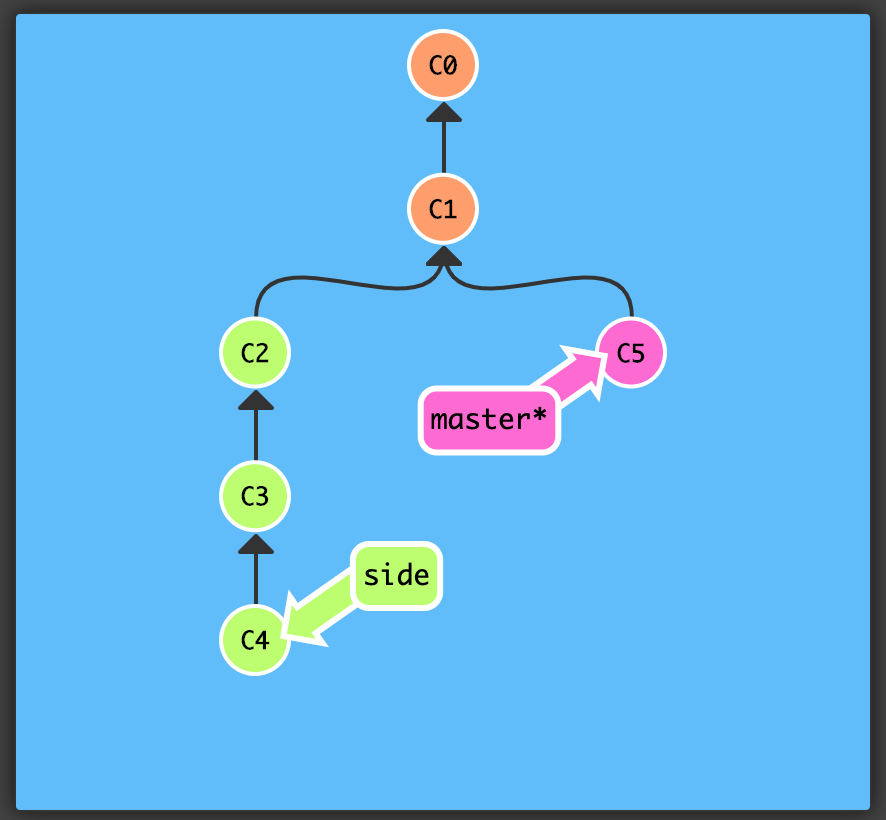
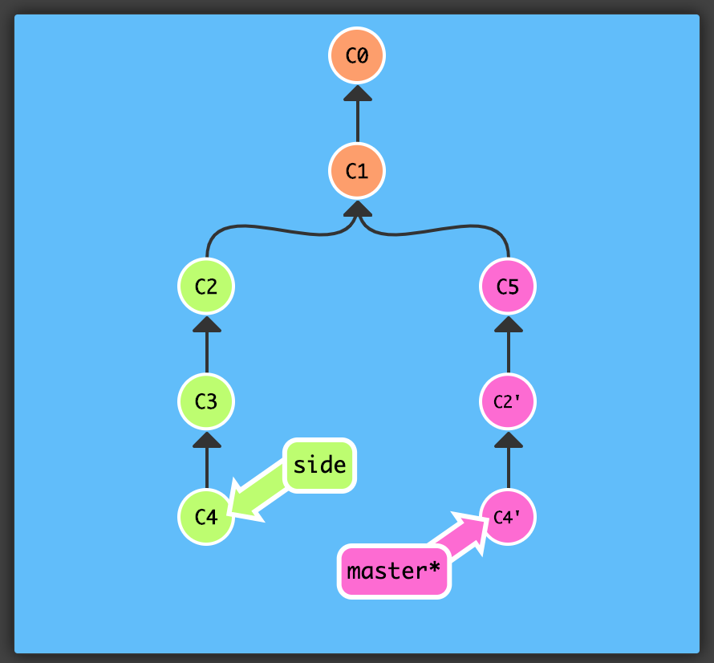
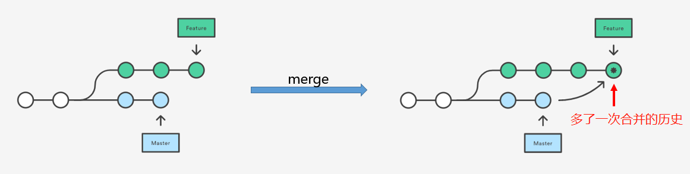
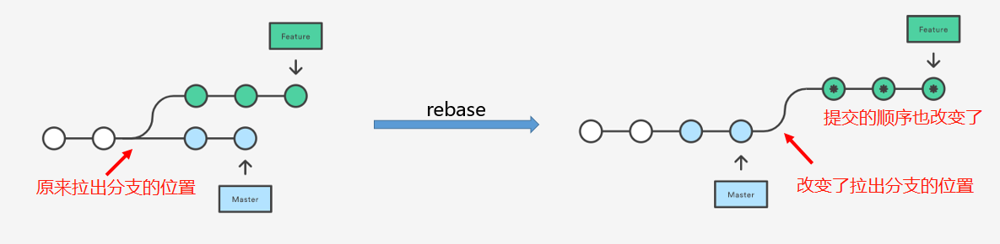

## git cherry-pick
将一些提交复制到当前所在的位置（HEAD）

命令：git cherry-pick <提交号>...



执行git cherry-pick C2 C4



当不知道提交号时，可用git rebase -i代替


##  merge 与 rebase区别

### merge
***操作：*** 将master合入feature

```Git
    git checkout feature
    git merge master
```

***特点：***
1. 此时master上会自动产生一个新的commit(merge commit)
2. 合并有冲突时，需要修改冲突后重新commit

***优点***：记录了每条合并分支的真是commit情况，commit会按提交时间从旧到新排列

***缺点***：每次merge会自动生成commit，commit频繁时显得杂乱，会提高之后查找问题的难度



master 合并 feature后commit信息如下


<br>

### rebase
git rebase 的目的也是将一个分支的更改并入到另外一个分支中去，不过它的本质是变基(找公共祖先)



***操作***: 将master合并到feature分支
```Git
    git checkout feature
    git reabse master
```

```Git
    git checkout master   // 切换到被合并分支
    git rebase -i feature // 变基
    git checkout feature  // 切回合并分支(目标分支)
    git rebase master     // 合并
```

```Git
    git rebase feature master
```

```Git
    // 合并发生冲突时解决步骤
    修改冲突部分
    git add
    git rebase --continue // 无效可执行git rebase --skip
```

***特点***: 会合并之前的commit历史，且commit顺序不一定按提交时间排列

***优点***: 更简洁的合并历史

***缺点***: 合并代码后出现问题定位不易，且需要多次解决同一冲突


### 总结
当需要保留详细的合并信息的时候建议使用git merge，特别是需要将分支合并进入master分支时；当发现自己修改某个功能时，频繁进行了git commit提交时，发现其实过多的提交信息没有必要时，可以尝试git rebase
