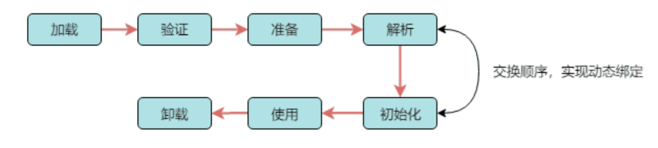
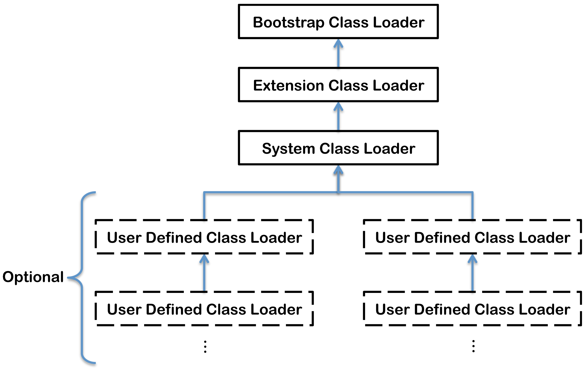
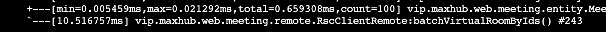
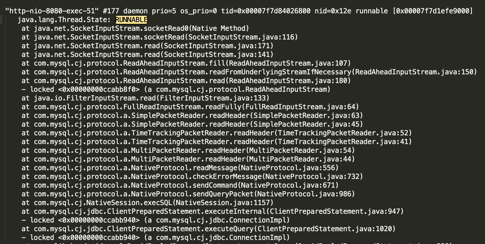
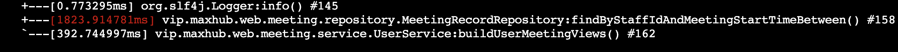
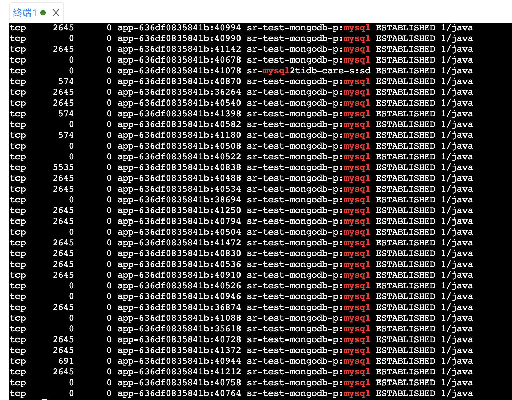
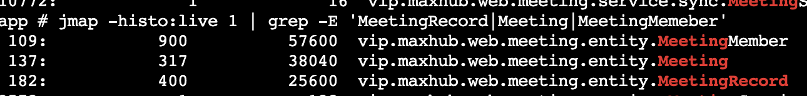
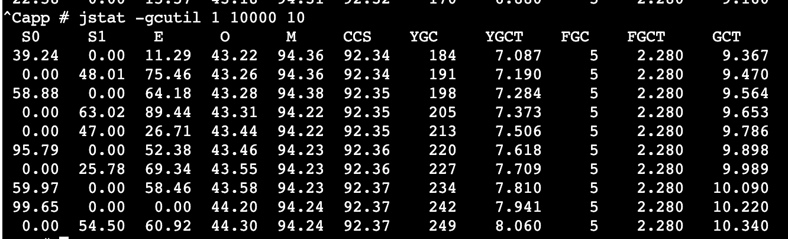
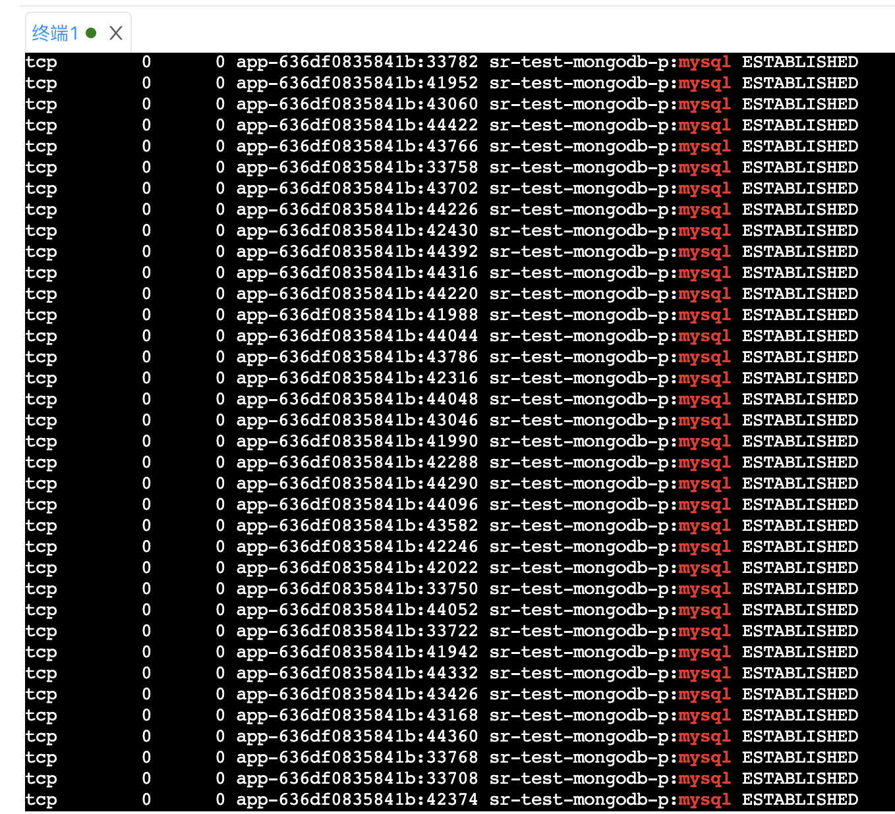

* [一、Java内存区域](#一Java内存区域)
    * [1. 程序计数器](#1程序计数器)
    * [2. Java虚拟机栈](#2Java虚拟机栈)
    * [3. 本地方法栈](#3本地方法栈)
    * [4. Java堆](#4Java堆)
    * [5. 方法区](#5方法区)
    * [6. 元空间](#6元空间)
    * [7. 运行时常量池](#7运行时常量池)
    * [8. 直接内存](#8直接内存)
* [二、内存溢出与内存泄漏](#二内存溢出与内存泄漏)
    * [1. 内存溢出](#1内存溢出)
        * [I. 堆溢出](#I堆溢出)
        * [II. 虚拟机栈溢出](#II虚拟机栈溢出)
        * [III. 方法区溢出](#III方法区溢出)
        * [IV. 直接内存溢出](#直接内存溢出)
    * [2. 内存泄漏](#2内存泄漏)
        * [I. 四种引用](#I强引用)
* [三、对象的内存布局](#三对象的内存布局)
* [四、GC](#四GC)
    * [1. 如何判断对象是否需要回收](#1如何判断对象是否需要回收)
        * [I. 引用计数算法](#I引用计数算法)
        * [II. 可达性分析算法](#II可达性分析算法)
    * [2. GC算法](#2GC算法)
        * [I. 标记清除算法](#I标记清除算法)
        * [II. 复制算法](#II复制算法)
        * [III. 标记整理算法](#III标记整理算法)
        * [IV. 分代收集算法](#IV分代收集算法)
    * [3. 垃圾收集器](#3垃圾收集器)
        * [I. Serial收集器](#ISerial收集器)
        * [II. Serial Old收集器](#IISerialOld收集器)
        * [III. ParNew收集器](#IIIParNew收集器)
        * [IV. Parallel Scanvenge收集器](#IVParallelScanvenge收集器)
        * [V. Parallel Old收集器](#VParallelOld收集器)
        * [VI. CMS收集器](#VICMS收集器)
        * [VII. G1收集器](#VIIG1收集器)
* [五、JDK的命令行工具](#五JDK的命令行工具)
    * [1. jps](#1jps)
    * [2. jstat](#2jstat)
    * [3. jinfo](#3jinfo)
    * [4. jmap](#4jmap)
    * [5. jhat](#5jhat)
    * [6. jstack](#6jstack)
    * [7. 频繁GC排查与CPU飙升问题排查](#7频繁GC排查与CPU飙升问题排查)
* [六、类加载机制](#六类加载机制)
    * [1. 类加载的过程](#1类加载的过程)
        * [I. 加载](I加载)
        * [II. 验证](II验证)
        * [III. 准备](#III准备)
        * [IV. 解析](#IV解析)
        * [V. 初始化](#V初始化)
        * [VI. 类加载的时机](#VI类加载的时机)
    * [2. 类与类加载器](#2类与类加载器)
        * [I. 类相等的条件](#I类相等的条件)
        * [II. 类加载器](II类加载器)
    * [3. 双亲委派机制](#3双亲委派机制)
        * [I. 双亲委派过程](#I双亲委派过程)
        * [II. 如何打破双亲委派](#II如何打破双亲委派)


# 一、Java内存区域
 


## 1.程序计数器

**定义：它可以看作当前线程所执行的字节码的行号指示器**

**它是*线程私有*的：为了线程切换后能恢复到正确的执行位置，每条线程都需要有一个独立的程序计数器**

作用：字节码解释器在工作时是通过改变这个计数器的值来选取下一条执行的字节码指令(分支、循环、异常处理、线程恢复都依赖计数器）

Java方法：计数器记录的是正在执行的虚拟机字节码指令的地址

Native方法：值为空（Undefined）


## 2.Java虚拟机栈

**定义：描述了Java方法执行的内存模型，每个方法在执行的同时会创建一个*栈帧*，每个方法从调用直到执行完成，就对应着一个栈帧在虚拟机栈中入栈到出栈的过程。
**

**它是*线程私有*的：每条线程都有自己的虚拟机栈**


>栈帧：用于存储 局部变量表、操作数栈、动态链接、方法出口等信息
>
>
>
>> 局部变量表：用于存放方法参数和方法内部定义的局部变量,boolean、char、short、int、float、reference(对象引用)、returnAddress(指向一条字节码指令的地址)，占一个局部变量空间，64位的long、double占两个。局部变量表所需的内存空间在编译期间完成分配，即方法需要在栈中分配多大的局部变量空间是完全确定的
>
>>操作数栈：是栈帧中一个后进先出的栈，刚创建栈帧是里面为空，方法执行中进行算术运算或者是调用其他的方法进行参数传递的时候是通过操作数栈进行的。理论相互独立，但大多虚拟机会进行优化，令一部分数据进行栈帧共享，这样在方法调用的时候，无需进行额外的参数复制传递
>
>> 动态连接：每个栈帧都包含一个指向运行时常量池中该栈帧所属方法的引用，来支持动态链接的实现。符号引用（名字A）和直接引用（地址）在运行时进行解析和链接的过程，称为动态连接
>
>>方法出口：正常情况，调用者的PC计数器可以作为返回地址。异常退出，返回地址要通过异常处理器表来确定。退出操作：一、恢复上层方法的局部变量表和操作数栈。二、把返回值压入调用者调用者栈帧的操作数栈。 三、调整 PC 计数器的值以指向方法调用指令后面的一条指令。


## 3.本地方法栈
**定义：与虚拟机栈发挥的作用很相似,也是线程私有的**

区别：虚拟机栈是为Java方法（字节码）服务的，本地方法栈是为虚拟机使用到的native方法服务的


## 4.Java堆

**定义：是虚拟机管理的内存中最大的一块，唯一目的就是存放对象实例，也是GC管理的主要区域，可以处于物理上不连续的内存空间**

由于现在收集器基本采用分代收集算法，所以堆还可以细分为新生代，老年代。

> 新生代：分为三个区域，一个Eden区和两个Survivor区，它们之间的默认比例为（8：1：1）

>老年代: 主要存放应用程序中生命周期长的内存对象

> **TLAB**：分配缓存区，由于堆是所有**线程共享**的，因此在堆上分配内存需要加锁。为了提高效率，会为每个新建的线程在Eden上分配一块独立的空间由该线程独享，在TLAB上分配内存不需要加锁，因此JVM在给线程中的对象分配内存时会尽量在TLAB上分配


### 4.1 TLAB

因为Eden区是线程共享的，多个线程一起分配对象可能会出现同步的问题，TLAB是为了解决这个同步的问题。在Eden区，每个线程都有自己的TLAB，线程在分配对象的时候，直接在自己TLAB上分配对象即可，就不需要解决线程同步的问题。

TLAB的大小可以根据Eden区，线程数，还有分配率进行动态生成的

当分配的对象大于TLAB的大小时，只能在共享区域里面分配，那么就需要同步了


## 5.方法区

**定义：用于存储已被虚拟机加载的类信息、常量池、静态变量、符号引用，即时编译器编译后的代码等数据。（永久代是Hotspot虚拟机特有的概念，是方法区的一种实现**

>类信息：1. 这个类的全限定名 &ensp;&ensp;2.这个类的直接父类的全限定名  &ensp;&ensp; 3. 该类实现的接口的全限定名的有序列表  &ensp;&ensp;  4.该类是类类型还是接口类型  &ensp;&ensp; 5.该类的修饰符

改动：1.在JDK1.7的HotSpot中，把字符串常量池从方法区中移出。

 		   2.在JDK1.8的HotSpot中，取消了方法区，在本地内存用元空间替代


## 6.元空间
**定义：元空间的本质和永久代类似，都是对JVM规范中方法区的实现，最大的区别是元空间使用的是本地内存**

**为什么要用元空间代替永久代？**

一、字符串存在永久代中，容易出现性能问题和内存溢出
二、类及方法的信息等比较难确定其大小，太小容易出现永久代溢出，太大容易导致老年代溢出		  	
三、永久代会为 GC 带来不必要的复杂度且回收效率偏低


## 7.运行时常量池
**定义：Class 文件中的常量池（编译器生成的字面量和符号引用）会在类加载后被放入这个区域。**

通俗点说，Java文件在编译成Class文件的时候，常量池里面的一些字面量和符号引用仅仅只是个名字而已，还没指向对应的内存地址，在类加载时会把这些字面量和符号引用放入运行时常量池并指向对应的内存地址

JDK 1.7的时候，字符串常量池从方法区中移至堆中
JDK 1.8的时候，由于方法区的移除，运行时常量池也从方法区转移至了元空间


## 8.直接内存
**定义：在 JDK 1.4 中新引入了 NIO 类，它可以使用 Native 函数库直接分配本地内存，然后通过 Java 堆里的 DirectByteBuffer 对象作为这块内存的引用进行操作。这样能在一些场景中显著提高性能，因为避免了在堆内存和堆外内存来回拷贝数据**


# 二、内存溢出与内存泄漏
## 1.内存溢出
内存溢出（OutOfMemoryError OOM），可以理解JVM在申请内存时，因为没有足够的内存提供而引发的错误

### I.堆溢出
出现堆溢出原因是为对象分配内存时，堆内存不足。
具体原因如下:
>1. 为大对象分配内存，如大数组
>2. 低效率的GC，可能堆空间过小或存在内存泄漏。官方对效率低的定义为：超过98%的时间用来做GC并且回受了不到2%的堆内存
>3. 频繁地使用String.intern()。JDK 1.7以后的字符串常量池在堆中

常用参数：-Xms -Xmx （堆初始容量大小跟堆最大容量，如-Xms512m）


### II.虚拟机栈溢出
因为每条线程都会有虚拟机栈与之对应，因此当**运行线程数过多**或者**设置的栈过大**，都可能出现OOM

区别于StackOverflowError，这个错误一般发生在错误地递归，当线程请求栈深度大于虚拟机所允许的最大深度时(取决于-Xss)，将抛出StackOverflowError

常用参数：-Xss (栈容量大小)


### III.方法区溢出
对于方法区的溢出，要理解方法区存的东西是什么？它用于存储已被虚拟机加载的类信息、常量、静态变量、JIT编译后的代码。所以在经常动态生成大量Class的应用中，要注意会不会出现OOM。
> 1. 应用中有大量的JSP。在JSP被第一次访问时，JSP引擎会将JSP转换编译成Class，并加入内存
> 2. 存在大量反射的场景。反射也会加载将Class进内存
> 3. JDK 1.7以前频繁地使用String.intern()。那时的字符串常量池还在方法区里

常用参数：
1.7及之前，可以通过-XX:PermSize  -XX:PermSizeMax限制方法区大小

1.8:  -XX:MetaspaceSize   -XX:MaxMetaspaceSize 元空间初始与最大容量


### IV.直接内存溢出
这个一般是频繁使用NIO或NIO使用不当造成的，因为直接内存不像新生代跟老年代那样，发现空间不足就通知收集器回收垃圾，它只能在Full GC时清理需要回收的对象

内存大小可通过 -XX:MaxDirectMemorySize指定，默认与Java堆最大值相等(-Xmx)


## 2.内存泄漏
内存泄漏是指，一个对象不再被需要了，可是收集器却无法将它回收，因为存在引用链。ThreadLocal使用弱引用解决了它内部Map中Key内存泄漏的问题，不过Value还是存在内存泄漏的可能
### I.强引用
强引用(Strong Reference)：类似“ Object obj = new Object()”这类的引用，只要还存在强引用，垃圾收集器就不会回收掉被引用的对象

### II.软引用
软引用(Soft Reference)：描述一些有用但非必需的对象。只有在内存不足的时候JVM才会回收该对象，用SoftReference类实现。
```java
Object obj = new Obejct(); 
SoftReference<Object> sf = new SoftReference<>(obj);
```
应用场景：缓存

### III.弱引用

弱引用(Weak Reference)：也是描述非必需的对象，不过当垃圾收集器工作时，无论内存是否足够，都会回收被弱引用关联的对象。用WeakReference类实现，用法同上。适用于偶尔引用但不影响垃圾收集的对象

### IV.虚引用
虚引用(Phantom Reference)：最弱的一种关系引用。跟没有引用一样，随时都可能被回收，设置虚引用的唯一目的就是能在这个对象被回收时取得一个系统通知，用PhantomReference类实现。


作用：管理堆外内存。当管理堆外内存的对象被虚引用回收了，它会有一个通知，GC某个线程去监听这个通知，就可以知道什么时候要释放堆外内存里的对象了。


# 三、对象的内存布局
 对象的内存区域可分为三个部分：对象头（12个字节）、实例数据、对齐填充
## 1.对象头
对象头又可分为两部分
> 一、用于存储对象自身的运行时数据，如哈希码、GC分代年龄、线程持有的锁、锁状态标志、偏向线程ID等
>
> markword，占8个字节


> 二、类型指针，虚拟机通过这个指针来确定这个对象是哪个类的实例
>
> 在64位计算机中，指针是占64位，8个字节的。
>
> 开启了-XX: +UseCompressedClassPointer之后，会把这个类型指针压缩成4个字节
>
> 开启了-XX: +UserCompressedOops之后，默认的对象指针也会被压缩成4个字节

## 2.实例数据
实例数据是对象真正存储的有效信息，就是定义的各种类型的字段内容，包括父类继承下来的

## 3.对齐填充
仅仅起占位符的作用。因为HotSpot VM的自动内存管理系统要求对象起始地址必须是8字节的整数倍，所以当实例数据部分没有对齐时，就通过对齐填充来补全。（对象头部分正好时8字节的1倍或2倍）
本质：提效


## 4.对象的访问定位
使用对象，一般是通过栈上的引用去操作堆中的对象，引用访问堆中的对象有两种方式：句柄和直接指针
>句柄：Java 堆中划分出一块区域来存储句柄，句柄中存储了对象的数据指针和类型指针。引用先访问句柄，在通过句柄存储的指针到具体的数据和类型。


>直接指针： 引用直接存储对象的数据指针，使用直接指针访问模式的堆实例数据，数据中包含了对象类型的指针。


句柄的好处是，当数据地址修改时，只需要修改句柄中的地址，引用本身不需要修改；直接指针的好处是速度更快。Hotspot 使用的是直接指针的方式访问对象。


## 5. 指针压缩

不开启指针压缩，64位机器采用8字节来存储真实内存地址


### 1. 比采用4字节的劣势

- 增加了GC开销，8字节对象引用需要占用更多的堆空间，留个其他数据的空间将会减少，从而加快了GC的发生
- 降低CPU缓存命中率，8字节的对象引用，CPU能缓存的指针将会更少，从而降低了CPU缓存的概率


### 2. 指针压缩的原理

由于java对象的对齐填充机制，这就会导致java对象的大小都会是8byte的整数倍。基于这种情况，JVM就将堆内存进行了块划分，以8字节为最小单位进行划分


**java对象的指针地址就可以不用存对象的真实的64位地址了，而是可以存一个映射地址编号**

4字节可以表示出2^32^ 个地址，每个地址对应是8字节的内存块，所以可以表示出32位的内存空间

也就解释了为什么当内存大于32GB时，开启指针压缩的参数会失效


我们可以通过增加JVM参数 -XX:+PrintFlagsFinal，验证UseCompressedOops的值，从而得知，到底是不是真的开启了压缩指针，还是压缩指针失效


# 四、GC
## 1.如何判断对象是否需要回收
### I.引用计数算法
**定义：给对象添加一个引用计数器，每当有一个地方引用它时，计数器值加一；引用失效，值减一；任何时刻计数器为0的对象就是不可能再被使用的**
优点：实现简单，判断效率高
缺点：难以解决对象相互循环引用的问题
```java
public class Main{
    public static void main(String[] args){
        // bro1、bro2引用的对象的引用计数器为1
        Brother bro1 = new Brother();
        Brother bro2 = new Brother();
        // bro1、bro2引用的对象的引用计数器为2
        bro2.brother = bro1;
        bro1.brother = bro2;
        // bro1、bro2原本指向的对象的引用计数器为1
        // 在逻辑上这两个对象应是无用对象需要被回收的
        // 但是由于相互循环引用的情况导致它们无法被回收
        bro1 = null;
        bro2 = null;
    }
}

class Brother{
    Brother brother;
}
```


### II.可达性分析算法
JVM就是采用可达性分析算法来判断哪些对象需要被回收

**定义：通过一系列称为“GC Roots”的对象作为起始点，从这些节点向下搜索，搜索走过的路径称为引用链，当一个对象到GC Roots没有任何引用链相连时，此对象时不可用的。**
> 可作为GC Roots的对象:
> 1. 虚拟机栈中引用的对象
> 2. 类静态属性引用的对象
> 3. 常量引用的对象
> 4. 本地方法栈中(Native方法)引用的对象


## 2.GC算法
### I.标记-清除算法
最基础的收集算法，它分两个阶段：**首先标记出所有需要回收的对象，在标记完成后统一回收所有被标记的对象**

缺点：一、效率问题，标记和清除的效率都不高。**二、空间问题，标记清除后产生大量内存碎片，可能会导致程序运行过程中分配较大对象时，无法找到足够的连续内存空间而不得不提前触发另一次垃圾收集动作**


### II.复制算法
为了解决效率问题，复制收集算法出现了，它将可用内存按容量划分为大小相等的两块。**每次只使用其中一块，当这块内存用完了，就将存活的对象复制到另外一块内存上，然后把使用过的内存空间一次清理掉。**

优点：实现简单，运行高效
缺点：内存缩小为原来的一半。对于存活较多的对象，要进行较多复制操作，效率降低且需要内存分配担保


### III.标记-整理算法
标记出所有需要回收的对象，然后让所有存活的对象都向一端移动，然后直接清理掉端边界意外的内存


### IV.分代收集算法
因为新生代中每次垃圾收集时都会发现有大批对象死去，只有少量存活，所以适用复制算法。
因为老年代中对象存活率极高、没有额外空间进行分配担保，所以必须使用“标记-清除”或“标记-整理”

**新生代中的对象是“朝生夕死的”，所以新生代将内存分为一块较大的Eden空间和两块较小的Survivor空间（默认8:1:1）。每次只是用Eden和其中一块Survivor空间，当进行Minor GC时，将Eden和Survivor中还存活的对象一次性地复制到另一块Survivor中，再清理掉刚才用过的Eden和Survivor区。**

可是没有办法保证每次回收都只有不多于10%的对象存活，所以当Survivor空间不够用时，需要依赖老年代进行分配担保。
分配担保：在发生Minor GC之前，虚拟机会检查老年代最大可用的连续空间是否大于新生代所有对象的总空间。如果大于，则安全。如果小于且设置了(HandlePromotionFailure=true)允许担保失败，那么会继续检查老年代最大可用连续空间是否大于历次晋升到老年代的对象的平均大小,大于则进行Minor GC，小于或HandlePromotionFailure=false，进行Full GC


### 准确式GC

准确式GC即虚拟机知道内存中的某个位置的数据是什么类型，当“Stop the world”的时候并不需要检查所有的引用位置，虚拟机通过使用OopMap这个数据结构知道哪些地方存放着对象的引用

类加载完成后，HotSpot将对象内什么偏移量上是什么类型的数据计算出来；在JIT编译过程中，在特定的位置记录下栈和寄存器（程序计数器）中哪些位置是引用


### 保守式GC

不能识别指针和非指针


如何识别指针？满足三个基本检查项目**才可能是指针**

- 是否正确地对齐
- 是否指向堆
- 是否指向对象的头


优点：简单，不容易出bug

缺点：

- 识别指针的成本有点高。

- 无法使用复制算法，无法确认它是否是真的指针，所以也就**无法移动对象，因为移动对象就需要改指针**。万一非指针指向了一个对象，移动了对象之后，修改了这个非指针怎么办
- 会误判垃圾为活动对象。当非指针恰好指向一个垃圾地址时，这个垃圾会被当成活动对象


### SafePoint

背景：Java线程在运行时，会不断地对栈和堆进行修改，如果JVM要进行GC、或者heap dump的话，那么栈和堆会处于一个不稳定的状态

作用：在程序中的某些固定位置是可以确定状态的，JVM可以根据这些状态进行特殊操作，如GC、偏向锁撤销、更新OOpMap、JVM的命令（可以让运行中的线程主动挂起）

如何实现：**线程在检查safepoint时会主动访问一个特定的内存页，而当STW时这个内存页设置为不可读，所以每个尝试读这个内存页的线程也就会挂起**


位置：

- 每个字节码命令之后（解释模式）
- 所有方法返回之前（JIT模式）
- 所有的非计数循环的末尾（JIT模式）


### Safe Region

背景：除了运行中的线程，其他状态的线程无法主动运行到safepoint

作用：在线程处于某些状态时，JVM认为这些状态不会对Heap作出任何修改，因此不会破坏JVM确定的状态


位置：

- 处于阻塞或等待中
- 正在执行JNI方法

为了防止线程从safe region返回后对jvm heap进行更改，当STW时线程在从safe region返回时都会主动挂起


### Card Table

作用：记录跨代引用关系，（老年代到新生代的引用），空间换时间

解决了什么问题：避免了YGC扫描整个老年代来寻找年轻代中的存活对象

怎么做的：当对象的引用关系发生改变时，对象所处的Card标记为Dirty，这样YGC只需要扫描dirty card里的对象就能标记出年轻代中存活的对象，再把card置为clean


CMS中的应用：

并发标记时，假如老年代的对象引用发生了变更，那么就会这个对象对应的card会被标记为dirty，后续只需要通过扫描dirty card中的对象即可，避免扫描全部老年代中的对象

问题：

如果发生了YGC，那么这个dirty card有可能会被置为clean（因为没有找到指向新生代的引用），这时候CMS就丢失了这部分的信息，（假如是新生代晋升或者老年代引用更新）

解决：

并发标记过程中还会维护一个**mod union table**，如果YGC修改了card table中的某一位，同时会将mod union card中对应的位改成1。所以只需要扫描card table和mod union table，当某个card在这两个table上任意一个为dirty时，都会被重新扫描


JVM在逻辑上将堆划分成大小相等的区域，称为card，默认大小为512字节，并将这些card映射到一个名为card table的字节数组上，用一个字节表示一个card，通过 （address >> 9）可以得到某个card所在table中的index，进而得到该card的状态


### RememberSet

作用：记录了对象的引用关系


### ModUnionTable


### DirtyCard


### OopMap

背景：JVM无法区别立即数和指针地址

作用：

- OOpMap用来标记栈里面的数是立即数还是指针地址。每一个InstanceKlass都维护了一个Map用于标记Java类里面的字段是OOP还是int，偏移量等
- 避免全栈扫描，加快枚举根节点的速度（把栈上代表的引用的位置全部记录下来）


引用关系

- 对象内引用。类加载完之后，HotSpot把对象内里面的哪些偏移量为指针
- 栈中的引用。在循环的末尾、方法返回前、可能抛异常的位置去更新记录（安全点）


但是，程序运行期间，很多指令都是有可能修改引用关系的，即要修改OopMap。如果碰到就修改，那代价也太大了，故而引入了 SafePoint，只在 SafePoint 才会对 OopMap 做一个统一的跟新。这也使得，只有 SafePoint 处 OopMap 是一定准确的，因此只能在 SafePoint 处进行 GC 行为


### 三色标记法

- 强三色不变式：不存在黑色对象引用到白色对象的指针
- 弱三色不变式：所有被黑色对象引用的白色对象都处于灰色保护状态


## 3.垃圾收集器
上半部分为新生代收集器，下半部分为老年代收集器。


### I.Serial收集器
**这是一个单线程的新生代垃圾收集器（复制算法），单线程说明它只会使用一条收集线程去完成垃圾收集工作**，所以它必须要暂停其它所有的用户线程，知道它完成垃圾收集工作（Stop The World STW）


### II.Serial Old收集器
Serial收集器的老年代版本，它是个使用“标记-整理”算法的单线程收集器
主要用途：一、与Parallel Scavenge收集器搭配使用。**二、作为CMS收集器的后备方案，在并发收集时发生Concurrent Mode Failure时搭配使用。**


### III.ParNew收集器
其实就是多线程版本的Serial收集器，在实现上也共用了很多代码。虽然它是与Serial收集器相比没太多创新之处，但却是许多Server模式下的虚拟机中首选的新生代收集器，因为**除了Serial外只有它能配合CMS收集器工作**


### IV.Parallel Scavenge收集器
也是采用复制算法的多线程新生代收集器。
**特点：Parallel Scavenge收集器的目的是达到一个可控制的吞吐量。其它收集器的关注点是尽可能地缩短垃圾的收集时用户线程的停顿时间**
吞吐量：CPU用于运行用户代码的时间与CPU总消耗时间的比值
适用场景：停顿时间越短的越适合与用户交互的程序，良好的响应速度会提升用户体验。高吞吐量可以高效率利用CPU时间，主要适合在后台运算而不需要太多交互的任


### V.Parallel Old收集器
是Parallel Scavenge收集器的老年代版本，使用多线程和“标记-整理算法”
在注重吞吐量和CPU敏感度的场合，可以优先考虑Parallel Scavenge和Parallel Old收集器


### VI.CMS收集器
**定义：是一种以获取最短回收停顿时间为目标的收集器**

- 不在两年代进行整理，而是使用空闲列表来管理内存空间进行回收
- 在标记清楚阶段的大部分工作和应用线程一起并发执行

适用场景：重视服务响应速度和系统停顿时间，如Java Web应用

> 收集步骤
> 1. 初始标记：标记GC Roots可以直接关联到的对象，需要STW，速度很快。
> 2. 并发标记：从“初始标记”阶段标记的对象开始找出所有存活的对象。标记过程比较耗时，不过GC线程和用户线程是可以一起运行的
> 3. 重新标记: 为了修正并发标记期间因用户线程继续运作而导致标记产生变动的那一部分对象的标记记录，需要STW，标记结束后，所有Java堆中存活的对象已保证被标记
> 4. 并发清除：释放老年代中的垃圾对象，可以与用户线程一起工作


> 缺点
> 1.  **CMS收集器对CPU资源非常敏感**。CMS默认启动的回收线程数是(CPU数+3)/4，当CPU不足4个时，CMS对用户程序的影响就可能变得很大。
> 2. **CMS无法处理浮动垃圾，就可能出现“Concurrent Mode Failure”而导致另一次Full GC的产生**。因为在并行清除的时候还有用户线程运行，所产生的垃圾称为浮动垃圾。CMS无法在当次收集中处理它们，所以CMS需要预留一部分空间提供并发收集时的程序运作使用，万一预留的内存不满足程序需要，就会出现一次“Concurrent Mode Failure”，这时候虚拟机会临时启动Serial Old来重新进行老年代的垃圾收集，停顿时间更长。
可通过-XX:CMSInitiatingOccupancyFraction来设置触发CMS收集的阈值，JDK1.6默认为92%
> 3. **空间碎片**。因为基于“标记-清除”算法，所以并发清除后会产生大量的空间碎片，即使老年代还有很多空间剩余，但无法找到足够大的连续空间来分配对象，导致不得不触发Full GC


#### 初始标记

这一步需要STW，它的作用是标记存活的对象。

- 标记老年代中所有的GC Roots对象
- 标记年轻代中或者的对象引用到的老年代对象

> -XX:+CMSParallelInitialMarkEnabled 开启初始化并行化
>
> 调大并行标记的线程数，线程数不要超过CPU的核数


#### 并发标记

从“初始标记”阶段标记的对象开始找出所有存活的对象。

因为是并发执行的，所以可能会发生引用关系变更的情况。（**新生代晋升到老年代**，**直接在老年代分配对象**， **老年代对象引用关系发生变化**）


- 并发标记要解决什么问题
  - 可达性分析需要基于一个能保障一致性的快照中才能分析，就意味着要全程冻结用户线程的运行
  - GC Roots是远远小于堆中对象的，而且还有OopMap此类的优化，所以扫描GC Roots的停顿时间相对短暂
  - 由GC Roots开始遍历对象来标记是否存活，耗时是随着堆中的对象增加而增加的
  - 所以并发标记是要削减从GC Roots开始遍历对象的耗时，通过并发执行标记线程和用户线程来实现
- 并发标记会带来什么问题
  - 浮动垃圾：扫描为可达的对象被用户线程修改成了不可达（下次清理）
  - 对象消失：扫描为不可达的对象被用户修改成了可达，但是已经认为是个不可达对象，会被清理掉（大问题）

- 对象消失发生的条件
  - 赋值器插入了一条或多条从黑色对象到白色对象的新引用
  - 赋值器删除了全部从灰色对象到该白色对象的直接或间接引用
- 如何解决对象消失的问题
  - 增量更新：破坏第一个条件，黑色对象插入指向白色对象的引用之后，它就变回灰色对象（CMS）
  - 原始快照：破坏第二个条件，记录下引用发生开始时的快照，并发扫描结束后，按记录中引用为灰色的对象再扫描一次（G1）
  - 读屏障：破坏第二个条件，（ZGC）
- 写屏障做了什么事？相当于AOP
  - 在CMS中，是写后屏障，它会把新插入引用的黑色对象改成灰色对象
  - 在G1中，是写前屏障，它会记录下改变前的引用关系（快照）
- CMS和G1解决对象消失的区别
  - G1是以被写屏障记录下来的旧引用为根进行STW重新扫描的
  - CMS的重新标记则需要重新扫描整个根集合


#### 并发预清理阶段

该阶段由参数**CMSPrecleaningEnabled**控制，默认是开启的


这一阶段主要做的是根据card table和mod union table找到dirty card并扫描dirty card，根据dirty card中引用关系发生变化的对象标记出可达对象，处理完dirty card之后会将card置为**clean**，也就是清除card table和mod union table中对应的位


#### 并发可中断的预清理阶段

该阶段发生的前提是新生代Eden区的内存使用量大于参数**CMSScheduleRemarkEdenSizeThreshold**的值，默认是2M


- 目的：减轻重新标记的负担，减少STW时间（降低时延）

- 怎么做：循环地做两件事
  - 遍历Survivor中的对象，标记可达的老年代对象
  - 和预清理一样，扫描drity card，标记可达对象
- 循环终止条件
  - 达到循环次数：**CMSMaxAbortablePrecleanLoops**设置循环次数，默认为0，表示无限循环
  - 达到最大的运行时间：默认5秒，通过参数**CMSMaxAbortablePrecleanTime**设置
  - 新生代Eden区使用率达到阈值**CMSScheduleRemarkEdenPenetration**，默认是50%，该条件成立的前提是在Precleaning时，Eden区的使用率小于10%
- 循环的目的：期望能发生一次YGC，清理年轻代的引用，使得重新标记时减少扫描年轻代指向老年代引用的时间（降低时延）


#### 重新标记

这个阶段需要STW，这个阶段扫描的目标是：新生代的对象 + Gc Roots + 前面被标记为dirty的card对应的老年代对象


将会减轻负担，通过参数**CMSScavengeBeforeRemark**设置在重新标记之前强制执行一次YGC，但是如果在可中断的预清理阶段已经发生过YGC了，那么再执行一次YGC只会增加更多的停顿时间，而且回收效果很差，默认该参数是关闭的。


#### 并发清理

这个阶段主要是清除那些没有标记的对象并且回收空间


由于CMS并发清理阶段用户线程还在运行着，伴随程序运行自然就还会有新的垃圾不断产生，这一部分垃圾出现在标记过程之后，CMS无法在当次收集中处理掉它们，只好留待下一次GC时再清理掉。这一部分垃圾就称为“浮动垃圾


#### 并发重置

重置CMS算法的内部数据结构，并为下一个周期做好准备。


#### 优点


#### 缺点


#### - CPU敏感

会抢占用户线程的CPU资源，默认（核数 + 3 ）/ 4


####  - 无法处理浮动垃圾

多标问题实际上到最后都变成了浮点问题，card table不会记录新生代到老年代的引用

并发清理也会产生浮点垃圾


#### - 会产生大量的空间碎片

因为CMS垃圾回收器是采用标记清除法，导致产生空间碎片

​      - XX: +UserCMSCompactAtFullCollection GC之后开启空间整理

​      - XX: CMSFullGCssBeforeCompaction  CMS执行多少次GC后进行空间整理，默认0


#### - Concurrent Mode Failure

如果并行清理的过程中老年代的空间不足以容纳应用产生的垃圾，就会抛出Concurrent Mode Failure

- 年轻代晋升了对象
- 分配大对象


如果出现该错误，老年代的垃圾收集器会从CMS退化成Serial Old，所用应用线程被暂停，使用单线程进行垃圾回收，停顿时间变长


如何解决

-  如果是CMS触发太晚，可以将XX:CMSInitiatingOccupancyFraction调小
- 如果是空间碎片过多，可以开启空间碎片整理，-XX:+UseCMSCompactAtFullCollection 、-XX:CMSFullGCsBeforeCompaction=n
- 垃圾产生速度大于清理速度，存在大对象、Eden区过小，晋升阈值过小，survivor区过小


三色标记 + 写屏障：

黑的白的灰的，会产生错标的问题


## VII.G1收集器
G1是一个并行、并发和增量式压缩低停顿的垃圾收集器。是一种服务端应用使用的垃圾收集器，目标是用在多核、大内存的机器上

> 特点
> 1. 并行与并发。G1能利用多CPU、多核下的硬件优势，使用多个CPU来缩短STW停顿的时间。
> 2. 分代收集。分代概念仍然保留，但G1采用不同的方式去处理对象以获取更好的收集效果。
> 3. 空间整合。G1从整体看是基于“标记-整理”算法，从局部看是基于“复制算法”
> 4. 可预测的停顿。能让使用者明确指定在一个长度为M毫秒的时间内，消耗在垃圾收集上的时间不得超过N秒


G1收集器的Java堆内存布局与其他收集器有很大差别，它将整个Java堆划分为多个大小相等的独立区域(Region)，而且老年代跟新生代不再是物理隔离的了
Region：G1堆内存中一个Region的大小可通过-XX:G1HeapRegionSize指定，大小只能为2的幂次方(MB)。默认Region的数量为2048个


其它收集器内存结构：


G1的内存结构：（其中H区为专门存放巨型对象，即超过Region一半大小的对象）


> G1收集步骤（与CMS类似）
> 1. 初始标记。初始标记过程，整个过程STW，标记了从GC Root可达的对象
> 2. 并发标记。从GC Root开始对堆中进行可达性分析，找出存活对象，耗时较长，但可与用户线程并发执行。虚拟机会将变化记录在Remember Set Logs中。
> 3. 最终标记。需要STW，修正在并发标记期间因用户程序继续运作而导致标记产生变动的那一部分标记记录，把Remember Set Logs的数据合并到Remember Set中
> 4. 筛选回收。需要STW，首先对各个Region的回收价值和成本进行排序，再根据用户所期望的GC停顿时间来制定回收计划。


### 1. YGC

- 进行STW
- 选择要进行收集的CSet，对于YGC来说，CSet就是整个年轻代
- 进入并行任务处理
  - 根扫描并处理。把根直接引用的对象复制到新的Survivor区，把被引用对象的field入栈等待后续的复制处理
  - 处理老年代到年轻代的引用。更新所有的RSet，然后从RSet出发，把RSet所在的卡表对应的分区内存块中所有的对象都认为是根，把这些根引用的对象复制到Survivor区中，然后把这些被引用对象的field入栈
  - JIT代码扫描
  - 根据栈中的对象，进行深度递归遍历复制对象
- 其他任务处理，大部分是串行的
  - 字符串去重优化
  - 尝试大对象回收


### 2. Mix GC

- 并发标记：目的是识别老年代分区中的活跃对象，并计算分区中垃圾对象所占空间的多少，用于垃圾回收过程中判断是否回收分区
- 垃圾回收：回收跟年轻代的步骤完全一致，重用了年轻代回收的代码。不同在于，除了回收新生代分区，同时回收并发标记中识别到的垃圾多的老年代分区

#### 2.1 并发标记

- 初始标记子阶段（STW）：发生在YGC之后，以新生代垃圾回收后的新生代Servivor分区作为根进行标记
- 并发标记子阶段：会对所有的分区进行标记
- 再标记子阶段（STW）：标记出所有存活对象
- 清理子阶段（STW）：
  - 利用RSet和BitMap统计存活对象，用于下一次的CSet选择
  - 交换标记位图，用于下一次并发标记
  - 重置RSet
  - 把空闲分区放到空闲分区列表

#### 2.2 混合回收

- 从CSet中选出若干个分区进行回收
- 将分区中存活的对象复制到空闲分区中
- 回收分区并放到空闲分区列表中


### 3. Full GC

串行FGC

- 标记活跃对象
- 计算新对象的地址
- 把所有的引用都更新到新的地址上
- 移动对象


## JVM知识

### 1. 分区与分代的优劣势

分代：

- 优势：分代的思想来源于对象的存活时长，对不同时长的区域采用不同的算法，**来提高效率**
- 劣势：

分区：

- 优势：堆空间划分为独立的区间，可以根据目标停顿的时间，来合理回收区间，减少一次GC的时间
- 


### 2. 元空间如何进行垃圾回收

- 无用的常量：没有被引用的
- 不再使用的类
  - 该类所有实例都被回收了
  - 该类的类加载器也被回收了
  - 对应的Class对象也被回收了


### 3. 对象创建

#### 3.1 类加载检查

首先会去常量池中定位这个类的符号引用，然后检查这个类是否有被加载、解析和初始化


#### 3.2 分配内存

- 指针碰撞：内存规整，用过的内存放一边，没用过的放一边
- 空闲列表：内存不规整，使用的和空闲的相互交错，需要一个列表进行存储


- CAS
- TLAB：每个线程在Java堆中预先分配一小块内存


#### 3.3 初始化

为分配到的内存初始化为零值，不设置对象头


#### 3.4 设置对象头和填充对齐

#### 3.5 初始化

执行构造方法


### 4. 对象的分配

#### 4.1 栈上分配

#### 4.2 堆上分配


三色标记 + STAB + 写屏障


ZGC：

ColoredPointers（颜色指针，着色指针）


# 五、JDK的命令行工具

## 1.jps
**作用：显示指定系统内所有的HotSpot虚拟机进程(JVM Process Status Tool)**

格式： jps [option] [hostid]
> option
> 1. -l 输出主类的全名，若为Jar包则输出路径
> 2. -v  输出虚拟机进程启动时的参数


## 2.jstat
**作用：用于监视虚拟机各种运行状态信息的命令行工具**

格式: jstat [option vmid [ interval[ s|ms ] [count] ]]

>option
> 1.  -class   监视类装置、卸载数量、总空间以及类装置所耗费的时间
> 2. -gc   监视Java堆的情况
> 3.  -gccapacity  与-gc差不多，主要关注堆中各个区域使用的最大最小空间
> 4.  -gcutil   与-gc差不多，主要关注已使用的空间占总空间的百分比
> 5.  -gccause   与-gcutil差不多，但会额外输出导致上一次GC产生的原因
> 6.  -gcnew   监视新生代的状况
> 7. -gcold     监视老年代的状况
> 8. -gcpermcapacity   输出永久带使用到的最大、最小空间
> 9.  -compiler  输出JIT编译器编译过的方法、耗时等信息

例：jstat -gc 10700 10000 3  意思是每10000毫秒查询一次进程10700的堆情况，查3次


## 3.jinfo
**作用：实时地查看和调整虚拟机各项参数（常用来查看参数）**

格式： jinfo [ option ] pid

>option 为空时输出全部参数
> 1. -flags 输出全部参数
> 2. -flag [name] ：输出对应名称的参数, 如 jinfo -flag DoEscapeAnalysis [pid]
> 3. -flag [ +|- ]name  开启或关闭对应的参数
> 4. -flag name=value 设定对应名称的参数


## 4.jmap
**作用：Java内存映射工具**

格式： jmap [ option ] vmid

>option
> 1. -histo  显示堆中对象统计信息
> 2. -heap: 显示堆的详细信息 参数配置、收集器、分代情况(Linux/Solars平台有效)
> 3. -F 强制生成dump快照


## 5.jhat
**作用：与jmap搭配使用，来分析jmap生成的堆转储快照**

## 6.jstack
**作用：用于生成虚拟机当前时刻的线程快照，线程快照就是当前虚拟机内每一条线程正在执行的方法堆栈的集合，目的是定位线程出现长时间停顿的原因。**

命令： jstack [ option ] vimd
> option
> 1. -F  强制输出线程堆栈
> 2. -l   除了堆栈外，显示关于锁的附加信息
> 3. -m  如果调用了本地，可以显示C/C++的堆栈


## 7.频繁GC排查与CPU飙升问题排查

1. 频繁GC排查
>1. 用 jps -l 先找出Java进程ID
>2. 使用jstat -gc [pid] 250 20查看GC增长情况
>3. 使用jmap -dump:format=b,file=heapDump 进程ID生成堆转储文件
>4. 用可视化工具分析堆情况结合代码解决

2. CPU飙升问题排查
>1. 用 jps -l 先找出Java进程ID
>2. 用top -Hp 找出最耗CPU的线程，其中TIME列值最高的就是最耗CPU的线程，记下ID。H代表线程模式，p代表监控某个进程
>3. 将该ID转化为十六进制值，printf "%x" ID
>4. 用 jstack  Java进程ID | grep 线程十六进制值(线程ID用十六进制数表示)，即可看到相应的耗时线程信息


# 六、类加载机制
## 1.类加载的过程
类从被加载到虚拟机内存中开始，到卸载出内存的整个生命周期为：



### I.加载

加载是类加载的一个阶段。在这个过程，虚拟机需要完成以下3件事情：
> 1. 通过一个类的全限定名来获取定义此类的二进制字节流
> 2. 将这个字节流代表的静态存储结构转换为方法区运行时存储结构
> 3. 在内存中生成一个代表这个类的java.lang.Class对象，作为方法区这个类的各种数据的访问入口

二进制字节流可以从以下方式中获取：
1. ZIP包。常见的有JAR、WAR包
2. 从网络中获取。Applet
3. 运行时计算生成。动态代理
4. 其他文件生成。JSP文件


### II.验证
验证是连接的第一步，这一阶段的目的是**为了确保Class文件的字节流中包含的信息符合当前虚拟机的要求**。这个阶段是否严谨，直接决定了Java虚拟机是否能承受恶意代码的攻击。

整体上看，大致完成下面4个阶段的校验工作
> 1. 文件格式检验( 保证输入的字节流能正确地解析并存储与方法区之内)
> 2. 元数据验证 ( 保证其描述地信息符合Java语言规范的要求)
> 3. 字节码验证( 通过数据流和控制流分析，确定程序语义是合法的、符合逻辑的)
> 4. 符号引用验证( 确保解析动作能正常执行)


### III.准备
**该阶段是正式为类变量分配内存并设置类变量初始值的阶段**，所使用的内存都在方法区中进行分配，初始值为数据类型的零值，赋值动作在初始化阶段发生。

如果类变量是常量，那么会按表达式来设置初始值。
public static final int value = 123； 准备阶段虚拟机就会根据ConstantValue属性所指定的值赋值给value 


### IV.解析
**解析阶段是虚拟机将常量池内的符号引用替换为直接引用的过程。**

符号引用以一组符号来描述所引用的目标，符号可以是任何形式的字面量，只要使用时能够无歧义的定位到目标即可。在编译时，java类并不知道所引用的类的实际地址，因此只能使用符号引用来代替（相当于名字）。
直接引用可以是直接指向目标的指针、相对偏移量或是一个能间接定位到目标的句柄。(相当于地址)与虚拟机实现的内存布局相关，如果有了直接引用，那么目标一定已经存在于内存


​        

### V.初始化
在初始化阶段，才真正执行类中定义的Java程序代码
初始化阶段是执行类构造器&lt;clinit>()方法的过程
> 1. &lt;clinit>()方法是由编译器自动收集类中的所有类变量的赋值动作和静态语句块中的语句合并产生的，收集的顺序按语句在源文件出现的顺序，静态语句块只能访问定义在它之前的变量，定义在之后的变量只能赋值，不能访问
> 2. &lt;clinit>()与类的构造函数不同( &lt;init>() )，虚拟机会保证在子类的&lt;clinit>()方法执行之前，父类的&lt;clinit>()已经执行完毕
> 3. 由于父类的&lt;clinit>()方法先执行，也就意味父类中定义的静态语句块先于子类的变量赋值操作。
> 4. 接口没有静态语句块，但仍有变量初始化的赋值操作，因此接口也会生成&lt;clinit>()方法，不过执行接口的&lt;clinit>()方法不需要先执行父接口的&lt;clinit>()方法，只有使用定义在父接口的变量时，才会初始化父接口，接口的实现类在初始化时也不会执行接口的&lt;clinit>()方法。


### VI.类加载的时机

>主动加载
> 1. 遇到 new、getstatic、putstatic、invokestatic 这四条字节码指令时，如果类没有进行过初始化，则必须先触发其初始化。**常见场景:  使用new关键字、读取或设置一个类的静态字段，以及调用一个类的静态方法时。**   注：被final修饰的静态字段除外。因为被final修饰的静态字段在编译阶段通过常量传播优化，将该值存储到了调用类的常量池中，即以后对该静态字段的引用实际都转化为调用类对自身常量池的引用了。
> 2. 对类进行反射调用的时候，如果该类没有进行过初始化，则先进行初始化
> 3. 初始化一个类时，如果其父类没有进行初始化，则先触发其父类的初始化
> 4. 虚拟机启动时，用户需要指定一个执行的主类

>被动加载
> 1. 对于静态字段，只有直接定义这个字段的类才会被初始化。即通过子类引用父类的静态字段，只会触发父类的初始化而不会导致子类初始化
> 2. 通过数组定义来引用类，不会触发此类的初始化。该过程会对数组类进行初始化，数组类是一个由虚拟机自动生成的、直接继承自 Object 的子类，其中包含了数组的属性和方法
> 3. 常量在编译阶段会存入调用类的常量池中，本质上并没有直接引用到定义常量的类，因此不会触发定义常量的类的初始化


## 2.类与类加载器
它主要工作在Class装载的加载阶段，主要作用是从系统外部获取Class二进制数据流，并装载进系统，然后交给JVM进行连接、初始化等操作

### I.类相等的条件
>1.类全限定名   2. 类加载器

两个类相等，需要类本身相等，并且使用同一个类加载器。因为每一个类加载器，都有自己独立的类名称空间。这个相等包括Class对象的equals()方法、isAssignableFrom()方法、isInstance()方法的返回结果为true

### II. 类加载器
从Java虚拟机的角度来说，只存在两种不同的类加载器，一种是启动类加载器(C++实现),是虚拟机的一部分。另一种就是所有其他的类加载器(Java实现，继承java.lang.ClassLoader)，独立于虚拟机外部

> 1. 启动类加载器(Bootstrap ClassLoader)，加载核心库java.*
这个类加载器负责将存在<JAVA_HOME>\lib中的 或 被-Xbootclasspath参数指定路径的，并且是虚拟机识别的(按文件名识别)类库加载到虚拟机内存中。启动类加载器无法被Java程序直接引用，编写自定义加载器时如需要把加载请求委派给启动类加载器，直接用null代替即可
> 2. 扩展类加载器(Extension ClassLoader)，加载扩展库javax.*
由sun.misc.Launcher$ExtClassLoader实现，负责加载存在<JAVA_HOME>\lib\ext目录中的，或被java.ext.dirs系统变量所指定的路径中的所有类库,可直接使用
> 3. 应用程序类加载器(Application ClassLoader) 加载程序所在目录
由sun,misc.Launcher$AppClassLoader实现。这个类加载器是ClassLoader中的getSystemClassLoader()方法的返回值，因此一般称为系统类加载器。负责加载用户类路径上所指定的类库，可直接使用(默认)。也就是说，不管是直接实现ClassLoader还是其他子类，它父加载器都是AppClassLoader




## 3.双亲委派机制
### I.双亲委派过程
**如果一个类加载器收到了类加载的请求，它首先会把这个请求委派给父类加载器去完成，只有当父类加载器反馈自己无法完成这个加载请求(它的搜索范围中没有找到所需的类)时，子加载器才会尝试自己去加载**


好处：使得 Java 类随着它的类加载器一起具有一种带有优先级的层次关系，从而**使得基础类得到统一**。例如，类java.lang.Object，存放在rt.jar中，所以无论哪一个类加载器加载这个类，最终都是委派给处于模型最顶层的启动类加载器，因此Object类在程序的各种类加载器环境中都是同一个类。**避免了多份同样的字节码加载**


### II.如何打破双亲委派
类加载器里面的findClass()用于写类加载逻辑、loadClass()方法的逻辑是如果父类加载器加载失败，则会调用自己的findClass()方法完成加载，保证了双亲委派规则


>1. 如果不想打破双亲委派模型，那么只需要重写findClass方法即可
>2. 如果想打破双亲委派模型，那么就重写整个loadClass方法


# 七、调优


### 1. 压测的目的


我们压测是带着目的去压测的


- 低延时

-  高吞吐

-  降低容量


优化Meeting查询会议、Eagle获取活动列表的目的都是为了降低延时


#### 1.1 原本是多少

##### 1.1.1 Meeting查询会议 

 获取线上最多的会议记录来压测，前后一个月的会议记录为100条，每个会议平均有十个参会人，基于此数据进行压测

得到的QPS为  1QPS/sec  平均延时也是3秒

一天的请求量大概5W

日活7000


##### 1.1.2 Eagle获取活动列表

根据返回最多可参与的活动信息，其中有两张参加活动的二维码，一张占350kb，总共返回的数据为将近1MB，基于此数据进行压测

得到的QPS为   1QPS/sec， 平均延时4秒多

一天的请求量大概为3.5W

日活7000


#### 1.2 预期目标

预期，降低时延，平均200ms


#### 1.3 调优步骤

寻找系统瓶颈、优化，返回循环直至达到预期目标


## 八、Meeting调优

### 1. 寻找系统瓶颈

怎么找，先用top命令，查看CPU的使用情况

使用top，发现CPU使用率只有150%左右，平均时延2秒，TPS 30/min

说明CPU利用不充分，用jstack查看线程的占用使用情况


#### 1.1 各部分耗时情况

用jstack每个五秒获取一次线程信息，发现大量线程被阻塞在了java.net.SocketInputStream.socketRead0(Native Method)

用arthas的trace命令发现，有循环调用HTTP请求，导致有大量的请求请求


#### 1.2 问题

循环里面调用了HTTP请求，一条会议查询请求一次，总共一百次，最小7毫秒，最大1秒，总共22秒


#### 1.3 解决

将循环调用改成批量查询，查询耗时降低至10毫秒




平均延时降低至500ms左右


> awk命令
>
> grep命令：grep -o objStr filename|wc -l


### 2. 系统瓶颈

继续用top，发现CPU使用率正常了，达到370%左右了，但是延时还是不达预期，平均400ms左右


#### 1.2 问题

##### 1.2.1 数据库问题分析

继续用jstack排查问题，发现大部分线程还是阻塞在了socketRead0上，还是有IO阻塞的问题




- findByStaffIdAndMeetingStartTimeBetween




先看看这条语句是怎样的，拿到sql，用了**外键**，参数为40b4aa8f-3170-4be9-9d1a-31c0c06ed8be，1611622800000，1616601600000

select meetingrec0_.id as id1_11_, meetingrec0_.created_date as created_2_11_, meetingrec0_.description as descript3_11_, meetingrec0_.ics_sequence as ics_sequ4_11_, meetingrec0_.ics_uid as ics_uid5_11_, meetingrec0_.meeting_no as meeting_6_11_, meetingrec0_.staff_id as staff_id7_11_, meetingrec0_.summary_status as summary_8_11_, meetingrec0_.updated_date as updated_9_11_, meetingrec0_.user_id as user_id10_11_, meetingrec0_.user_read_time as user_re11_11_ from meeting_record meetingrec0_ left outer join meeting meeting1_ on meetingrec0_.meeting_no=meeting1_.meeting_no where meetingrec0_.staff_id=? and (meeting1_.start_time between ? and ?)

简化：

select id , mr.created_date , description , ics_sequence , ics_uid , mr.meeting_no , mr.staff_id , summary_status , mr.updated_date , mr.user_id , user_read_time from meeting_record mr left outer join meeting m on mr.meeting_no=m.meeting_no where mr.staff_id= 0x40b4aa8f31704be99d1a31c0c06ed8be and (m.start_time between '2021-01-25 00:00:00' and '2021-03-25 00:00:00')


用explain分析

| id   | select_type | table | partitions | type   | possible_keys                                  | key          | key_len | ref                                    | rows | filtered | Extra                 |
| ---- | ----------- | ----- | ---------- | ------ | ---------------------------------------------- | ------------ | ------- | -------------------------------------- | ---- | -------- | --------------------- |
| 1    | SIMPLE      | mr    | [NULL]     | ref    | idx_mno,idx_staff_id                           | idx_staff_id | 17      | const                                  | 100  | 100      | Using index condition |
| 1    | SIMPLE      | m     | [NULL]     | eq_ref | PRIMARY,idx_meeting_no_and_start_time,idx_time | PRIMARY      | 130     | mindlinker_meeting_press.mr.meeting_no | 1    | 76.36    | Using where           |

第一条语句

- type(访问方法)：ref，表示使用普通二级索引与等值来查询，staff_id
- ref:  const, 表示用staff_id索引时，与staff_id列作等值匹配的对象是一个常数
- rows：预计扫描了100行
- extra：Using index condition，表示使用回表操作

第二条语句

- type：eq_ref，表明被驱动表是个唯一二级索引或者主键进行检索
- ref:  meeting_no, 表示是通过这个主键进行检索的


靠，不是慢查询，看起来没问题，该用索引的也用的索引，才100条数据，返回的数据也不大呀

百度谷歌才发现，原来跟TCP缓冲区有关，用netstat命令查看一下



发现Recv-Q跟Send-Q很多都不为0，有堆积现象

 Recv-Q
       Established: 表示缓存区中还没交付给应用的字节数
	   Listening: 已建立成功，但还没交付给应用的tcp连接数量

   Send-Q
       Established: 已经发送给对方，但还没收到ack的字节数
       Listening: 已连接的队列大小，TCP三次握手通过半连接队列和已连接队列来实现的


我们可以通过两端socket收发队列中的数据进行判断：

- 当A的Send-Q中数据堆积而B的Recv-Q中数据为0时，一般是A-B之间的网络问题
- 当A的Send-Q和B的Recv-Q中的数据同时累积时，一般是B服务的性能问题
- **当A的Recv-Q中数据堆积时，一般是A本身的性能问题**
- 如果所有的队列都为0，那还是表示网络没有成为瓶颈


推测是程序的性能有问题导致接受缓冲区中有堆积


##### 1.2.2 性能问题分析

用jstat查看，GC非常频繁，1秒3次YGC，大概20秒一次Full GC

因为用的是2GB的内存，堆参数 -Xmx、-Xms为1280MB左右

> 这是一个经验值，因为上限只有2GB，除了堆内存，非堆也需要一定的内存


其中，有三个对象超大，占的内存很大，分别是MeetingRecord、MeetingMemeber

MeetingRecord、MeetingMemeber中还用了外键，相当于每个对象里面又多了个Meeting对象

因为开启了-XX: +UseCompressedClassPointer和-XX: +UserCompressedOop，所以类型指针、和普通对象指针分别为4个字节


其中，Meeting对象，因为每个MeetingRecord、MeetingMemeber都有它，先算它

- 对象头8字节、类型指针4字节、26个对象引用 * 4 104个字节，再补齐4个字节，一共120个字节


MeetingRecord

- 对象头8字节，类型指针4字节、13个对象引用 * 4  52个字节，  一共64个字节


MeetingMember

- 对象头8字节，类型指针4字节，12个对象引用 * 4  48个字节，一共64个字节


MeetingRecord：MeetingMember  1: 10   MeetingRecord：MeetingMember：Meeting  1:1:1

所以这个方法会占 100 * ( MeetingRecord +  Meeting ) + 100 * 10 * (MeetingRecord + Meeting)

100 * 184 + 1000 * 128 =  146,400 字节 = 146KB



这个接口粗略估计会产生146,4KB的数据，有点差别，估计是被回收了


#### 1.3 解决

在程序中把外键去掉，把方法中的用不到的字段去掉，查询时只返回需要的字段


MeetingRecord :  对象头8字节，类型指针4字节、12个对象引用 * 4  48个字节，  一共64个字节

MeetingMember: 对象头8字节，类型指针4字节、12个对象引用 * 4  48个字节，  一共64个字节

MeetingRecord : MeetingMember   1: 10

100 * 64 + 100 * 10 * 64 = 70400 字节






时延降低至170ms，及格

### 3. 系统瓶颈


-XX:TLABWasteTargetPercent=20  -XX:TLABRefillWasteFraction=16


对象的年龄


### 4. 总结

#### 4.1 网络IO

- 先用top命令查看进程的CPU使用率，发现CPU使用率非常低
- 用jstack命令查看java线程都在干嘛
- 发现RUNNABLE的线程大部分都处在socketRead，根据jstack打印的堆栈日志可知道是循环查询的代码引起的，以压测的数据了来说，一个请求会循环查询100次
- 改成批量获取

- 用arthas的trace命令可以看到，这里用十几秒的耗时降至了10毫秒

#### 4.2 SQL优化

- 继续用top命令，发现CPU使用率上去了，可是时延还是挺高的，要500毫秒左右

- 用jstack命令，发现线程有的还是在socketRead()那里阻塞了，看堆栈日志是SQL操作引起的，而且GC线程占用的CPU也多起来的

- 先从SQL上面开始分析，发现大部分是阻塞在两条查询语句里，用explain分析这两条语句

  - select * from XXX where staff_id = XXX and  begin_time betwen XXXX  and XXXX

  - ```java
    explain select * from meeting_member mm left join meeting m on m.meeting_no = mm.meeting_no where mm.meeting_no = '010156818202102258178'
    ```

- 分析结果

  - type是range，没问题，不过extra是using index condition，表示先用条件查询，再回表。优化点，增加覆盖索引，减去回表的成本，select只返回必要字段，减少对象的大小
  - type是ref，没问题，只能优化select的字段了

- 因为运行中的线程大部分阻塞在这两条语句上了，所以怀疑是不是这两条语句返回的对象太大了，计算一下

  - 第一条语句，返回的是MeetingRecord，MarkWorld占8个字节，开了类型指针压缩，所以指针类型占4个字节，属性占 4 * 12 = 48个字节，对齐填充4个字节，64个字节，200 * 64 = 128000B = 125KB
  - 第二条语句，因为有left join，导致每条会议成员记录里面都会有个会议的对象，会议成员 8 + 4 + 14 * 4 + 4 = 72 个字节， 会议  8 + 4 + 27 *4 + 8 = 128 ， 200 * 10 *（72 + 128）= 390kb
  - 一次请求这两条sql就搞出了500KB了，eden区的大小 1280 / 3 / 10 * 8 = 300多MB

- 优化SQL

  - 查看代码，业务里面其实并不需要完整的拿到整个会议记录的所有内容的，他只是通过员工id和时间找到这个员工这段时间开过的会，然后通过会议id找到每个参会人，所以这里可以优化成 select meeting_no from ....     type变成了using where；using index，表示使用了索引查询，并且用where里面的条件过滤，没有回表
  - 第二条，直接去掉外键，select 只加上所需要的字段

- 优化后的对象大小

  - 第一条语句，只有三个字段，所以大小是 8 + 4 + 3 * 4 = 24个字节，200 * 24 = 4字节
  - 第二条语句，8 + 4 + 12 * 4 + 4= 64 字节 ， 200 * 10 * 64 = 125kb
  - 一次查询这两条sql就100多kb，节省了400kb

- 优化结果：GC从1秒一两次，将至三四秒一次，而且对象存活的年龄也基本在1


#### 4.3 TLAB

用PrintTLAB查看TLAB的分配情况

发现157条线程，上一次GC到这次GC，总共重新分配了7000多次，慢分配也高达450多次


默认情况下，总的TLAB大小占Eden区的1%，而且TLAB允许浪费的空间默认为64分之1

所以总的TLAB大小为 3MB，150条线程，平均每条线程可以分配 20kb左右的TLAB块，经过上面的分析，知道这么一块肯定是不够分的，


##### 4.3.1 慢分配过程

- 判断这个TLAB的剩余空间，如果太小，就申请一个新的TLAB来分配对象，剩余的空间用一个dummy数组填充（TLABRefillWasteFraction默认64）

  - 因为在某些线性扫描堆里对象的时候，需要知道堆哪些地方有对象，哪些地方空白。对于对象，扫描完直接跳过对象长度即可，而空白的地方则需要一个字一个字的扫描，非常忙，所以把这块空白的地方分配一个dummy对象，辅助扫描对象

- 如果这个TLAB的剩余空间很大，能满足很多对象的分配，就不能丢弃这个TLAB，否则内存浪费很多，此时可以把对象分配到堆中

  

##### 4.3.2 新的TLAB如何分配

快速无锁分配：用CAS在堆分区获取一块内存，假如不成功，就慢速分配了

慢速分配：

- 对堆分区加锁分配

- 不成功则判断是否可以扩展新生代，可以的话再分配

- 不成功，则判断是不是可以进行垃圾回收

- 不成功，达到两次尝试就失败

  

##### 4.3.2 如何优化TLAB

将TLAB调大，200kb，300 * 1024 / 150 / 200 = 10 ，所以将，TLABWasteTargetPercent调到10


##### 4.3.3 优化结果

重新分配的次数将至100多，而且对象的慢分配也没有了


## 九、Eagle调优

### 1. 寻找性能瓶颈

返回的body大小为900KB，平均时延为4秒


# 十、G1垃圾收集器


## 1. 对象分配

两种基于TLAB（线程本地分配缓冲区）分配策略，快速分配和慢速分配

### 1.1 为什么需要TLAB

解决什么问题：因为堆是线程共享的，在堆上分配对象，会遇到并发，线程竞争资源的问题

怎么解决的：每个线程有自己的缓冲区来避免和减少使用锁，从而实现快速分配

 

只有在为每个线程分配TLAB的时候才需要锁定整个堆。


### 1.2 TLAB的数据结构

TLAB是Eden区中的一块内存，不同线程的TLAB都位于Eden区中。

每个线程有一个TLAB的数据结构，用于保存待分配内存区间的起始地址和结束地址。


在G1中，一个Eden分区可能有多个TLAB块，每个TLAB块不会重叠，也不会跨区


### 1.3 TLAB快速对象分配的步骤

- 从线程的TLAB分配空间，成功则返回
- 不能分配，先尝试分配一个新的TLAB，再分配对象


从TLAB中直接分配对象，也称为指针碰撞法分配。

因为TLAB中有一个top指针，用来记录当前对象分配的位置，如果剩余空间end - top 大于待分配对象的空间，则直接修改top = top + objSize


### 1.4 TLAB如何设置大小才合理

- TLABSize设置TLAB大小（不优雅），默认值为0时，JVM会自动推断值多大合适
- TLABWasteTargetPercent，用于设置TLAB可占Eden区的百分比，默认1%


### 1.5 如何判断TLAB满了


2


# 十一、

## 1. 如何判断CPU性能的好坏

核心、频率、睿频、缓存

2. ## 核数越多性能一定更好吗

3. ### 多CPU、多核CPU和多线程


## 4 CPU性能


### 频率


### 如何查看CPU硬件信息


- cat /proc/cpuinfo   CPU的基础信息
- top :  load average
- sar


### 如何查看CPU过载、满载


### CPU跑什么这么忙，如何看

pstack/jstack、gdb、pstree


还可以看用户态还是内核态

看内核态：strace（看进程系统调用的情况）、

看文件描述符， losf -p PID    、  /proc/PID/fd

采样CPU，查看CPU在忙什么：perf record、perf report

查看CPU为什么这么闲：offcputime  看CPU在等什么

模拟CPU负载：stress

