* [一、Java内存区域](#一Java内存区域)
    * [1. 程序计数器](#1程序计数器)
    * [2. Java虚拟机栈](#2Java虚拟机栈)
    * [3. 本地方法栈](#3本地方法栈)
    * [4. Java堆](#4Java堆)
    * [5. 方法区](#5方法区)
    * [6. 元空间](#6元空间)
    * [7. 运行时常量池](#7运行时常量池)
    * [8. 直接内存](#8直接内存)
* [二、内存溢出与内存泄漏](#二内存溢出与内存泄漏)
    * [1. 内存溢出](#1内存溢出)
        * [I. 堆溢出](#I堆溢出)
        * [II. 虚拟机栈溢出](#II虚拟机栈溢出)
        * [III. 方法区溢出](#III方法区溢出)
        * [IV. 直接内存溢出](#直接内存溢出)
    * [2. 内存泄漏](#2内存泄漏)
        * [I. 四种引用](#I强引用)
* [三、对象的内存布局](#三对象的内存布局)
* [四、GC](#四GC)
    * [1. 如何判断对象是否需要回收](#1如何判断对象是否需要回收)
        * [I. 引用计数算法](#I引用计数算法)
        * [II. 可达性分析算法](#II可达性分析算法)
    * [2. GC算法](#2GC算法)
        * [I. 标记清除算法](#I标记清除算法)
        * [II. 复制算法](#II复制算法)
        * [III. 标记整理算法](#III标记整理算法)
        * [IV. 分代收集算法](#IV分代收集算法)
    * [3. 垃圾收集器](#3垃圾收集器)
        * [I. Serial收集器](#ISerial收集器)
        * [II. Serial Old收集器](#IISerialOld收集器)
        * [III. ParNew收集器](#IIIParNew收集器)
        * [IV. Parallel Scanvenge收集器](#IVParallelScanvenge收集器)
        * [V. Parallel Old收集器](#VParallelOld收集器)
        * [VI. CMS收集器](#VICMS收集器)
        * [VII. G1收集器](#VIIG1收集器)
* [五、JDK的命令行工具](#五JDK的命令行工具)
    * [1. jps](#1jps)
    * [2. jstat](#2jstat)
    * [3. jinfo](#3jinfo)
    * [4. jmap](#4jmap)
    * [5. jhat](#5jhat)
    * [6. jstack](#6jstack)
    * [7. 频繁GC排查与CPU飙升问题排查](#7频繁GC排查与CPU飙升问题排查)


# 一、Java内存区域
 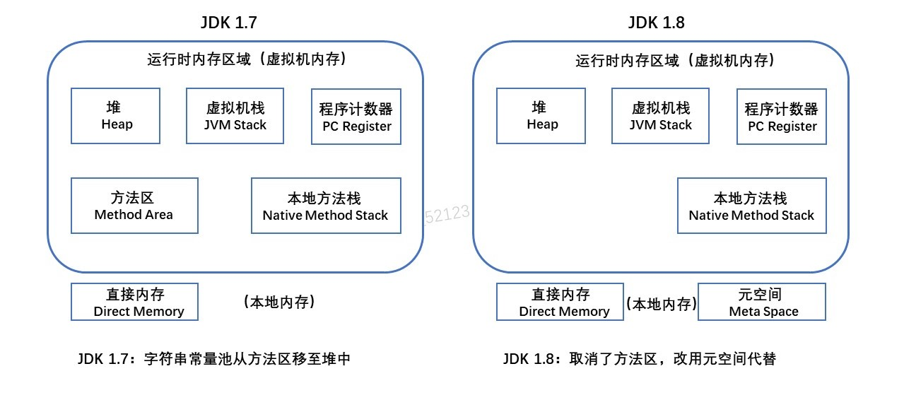
<br>

## 1.程序计数器

**定义：它可以看作当前线程所执行的字节码的行号指示器
<br>
它是*线程私有*的：为了线程切换后能恢复到正确的执行位置，每条线程都需要有一个独立的程序计数器**
<br/><br/>
作用：字节码解释器在工作时是通过改变这个计数器的值来选取下一条执行的字节码指令(分支、循环、异常处理、线程恢复都依赖计数器)<br/><br/>

Java方法：计数器记录的是正在执行的虚拟机字节码指令的地址<br>
Native方法：值为空（Undefined）<br><br>


## 2.Java虚拟机栈

**定义：描述了Java方法执行的内存模型，每个方法在执行的同时会创建一个*栈帧*，每个方法从调用直到执行完成，就对应着一个栈帧在虚拟机栈中入栈到出栈的过程。
<br>
它是*线程私有*的：每条线程都有自己的虚拟机栈**
<br><br>

>栈帧：用于存储 局部变量表、操作数栈、动态链接、方法出口等信息<br><br>
>> 局部变量表：用于存放方法参数和方法内部定义的局部变量,boolean、char、short、int、float、reference(对象引用)、returnAddress(指向一条字节码指令的地址)，占一个局部变量空间，64位的long、double占两个。局部变量表所需的内存空间在编译期间完成分配，即方法需要在栈中分配多大的局部变量空间是完全确定的
<br><br>
>>操作数栈：是栈帧中一个后进先出的栈，刚创建栈帧是里面为空，方法执行中进行算术运算或者是调用其他的方法进行参数传递的时候是通过操作数栈进行的。理论相互独立，但大多虚拟机会进行优化，令一部分数据进行栈帧共享，这样在方法调用的时候，无需进行额外的参数复制传递
<br><br>
>> 动态连接：每个栈帧都包含一个指向运行时常量池中该栈帧所属方法的引用，来支持动态链接的实现。符号引用（名字A）和直接引用（地址）在运行时进行解析和链接的过程，称为动态连接
<br><br>
>>方法出口：正常情况，调用者的PC计数器可以作为返回地址。异常退出，返回地址要通过异常处理器表来确定。退出操作：一、恢复上层方法的局部变量表和操作数栈。二、把返回值压入调用者调用者栈帧的操作数栈。 三、调整 PC 计数器的值以指向方法调用指令后面的一条指令。

<br><br>
## 3.本地方法栈
**定义：与虚拟机栈发挥的作用很相似,也是线程私有的**<br>
区别：虚拟机栈是为Java方法（字节码）服务的，本地方法栈是为虚拟机使用到的native方法服务的

<br><br>
## 4.Java堆

**定义：是虚拟机管理的内存中最大的一块，唯一目的就是存放对象实例，也是GC管理的主要区域，可以处于物理上不连续的内存空间**
<br>
由于现在收集器基本采用分代收集算法，所以堆还可以细分为新生代，老年代。
<br><br>

> 新生代：分为三个区域，一个Eden区和两个Survivor区，它们之间的默认比例为（8：1：1）
<br><br>
>老年代: 主要存放应用程序中生命周期长的内存对象
<br><br>
> TLAB：分配缓存区，由于堆是所有**线程共享**的，因此在堆上分配内存需要加锁。为了提高效率，会为每个新建的线程在Eden上分配一块独立的空间由该线程独享，在TLAB上分配内存不需要加锁，因此JVM在给线程中的对象分配内存时会尽量在TLAB上分配


<br><br>
## 5.方法区

**定义：用于存储已被虚拟机加载的类信息、常量池、静态变量、符号引用，即时编译器编译后的代码等数据。（永久代是Hotspot虚拟机特有的概念，是方法区的一种实现）**
<br><br>
>类信息：1. 这个类的全限定名 &ensp;&ensp;2.这个类的直接父类的全限定名  &ensp;&ensp; 3. 该类实现的接口的全限定名的有序列表  &ensp;&ensp;  4.该类是类类型还是接口类型  &ensp;&ensp; 5.该类的修饰符

改动：1.在JDK1.7的HotSpot中，把字符串常量池从方法区中移出。<br>
    &ensp;&ensp;&ensp;&ensp;&ensp;&ensp;2.在JDK1.8的HotSpot中，取消了方法区，在本地内存用元空间替代


<br><br>
## 6.元空间
**定义：元空间的本质和永久代类似，都是对JVM规范中方法区的实现，最大的区别是元空间使用的是本地内存**
<br><br>

**为什么要用元空间代替永久代？**<br>
一、字符串存在永久代中，容易出现性能问题和内存溢出<br>
二、类及方法的信息等比较难确定其大小，太小容易出现永久代溢出，太大容易导致老年代溢出<br>		  	
三、永久代会为 GC 带来不必要的复杂度且回收效率偏低


<br><br>
## 7.运行时常量池
**定义：Class 文件中的常量池（编译器生成的字面量和符号引用）会在类加载后被放入这个区域。**
<br><br>
通俗点说，Java文件在编译成Class文件的时候，常量池里面的一些字面量和符号引用仅仅只是个名字而已，还没指向对应的内存地址，在类加载时会把这些字面量和符号引用放入运行时常量池并指向对应的内存地址

JDK 1.7的时候，字符串常量池从方法区中移至堆中<br>
JDK 1.8的时候，由于方法区的移除，运行时常量池也从方法区转移至了元空间


<br><br>
## 8.直接内存
**定义：在 JDK 1.4 中新引入了 NIO 类，它可以使用 Native 函数库直接分配本地内存，然后通过 Java 堆里的 DirectByteBuffer 对象作为这块内存的引用进行操作。这样能在一些场景中显著提高性能，因为避免了在堆内存和堆外内存来回拷贝数据**


<br><br>
# 二、内存溢出与内存泄漏
## 1.内存溢出
内存溢出（OutOfMemoryError OOM），可以理解JVM在申请内存时，因为没有足够的内存提供而引发的错误
<br>
### I.堆溢出
出现堆溢出原因是为对象分配内存时，堆内存不足。<br>
具体原因如下:
>1. 为大对象分配内存，如大数组
>2. 低效率的GC，可能堆空间过小或存在内存泄漏。官方对效率低的定义为：超过98%的时间用来做GC并且回受了不到2%的堆内存
>3. 频繁地使用String.intern()。JDK 1.7以后的字符串常量池在堆中

常用参数：-Xms -Xmx （堆初始容量大小跟堆最大容量，如-Xms512m）
<br><br>

### II.虚拟机栈溢出
因为每条线程都会有虚拟机栈与之对应，因此当**运行线程数过多**或者**设置的栈过大**，都可能出现OOM
<br><br>
区别于StackOverflowError，这个错误一般发生在错误地递归，当线程请求栈深度大于虚拟机所允许的最大深度时(取决于-Xss)，将抛出StackOverflowError
<br><br>
常用参数：-Xss (栈容量大小)
<br><br>

### III.方法区溢出
对于方法区的溢出，要理解方法区存的东西是什么？它用于存储已被虚拟机加载的类信息、常量、静态变量、JIT编译后的代码。所以在经常动态生成大量Class的应用中，要注意会不会出现OOM。
> 1. 应用中有大量的JSP。在JSP被第一次访问时，JSP引擎会将JSP转换编译成Class，并加入内存
> 2. 存在大量反射的场景。反射也会加载将Class进内存
> 3. JDK 1.7以前频繁地使用String.intern()。那时的字符串常量池还在方法区里

常用参数：<br>
1.7及之前，可以通过-XX:PermSize  -XX:PermSizeMax限制方法区大小
<br>
1.8:  -XX:MetaspaceSize   -XX:MaxMetaspaceSize 元空间初始与最大容量
<br><br>

### IV.直接内存溢出
这个一般是频繁使用NIO或NIO使用不当造成的，因为直接内存不像新生代跟老年代那样，发现空间不足就通知收集器回收垃圾，它只能在Full GC时清理需要回收的对象
<br><br>
内存大小可通过 -XX:MaxDirectMemorySize指定，默认与Java堆最大值相等(-Xmx)
<br><br>

## 2.内存泄漏
内存泄漏是指，一个对象不再被需要了，可是收集器却无法将它回收，因为存在引用链。ThreadLocal使用弱引用解决了它内部Map中Key内存泄漏的问题，不过Value还是存在内存泄漏的可能
### I.强引用
强引用(Strong Reference)：类似“ Object obj = new Object()”这类的引用，只要还存在强引用，垃圾收集器就不会回收掉被引用的对象

### II.软引用
软引用(Soft Reference)：描述一些有用但非必需的对象。只有在内存不足的时候JVM才会回收该对象，用SoftReference类实现。
```java
Object obj = new Obejct(); 
SoftReference<Object> sf = new SoftReference<>(obj);
```
### III.弱引用
弱引用(Weak Reference)：也是描述非必需的对象，不过当垃圾收集器工作时，无论内存是否足够，都会回收被弱引用关联的对象。用WeakReference类实现，用法同上。适用于偶尔引用但不影响垃圾收集的对象

### IV.虚引用
虚引用(Phantom Reference)：最弱的一种关系引用。跟没有引用一样，随时都可能被回收，设置虚引用的唯一目的就是能在这个对象被回收时取得一个系统通知，用PhantomReference类实现。


# 三、对象的内存布局
 对象的内存区域可分为三个部分：对象头、实例数据、对齐填充
<br><br>
## 1.对象头
对象头又可分为两部分
<br>
> 一、用于存储对象自身的运行时数据，如哈希码、GC分代年龄、线程持有的锁、锁状态标志、偏向线程ID等
<br>


> 二、类型指针，虚拟机通过这个指针来确定这个对象是哪个类的实例

## 2.实例数据
实例数据是对象真正存储的有效信息，就是定义的各种类型的字段内容，包括父类继承下来的

## 3.对齐填充
仅仅起占位符的作用。因为HotSpot VM的自动内存管理系统要求对象起始地址必须是8字节的整数倍，所以当实例数据部分没有对齐时，就通过对齐填充来补全。（对象头部分正好时8字节的1倍或2倍）


<br>

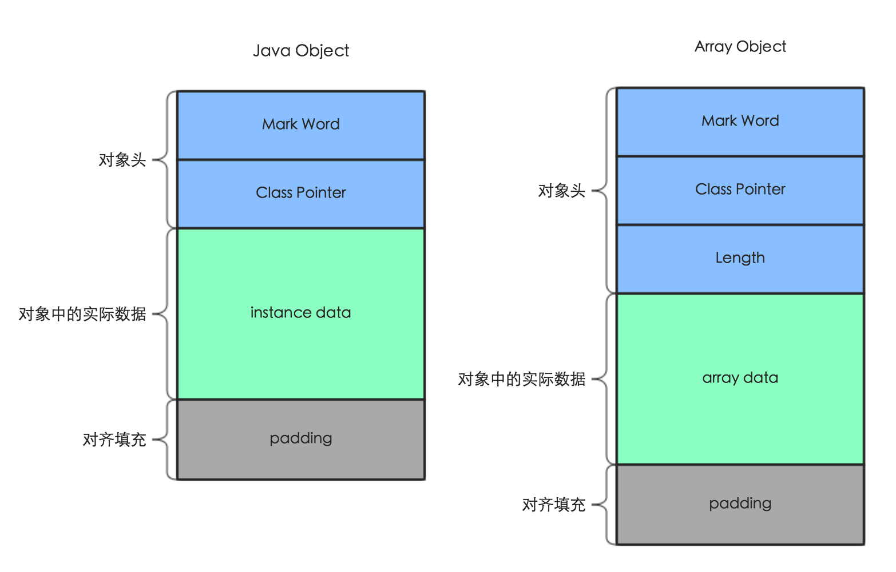

## 4.对象的访问定位
使用对象，一般是通过栈上的引用去操作堆中的对象，引用访问堆中的对象有两种方式：句柄和直接指针
>句柄：Java 堆中划分出一块区域来存储句柄，句柄中存储了对象的数据指针和类型指针。引用先访问句柄，在通过句柄存储的指针到具体的数据和类型。

<br><br>
>直接指针： 引用直接存储对象的数据指针，使用直接指针访问模式的堆实例数据，数据中包含了对象类型的指针。

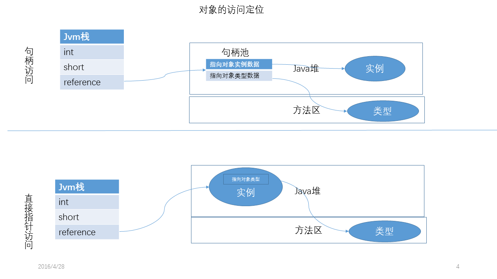


<br><br>
句柄的好处是，当数据地址修改时，只需要修改句柄中的地址，引用本身不需要修改；直接指针的好处是速度更快。Hotspot 使用的是直接指针的方式访问对象。


<br><br>
# 四、GC
## 1.如何判断对象是否需要回收
### I.引用计数算法
**定义：给对象添加一个引用计数器，每当有一个地方引用它时，计数器值加一；引用失效，值减一；任何时刻计数器为0的对象就是不可能再被使用的**<br><br>
优点：实现简单，判断效率高<br>
缺点：难以解决对象相互循环引用的问题
```java
public class Main{
    public static void main(String[] args){
        // bro1、bro2引用的对象的引用计数器为1
        Brother bro1 = new Brother();
        Brother bro2 = new Brother();
        // bro1、bro2引用的对象的引用计数器为2
        bro2.brother = bro1;
        bro1.brother = bro2;
        // bro1、bro2原本指向的对象的引用计数器为1
        // 在逻辑上这两个对象应是无用对象需要被回收的
        // 但是由于相互循环引用的情况导致它们无法被回收
        bro1 = null;
        bro2 = null;
    }
}

class Brother{
    Brother brother;
}
```
<br>

### II.可达性分析算法
JVM就是采用可达性分析算法来判断哪些对象需要被回收
<br><br>
**定义：通过一系列称为“GC Roots”的对象作为起始点，从这些节点向下搜索，搜索走过的路径称为引用链，当一个对象到GC Roots没有任何引用链相连时，此对象时不可用的。**<br>
> 可作为GC Roots的对象:
> 1. 虚拟机栈中引用的对象
> 2. 类静态属性引用的对象
> 3. 常量引用的对象
> 4. 本地方法栈中(Native方法)引用的对象

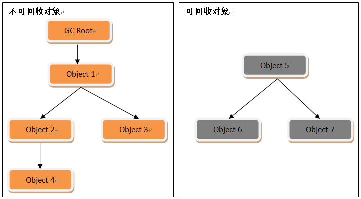

<br><br>

## 2.GC算法
### I.标记-清除算法
最基础的收集算法，它分两个阶段：**首先标记出所有需要回收的对象，在标记完成后统一回收所有被标记的对象**

缺点：一、效率问题，标记和清除的效率都不高。**二、空间问题，标记清除后产生大量内存碎片，可能会导致程序运行过程中分配较大对象时，无法找到足够的连续内存空间而不得不提前触发另一次垃圾收集动作**


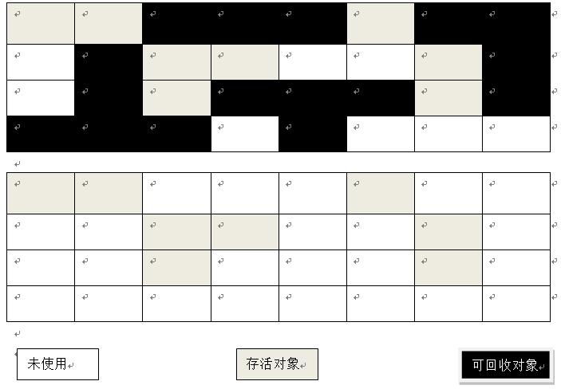

<br><br>

### II.复制算法
为了解决效率问题，复制收集算法出现了，它将可用内存按容量划分为大小相等的两块。**每次只使用其中一块，当这块内存用完了，就将存活的对象复制到另外一块内存上，然后把使用过的内存空间一次清理掉。**

优点：实现简单，运行高效<br>
缺点：内存缩小为原来的一半。对于存活较多的对象，要进行较多复制操作，效率降低且需要内存分配担保

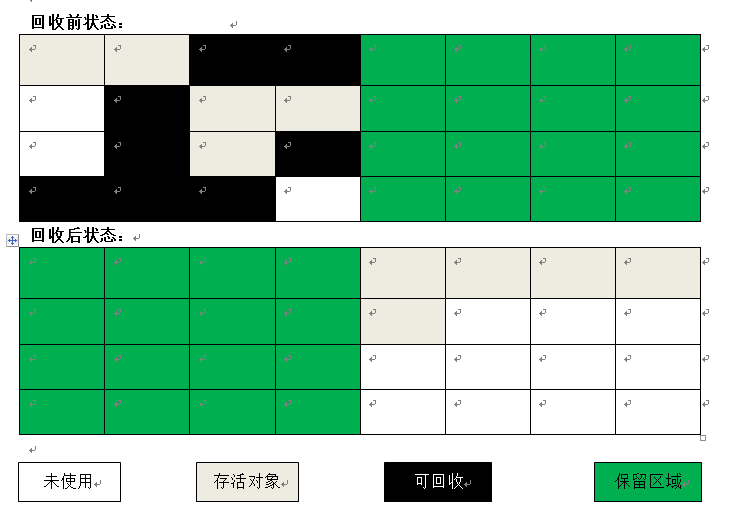

<br><br>

### III.标记-整理算法
标记出所有需要回收的对象，然后让所有存活的对象都向一端移动，然后直接清理掉端边界意外的内存

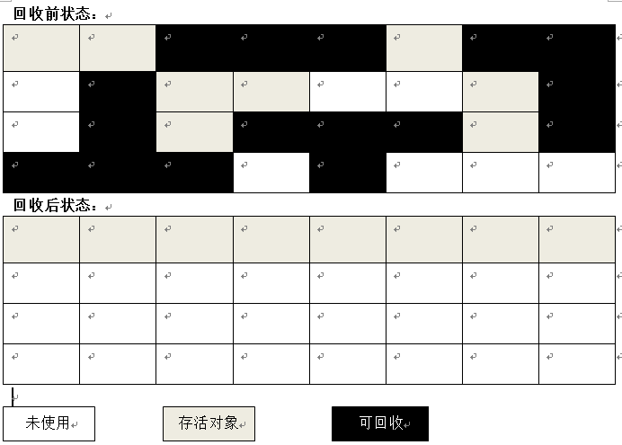

<br><br>

### IV.分代收集算法
因为新生代中每次垃圾收集时都会发现有大批对象死去，只有少量存活，所以适用复制算法。<br>
因为老年代中对象存活率极高、没有额外空间进行分配担保，所以必须使用“标记-清除”或“标记-整理”

<br><br>
**新生代中的对象是“朝生夕死的”，所以新生代将内存分为一块较大的Eden空间和两块较小的Survivor空间（默认8:1:1）。每次只是用Eden和其中一块Survivor空间，当进行Minor GC时，将Eden和Survivor中还存活的对象一次性地复制到另一块Survivor中，再清理掉刚才用过的Eden和Survivor区。**<br>
可是没有办法保证每次回收都只有不多于10%的对象存活，所以当Survivor空间不够用时，需要依赖老年代进行分配担保。<br>
分配担保：在发生Minor GC之前，虚拟机会检查老年代最大可用的连续空间是否大于新生代所有对象的总空间。如果大于，则安全。如果小于且设置了(HandlePromotionFailure=true)允许担保失败，那么会继续检查老年代最大可用连续空间是否大于历次晋升到老年代的对象的平均大小,大于则进行Minor GC，小于或HandlePromotionFailure=false，进行Full GC


## 3.垃圾收集器
上半部分为新生代收集器，下半部分为老年代收集器。
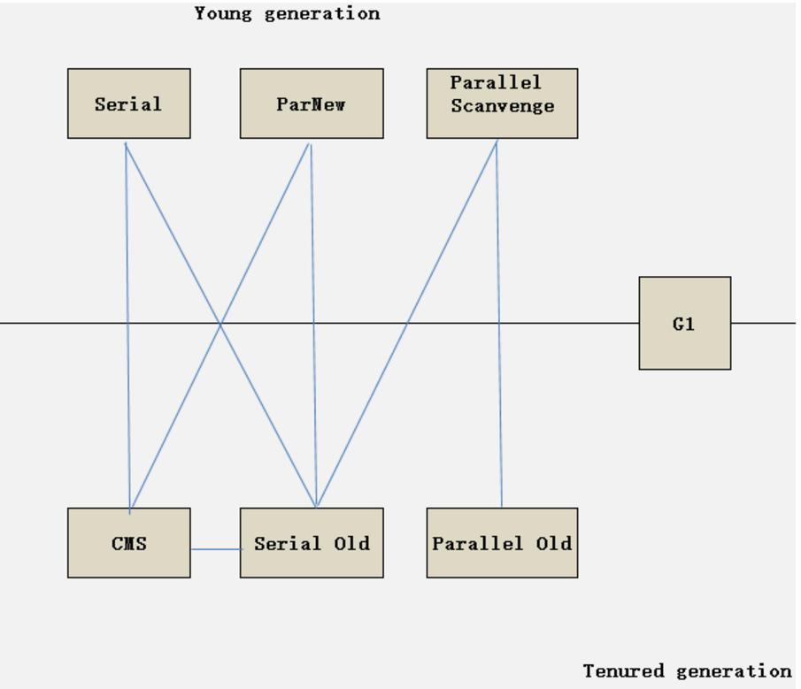

<br><br>

### I.Serial收集器
**这是一个单线程的新生代垃圾收集器（复制算法），单线程说明它只会使用一条收集线程去完成垃圾收集工作**，所以它必须要暂停其它所有的用户线程，知道它完成垃圾收集工作（Stop The World STW）

<br>

### II.Serial Old收集器
Serial收集器的老年代版本，它是个使用“标记-整理”算法的单线程收集器<br>
主要用途：一、与Parallel Scavenge收集器搭配使用。**二、作为CMS收集器的后备方案，在并发收集时发生Concurrent Mode Failure时搭配使用。**

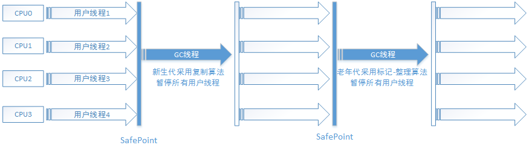


### III.ParNew收集器
其实就是多线程版本的Serial收集器，在实现上也共用了很多代码。虽然它是与Serial收集器相比没太多创新之处，但却是许多Server模式下的虚拟机中首选的新生代收集器，因为**除了Serial外只有它能配合CMS收集器工作**

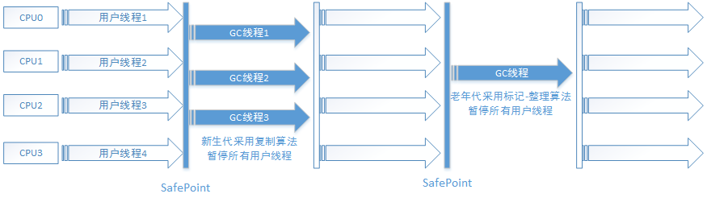


### IV.Parallel Scavenge收集器
也是采用复制算法的多线程新生代收集器。<br><br>
**特点：Parallel Scavenge收集器的目的是达到一个可控制的吞吐量。其它收集器的关注点是尽可能地缩短垃圾的收集时用户线程的停顿时间**<br>
吞吐量：CPU用于运行用户代码的时间与CPU总消耗时间的比值<br><br>
适用场景：停顿时间越短的越适合与用户交互的程序，良好的响应速度会提升用户体验。高吞吐量可以高效率利用CPU时间，主要适合在后台运算而不需要太多交互的任


### V.Parallel Old收集器
是Parallel Scavenge收集器的老年代版本，使用多线程和“标记-整理算法”<br>
在注重吞吐量和CPU敏感度的场合，可以优先考虑Parallel Scavenge和Parallel Old收集器
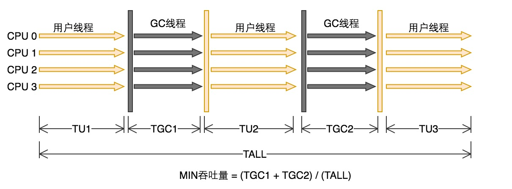


### VI.CMS收集器
**定义：是一种以获取最短回收停顿时间为目标的收集器**
<br>
适用场景：重视服务响应速度和系统停顿时间，如Java Web应用
<br>
> 收集步骤
> 1. 初始标记：标记GC Roots可以直接关联到的对象，需要STW，速度很快。
> 2. 并发标记：从“初始标记”阶段标记的对象开始找出所有存活的对象。标记过程比较耗时，不过GC线程和用户线程是可以一起运行的
> 3. 重新标记: 为了修正并发标记期间因用户线程继续运作而导致标记产生变动的那一部分对象的标记记录，需要STW，标记结束后，所有Java堆中存活的对象已保证被标记
> 4. 并发清除：释放老年代中的垃圾对象，可以与用户线程一起工作


> 缺点
> 1.  **CMS收集器对CPU资源非常敏感**。CMS默认启动的回收线程数是(CPU数+3)/4，当CPU不足4个时，CMS对用户程序的影响就可能变得很大。
> 2. **CMS无法处理浮动垃圾，就可能出现“Concurrent Mode Failure”而导致另一次Full GC的产生**。因为在并行清除的时候还有用户线程运行，所产生的垃圾称为浮动垃圾。CMS无法在当次收集中处理它们，所以CMS需要预留一部分空间提供并发收集时的程序运作使用，万一预留的内存不满足程序需要，就会出现一次“Concurrent Mode Failure”，这时候虚拟机会临时启动Serial Old来重新进行老年代的垃圾收集，停顿时间更长。<br>
可通过-XX:CMSInitiatingOccupancyFraction来设置触发CMS收集的阈值，JDK1.6默认为92%
> 3. **空间碎片**。因为基于“标记-清除”算法，所以并发清除后会产生大量的空间碎片，即使老年代还有很多空间剩余，但无法找到足够大的连续空间来分配对象，导致不得不触发Full GC

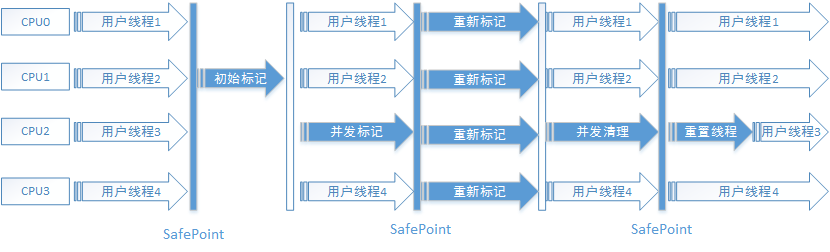


### VII.G1收集器
G1是一个并行、并发和增量式压缩低停顿的垃圾收集器。是一种服务端应用使用的垃圾收集器，目标是用在多核、大内存的机器上<br>

> 特点
> 1. 并行与并发。G1能利用多CPU、多核下的硬件优势，使用多个CPU来缩短STW停顿的时间。
> 2. 分代收集。分代概念仍然保留，但G1采用不同的方式去处理对象以获取更好的收集效果。
> 3. 空间整合。G1从整体看是基于“标记-整理”算法，从局部看是基于“复制算法”
> 4. 可预测的停顿。能让使用者明确指定在一个长度为M毫秒的时间内，消耗在垃圾收集上的时间不得超过N秒

<br>
G1收集器的Java堆内存布局与其他收集器有很大差别，它将整个Java堆划分为多个大小相等的独立区域(Region)，而且老年代跟新生代不再是物理隔离的了<br>
Region：G1堆内存中一个Region的大小可通过-XX:G1HeapRegionSize指定，大小只能为2的幂次方(MB)。默认Region的数量为2048个

<br><br>
其它收集器内存结构：

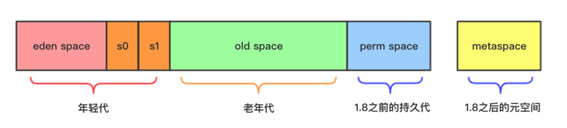
<br><br>
G1的内存结构：（其中H区为专门存放巨型对象，即超过Region一半大小的对象）
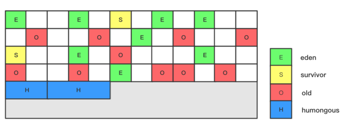
<br><br>

> G1收集步骤（与CMS类似）
> 1. 初始标记。初始标记过程，整个过程STW，标记了从GC Root可达的对象
> 2. 并发标记。从GC Root开始对堆中进行可达性分析，找出存活对象，耗时较长，但可与用户线程并发执行。虚拟机会将变化记录在Remember Set Logs中。
> 3. 最终标记。需要STW，修正在并发标记期间因用户程序继续运作而导致标记产生变动的那一部分标记记录，把Remember Set Logs的数据合并到Remember Set中
> 4. 筛选回收。需要STW，首先对各个Region的回收价值和成本进行排序，再根据用户所期望的GC停顿时间来制定回收计划。

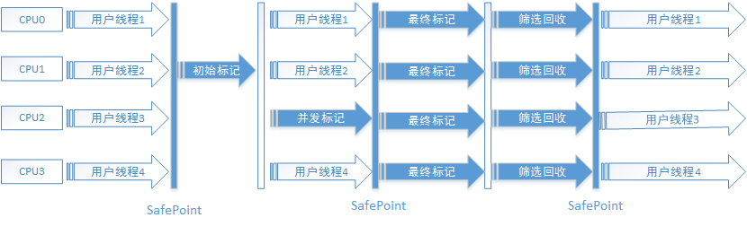


# 五、JDK的命令行工具

## 1.jps
**作用：显示指定系统内所有的HotSpot虚拟机进程(JVM Process Status Tool)**

格式： jps [option] [hostid]<br>
> option
> 1. -l 输出主类的全名，若为Jar包则输出路径
> 2. -v  输出虚拟机进程启动时的参数

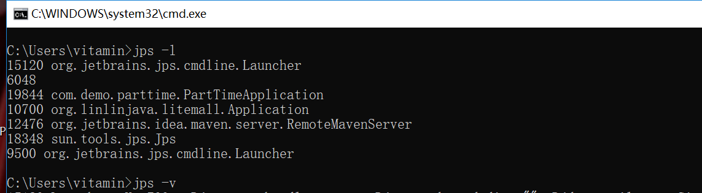


## 2.jstat
**作用：用于监视虚拟机各种运行状态信息的命令行工具**

格式: jstat [option vmid [ interval[ s|ms ] [count] ]]

>option
> 1.  -class   监视类装置、卸载数量、总空间以及类装置所耗费的时间
> 2. -gc   监视Java堆的情况
> 3.  -gccapacity  与-gc差不多，主要关注堆中各个区域使用的最大最小空间
> 4.  -gcutil   与-gc差不多，主要关注已使用的空间占总空间的百分比
> 5.  -gccause   与-gcutil差不多，但会额外输出导致上一次GC产生的原因
> 6.  -gcnew   监视新生代的状况
> 7. -gcold     监视老年代的状况
> 8. -gcpermcapacity   输出永久带使用到的最大、最小空间
> 9.  -compiler  输出JIT编译器编译过的方法、耗时等信息

例：jstat -gc 10700 10000 3  意思是每10000毫秒查询一次进程10700的堆情况，查3次
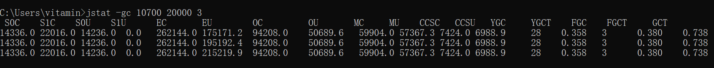


## 3.jinfo
**作用：实时地查看和调整虚拟机各项参数（常用来查看参数）**

格式： jinfo [ option ] pid

>option 为空时输出全部参数
> 1. -flags 输出全部参数
> 2. -flag [name] ：输出对应名称的参数, 如 jinfo -flag DoEscapeAnalysis [pid]
> 3. -flag [ +|- ]name  开启或关闭对应的参数
> 4. -flag name=value 设定对应名称的参数

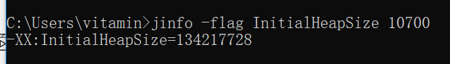


## 4.jmap
**作用：Java内存映射工具**

格式： jmap [ option ] vmid

>option
> 1. -histo  显示堆中对象统计信息
> 2. -heap: 显示堆的详细信息 参数配置、收集器、分代情况(Linux/Solars平台有效)
> 3. -F 强制生成dump快照

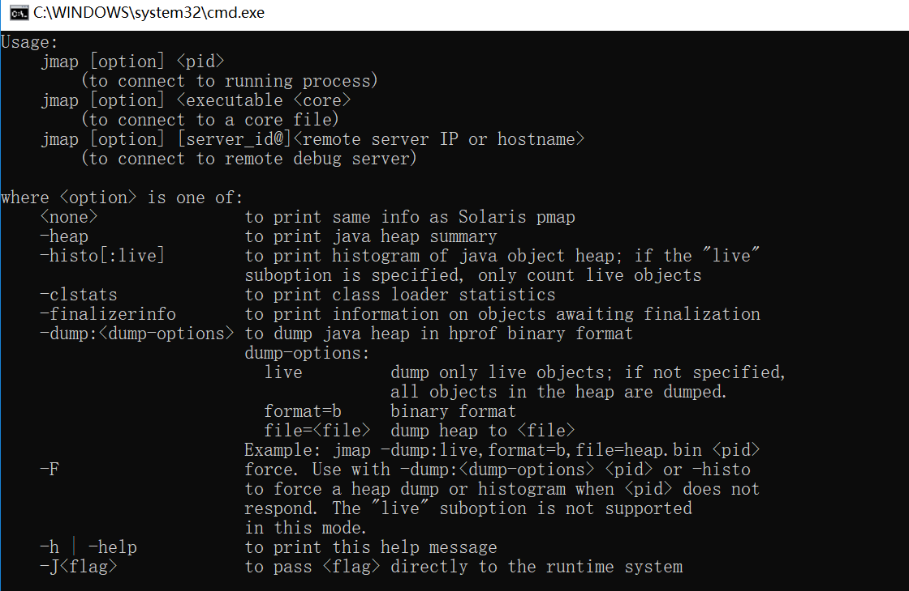

## 5.jhat
**作用：与jmap搭配使用，来分析jmap生成的堆转储快照**

## 6.jstack
**作用：用于生成虚拟机当前时刻的线程快照，线程快照就是当前虚拟机内每一条线程正在执行的方法堆栈的集合，目的是定位线程出现长时间停顿的原因。**

命令： jstack [ option ] vimd
> option
> 1. -F  强制输出线程堆栈
> 2. -l   除了堆栈外，显示关于锁的附加信息
> 3. -m  如果调用了本地，可以显示C/C++的堆栈

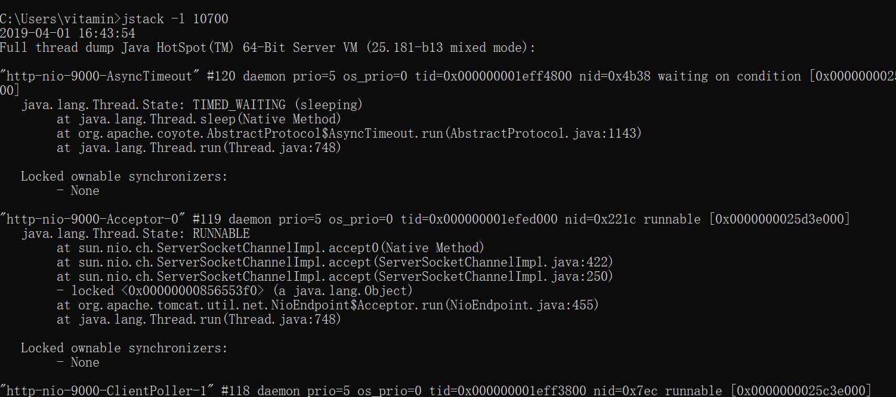


## 7.频繁GC排查与CPU飙升问题排查

1. 频繁GC排查
>1. 用 jps -l 先找出Java进程ID
>2. 使用jstat -gc [pid] 250 20查看GC增长情况
>3. 使用jmap -dump:format=b,file=heapDump 进程ID生成堆转储文件
>4. 用可视化工具分析堆情况结合代码解决

2. CPU飙升问题排查
>1. 用 jps -l 先找出Java进程ID
>2. 用top -Hp 找出最耗CPU的线程，其中TIME列值最高的就是最耗CPU的线程，记下ID。H代表线程模式，p代表监控某个进程
>3. 将该ID转化为十六进制值，printf "%x" ID
>4. 用 jstack  Java进程ID | grep 线程十六进制值(线程ID用十六进制数表示)，即可看到相应的耗时线程信息

