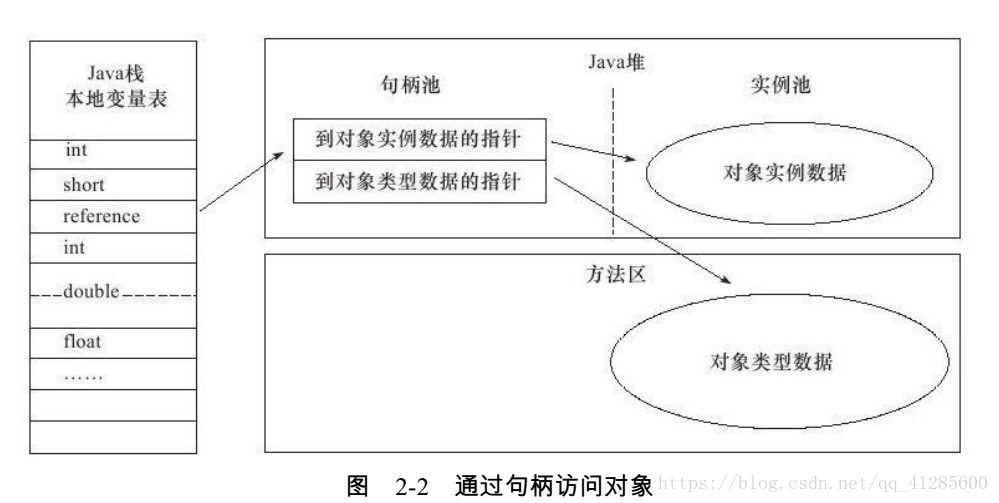
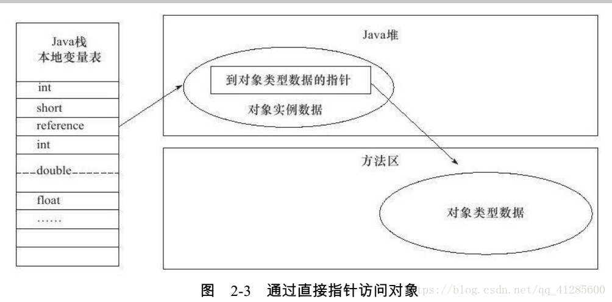

* [一、Java内存区域](#一Java内存区域)
    * [1. 程序计数器](#1程序计数器)
    * [2. Java虚拟机栈](#2Java虚拟机栈)
    * [3. 本地方法栈](#3本地方法栈)
    * [4. Java堆](#4Java堆)
    * [5. 方法区](#5方法区)
    * [6. 元空间](#6元空间)
    * [7. 运行时常量池](#7运行时常量池)
    * [8. 直接内存](#8直接内存)
* [二、对象的内存布局](#二对象的内存布局)

# 一、Java内存区域
 
 

## 1.程序计数器

**定义：它可以看作当前线程所执行的字节码的行号指示器
 
它是*线程私有*的：为了线程切换后能恢复到正确的执行位置，每条线程都需要有一个独立的程序计数器**
  
作用：字节码解释器在工作时是通过改变这个计数器的值来选取下一条执行的字节码指令(分支、循环、异常处理、线程恢复都依赖计数器)  

Java方法：计数器记录的是正在执行的虚拟机字节码指令的地址 
Native方法：值为空（Undefined）  

## 2.Java虚拟机栈

**定义：描述了Java方法执行的内存模型，每个方法在执行的同时会创建一个*栈帧*，每个方法从调用直到执行完成，就对应着一个栈帧在虚拟机栈中入栈到出栈的过程。
 
它是*线程私有*的：每条线程都有自己的虚拟机栈**
  

>栈帧：用于存储 局部变量表、操作数栈、动态链接、方法出口等信息  
>> 局部变量表：用于存放方法参数和方法内部定义的局部变量,boolean、char、short、int、float、reference(对象引用)、returnAddress(指向一条字节码指令的地址)，占一个局部变量空间，64位的long、double占两个。局部变量表所需的内存空间在编译期间完成分配，即方法需要在栈中分配多大的局部变量空间是完全确定的
  
>>操作数栈：是栈帧中一个后进先出的栈，刚创建栈帧是里面为空，方法执行中进行算术运算或者是调用其他的方法进行参数传递的时候是通过操作数栈进行的。理论相互独立，但大多虚拟机会进行优化，令一部分数据进行栈帧共享，这样在方法调用的时候，无需进行额外的参数复制传递
  
>> 动态连接：每个栈帧都包含一个指向运行时常量池中该栈帧所属方法的引用，来支持动态链接的实现。符号引用（名字A）和直接引用（地址）在运行时进行解析和链接的过程，称为动态连接
  
>>方法出口：正常情况，调用者的PC计数器可以作为返回地址。异常退出，返回地址要通过异常处理器表来确定。退出操作：一、恢复上层方法的局部变量表和操作数栈。二、把返回值压入调用者调用者栈帧的操作数栈。 三、调整 PC 计数器的值以指向方法调用指令后面的一条指令。

  
## 3.本地方法栈
**定义：与虚拟机栈发挥的作用很相似,也是线程私有的** 
区别：虚拟机栈是为Java方法（字节码）服务的，本地方法栈是为虚拟机使用到的native方法服务的

  
## 4.Java堆

**定义：是虚拟机管理的内存中最大的一块，唯一目的就是存放对象实例，也是GC管理的主要区域，可以处于物理上不连续的内存空间**
 
由于现在收集器基本采用分代收集算法，所以堆还可以细分为新生代，老年代。
  

> 新生代：分为三个区域，一个Eden区和两个Survivor区，它们之间的默认比例为（8：1：1）
  
>老年代: 主要存放应用程序中生命周期长的内存对象
  
> TLAB：分配缓存区，由于堆是所有**线程共享**的，因此在堆上分配内存需要加锁。为了提高效率，会为每个新建的线程在Eden上分配一块独立的空间由该线程独享，在TLAB上分配内存不需要加锁，因此JVM在给线程中的对象分配内存时会尽量在TLAB上分配

  
## 5.方法区

**定义：用于存储已被虚拟机加载的类信息、常量池、静态变量、符号引用，即时编译器编译后的代码等数据。（永久代是Hotspot虚拟机特有的概念，是方法区的一种实现）**
  
>类信息：1. 这个类的全限定名 &ensp;&ensp;2.这个类的直接父类的全限定名  &ensp;&ensp; 3. 该类实现的接口的全限定名的有序列表  &ensp;&ensp;  4.该类是类类型还是接口类型  &ensp;&ensp; 5.该类的修饰符

改动：1.在JDK1.7的HotSpot中，把字符串常量池从方法区中移出。 
    &ensp;&ensp;&ensp;&ensp;&ensp;&ensp;2.在JDK1.8的HotSpot中，取消了方法区，在本地内存用元空间替代

  
## 6.元空间
**定义：元空间的本质和永久代类似，都是对JVM规范中方法区的实现，最大的区别是元空间使用的是本地内存**
  

**为什么要用元空间代替方法区？** 
一、字符串存在永久代中，容易出现性能问题和内存溢出 
二、类及方法的信息等比较难确定其大小，太小容易出现永久代溢出，太大容易导致老年代溢出 		  	
三、永久代会为 GC 带来不必要的复杂度且回收效率偏低

  
## 7.运行时常量池
**定义：Class 文件中的常量池（编译器生成的字面量和符号引用）会在类加载后被放入这个区域。**
  
通俗点说，Java文件在编译成Class文件的时候，常量池里面的一些字面量和符号引用仅仅只是个名字而已，还没指向对应的内存地址，在类加载时会把这些字面量和符号引用放入运行时常量池并指向对应的内存地址

JDK 1.7的时候，字符串常量池从方法区中移至堆中 
JDK 1.8的时候，由于方法区的移除，运行时常量池也从方法区转移至了元空间

  
## 8.直接内存
**定义：在 JDK 1.4 中新引入了 NIO 类，它可以使用 Native 函数库直接分配本地内存，然后通过 Java 堆里的 DirectByteBuffer 对象作为这块内存的引用进行操作。这样能在一些场景中显著提高性能，因为避免了在堆内存和堆外内存来回拷贝数据**

 

# 二、对象的内存布局
 对象的内存区域可分为三个部分：对象头、实例数据、对齐填充
  
## 1.对象头
对象头又可分为两部分
 
> 一、用于存储对象自身的运行时数据，如哈希码、GC分代年龄、线程持有的锁、锁状态标志、偏向线程ID等
 
 

> 二、类型指针，虚拟机通过这个指针来确定这个对象是哪个类的实例

## 2.实例数据
实例数据是对象真正存储的有效信息，就是定义的各种类型的字段内容，包括父类继承下来的

## 3.对齐填充
仅仅起占位符的作用。因为HotSpot VM的自动内存管理系统要求对象起始地址必须是8字节的整数倍，所以当实例数据部分没有对齐时，就通过对齐填充来补全。（对象头部分正好时8字节的1倍或2倍）

 

## 4.对象的访问定位
使用对象，一般是通过栈上的引用去操作堆中的对象，引用访问队中的对象有两种方式：句柄和直接指针
>句柄：Java 堆中划分出一块区域来存储句柄，句柄中存储了对象的数据指针和类型指针。引用先访问句柄，在通过句柄存储的指针到具体的数据和类型。

  
>直接指针： 引用直接存储对象的数据指针，使用直接指针访问模式的堆实例数据，数据中包含了对象类型的指针。

  
句柄的好处是，当数据地址修改时，只需要修改句柄中的地址，引用本身不需要修改；直接指针的好处是速度更快。Hotspot 使用的是直接指针的方式访问对象。