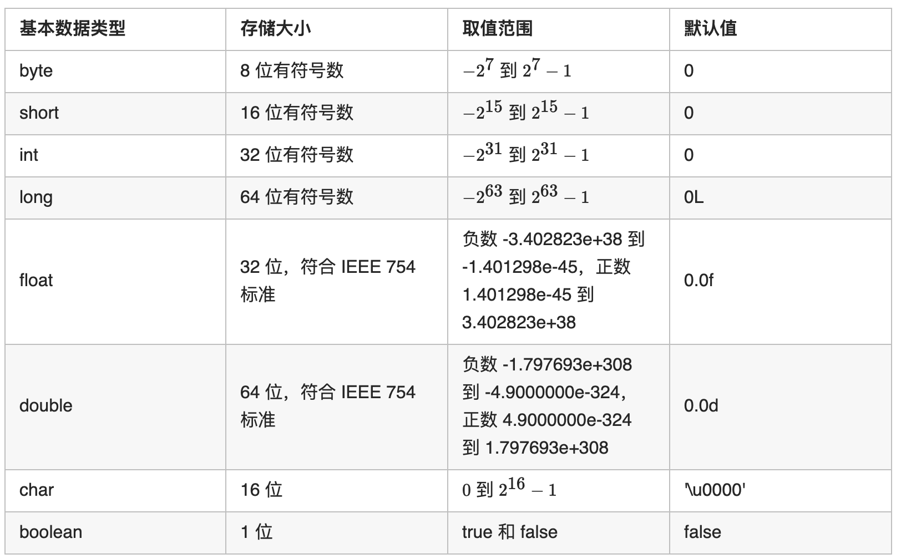
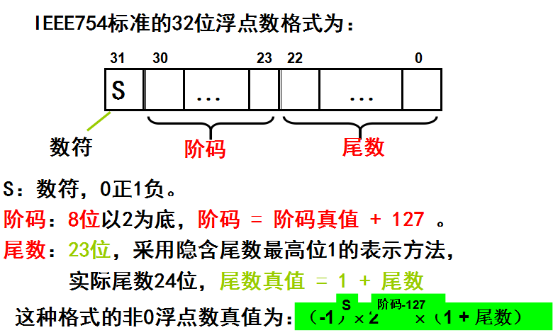

# 一、基础语法

### 1. 基础数据结构

Java 的基本数据类型有 8 种，包括 6 种数字类型、1 种字符类型和 1 种布尔类型。

#### 1.1 基本数据类型总览

- 数字类型包括 4 种整数类型和 2 种浮点数类型，4 种整数类型是 byte、short、int 和 long，2 种浮点数类型是 float 和 double

- 字符类型是 `char`，用于表示单个字符。Java 使用统一码对字符进行编码
- 布尔类型是 `boolean`，包括 `true` 和 `false` 两种取值




#### 1.2 基本数据类型之间的转换

将小范围类型的变量转换为大范围类型称为拓宽类型，不需要显性声明类型转换。将大范围类型的变量转换为小范围类型称为缩窄类型，必须显性声明类型转换，否则会导致编译错误

编译错误的：

- byte b = 500 : 500 超出了 `byte` 类型的取值范围 (-128 ~ 127)
- float f = 3.14
- short s = '\u8000' :字符直接量超出了 `short` 的取值范围且没有显性声明类型转换'

编译正确的：

- byte b = 'b'
- byte b = 30
- byte b = (byte)'b'
- short s = (short)'\u8000'
- long l = 2343223;

#### 1.3 拆箱与装箱

装箱：自动将基本数据类型转换为包装类型     Integer x = 2;            

拆箱：自动把包装类型转换为基本数据类型     int y = x;


从反编译得到的字节码内容可以看出，在装箱的时候自动调用的是Integer的valueOf(int)方法。而在拆箱的时候自动调用的是Integer的intValue方法


##### 1.3.1 缓存池

Double 跟 Float始终会在堆中创建新对象

new Integer(123) 与 Integer.valueOf(123) 的区别在于：

- **new Integer(123)  会创建新的对象**

- **Integer.valueOf(123) 会使用缓存池中的对象，多次调用会得到同一对象**


基本类型对应的缓冲池如下：

boolean values true and false

all byte values

short values between -128 and 127

int values between -128 and 127

char in the range \u0000 to \u007F

long   between  -128 and 127


### 2. 方法

方法包括方法头和方法体，方法头又可以分成修饰符、返回值类型、方法名和参数列表，因此方法包括 5 个部分。

- 修饰符：修饰符是可选的，告诉编译器如何调用该方法。

- 返回值类型：方法可以返回一个值，此时返回值类型是方法要返回的值的数据类型。方法也可以没有返回值，此时返回值类型是 void。

- 方法名：方法的实际名称。

- 参数列表：定义在方法头中的变量称为形式参数或参数，简称形参。当调用方法时，需要给参数传递一个值，称为实际参数，简称实参。参数列表指明方法中的参数类型、次序和数量。参数是可选的，方法可以不包含参数。

- 方法体：方法体包含具体的语句集合


#### 2.1 方法的重载

方法的重载是指在同一个类中的多个方法有相同的名称，但是方法签名不同，编译器能够根据方法签名决定调用哪个方法。由于方法签名由方法名和参数表共同构成，因此**方法的重载等同于多个方法有相同的名称和不同的参数列表**


关于方法的重载，需要注意以下两点。

- 方法签名只由方法名和参数列表共同构成，因此被重载的方法必须具有不同的参数列表，而不能通过不同的修饰符和返回值类型进行方法的重载。

- 如果一个方法调用有多个可能的匹配，则编译器会调用最合适的匹配方法，如果编译器无法判断哪个方法最匹配，则称为歧义调用，会导致编译错误。


## 二、面向对象

### 1. 面向对象的概念

#### 1.1 面向对象和面向过程的区别

面向过程：将问题分解成步骤，然后按照步骤实现函数，执行时依次调用函数。数据和对数据的操作是分离的。

面向对象：将问题分解成对象，描述事物在解决问题的步骤中的行为。对象与属性和行为是关联的。


面向过程的优点是性能比面向对象高，不需要面向对象的实例化；缺点是不容易维护、复用和扩展。

面向对象的优点是具有封装、继承、多态的特性，因而容易维护、复用和扩展，可以设计出低耦合的系统；缺点是由于需要实例化对象，因此性能比面向过程低。


#### 1.2 对象和类

对象是现实世界中可以明确标识的实体，对象有自己独有的状态和行为。对象的状态由数据域的集合构成，对象的行为由方法的集合构成

类是定义同一类型对象的结构，是对具有相同特征的对象的抽象。类是一个模板，用来定义对象的数据域和方法。可以从一个类创建多个对象，创建对象称为实例化


### 2. 构造方法

构造方法是一种特殊的方法，调用构造方法可以创建新对象。构造方法可以执行任何操作，实际应用中，构造方法一般用于初始化操作

#### 2.1 定义和调用构造方法

构造方法的名称必须和构造方法所在类的名称相同。构造方法可以被重载，即允许在同一个类中定义多个参数列表不同的构造方法。

使用 new 操作符调用构造方法，通过调用构造方法创建对象

#### 2.2 默认构造方法

类可以不显性声明构造方法。此时类中隐性声明了一个方法体为空的没有参数的构造方法，称为**默认构造方法**。只有当类中没有显性声明任何构造方法时，才会有默认构造方法

#### 2.3 构造方法与普通方法的区别

- 构造方法的名称必须与所在的类名称相同
- 构造方法没有返回类型，包括没有void
- 构造方法通过new操作符调用，通过调用构造方法创建对象


### 3. 静态和实例

#### 3.1 静态和实例的区别

- 调用方式：从外部调用静态的类成员时，可以通过类名调用，也可以通过对象名调用。从外部调用实例的类成员，则只能通过对象名调用。建议通过类名调用静态的类成员，因为通过类名调用静态的类成员是不需要创建对象的，而且可以提高代码的可读性
- 内部访问：静态方法只能访问静态的类成员，不能访问实例的类成员。实例方法既可以访问实例的类成员，也可以访问静态的类成员


#### 3.2 初始化块

代码初始化块属于类成员，在加载类时或创建对象时会隐式调用代码初始块。使用初始化块的好处是**可以减少多个构造器内的重复代码**


##### 3.2.1 单个类的初始化块的执行顺序

如果有初始化块，则初始化块会在其他代码之前被执行。具体而言，静态初始化块会在静态方法之前被执行，非静态初始化块会在构造器和实例方法之前被执行

由于静态初始化块在加载类时被调用，因此静态初始化块会最先执行，且只会执行一次

由于非静态初始化块在创建对象时被调用，因此每次创建对象时都会执行非静态初始化块以及执行构造器。非静态初始化块的执行在静态初始化块的执行之后、构造器的执行之前


##### 3.2.2 存在继承关系的初始化块的执行顺序

1. 执行父类的静态初始化块。
2. 执行子类的静态初始化块。
3. 执行父类的非静态初始化块。
4. 执行父类的构造器。
5. 执行子类的非静态初始化块。
6. 执行子类的构造器。


### 4 关键字this

#### 4.1 关键字 `this` 用于引用隐藏变量

在方法和构造方法中，可能将属性名用作参数名，在这种情况下，需要引用隐藏的属性名才能给属性设置新值。例如，当属性名和参数名都是 var 时，需要通过 this.var = var 对属性进行赋值。

当方法内部有局部变量和属性名相同时，同样需要通过关键字 this 引用对象的属性。

如果方法内部不存在和属性名相同的局部变量，则在使用属性时，属性前面的 this 可以省略

#### 4.2 关键字 `this` 用于调用其他构造方法

在构造方法中，可以通过关键字 `this` 调用其他构造方法，具体用法是 `this(参数列表)`。

#### 4.3 关键字 `this` 不能在静态代码块中使用

由于关键字 this 代表的是对象的引用，因此依赖于具体对象，而静态方法和静态初始化块不依赖于类的具体对象，因此静态方法和静态初始化块中不能使用关键字 this


### 5. 可见性修饰符

| 作用范围  | 所在类   | 同一包内其他类 | 其他包内子类 | 其他包内非子类 |
| --------- | -------- | -------------- | ------------ | -------------- |
| private   | 可以访问 | 不可以         | 不可以       | 不可以         |
| 缺省      | 可以     | 可以           | 不可以       | 不可以         |
| protected | 可以     | 可以           | 可以         | 不可以         |
| public    | 可以     | 可以           | 可以         | 可以           |


### 6. 字符串

#### 6.1 String

从 String 的源码可以看到，String 使用数组存储字符串的内容，数组使用关键词 final 修饰，因此数组内容不可变，使用 String 定义的字符串的值也是不可变的。

由于 String 类型的值不可变，因此每次对 String 的修改操作都会创建新的 String 对象，导致效率低下且占用大量内存空间


#### 6.2 StringBuffer 和 StringBuilder

使用数组存储字符串的内容，由于数组没有使用关键词 `final` 修饰，因此数组内容可变

都是可变类型，可以对字符串的内容进行修改，且不会因为修改而创建新的对象


#### 6.2.1 StringBuffer 和 StringBuilder的区别

从源码可以看到，StringBuffer 对定义的方法或者调用的方法使用了关键词 synchronized 修饰，而 StringBuilder 的方法没有使用关键词 synchronized 修饰。由于 StringBuffer 对方法加了同步锁，因此其效率略低于 StringBuilder，但是在多线程的环境下，StringBuilder 不能保证线程安全，因此 StringBuffer 是更优的选择


### 7. 继承


## 三、IEEE754浮点数

### 1. n位二进制可以表示的信息量

数字计算机只能处理离散数据，二进制的位数直接决定了它能表示的离散数据个数，也决定了它所能表示的信息个数，对于n位二进制数，它可以表示的信息量为2^N^


假如约定这样8位编码：最低两位为小数区域，其余是整数区域，就有

```
000000.00 // 表示 0.0
000000.01 // 表示 0.25
000000.10 // 表示 0.5
000000.11 // 表示 0.75
000001.00 // 表示 1.0
000001.01 // 表示 1.25
```

我们发现，介于0.0到0.25的数字被跳过了，而即使把小数区域的位长扩大到8位、16位、甚至一个极大的位数，也无法充分表示介于0.0到0.25所有的数。这是因为，在0.0到0.25之间的数是连续的，有无限多个数，但是**有限的N位长二进制最多只能表示2^N^个信息量**，有限的信息量无法表示无限的数据量，这就是现实世界与计算机世界的矛盾


### 2. 定位数表示

约定整数部分和小数部分为固定位置的格式，就是定点数表示

格式：分为符号位、整数部分、隐含的小数点、小数部分

特点：整数部分和小数部分位长固定，当需要表示绝对值特大或者特小时需要很大的空间


### 3. 浮点数表示

浮点数使用科学计数法存储数字，小数点的位置根据指数的大小浮点

格式：分为符号位、指数、尾数。N = 2^E^ * M

特点：一部分位作为指数，可以扩大所表示的数值范围

 意义：是数字计算机表示实数的格式，并以`IEEE 754 (IEEE Standard for Binary Floating-Point Arithmetic)`为标准


### 4. IEEE 754标准的浮点数

**32位浮点数格式：**




单精度浮点数：1个符号位，8个指数位，23个小数位

双精度浮点数：1个符号位，11个指数位，52个小数位


## 四、类加载


### 为什么ArrayList里面的数组要定义成transient

假如elementData的长度为10，而其中只有5个元素，那么在序列化的时候只需要存储5个元素，而数组中后面5个元素是不需要存储的。于是将elementData定义为transient，避免了Java自带的序列化机制，并定义了两个方法writeObject和readObject，实现了自己可控制的序列化

```java
transient Object[] elementData;

private void writeObject(java.io.ObjectOutputStream s)
        throws java.io.IOException{
        // Write out element count, and any hidden stuff
        int expectedModCount = modCount;
        s.defaultWriteObject();

        // Write out size as capacity for behavioural compatibility with clone()
        s.writeInt(size);

        // Write out all elements in the proper order.
        for (int i=0; i<size; i++) {
            s.writeObject(elementData[i]);
        }

        if (modCount != expectedModCount) {
            throw new ConcurrentModificationException();
        }
    }
```

