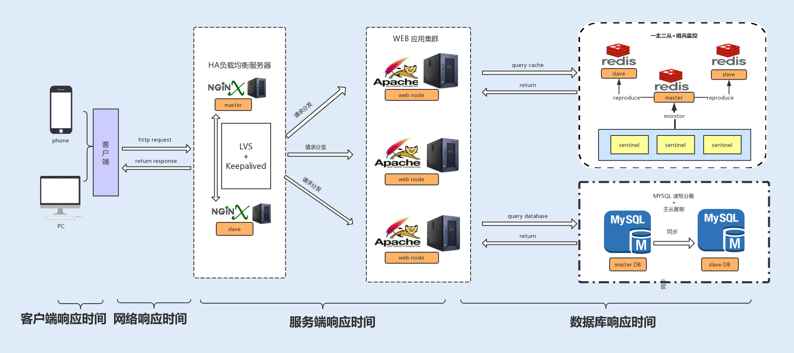

## 一、如何制定性能调优标准

### 1. 为什么要做性能优化

> 好的系统性能调优不仅仅可以提高系统的性能，还能为公司节省资源

### 2. 什么时候开始介入调优

在项目开发的初期，我们没有必要过于在意性能优化，这样反而会让我们疲于性能优化，我们只需要在代码层面保证有效的编码，比如，减少磁盘 I/O 操作、降低竞争锁的使用以及使用高效的算法等等

***在系统编码完成之后，我们就可以对系统进行性能测试了***，根据产品经理提供的预期数据，进行压测，通过性能分析、统计工具来统计各项性能指标，看是否在预期范围之内

### 3. 有哪些参考因素可以体现系统的性能

先了解一下哪些计算机资源会成为系统的性能瓶颈

#### CPU
> 有的应用需要大量计算，他们会长时间、不间断地占用 CPU 资源，导致其他资源无法争夺到 CPU 而响应缓慢，从而带来系统性能问题<br>
例如，代码递归导致的无限循环，正则表达式引起的回溯，JVM 频繁的 FULL GC，以及多线程编程造成的大量上下文切换等，这些都有可能导致 CPU 资源繁忙

#### 内存
> Java堆内存的读写速度非常快，所以基本不存在读写性能瓶颈。但是由于内存成本要比磁盘高，相比磁盘，内存的存储空间又非常有限。所以当内存空间被占满，对象无法回收时，就会导致内存溢出、内存泄露等问题

#### 磁盘 I/O
>磁盘相比内存来说，存储空间要大很多，但磁盘 I/O 读写的速度要比内存慢，虽然目前引入的 SSD 固态硬盘已经有所优化，但仍然无法与内存的读写速度相提并论

#### 网络
> 网络带宽过低的话，对于传输数据比较大，或者是并发量比较大的系统，网络就很容易成为性能瓶颈

#### 异常
> Java 应用中，抛出异常需要构建异常栈，对异常进行捕获和处理，这个过程非常消耗系统性能。如果在高并发的情况下引发异常，持续地进行异常处理，那么系统的性能就会明显地受到影响

#### 数据库
> 大部分系统都会用到数据库，而数据库的操作往往是涉及到磁盘 I/O 的读写。大量的数据库读写操作，会导致磁盘 I/O 性能瓶颈，进而导致数据库操作的延迟性

#### 锁竞争
> 锁的使用可能会带来上下文切换，从而给系统带来性能开销。JDK1.6 之后，Java 为了降低锁竞争带来的上下文切换，对 JVM 内部锁已经做了多次优化。而如何合理地使用锁资源，优化锁资源，就需要了解更多的操作系统知识、Java 多线程编程基础，积累项目经验，并结合实际场景去处理相关问题

### 4. 衡量系统性能的指标

#### 响应时间



我们可以把响应时间自下而上细分为以下几种，其中数据库操作往往是整个请求链中最耗时的，一般一个接口的响应时间是在毫秒级
，但如果你的客户端嵌入了大量的逻辑处理，消耗的时间就有可能变长，从而成为系统的瓶颈


#### 吞吐量

吞吐量越大，性能越好，我们可以把吞吐量分为磁盘吞吐量和网络吞吐量

- 磁盘吞吐量
> 1. IOPS: 每秒的读写次数，关注的是随机读写性能，对于随机读写频繁的应用，是关键衡量指标
> 2. 数据吞吐量：指单位时间内可以成功传输的数据量，对于大量顺序读写频繁的应用，这是关键衡量指标

- 网络吞吐量
> 不仅仅跟带宽有关系，还跟 CPU 的处理能力、网卡、防火墙、外部接口以及 I/O 等紧密关联

- TPS、QPS
> 1. TPS是单位时间内处理事务的数量，代表一个事务的处理，可以包含了多次请求
> 2. QPS是单位时间内请求的数量,一次请求代表一个接口的一次请求到服务器返回结果
> 3. 区别：当一次用户操作只包含一个请求接口时，TPS和QPS没有区别。当用户的一次操作包含了多个服务请求时，这个时候TPS作为这次用户操作的性能指标就更具有代表性了


#### 计算机资源分配使用率
通常由 CPU利用率、内存使用率、磁盘 I/O、网络 I/O 来表示资源使用率，任何一项分配不合理，对整个系统性能的影响都是毁灭性的。


#### 负载承受能力
当系统压力上升时，你可以观察，系统响应时间的上升曲线是否平缓，这项指标能直观地反馈给你，系统所能承受的负载压力极限

系统负载指单位时间内系统正在运行或者等待的进程或线程数，代表系统的繁忙程度

***负载的数值代表的是 CPU 还没处理完的进程的数目，平均负载值是用移动平均法得出的，有n核，满载的负载值就是n***


### 小问题

#### 1. 避免业务异常生成栈追踪信息

遇到业务异常，只需要用字符串描述异常信息即可，自定义异常继承RuntimeException，将writableStackTrace设置为false
```
protected RuntimeException(String message, Throwable cause,
                               boolean enableSuppression,
                               boolean writableStackTrace) {
        super(message, cause, enableSuppression, writableStackTrace);
    }
```

#### 2. 端口被大量CLOSE_WAIT占用

正常的关闭流程是：服务端在接收到客户端发送的关闭请求FIN后，会进入CLOSE_WAIT状态，同时发送ACK回去。在完成与客户端直接的通信操作之后，再向客户端发送FIN，进入LAST_ACK状态

- 原因一：可能是服务端在关闭连接之前还有逻辑未处理完或出错，导致没有发FIN包

- 原因二：服务设置超时时间过短，服务已经主动关闭，但是上游还未超时没有发送FIN包


## 二、如何制定性能调优策略
### 1. 性能测试应注意的问题
#### I. 热身
当代码被频繁执行时，会被虚拟机判定为热点代码，随后虚拟机便通过JIT把热点代码编译、优化，并存储在内存，之后的运行就直接从内存中获取代码

这也是为什么刚开始运行时，速度会比较慢

#### II. 性能测试不稳定
主要影响因素有网络波动、其他进程占用资源或Java垃圾回收。

我们可以通过多次测试，只要保证平均值在合理范围内即可，当波动不大时，性能测试就是通过的

### 2. 合理分析

#### I. 分析需要的数据
需要用到测试接口的平均、最大和最小吞吐量，响应时间。服务器的CPU、内存、I/O、网络I/O使用率，JVM的GC频率

#### II. 查找问题
可以用自下而上的方式查找问题：
> 1. 系统层面。观察系统的CPU、内存、I/O、网络，如有异常再通过命令查找异常日志并分析
> 2. JVM层面。 主要观察GC频率以及内存分配是否存在异常
> 3. 业务层面。 例如编程是否存在不合理的地方，读写数据是否存在瓶颈等

#### III. 调优策略
解决性能问题则可以采用自上而下的方式逐级优化：
> 1. 优化代码。应用层的问题代码往往会因耗尽系统资源而暴露出来，如内存溢出、for循环LinkedList等。可以用JProfile进行代码分析
> 2. 优化设计。可以使用合适的设计模式来精简代码和提高整体性能
> 3. 优化算法。合适的算法能大大提升系统性能
> 4. 时间换空间。 适用对查询速度没有较高要求而对存储空间苛刻的情况。例如分页查询
> 5. 空间换时间。 通过牺牲部分空间来到达预期的获取速度。比如缓存技术、数据冗余等等
> 6. 参数调优。 JVM的堆栈大小、垃圾收集器、容器线程池等


### 3. 兜底策略
无论我们的系统优化得有多好，还是会存在承受极限，所以为了保证系统的稳定性，我们还需要采用一些兜底策略
#### I. 限流
根据测试接口的TPS对系统的入口设置最大访问限制，同时采取熔断措施，友好地返回没有成功的请求

#### II. 智能扩容
当访问量达到某个阈值时，系统可以实现自动扩容。可以使用Kubernetes来实现


## 三、Java字符串性能优化

### 1. 如何构建超大字符串
用加号把字符串和变量拼接时，会被编译器优化成StringBuilder

在多线程编程时，StringBuilder会存在线程安全问题，可以使用StringBuffer，不过性能会下降

### 2. 使用String.intern()节省内存
每次赋值时使用String的intern方法，如果常量池中有相同值，就会重复使用该对象

如果对空间要求高于时间要求，且存在大量重复字符串时，可以考虑使用常量池存储。

常量池的实现类似HashTable。存储的数据越多，遍历的时间复杂度就会增加

### 3. 复习巩固
JDK8以后，字符串常量池存在于Java堆中，唯一由java.lang.String管理。它和运行时常量池、类文件常量池无关

