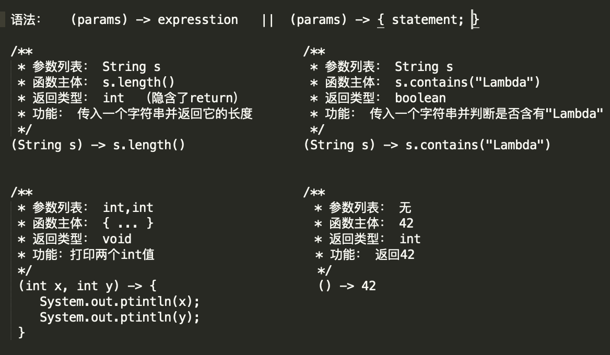

<!-- TOC -->
- [Lambda表达式](#lambda表达式)
    - [1. 特点](#1-特点)
    - [2. 语法](#2-语法)
    - [3. 类型推断、检查，使用局部变量](#3-类型推断检查使用局部变量)
- [Stream](#Stream)
    - [1. 组成](#1-组成)
    - [2. 特点](#2-特点)
    - [3. 常用操作](#3-常用操作)
    - [4. 并发流](#4-并发流)

## Lambda表达式
定义：它可以被理解为是一种传递匿名函数的方式<br>
特点：没有名称，但它有参数列表、函数主体、返回列表<br>
好处：可以让你的代码变得更简洁、清晰


注：上面的executor为ThreadPoolExecutor的引用


### 1. 特点
- ***匿名***: 它并没有确切的名字，避免了写得少而想得多这个问题
- ***函数***: 它不像方法那样属于特定的类，但又和方法一样，它有***参数列表、函数主体、返回类型、异常列表***
- ***传递***: Lambda表达式可以作为参数传递给方法或存在变量中
- ***简洁***: 不用像匿名类那样写很多冗余的代码模版，就像上图那样

### 2. 语法
Lambda表达式从左到右由三个部分组成：
- 参数列表
 > 由0、1或多个参数组成，参数之间用逗号隔开。<br>
 > 参数类型可以省略，不过考虑到可读性，建议不省
- 箭头: ->

- 函数主体（表达式或语句）
    1. 当函数主体是一个表达式时，如 x+y、i++、x > y ? x : y等。此时Lambda隐含了return，所以表达式直接写上就好<br>
    例子： (Integer x, Integer y) -> x * y
    2. 如果是由语句组成，那么语句就要用花括号括起来。如有返回值，要显式写出return

四个例子：



### 3. 类型推断、检查，使用局部变量

I. 类型推断
```java
    // 目标类型推断
    // 该Lambda表达式为无参无返回值，匹配Runnable接口里面的run方法
    // 故该Lambda表达式的目标类型可以为Runnable

    Runnalbe task = () -> System.out.println("Lambda");
 
    // 反过来
    // 参数和返回值类型也可以通过目标类型推断出来
```

II. 类型检查

类型检查就是判断方法所需的参数是否与Lambda的目标类型匹配<br>
比如execute()方法需要Runnable接口作为参数，那么就检查该Lambda的目标类型是否匹配


III. 局部变量

 Lambda主体中也可以使用外层作用域中定义的变量，不过使用局部变量的时候要注意，跟在匿名类用的时候一样，传入的局部变量要声明为final，或者这个局部变量只赋值一次
 
 原因：
 
 ***局部变量是分配在栈帧上的。使用Lambda表达式是有可能在该局部变量回收之后再去访问的***（比如上面提交任务给线程池并发执行）
 ```java
    public void example(){
//      int x = 1;  这个是不对的
        final int x = 1;
        executor.execute( () -> System.out.print(x) );
    }

//     因为System.out.print(x)这个任务可能是在example()这个结束之后再执行的
//     x如果是局部变量，那么x会被回收，导致之后执行任务访问x的时候发生异常
```
 
 ### 4. 常用的函数式接口
 
 函数式接口是只有一个抽象方法的接口，可用作Lambda表达式的目标类型
 
 经常用Stream一起使用
 
 
 
 ## Stream
 什么是流？流是从支持数据处理操作的源生成的元素序列，你可以用它写出声明式处理数据集合的代码，当遇到需要处理大量数据时，流还可以并行处理，以提高性能
 
 ### 1. 组成
 
 I. 数据源
 
 数据源是流的处理数据的源泉，它可以是集合、数组、输入/输出资源，如果数据源有序，那么经过流输出的元素也是有序的
 
 II. 中间操作
 
 通过中间操作，可以从数据源中查出自己所需的元素
 
 III. 终端操作
  
 终端操作会将从中间操作中查询出来的元素收集起来，生成结果。需要注意，除非是触发了终端操作，否则中间操作不会执行，你可以将***终端操作理解为一个阀门，打开这个阀门，数据源才会开始流动，通过中间操作过来，最后生成结果***。
 
 ```java

    public void example(){
        int[] array = new int[]{1, 2, 3, 4, 4, 5, 2}; // 数据源
        Arrays.stream(array)    // 创建流，中间操作
              .distinct()       // 去重，中间操作              
              .skip(1)          // 跳过第一个数据，中间操作
              .forEach(System.out::println);  // 打印收集到的所有元素，终端操作
         // 结果：
         // 2
         // 3
         // 4
         // 5
    }
    // System.out::println是方法引用，可看作Lambda表达式的简写
    // 上面例子中的System.out::println与int i -> System.out.println(i)相等
    // 用法：  类名::方法名
```

### 2. 特点
I. 不存储数据

Stream只是数据源的视图而已，它本身不存储数据源里面的元素。而且数据源可以是是一个数组，Java容器或I/O channel等。

II. 函数式编程

流的操作不会修改数据源，比如说去重的中间操作，Stream并不会删除重复元素，而是产生出一个不包含重复元素的Stream

III. 惰性执行

流的中间操作都是延迟执行的，只有到了终端操作才会真正开始顺序执行

IV. 纯消费

Stream只能被“消费”一次，一旦遍历过就会失效。如果想重新遍历，只能生成新的Stream

### 3. 常用操作

I. 创建流


II 常用中间操作


III 终端操作


### 4. 并发流

可以使用parallelStream()或者parallel()来并发执行流

使用条件：
1. 数据量较大。 数据量不大时，顺序执行往往较快，如果任务涉及到IO操作，可以考虑并发
2. 没有共享变量。 
3. 不要求顺序处理 

注意，并行流内部使用了默认的ForkJoinPool，默认的线程数量就是处理器的数量<br>
可以通过System.setProperty("java.util.concurrent.ForkJoinPool.common.parallelism","12")来改变线程池大小