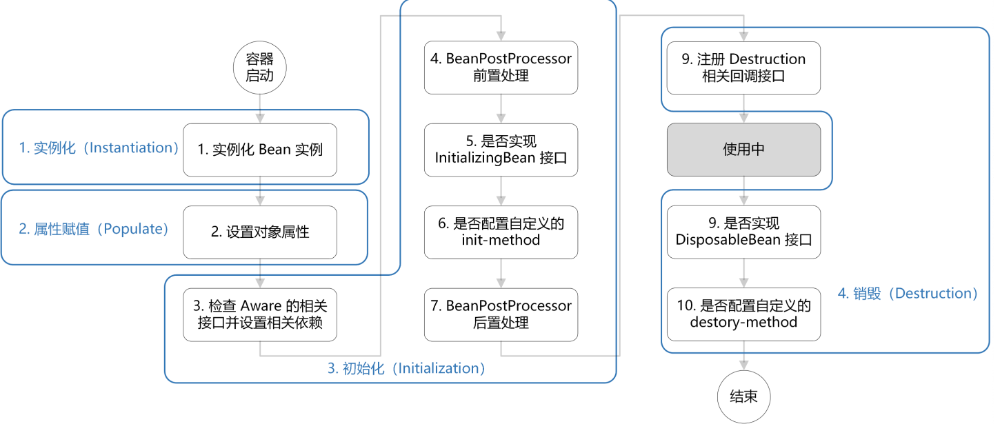
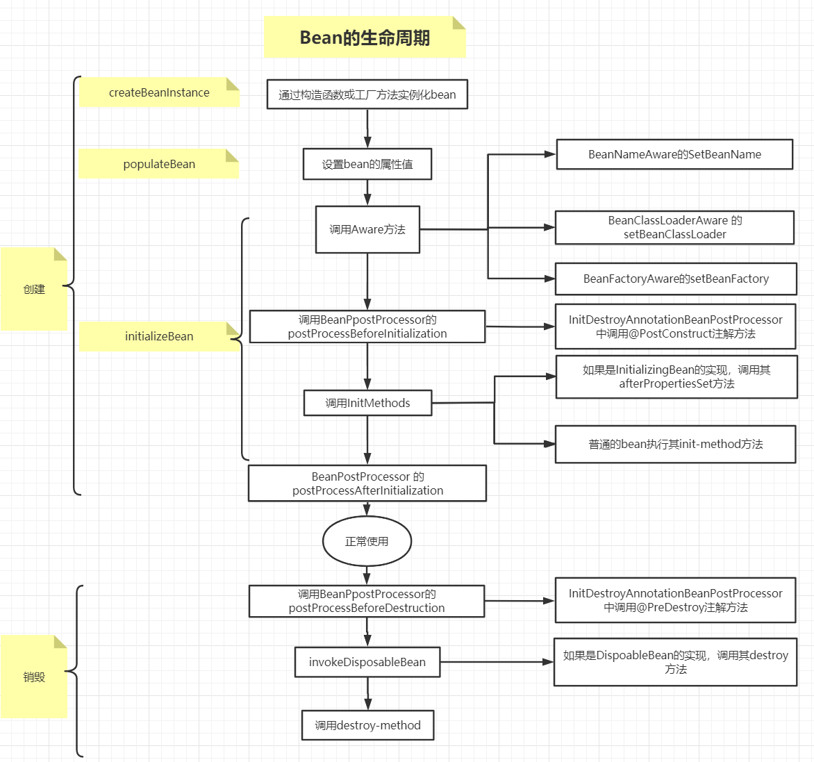
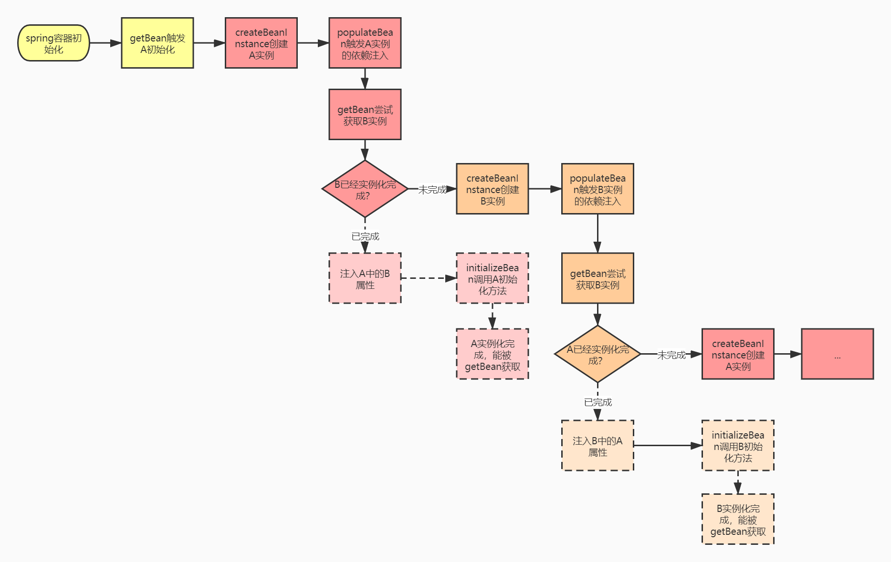
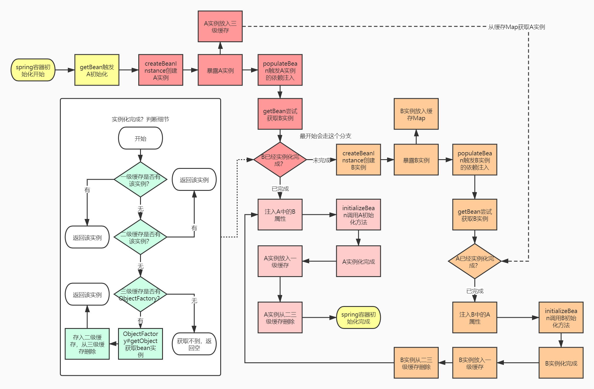
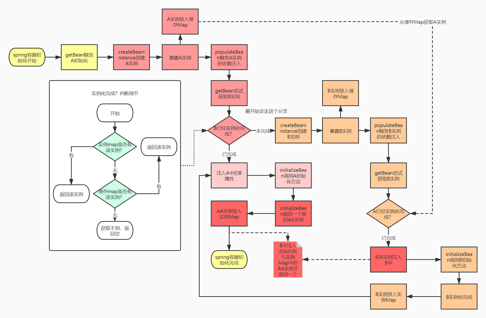
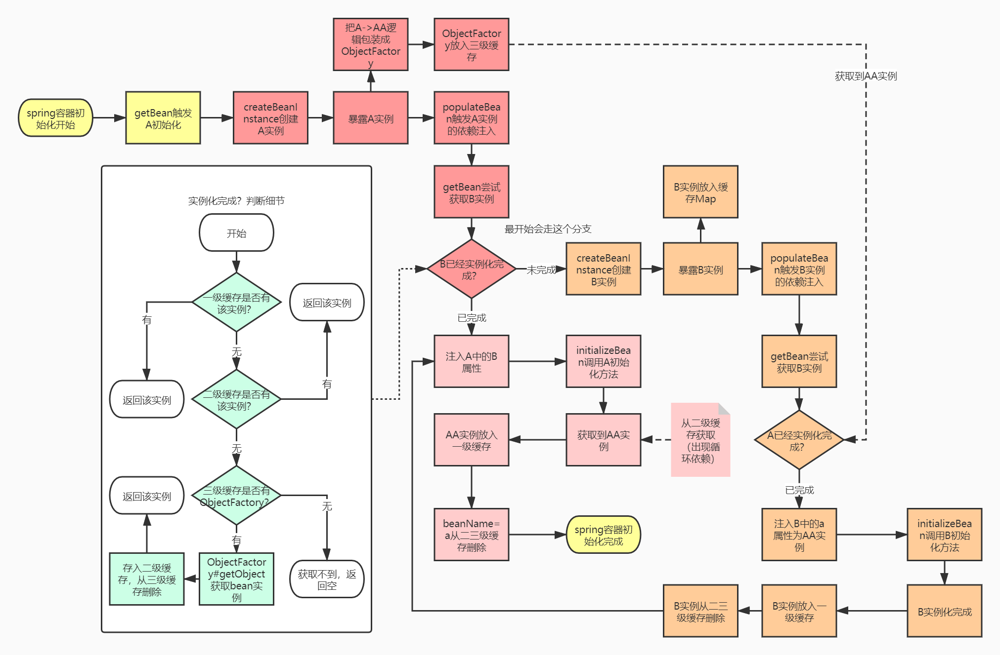
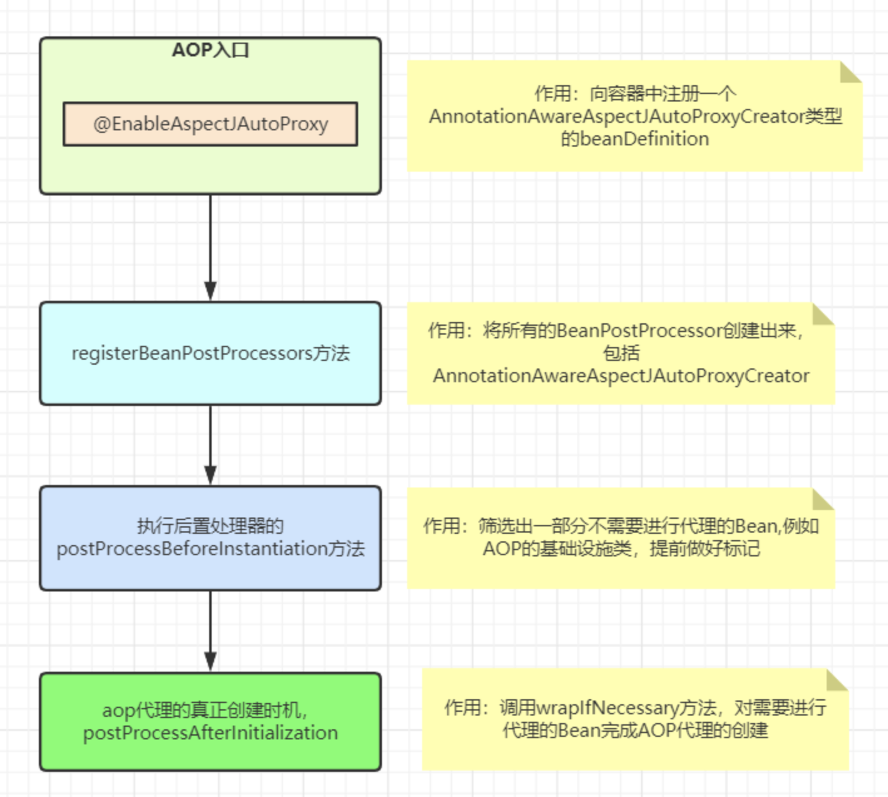
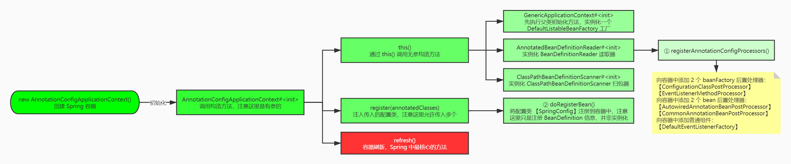
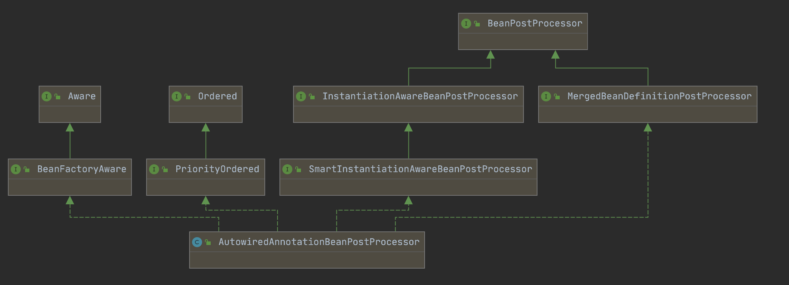

# 一、Spring的生命周期







AbstractAutowireCapableBeanFactory.doCreateBean()

```java
protected Object doCreateBean(String beanName, RootBeanDefinition mbd, @Nullable Object[] args)
			throws BeanCreationException {

		// Instantiate the bean.
		BeanWrapper instanceWrapper = null;
		if (mbd.isSingleton()) {
			instanceWrapper = this.factoryBeanInstanceCache.remove(beanName);
		}
		if (instanceWrapper == null) {
      // 创建Bean实例
			instanceWrapper = createBeanInstance(beanName, mbd, args);
		}
		Object bean = instanceWrapper.getWrappedInstance();
		Class<?> beanType = instanceWrapper.getWrappedClass();
		if (beanType != NullBean.class) {
			mbd.resolvedTargetType = beanType;
		}

		// Allow post-processors to modify the merged bean definition.
		synchronized (mbd.postProcessingLock) {
			if (!mbd.postProcessed) {
				try {
          // 调用一个BeanPostProcessor的钩子方法,这里调用的是
          // MergedBeanDefinitionPostProcessor#postProcessMergedBeanDefinition
          // 这个钩子方法是在bean实例创建之后，依赖注入之前调用的，需要注意的是
          // @Autowired和@Value注解的信息收集-AutowiredAnnotationBeanPostProcessor
          // @PostConstruct、@PreDestroy注解信息收集-CommonAnnotationBeanPostProcessor
					applyMergedBeanDefinitionPostProcessors(mbd, beanType, beanName);
				}
				catch (Throwable ex) {
					throw new BeanCreationException(mbd.getResourceDescription(), beanName,
							"Post-processing of merged bean definition failed", ex);
				}
				mbd.postProcessed = true;
			}
		}

		// Eagerly cache singletons to be able to resolve circular references
		// even when triggered by lifecycle interfaces like BeanFactoryAware.
  	// 使用三级缓存来解决循环依赖的问题
		boolean earlySingletonExposure = (mbd.isSingleton() && this.allowCircularReferences &&
				isSingletonCurrentlyInCreation(beanName));
		if (earlySingletonExposure) {
			if (logger.isTraceEnabled()) {
				logger.trace("Eagerly caching bean '" + beanName +
						"' to allow for resolving potential circular references");
			}
			addSingletonFactory(beanName, () -> getEarlyBeanReference(beanName, mbd, bean));
		}

		// Initialize the bean instance.
		Object exposedObject = bean;
		try {
			populateBean(beanName, mbd, instanceWrapper);
			exposedObject = initializeBean(beanName, exposedObject, mbd);
		}
		catch (Throwable ex) {
			if (ex instanceof BeanCreationException && beanName.equals(((BeanCreationException) ex).getBeanName())) {
				throw (BeanCreationException) ex;
			}
			else {
				throw new BeanCreationException(
						mbd.getResourceDescription(), beanName, "Initialization of bean failed", ex);
			}
		}

		if (earlySingletonExposure) {
			Object earlySingletonReference = getSingleton(beanName, false);
			if (earlySingletonReference != null) {
				if (exposedObject == bean) {
					exposedObject = earlySingletonReference;
				}
				else if (!this.allowRawInjectionDespiteWrapping && hasDependentBean(beanName)) {
					String[] dependentBeans = getDependentBeans(beanName);
					Set<String> actualDependentBeans = new LinkedHashSet<>(dependentBeans.length);
					for (String dependentBean : dependentBeans) {
						if (!removeSingletonIfCreatedForTypeCheckOnly(dependentBean)) {
							actualDependentBeans.add(dependentBean);
						}
					}
					if (!actualDependentBeans.isEmpty()) {
						throw new BeanCurrentlyInCreationException(beanName,
								"Bean with name '" + beanName + "' has been injected into other beans [" +
								StringUtils.collectionToCommaDelimitedString(actualDependentBeans) +
								"] in its raw version as part of a circular reference, but has eventually been " +
								"wrapped. This means that said other beans do not use the final version of the " +
								"bean. This is often the result of over-eager type matching - consider using " +
								"'getBeanNamesForType' with the 'allowEagerInit' flag turned off, for example.");
					}
				}
			}
		}

		// Register bean as disposable.
		try {
			registerDisposableBeanIfNecessary(beanName, bean, mbd);
		}
		catch (BeanDefinitionValidationException ex) {
			throw new BeanCreationException(
					mbd.getResourceDescription(), beanName, "Invalid destruction signature", ex);
		}

		return exposedObject;
	}
```


## 1. 实例化

实例化一个bean实例


```java
protected BeanWrapper createBeanInstance(String beanName, RootBeanDefinition mbd, @Nullable Object[] args) {
		// Make sure bean class is actually resolved at this point.
		Class<?> beanClass = resolveBeanClass(mbd, beanName);

		if (beanClass != null && !Modifier.isPublic(beanClass.getModifiers()) && !mbd.isNonPublicAccessAllowed()) {
			throw new BeanCreationException(mbd.getResourceDescription(), beanName,
					"Bean class isn't public, and non-public access not allowed: " + beanClass.getName());
		}

  	// 如果beanDefinition里有instanceSupplier，直接通过instanceSupplier拿就行了
		Supplier<?> instanceSupplier = mbd.getInstanceSupplier();
		if (instanceSupplier != null) {
			return obtainFromSupplier(instanceSupplier, beanName);
		}

  	// 如果工厂方法不为空，就使用工厂方法实例化
		if (mbd.getFactoryMethodName() != null) {
			return instantiateUsingFactoryMethod(beanName, mbd, args);
		}

		// Shortcut when re-creating the same bean...
    // 这里是对非单例bean做的优化，如果创建过一次了，
    // spring会把相应的构造器或者工厂方法存到resolvedConstructorOrFactoryMethod字段
    // 这样再次创建这个类的实例的时候就可以直接使用resolvedConstructorOrFactoryMethod创建了

		boolean resolved = false;
		boolean autowireNecessary = false;
		if (args == null) {
			synchronized (mbd.constructorArgumentLock) {
				if (mbd.resolvedConstructorOrFactoryMethod != null) {
					resolved = true;
					autowireNecessary = mbd.constructorArgumentsResolved;
				}
			}
		}
		if (resolved) {
			if (autowireNecessary) {
				return autowireConstructor(beanName, mbd, null, null);
			}
			else {
				return instantiateBean(beanName, mbd);
			}
		}

		// Candidate constructors for autowiring?
		Constructor<?>[] ctors = determineConstructorsFromBeanPostProcessors(beanClass, beanName);
		if (ctors != null || mbd.getResolvedAutowireMode() == AUTOWIRE_CONSTRUCTOR ||
				mbd.hasConstructorArgumentValues() || !ObjectUtils.isEmpty(args)) {
			return autowireConstructor(beanName, mbd, ctors, args);
		}

		// Preferred constructors for default construction?
		ctors = mbd.getPreferredConstructors();
		if (ctors != null) {
			return autowireConstructor(beanName, mbd, ctors, null);
		}

		// No special handling: simply use no-arg constructor.
		return instantiateBean(beanName, mbd);
	}
```


## 2. 属性赋值

为bean设置相关属性和依赖


## 3. 初始化

初始化操作又可以分为初始化前、中、后


```java
// AbstractAutowireCapableBeanFactory.java
protected Object initializeBean(final String beanName, final Object bean, @Nullable RootBeanDefinition mbd) {
    // 3. 检查 Aware 相关接口并设置相关依赖
  	// invokeAwareMethods里有三个前置处理器，都是在填充完属性之后，在InitializingBean和init-method之前的
    // 3.1 BeanNameAware：获取Bean的名字
  	// 3.2 BeanClassLoaderAware: 获取加载这个Bean的类加载器
  	// 3.3 BeanFactoryAware: 获取BeanFactory来查找依赖的Bean
    if (System.getSecurityManager() != null) {
        AccessController.doPrivileged((PrivilegedAction<Object>) () -> {
            invokeAwareMethods(beanName, bean);
            return null;
        }, getAccessControlContext());
    }
    else {
        invokeAwareMethods(beanName, bean);
    }

    // 4. BeanPostProcessor 前置后置处理。主要是在Bean实例化和配置了属性之后调用的
  	// 这个接口有两个，default方法，重写它们就可以实现在初始化前后获取bean实例还有bean-name
  	// 比如，Apollo就是通过BeanPostProcessor来替换变量的
  	// 常用场景：对于标记接口的实现类，进行自定义处理
    // 常用场景：为当前对象提供代理实现。如AOP，生成对象的代理类，然后返回
    Object wrappedBean = bean;
    if (mbd == null || !mbd.isSynthetic()) {
        wrappedBean = applyBeanPostProcessorsBeforeInitialization(wrappedBean, beanName);
    }

    // 5. 若实现 InitializingBean 接口，调用 afterPropertiesSet() 方法
    // 6. 若配置自定义的 init-method方法，则执行
    try {
        invokeInitMethods(beanName, wrappedBean, mbd);
    }
    catch (Throwable ex) {
        throw new BeanCreationException(
            (mbd != null ? mbd.getResourceDescription() : null),
            beanName, "Invocation of init method failed", ex);
    }
    // 7. BeanPostProceesor 后置处理
    if (mbd == null || !mbd.isSynthetic()) {
        wrappedBean = applyBeanPostProcessorsAfterInitialization(wrappedBean, beanName);
    }

    return wrappedBean;
}

```


### 3.1 @PostConstruct

在Bean的生命周期中，只会调用一次，而且是在构造函数之后调用的

跟在构造器里调用有什么不一样？

- 在执行构造函数的时候，bean还没被初始化，依赖还没注入。@PostConstruct是在bean完全初始化后的，所以你可以在@PostConstruct方法里使用依赖
- 容器可能会多次实例化（虽然不太可能）。@PostConstruct只会被调用一次


## 4. 销毁

注册销毁相关的调用接口


## 5. doCreateBean小结

创建`bean`实例，可能是通过**工厂方法**或者**构造器**，且参数都支持依赖注入。

依赖注入，解决`@Resource`、`@Autowired`等注解注入以及`beanDefinition`的`propertyValues`属性注入问题。

初始化逻辑

1. `XxxAware`接口调用
2. 初始化方法调用，初始化注解(`@PostConstruct`)->初始化接口(`InitializingBean`)->`beanDefinition`的`initMethodName`属性（例如`xml`配置）

注册单例`bean`的销毁逻辑


# 二、Spring循环依赖




## 1. 三级缓存解决循环依赖




## 2. 为什么要设计成三级缓存

### 2.1 只做二级缓存会有什么问题

```java
protected Object initializeBean(final String beanName, final Object bean, @Nullable RootBeanDefinition mbd) {
    // 调用aware接口
    invokeAwareMethods(beanName, bean);
    Object wrappedBean = bean;
    if (mbd == null || !mbd.isSynthetic()) {
        // 埋点
        wrappedBean = applyBeanPostProcessorsBeforeInitialization(wrappedBean, beanName);
    }

    try {
        // 初始化方法
        invokeInitMethods(beanName, wrappedBean, mbd);
    }
    catch (Throwable ex) {
        throw new BeanCreationException(...);
    }
    if (mbd == null || !mbd.isSynthetic()) {
        // 埋点
        wrappedBean = applyBeanPostProcessorsAfterInitialization(wrappedBean, beanName);
    }

    return wrappedBean;
}

```

可以看到，在初始化Bean的时候，有可能会把原来的Bean给替换掉
例如单元测试Mock的时候


所以，在初始化bean的时候，`initializeBean`方法是可能返回一个新的对象，从而把`createBeanInstance`创建的bean实例替换掉的



这会导致`B`中注入的`A`实例与`singletonObjects`中保存的`AA`实例不一致，而之后其他的实例注入`a`时，却会拿到`singletonObjects`中的`AA`实例，这样肯定是不符合预期的


### 2.2 三级缓存是如何解决问题的

三级缓存如何解决initializeBean中返回新的bean，导致B中注入A的bean与singletonObjects中保存的AA不一致





原来为了解决`initializeBean`可能替换`bean`引用的问题，`spring`就设计了这个三级缓存，他在第三级里保存了一个`ObjectFactory`，其实具体就是`getEarlyBeanReference`的调用，其中提供了一个`getEarlyBeanReference`的埋点方法，通过这个埋点方法，它允许开发人员把需要替换的`bean`，提早替换出来


### 2.3 三级缓存的实际应用

`Spring`的`AOP`功能，是通过生成动态代理类来实现的，而最后我们使用的也都是代理类实例而不是原始类实例。而`AOP`代理类的创建，就是在`initializeBean`方法的`postProcessAfterInitialization`埋点中，我们直接看一下`getEarlyBeanReference`和`postProcessAfterInitialization`这两个埋点吧


```java
public abstract class AbstractAutoProxyCreator extends ProxyProcessorSupport
    implements SmartInstantiationAwareBeanPostProcessor, BeanFactoryAware {
    
    private final Map<Object, Object> earlyProxyReferences = new ConcurrentHashMap<>(16);
    // 如果出现循环依赖，getEarlyBeanReference会先被调用到
    public Object getEarlyBeanReference(Object bean, String beanName) {
        Object cacheKey = getCacheKey(bean.getClass(), beanName);
        // 这个时候把当前类放入earlyProxyReferences
        this.earlyProxyReferences.put(cacheKey, bean);
        // 直接返回了一个代理实例
        return wrapIfNecessary(bean, beanName, cacheKey);
    }
    
    public Object postProcessAfterInitialization(Object bean, String beanName) {
        if (bean != null) {
            Object cacheKey = getCacheKey(bean.getClass(), beanName);
            // 注意这个判断，如果出现了循环依赖，这个if块是进不去的
            if (this.earlyProxyReferences.remove(cacheKey) != bean) {
                // 如果没有出现循环依赖，会在这里创建代理类
                return wrapIfNecessary(bean, beanName, cacheKey);
            }
        }
        return bean;
    }
}

```


## 3. 三级缓存无法解决的问题

### 3.1 循环构造依赖

`java`的语言特性决定了不允许使用未初始化完成的变量

有一个特殊的循环依赖，由于`java`语言特性的原因，是永远无法解决的，那就是构造器循环依赖

### 3.2 @Lazy解决

从源码我们可以看到，对于`@Lazy`的依赖，我们其实是返回了一个代理类（以下称为`LazyProxy`）而不是正真通过`getBean`拿到目标`bean`注入。而真正的获取`bean`的逻辑，被封装到了一个`TargetSource`类的`getTarget`方法中，而这个`TargetSource`类最终被用来生成`LazyProxy`了，那么我们是不是可以推测，`LazyProxy`应该持有这个`TargetSource`对象


```java
public class A {
    private final B b;
    public A(final B b) {
        this.b = b;
    }
    public void prt() {
        System.out.println("in a prt");
    }
}

public class B {
    private final A a;
    public B(final A a) {
        this.a = a;
    }
    public void prt() {
        a.prt();
    }
}
// A的懒加载代理类
public class LazyProxyA extends A {
    private A source;
    private final Map<String, Object> ioc;
    private final String beanName;
    public LazyProxyA(Map<String, Object> ioc, String beanName) {
        super(null);
        this.ioc = ioc;
        this.beanName = beanName;
    }
    @Override
    public void prt() {
        if (source == null) {
            source = (A) ioc.get(beanName);
        }
        source.prt();
    }
}

```


# 三、FactoryBean

Spring 中有两种类型的Bean，一种是普通Bean，另一种是工厂Bean 即 FactoryBean。FactoryBean跟普通Bean不同，其返回的对象不是指定类的一个实例，而是该FactoryBean的getObject方法所返回的对象。创建出来的对象是否属于单例由isSingleton中的返回决定


### 1. 作用

用户可以通过实现该接口定制实例化Bean的逻辑


也就是说，正常通过factoryBean从`Spring`容器中取的话，是只能取到factoryBean中返回的实例，但是如果在factoryBean前面加上`&`符号，使用`&factoryBean`从`Spring`容器中获取，才能获取到`FactoryBean`实例本身


### 2. 与BeanFactory的区别

区别：BeanFactory是个Factory，也就是IOC容器或对象工厂，FactoryBean是个Bean。在Spring中，**所有的Bean都是由BeanFactory(也就是IOC容器)来进行管理的**。但对FactoryBean而言，**这个Bean不是简单的Bean，而是一个能生产或者修饰对象生成的工厂Bean,它的实现与设计模式中的工厂模式和修饰器模式类似** 


# 四、AOP

## 1. 静态代理与动态代理

### 1.1 静态代理

> 编译期把内容织入代理对象

- 硬编码静态代理： 说白了就是通过编码上的设计达到代理的效果。
- AspectJ编译织入 ：编译期把内容编译到字节码中，


- 静态代理不产生新的Class
- 静态代理在编译期织入代理对象
- 静态代理不灵活

### 1.2 动态代理

> 生成了新的字节码，动态代理

- JDK动态代理：Proxy+InvocationHandler 模式
- CGLB动态代理： Enhancer + MethodInterceptor(CallBack)


## 2. AOP在Bean生命周期中的流程

```java
public void refresh() throws BeansException, IllegalStateException {
        synchronized(this.startupShutdownMonitor) {
            this.prepareRefresh();
            ConfigurableListableBeanFactory beanFactory = this.obtainFreshBeanFactory();
            this.prepareBeanFactory(beanFactory);

            try {
                this.postProcessBeanFactory(beanFactory);
                this.invokeBeanFactoryPostProcessors(beanFactory);
                // 完成BeanPostProcessor的创建并添加到容器中
                this.registerBeanPostProcessors(beanFactory);
                this.initMessageSource();
                this.initApplicationEventMulticaster();
                this.onRefresh();
                this.registerListeners();
                this.finishBeanFactoryInitialization(beanFactory);
                this.finishRefresh();
            } catch (BeansException var9) {
                if (this.logger.isWarnEnabled()) {
                    this.logger.warn("Exception encountered during context initialization - cancelling refresh attempt: " + var9);
                }

                this.destroyBeans();
                this.cancelRefresh(var9);
                throw var9;
            } finally {
                this.resetCommonCaches();
            }

        }
    }
```




### 2.1 @EnableAspectJAutoProxy

通过`@EnableAspectJAutoProxy`注解向容器中注册一个`AnnotationAwareAspectJAutoProxyCreator`的`BeanDefinition`，它本身也是一个`BeanPostProcessor`，这个`BeanDefinition`会在`org.springframework.context.support.AbstractApplicationContext#registerBeanPostProcessors`这个方法中完成创建


### 2.2 postProcessBeforeInstantiation的执行

```java
//  这个方法的主要目的就是在不考虑通知的情况下，确认哪些Bean不需要被代理
//  1.Advice,Advisor,Pointcut类型的Bean不需要被代理
//  2.不是原始Bean被包装过的Bean不需要被代理，例如ScopedProxyFactoryBean
//  实际上并不只是这些Bean不需要被代理，如果没有对应的通知需要被应用到这个Bean上的话
//  这个Bean也是不需要被代理的，只不过不是在这个方法中处理的。
public Object postProcessBeforeInstantiation(Class<?> beanClass, String beanName) {
    Object cacheKey = getCacheKey(beanClass, beanName);
    // 如果beanName为空或者为这个bean提供了定制的targetSource
    if (!StringUtils.hasLength(beanName) || !this.targetSourcedBeans.contains(beanName)) {
        // advisedBeans是一个map,其中key是BeanName,value代表了这个Bean是否需要被代理
        // 如果已经包含了这个key,不需要在进行判断了，直接返回即可
        // 因为这个方法的目的就是在实例化前就确认哪些Bean是不需要进行AOP的
        if (this.advisedBeans.containsKey(cacheKey)) {
            return null;
        }
        // 说明还没有对这个Bean进行处理
        // 在这里会对SpringAOP中的基础设施bean,例如Advice,Pointcut,Advisor做标记
        // 标志它们不需要被代理，对应的就是将其放入到advisedBeans中，value设置为false
        // 其次，如果这个Bean不是最原始的Bean，那么也不进行代理，也将其value设置为false
        if (isInfrastructureClass(beanClass) || shouldSkip(beanClass, beanName)) {
            this.advisedBeans.put(cacheKey, Boolean.FALSE);
            return null;
        }
    }

    // 是否为这个Bean提供了定制的TargetSource
    // 如果提供了定制的TargetSource，那么直接在这一步创建一个代理对象并返回
    // 一般不会提供
    TargetSource targetSource = getCustomTargetSource(beanClass, beanName);
    if (targetSource != null) {
        if (StringUtils.hasLength(beanName)) {
            this.targetSourcedBeans.add(beanName);
        }
        Object[] specificInterceptors = getAdvicesAndAdvisorsForBean(beanClass, beanName, targetSource);
        Object proxy = createProxy(beanClass, beanName, specificInterceptors, targetSource);
        this.proxyTypes.put(cacheKey, proxy.getClass());
        return proxy;
    }

    return null;
}

```


### 2.3 postProcessAfterInitialization方法执行

```java
public Object postProcessAfterInitialization(@Nullable Object bean, String beanName) {
    if (bean != null) {
        Object cacheKey = getCacheKey(bean.getClass(), beanName);
        // 什么时候这个判断会成立呢？
        // 如果不出现循环引用的话，remove方法必定返回null
        // 所以这个remove(cacheKey) != bean肯定会成立
        // 如果发生循环依赖的话，这个判断就不会成立
        // 这个我们在介绍循环依赖的时候再详细分析，
        // 目前你只需要知道wrapIfNecessary完成了AOP代理
        if (this.earlyProxyReferences.remove(cacheKey) != bean) {
            // 需要代理的话，在这里完成的代理
            return wrapIfNecessary(bean, beanName, cacheKey);
        }
    }
    return bean;
}

```


### 2.3 wrapIfNecessary方法执行

```java
protected Object wrapIfNecessary(Object bean, String beanName, Object cacheKey) {
   
    // 在postProcessBeforeInstantiation方法中可能已经完成过代理了
    // 如果已经完成代理了，那么直接返回这个代理的对象
    if (StringUtils.hasLength(beanName) && this.targetSourcedBeans.contains(beanName)) {
        return bean;
    }
    
    // 在postProcessBeforeInstantiation方法中可能已经将其标记为不需要代理了
    // 这种情况下，也直接返回这个Bean
    if (Boolean.FALSE.equals(this.advisedBeans.get(cacheKey))) {
        return bean;
    }
    
    // 跟在postProcessBeforeInstantiation方法中的逻辑一样
    // 如果不需要代理，直接返回，同时在advisedBeans中标记成false
    if (isInfrastructureClass(bean.getClass()) || shouldSkip(bean.getClass(), beanName)) {
        this.advisedBeans.put(cacheKey, Boolean.FALSE);
        return bean;
    }

    // 获取可以应用到这个Bean上的通知
    Object[] specificInterceptors = getAdvicesAndAdvisorsForBean(bean.getClass(), beanName, null);
    // 如果存在通知的话，说明需要被代理
    if (specificInterceptors != DO_NOT_PROXY) {
        this.advisedBeans.put(cacheKey, Boolean.TRUE);
        // 到这里创建代理，实际上底层就是new了一个ProxyFactory来创建代理的
        Object proxy = createProxy(
            bean.getClass(), beanName, specificInterceptors, new SingletonTargetSource(bean));
        this.proxyTypes.put(cacheKey, proxy.getClass());
        return proxy;
    }
 // 如果没有通知的话，也将这个Bean标记为不需要代理
    this.advisedBeans.put(cacheKey, Boolean.FALSE);
    return bean;
}

```


## 3. AOP如何被注入


@EnableAspectjAutoProxy注解上有@Import注解，引入了AspectJAutoProxyRegistrar类，这个类继承了ImportBeanDefinitionRegistrar，通过这个ImportBeanDefinitionRegistrar这个类的registerBeanDefinitions方法，向容器注入一个AnnotationAwareAspectJAutoProxyCreator类，并设置用什么方式实现代理，然后**AnnotationAwareAspectJAutoProxyCreator类的postProcessAfterInitialization()方法将所有有advice的bean重新包装成proxy**


怎么注入的？

把AnnotationAwareAspectJAutoProxyCreator放到BeanDenifition里面，然后再通过BeanDefinitionRegistry注册到容器里


什么是Bean？

我们可以简单理解为是 BeanDefinition 的实例，Spring 会根据 BeanDefinition 中的信息为我们生产合适的 bean 实例出来


怎么知道哪个类需要被代理？


@EnableAspectJAutoProxy何时被扫描


### 3.1 @EnableAspectJAutoProxy

```java
@Import(AspectJAutoProxyRegistrar.class)
public @interface EnableAspectJAutoProxy {

	/**
	 * Indicate whether subclass-based (CGLIB) proxies are to be created as opposed
	 * to standard Java interface-based proxies. The default is {@code false}.
	 */
	boolean proxyTargetClass() default false;

	/**
	 * Indicate that the proxy should be exposed by the AOP framework as a {@code ThreadLocal}
	 * for retrieval via the {@link org.springframework.aop.framework.AopContext} class.
	 * Off by default, i.e. no guarantees that {@code AopContext} access will work.
	 * @since 4.3.1
	 */
	boolean exposeProxy() default false;

}
```


### 3.2 AspectJAutoProxyRegistrar

```java
class AspectJAutoProxyRegistrar implements ImportBeanDefinitionRegistrar {

	/**
	 * Register, escalate, and configure the AspectJ auto proxy creator based on the value
	 * of the @{@link EnableAspectJAutoProxy#proxyTargetClass()} attribute on the importing
	 * {@code @Configuration} class.
	 */
	@Override
	public void registerBeanDefinitions(
			AnnotationMetadata importingClassMetadata, BeanDefinitionRegistry registry) {

    // 注册了一个基于注解的自动代理创建器
    // 此处向容器注入了AnnotationAwareAspectJAutoProxyCreator类
		AopConfigUtils.registerAspectJAnnotationAutoProxyCreatorIfNecessary(registry);

    // 解析EnableAspectJAutoProxy里面的字段
		AnnotationAttributes enableAspectJAutoProxy =
				AnnotationConfigUtils.attributesFor(importingClassMetadata, EnableAspectJAutoProxy.class);
    // 表示强制指定了要使用CGLIB
		if (enableAspectJAutoProxy != null) {
			if (enableAspectJAutoProxy.getBoolean("proxyTargetClass")) {
				AopConfigUtils.forceAutoProxyCreatorToUseClassProxying(registry);
			}
      // 强制暴露Bean的代理对象到AopContext
			if (enableAspectJAutoProxy.getBoolean("exposeProxy")) {
				AopConfigUtils.forceAutoProxyCreatorToExposeProxy(registry);
			}
		}
	}

}
```


### 3. AopConfigUtils

```java
private static BeanDefinition registerOrEscalateApcAsRequired(Class<?> cls, BeanDefinitionRegistry registry, @Nullable Object source) {
        Assert.notNull(registry, "BeanDefinitionRegistry must not be null");
        if (registry.containsBeanDefinition("org.springframework.aop.config.internalAutoProxyCreator")) {
            BeanDefinition apcDefinition = registry.getBeanDefinition("org.springframework.aop.config.internalAutoProxyCreator");
            if (!cls.getName().equals(apcDefinition.getBeanClassName())) {
                int currentPriority = findPriorityForClass(apcDefinition.getBeanClassName());
                int requiredPriority = findPriorityForClass(cls);
                if (currentPriority < requiredPriority) {
                    apcDefinition.setBeanClassName(cls.getName());
                }
            }

            return null;
        } else {
            RootBeanDefinition beanDefinition = new RootBeanDefinition(cls);
            beanDefinition.setSource(source);
            beanDefinition.getPropertyValues().add("order", -2147483648);
            beanDefinition.setRole(2);
            registry.registerBeanDefinition("org.springframework.aop.config.internalAutoProxyCreator", beanDefinition);
            return beanDefinition;
        }
    }
```


## 4. AnnotationAwareAspectJAutoProxyCreator

自动代理创建类

它实现了BeanPostProcessor接口，实现类为AbstractAutoProxyCreator

```java
@Override
	public Object postProcessBeforeInitialization(Object bean, String beanName) {
		return bean;
	}
 
    // 主要看这个方法，在bean初始化之后对生产出的bean进行包装
	@Override
	public Object postProcessAfterInitialization(Object bean, String beanName) throws BeansException {
		if (bean != null) {
			Object cacheKey = getCacheKey(bean.getClass(), beanName);
			if (!this.earlyProxyReferences.contains(cacheKey)) {
				return wrapIfNecessary(bean, beanName, cacheKey);
			}
		}
		return bean;
	}
 
    // wrapIfNecessary
	protected Object wrapIfNecessary(Object bean, String beanName, Object cacheKey) {
		if (beanName != null && this.targetSourcedBeans.contains(beanName)) {
			return bean;
		}
		if (Boolean.FALSE.equals(this.advisedBeans.get(cacheKey))) {
			return bean;
		}
		if (isInfrastructureClass(bean.getClass()) || shouldSkip(bean.getClass(), beanName)) {
			this.advisedBeans.put(cacheKey, Boolean.FALSE);
			return bean;
		}
 
		// Create proxy if we have advice.
        // 意思就是如果该类有advice则创建proxy，
		Object[] specificInterceptors = getAdvicesAndAdvisorsForBean(bean.getClass(), beanName, null);
		if (specificInterceptors != DO_NOT_PROXY) {
			this.advisedBeans.put(cacheKey, Boolean.TRUE);
            // 1.通过方法名也能简单猜测到，这个方法就是把bean包装为proxy的主要方法，
			Object proxy = createProxy(
					bean.getClass(), beanName, specificInterceptors, new SingletonTargetSource(bean));
			this.proxyTypes.put(cacheKey, proxy.getClass());
            
            // 2.返回该proxy代替原来的bean
			return proxy;
		}
 
		this.advisedBeans.put(cacheKey, Boolean.FALSE);
		return bean;
	}

```


**AnnotationAwareAspectJAutoProxyCreator类的postProcessAfterInitialization()方法将所有有advisor的bean重新包装成proxy**


## 5. 如何获取Advisor

AnnotationAwareAspectJAutoProxyCreator里面有个属性，BeanFactoryAspectJAdvisorsBuilder，通过它的buildAspectJAdvisors方法来获取Advisor的

buildAspectJAdvisors里面用到了双重校验锁


```java
/**
	 * Look for AspectJ-annotated aspect beans in the current bean factory,
	 * and return to a list of Spring AOP Advisors representing them.
	 * <p>Creates a Spring Advisor for each AspectJ advice method.
	 * @return the list of {@link org.springframework.aop.Advisor} beans
	 * @see #isEligibleBean
	 */
	public List<Advisor> buildAspectJAdvisors() {
    List<String> aspectNames = this.aspectBeanNames;

		if (aspectNames == null) {
			synchronized (this) {
				aspectNames = this.aspectBeanNames;
				if (aspectNames == null) {
					List<Advisor> advisors = new ArrayList<>();
					aspectNames = new ArrayList<>();
          // 获取当前beanFactory下面所有的BeanName
					String[] beanNames = BeanFactoryUtils.beanNamesForTypeIncludingAncestors(
							this.beanFactory, Object.class, true, false);
					for (String beanName : beanNames) {
						if (!isEligibleBean(beanName)) {
							continue;
						}
						// We must be careful not to instantiate beans eagerly as in this case they
						// would be cached by the Spring container but would not have been weaved.
            
						Class<?> beanType = this.beanFactory.getType(beanName, false);
						if (beanType == null) {
							continue;
						}
            // 判断这个bean有没有带@Aspect注解
						if (this.advisorFactory.isAspect(beanType)) {
              // 有的放放到aspectName里
							aspectNames.add(beanName);
              // 并将这个bean封装成AspectMetadata
							AspectMetadata amd = new AspectMetadata(beanType, beanName);
							if (amd.getAjType().getPerClause().getKind() == PerClauseKind.SINGLETON) {
								MetadataAwareAspectInstanceFactory factory =
										new BeanFactoryAspectInstanceFactory(this.beanFactory, beanName);
								List<Advisor> classAdvisors = this.advisorFactory.getAdvisors(factory);
								if (this.beanFactory.isSingleton(beanName)) {
									this.advisorsCache.put(beanName, classAdvisors);
								}
								else {
									this.aspectFactoryCache.put(beanName, factory);
								}
								advisors.addAll(classAdvisors);
							}
							else {
								// Per target or per this.
								if (this.beanFactory.isSingleton(beanName)) {
									throw new IllegalArgumentException("Bean with name '" + beanName +
											"' is a singleton, but aspect instantiation model is not singleton");
								}
								MetadataAwareAspectInstanceFactory factory =
										new PrototypeAspectInstanceFactory(this.beanFactory, beanName);
								this.aspectFactoryCache.put(beanName, factory);
								advisors.addAll(this.advisorFactory.getAdvisors(factory));
							}
						}
					}
					this.aspectBeanNames = aspectNames;
					return advisors;
				}
			}
		}

		if (aspectNames.isEmpty()) {
			return Collections.emptyList();
		}
		List<Advisor> advisors = new ArrayList<>();
		for (String aspectName : aspectNames) {
			List<Advisor> cachedAdvisors = this.advisorsCache.get(aspectName);
			if (cachedAdvisors != null) {
				advisors.addAll(cachedAdvisors);
			}
			else {
				MetadataAwareAspectInstanceFactory factory = this.aspectFactoryCache.get(aspectName);
				advisors.addAll(this.advisorFactory.getAdvisors(factory));
			}
		}
		return advisors;
  }
```


## 6. 如何创建Proxy

```java
protected Object createProxy(
			Class<?> beanClass, String beanName, Object[] specificInterceptors, TargetSource targetSource) {
 
		if (this.beanFactory instanceof ConfigurableListableBeanFactory) {
			AutoProxyUtils.exposeTargetClass((ConfigurableListableBeanFactory) this.beanFactory, beanName, beanClass);
		}
 
        // 1.创建proxyFactory，proxy的生产主要就是在proxyFactory做的
		ProxyFactory proxyFactory = new ProxyFactory();
		proxyFactory.copyFrom(this);
 
		if (!proxyFactory.isProxyTargetClass()) {
			if (shouldProxyTargetClass(beanClass, beanName)) {
				proxyFactory.setProxyTargetClass(true);
			}
			else {
				evaluateProxyInterfaces(beanClass, proxyFactory);
			}
		}
 
        // 2.将当前bean适合的advice，重新封装下，封装为Advisor类，然后添加到ProxyFactory中
		Advisor[] advisors = buildAdvisors(beanName, specificInterceptors);
		for (Advisor advisor : advisors) {
			proxyFactory.addAdvisor(advisor);
		}
 
		proxyFactory.setTargetSource(targetSource);
		customizeProxyFactory(proxyFactory);
 
		proxyFactory.setFrozen(this.freezeProxy);
		if (advisorsPreFiltered()) {
			proxyFactory.setPreFiltered(true);
		}
 
        // 3.调用getProxy获取bean对应的proxy
		return proxyFactory.getProxy(getProxyClassLoader());
	}
```


# 五、动态代理

## 1. JDK动态代理

### 2. CGLIB动态代理


# 六、依赖如何注入


# 七、常用的类

## 1. BeanFactory

## 2. ApplicationContext


# 八、Transactional的实现原理

如何知道事务已经执行成功

### 1. @transactional失效的场景

#### 1.1 使用在非public方法上

#### 1.2 设置属性propagation错误

若是错误的配置以下三种 propagation，事务将不会发生回滚

- PROPAGATION_SUPPORTS：如果当前存在事务，则加入该事务；如果当前没有事务，则以非事务的方式继续运行
- PROPAGATION_NOT_SUPPORTED：以非事务方式运行，如果当前存在事务，则把当前事务挂起
- PROPAGATION_NEVER：以非事务方式运行，如果当前存在事务，则抛出异常

#### 1.3 rollBackFor设置错误

#### 1.4 同一个类中方法调用

只有当事务方法被当前类以外的代码调用时，才会由`Spring`生成的代理对象来管理

#### 1.5 异常被try-catch捕获了

#### 1.6 数据库不支持事务


# 九、IOC


## 1. 什么是IOC


## 2. 包扫描

### 2.1 @SrptingBootApplication

由三个注解组成：@Configuration` + `@EnableAutoConfiguration` + `@ComponentScan


标识了一个配置类，这个配置类上声明了一个或多个 `@Bean` 的方法，并且它会触发自动配置和组件扫描。


### 2.2 @ComponentScan

默认扫描当前配置类所在包及子包里的所有组件

```java
@ComponentScan(excludeFilters = { @Filter(type = FilterType.CUSTOM, classes = TypeExcludeFilter.class),
		@Filter(type = FilterType.CUSTOM, classes = AutoConfigurationExcludeFilter.class) })
```


#### 2.2.1 TypeExcludeFilter

`TypeExcludeFilter` 的作用是做**扩展的组件过滤**，能让我们**向IOC容器中注册一些自定义的组件过滤器，以在包扫描的过程中过滤它们**


#### 2.2.2 AutoConfigurationExcludeFilter

的 `match` 方法要判断两个部分：**是否是一个配置类，是否是一个自动配置类**


### 2.3 @SpringBootConfiguration

标识一个类作为 SpringBoot 的配置类，它可以是Spring原生的 `@Configuration` 的一种替换方案，目的是这个配置可以被自动发现

应用应当只在主启动类上标注 `@SpringBootConfiguration`，大多数情况下都是直接使用 `@SpringBootApplication`


### 2.4 @Configuration

被 `@Configuration` 标注的类，会被 Spring 的IOC容器认定为配置类， 相当于一个applicationContext.xml配置文件


## 3. 自动装配

有三种方式实现自动装配

- @Component
- @Configuration + @Bean
- @EnableXXX  + @Import


### 3.1 手动装配@EnableXXX  + @Import


@Import

```java
public @interface Import {

	/**
	 * {@link Configuration @Configuration}, {@link ImportSelector},
	 * {@link ImportBeanDefinitionRegistrar}, or regular component classes to import.
	 */
  // 可以传入四种类型：普通类、配置类、ImportSelector 的实现类, ImportBeanDefinitionRegistrar 的实现类
	Class<?>[] value();

}
```


#### 用法

```java
@Documented
@Retention(RetentionPolicy.RUNTIME)
@Target(ElementType.TYPE)
public @interface EnableColor {
    
}
```


```java
@Import({Red.class})
public @interface EnableColor {
    
}
```


启动类标注@EnableColor，引导启动IOC容器

```java
@EnableColor
@Configuration
public class ColorConfiguration {
    
}

public class App {
    public static void main(String[] args) throws Exception {
        AnnotationConfigApplicationContext ctx = new AnnotationConfigApplicationContext(ColorConfiguration.class);
        String[] beanDefinitionNames = ctx.getBeanDefinitionNames();
        Stream.of(beanDefinitionNames).forEach(System.out::println);
    }
}
```


#### ImportSelector

```java
public class ColorImportSelector implements ImportSelector {
    
  	// 自动扫描Blue、Green
    @Override
    public String[] selectImports(AnnotationMetadata importingClassMetadata) {
        return new String[] {Blue.class.getName(), Green.class.getName()};
    }
    
}
```


#### ImportBeanDefinitionRegistrar

```java
public class ColorImportBeanDefinitionRegistrar implements ImportBeanDefinitionRegistrar {
    
    @Override
    public void registerBeanDefinitions(AnnotationMetadata importingClassMetadata, BeanDefinitionRegistry registry) {
        registry.registerBeanDefinition("black", new RootBeanDefinition(Black.class));
    }
    
}
```


### 3.2  自动装配

SpringBoot的自动配置完全由 `@EnableAutoConfiguration` 开启。

```java
@AutoConfigurationPackage
@Import(AutoConfigurationImportSelector.class)
public @interface EnableAutoConfiguration{}
```


# 十、Spring启动流程





## 1. 如何设计一个IOC容器

首先得提供一个入口（**AnnotationConfigApplicationContext**）给用户使用，然后初始化一系列工具组件

- IOC容器的作用是管理Bean对象嘛，能管理前提是得有Bean对象，所以需要一个BeanFactory（**DefaultListableBeanFactory**）工厂来生成Bean对象
- 如果想对特定注解的类进行读取转化成BeanDefinition对象，那么就需要一个注解配置读取器（**AnnotatedBeanDenifitionReader**）
- 如果我想对用户指定的包目录进行扫描查找Bean对象，那么还需要一个路径扫描器（**ClassPathBeanDenifitionScanner**）


## 2. @Autowire、@Resource是如何注入的


###  2.1 AutowiredAnnotationBeanPostProcessor

步骤： 

1. 解析注解元信息（postProcessMergedBeanDefinition，把需要依赖注入的属性、方法进行元信息的转换，变成InjectionMetadata）
2. 注入阶段，在Bean实例化后，会进行属性赋值，通过InstantiationAwareBeanProcessor.postProcessProperties方法进行属性赋值



- 实现了InstantiationAwareBeanPostProcessor，所以可以介入到Bean的实例化前后
- 实现了BeanPostProcessor，所以可以介入到Bean初始化前后
- 实现了MergedBeanDefinitionPostProcessor。说明可以合并bean的定义信息


@Autowired注解是如何实现自动装配的？

通过后置处理器AutowiredAnnotationBeanPostProcessor类的postProcessPropertyValues()方法实现的


自动装配时，从容器中发现多个同类型的属性怎么办？

@Autowired注解会先根据类型判断，然后根据@Primary、@Priority注解判断，最后根据属性名与beanName是否相等来判断，如果还是不能决定注入哪一个bean时，就会抛出异常


### CommonAnnotationBeanPostProcessor


## 3. @Bean注解是如何实现的


## 4. 整个工厂在初始化之后，扫描之前干了什么


## 5. BeanFactory和ApplicationContext的关系