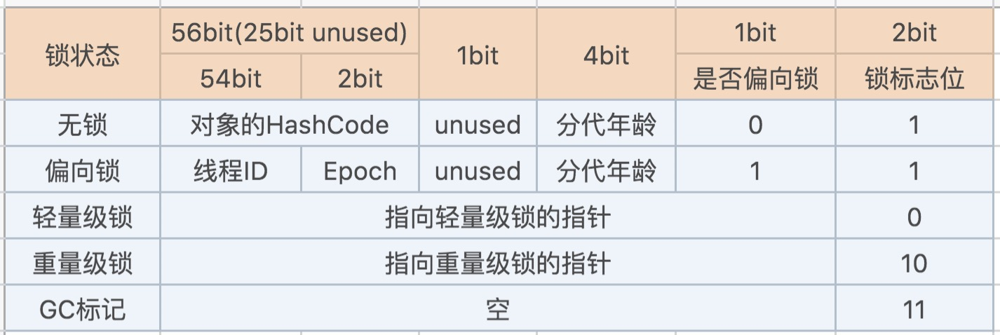
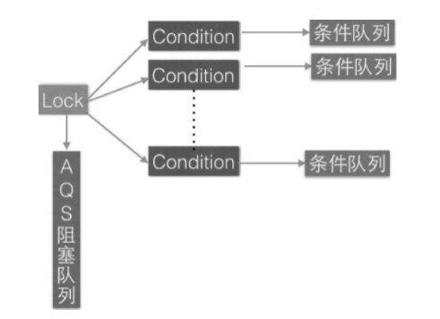
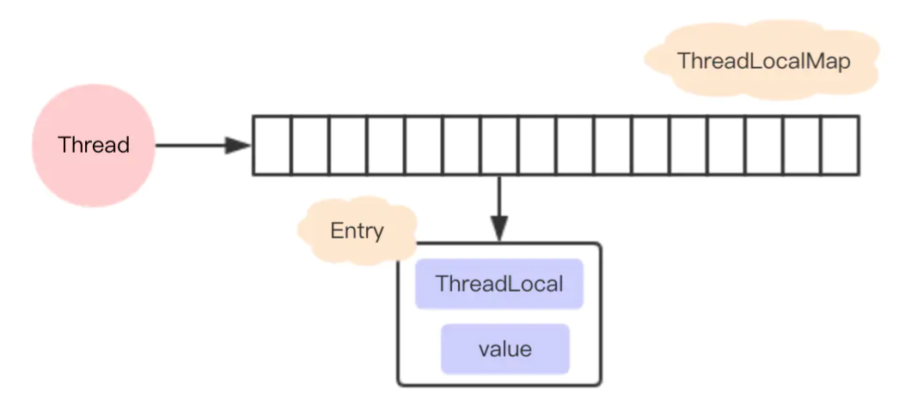

## 一、线程池

### 1. 什么是线程池

线程池是一种线程的使用模式，它用来维护多个线程，避免了短时间处理任务时创建与销毁线程的代价


#### 1.1 为什么要用线程池

Java线程的创建、销毁是需要一定的维护成本的，如果处理不好，很容易带来性能上的问题


在HotSpot VM的线程模型中，Java线程是被一对一映射成内核线程的。也就是说，**Java在使用线程执行任务时，需要创建一个内核线程；当该Java线程被终止时，这个内核线程也会被回收**


> 线程模型有多对一模型、一对一模型、多对多模型
>
> Java线程属于用户线程，和内核线程是一对一的关系


#### 1.2 使用线程池的好处

- 降低资源消耗。通过重复利用已创建的线程，降低创建和销毁造成的消耗
- 提高响应速度。当任务到达时，不需要等待线程创建就能立即执行
- 提高线程的可维护性。使用线程池可以进行统一分配、调优和监控


#### 1.3 扩展（选）

##### 1.3.1 线程模型

- 多对一模型
  - 优势：
  - 劣势：
- 一对一模型
  - 优势：
  - 劣势：
- 多对多模型
  - 优势：
  - 劣势


##### 1.3.2 线程的创建会什么开销呢

线程堆栈、初始化大块的内存

- 线程标识符
- 一组寄存器
  - 通用寄存器
  - 程序计数器PC
  - 状态寄存器
- 线程运行状态
- 优先级
- 线程专有存储区
- 信号屏蔽
- 堆栈指针


### 2. 线程池的工作原理

1. 提交任务
2. 当运行的线程数少于核心线程数时，新建线程
3. 当运行的线程数大于核心线程数时，将任务放入等待队列中
4. 当等待队列满了的时候
   1. 如果运行的线程数小于最大线程数，则新建线程
   2. 如果运行的线程数大于最大线程数，则执行拒绝策略


### 3. 线程池的几个核心参数

```java
public ThreadPoolExecutor(int corePoolSize,
                              int maximumPoolSize,
                              long keepAliveTime,
                              TimeUnit unit,
                              BlockingQueue<Runnable> workQueue,
                              ThreadFactory threadFactory,
                              RejectedExecutionHandler handler) {
        if (corePoolSize < 0 ||
            maximumPoolSize <= 0 ||
            maximumPoolSize < corePoolSize ||
            keepAliveTime < 0)
            throw new IllegalArgumentException();
        if (workQueue == null || threadFactory == null || handler == null)
            throw new NullPointerException();
        this.acc = System.getSecurityManager() == null ?
                null :
                AccessController.getContext();
        this.corePoolSize = corePoolSize;
        this.maximumPoolSize = maximumPoolSize;
        this.workQueue = workQueue;
        this.keepAliveTime = unit.toNanos(keepAliveTime);
        this.threadFactory = threadFactory;
        this.handler = handler;
    }
```

- corePoolSize：核心线程数。提交任务到线程池时，即使有空闲线程也会创建线程，直到任务数大于corePoolSize，可以调用prestartAllCoreThreads()方法提前创建启动所有基本线程
- maximumPoolSize：最大线程数。线程池允许创建的最大线程数
- keepAliveTime：多余的空闲线程等待新任务的最长时间（多余是指可运行的线程数多于核心线程数）。当任务多且任务短时，可以适当调大，以提高利用率
- TimeUnit：存活时间的单位
- BlockingQueue：等待阻塞队列，用于保存等待执行的任务。
- ThreadFactory：用于设置创建线程的工厂，可以通过线程工厂给每个创建出来的线程设置更有意义的名字
- RejectedExecutionHandler：拒绝策略/饱和策略，当线程池饱和时，用来处理新提交任务的策略。默认抛出异常


#### 3.1 BlockingQueue

- ArrayBlockingQueue：基于数组结构的有界阻塞队列，按FIFO原则对元素排列

- LinkedBlockingQueue：基于链表结构的阻塞队列，也按FIFO排序，吞吐量比上面高

-  SynchronousQueue：不存储元素的阻塞队列，每个插入操作必须等到另一个线程调用除操作，否则一直阻塞，吞吐量高于上面。

- PriorityBlockingQueue：一个具有优先级的无限阻塞队列
- DelayedWorkQueue：

这里先简单介绍常用的几个阻塞队列，后面再补上源码分析


#### 3.2 ThreadFactory

ThreadPoolExecutor默认使用Executors.defaultThreadFactory()作为默认的线程工厂

 ```java
 static class DefaultThreadFactory implements ThreadFactory {
        private static final AtomicInteger poolNumber = new AtomicInteger(1);
        private final ThreadGroup group;
        private final AtomicInteger threadNumber = new AtomicInteger(1);
        private final String namePrefix;

        DefaultThreadFactory() {
            // 默认情况下，安全管理器是没有安装的
            SecurityManager s = System.getSecurityManager();
          
            // 线程组一般用的都是主线程里面的
            group = (s != null) ? s.getThreadGroup() :
                                  Thread.currentThread().getThreadGroup();
            namePrefix = "pool-" +
                          poolNumber.getAndIncrement() +
                         "-thread-";
        }

        public Thread newThread(Runnable r) {
            // 通过线程组，任务，线程名，堆栈大小来新建线程
            Thread t = new Thread(group, r,
                                  namePrefix + threadNumber.getAndIncrement(),
                                  0);
          	// 如果为守护进程，则设置为false
            if (t.isDaemon())
                t.setDaemon(false);
          	// 如果不是普通的优先级，则设置为普通的优先级
            if (t.getPriority() != Thread.NORM_PRIORITY)
                t.setPriority(Thread.NORM_PRIORITY);
            return t;
        }
    }
 ```


#### 3.3 拒绝策略

当线程池处于饱和状态，就必须采取一种策略处理提交的新任务

- AbortPolicy： 直接抛出异常
- CallerRunsPolicy：只用调用者所在线程来运行任务
- DiscardOldestPolicy：丢弃队列里最近的一个任务，并执行当前任务
-  DiscardPolicy：不处理，丢弃掉

或者自定义策略实现RejectedExecutionHandlerj接口

```java
/**
 * A handler for tasks that cannot be executed by a {@link ThreadPoolExecutor}.
 */
public interface RejectedExecutionHandler {

    /**
     * Method that may be invoked by a {@link ThreadPoolExecutor} when
     * {@link ThreadPoolExecutor#execute execute} cannot accept a
     * task.  This may occur when no more threads or queue slots are
     * available because their bounds would be exceeded, or upon
     * shutdown of the Executor.
     *
     * <p>In the absence of other alternatives, the method may throw
     * an unchecked {@link RejectedExecutionException}, which will be
     * propagated to the caller of {@code execute}.
     *
     * @param r the runnable task requested to be executed
     * @param executor the executor attempting to execute this task
     * @throws RejectedExecutionException if there is no remedy
     */
    void rejectedExecution(Runnable r, ThreadPoolExecutor executor);
}
```


##### 3.3.1 AbortPolicy 

直接抛出异常，这个实现很简单

```java
/**
     * A handler for rejected tasks that throws a
     * {@code RejectedExecutionException}.
     */
    public static class AbortPolicy implements RejectedExecutionHandler {
        
        public AbortPolicy() { }

        public void rejectedExecution(Runnable r, ThreadPoolExecutor e) {
            throw new RejectedExecutionException("Task " + r.toString() +
                                                 " rejected from " +
                                                 e.toString());
        }
    }
```


##### 3.3.2 CallerRunsPolicy 

使用调用者的线程来处理新提交的任务

```java
/**
     * A handler for rejected tasks that runs the rejected task
     * directly in the calling thread of the {@code execute} method,
     * unless the executor has been shut down, in which case the task
     * is discarded.
     */
    public static class CallerRunsPolicy implements RejectedExecutionHandler {

        public CallerRunsPolicy() { }

        /**
         * Executes task r in the caller's thread, unless the executor
         * has been shut down, in which case the task is discarded.
         *
         * @param r the runnable task requested to be executed
         * @param e the executor attempting to execute this task
         */
        public void rejectedExecution(Runnable r, ThreadPoolExecutor e) {
            if (!e.isShutdown()) {
                r.run();
            }
        }
    }
```


##### 3.3.3 DiscardOldestPolicy

丢弃等待队列里面最近的任务，并执行新提交的任务

```java
public static class DiscardOldestPolicy implements RejectedExecutionHandler {

    public DiscardOldestPolicy() { }

    public void rejectedExecution(Runnable r, ThreadPoolExecutor e) {
        if (!e.isShutdown()) {
            e.getQueue().poll();
            e.execute(r);
        }
    }
}
```


##### 3.3.4 DiscardPolicy

不处理新提交的任务

```java
public static class DiscardPolicy implements RejectedExecutionHandler {
    
    public DiscardPolicy() { }

    public void rejectedExecution(Runnable r, ThreadPoolExecutor e) {
    }
}
```


### 

#### 3.4 扩展（选）

1. 安全管理器
2. 线程组

3. 守护线程


### 4.  Executors中内置的线程池

下面结合核心参数来分析一下不同的线程池的工作过程


#### 4.1 newCachedThreadPool

```java
public static ExecutorService newCachedThreadPool() {
        return new ThreadPoolExecutor(0, Integer.MAX_VALUE,
                                      60L, TimeUnit.SECONDS,
                                      new SynchronousQueue<Runnable>());
    }
```

- corePoolSize：0，说明每次有任务到来，都会放入等待队列里
- maximumPoolSize：Integer.MAX_VALUE，这个线程池可以创建Integer.MAX_VALUE个线程，搞不好很容易造成性能问题，甚至OOM
- 60L，TimeUnit.SECONDS：当可运行线程数多于核心线程数时，空闲的线程有60秒的存活时间
- SynchronousQueue：这个队列内部是没有容器来存储任务的。


所以，这个可缓存线程池的工作原理就是

当有任务提交到线程池里，首先会放入等待队列中，等待队列会判断是否有空闲的线程可以执行任务，如果没有，则新建线程。

因为SynchronousQueue不会存储任务，所以如果线程池中的线程数超过了处理任务所需，那么可以灵活的回收掉多余的线程。


场景：适合有大量短时间执行的任务


#### 4.2 newFixedThreadPool 

```java
public static ExecutorService newFixedThreadPool(int nThreads) {
        return new ThreadPoolExecutor(nThreads, nThreads,
                                      0L, TimeUnit.MILLISECONDS,
                                      new LinkedBlockingQueue<Runnable>());
    }
```

- corePoolSize：nThreads
- maximumPoolSize：nThreads
- 0L，TimeUnit.MILLISECONDS：当可运行的线程数多于核心线程数时，空余的线程会立即被回收
- LinkedBlockingQueue：链表阻塞队列。如果nThreads设置得太小，会导致链表中的任务过多，也会导致OOM


这个定长线程池的工作过程就是

当有新任务提交的时候，假如可运行的线程数还没达到nThreads，就会一直新建线程。当可运行的线程数达到了nThreads，之后提交的任务都会放入链表阻塞队列中


场景：适合执行长期任务


#### 4.3 newScheduledThreadPool

```java
 public static ScheduledExecutorService newScheduledThreadPool(int corePoolSize) {
        return new ScheduledThreadPoolExecutor(corePoolSize);
    }


public ScheduledThreadPoolExecutor(int corePoolSize) {
        super(corePoolSize, Integer.MAX_VALUE, 0, NANOSECONDS,
              new DelayedWorkQueue());
    }
```

- corePoolSize: 自定义大小
- maximumPoolSize：Integer.MAX_VALUE
- 0L，TimeUnit.NANOSECONDS：当可运行的线程数多于核心线程数时，空余的线程会立即被回收
- DelayedWorkQueue：是一个优先级队列，它可以保证每次出队的任务都是当前队列中执行时间最靠前的，由于它是基于堆结构的队列，堆结构在执行插入和删除操作时的最坏时间复杂度是 O(logN)


这个比较特殊，先说一下工作过程

当有任务提交时，可运行线程数小于corePoolSize时，会新建线程。当放入了DelayedWorkQueue这个阻塞队列时，它不像之前的队列是先进先出的，而是根据任务的优先级来决定哪个任务先执行


场景：适合周期性执行任务的场景


#### 4.4 newSingleThreadExecutor

```java
public static ExecutorService newSingleThreadExecutor() {
        return new FinalizableDelegatedExecutorService
            (new ThreadPoolExecutor(1, 1,
                                    0L, TimeUnit.MILLISECONDS,
                                    new LinkedBlockingQueue<Runnable>()));
    }
```

- corePoolSize, maximumPoolSize:  为1，说明只有一个线程可以执行任务
- 0L, TimeUnit.MILLISECONDS:  多余的线程会被立即回收，在这里这个参数没意义
- LinkedBlockingQueue： 链表阻塞队列，注意OOM的问题 


工作过程就很简单了，只有一个线程进行工作

场景：适合一个一个任务执行的场景


扩展（选）

核心线程数、最大线程数、等待队列应该要怎么选


### 5. 线程池的重要属性


#### 5.1 线程池的状态

```java
		private static final int COUNT_BITS = Integer.SIZE - 3;
    private static final int CAPACITY   = (1 << COUNT_BITS) - 1;

    // runState is stored in the high-order bits
		// 接受新的任务并执行队列里面的任务
    private static final int RUNNING    = -1 << COUNT_BITS;

		// 不接受新的任务，不过还会继续执行队列里面的任务
		// 通过执行shutdown()，可以使线程池进入该状态
		// 或者当线程池没有引用被回收前，通过finalize()
    private static final int SHUTDOWN   =  0 << COUNT_BITS;

		// 不接受新的任务，不处理队列里的任务，并中断正在执行的任务
		// 通过执行shutdownNow()方法，可以使线程池进入该状态
    private static final int STOP       =  1 << COUNT_BITS;

		// 所有的任务都结束了，线程池中的线程数也为0，当变成这个状态时，会调用terminated()方法，然后再变成TERMINATED状态
    private static final int TIDYING    =  2 << COUNT_BITS;

		// terminated()方法执行完了（该方法为空实现）
    private static final int TERMINATED =  3 << COUNT_BITS;
```

>  因为COUNT_BITS 为 Integer.SIZE（32） - 3，所以线程池的状态是通过Integer的高三位来表示的

- CAPACITY:       0001 1111 1111 1111 1111 1111 1111 1111    (1 <<  29) - 1 
- RUNNING:       1110 0000 0000 0000 0000 0000 0000 0000 （-1 <<  29）
- SHUTDOWN:   0
- STOP:                0010 0000 0000 0000 0000 0000 0000 0000  ( 1 <<  29)
- TIDYING：        0100 0000 0000 0000 0000 0000 0000 0000  ( 2 <<  29)
- TERMINATED:  0110 0000 0000 0000 0000 0000 0000 0000  ( 3 <<  29)


#### 5.2 线程池中的控制状态

```java
    // 由5.1可知，ctlOf(RUNNING, 0)为 RUNNING | 0 => RUNNING
		private final AtomicInteger ctl = new AtomicInteger(ctlOf(RUNNING, 0));
		// Packing and unpacking ctl
    private static int runStateOf(int c)     { return c & ~CAPACITY; }
    private static int workerCountOf(int c)  { return c & CAPACITY; }
		// rs为线程池的运行状态，看5.1
		// wc为线程池中的有效线程数
    private static int ctlOf(int rs, int wc) { return rs | wc; }
```


ctl通过将一个整型按二进制分成两个部分，分别来记录线程池的生命周期和当前有效线程数


```java
		// Packing and unpacking ctl
		// int c表示ctl，rs表示runState，wc表示workerCount
    private static int runStateOf(int c)     { return c & ~CAPACITY; }
    private static int workerCountOf(int c)  { return c & CAPACITY; }
    private static int ctlOf(int rs, int wc) { return rs | wc; }
```

CAPACITY为0001 1111 1111 1111 1111 1111 1111 1111
rs只占高三位
wc从1开始递增，最多能有CAPACITY个有效线程数


所以通过ctl 跟 CAPACITY的与操作就很容易得出线程池的状态和有效线程数


### 6. 结合源码看线程池

#### 6.1 用execute提交任务


这里的主要工作为将提交的任务，根据线程池的运行状态还有队列的情况，来处理任务


```java
public void execute(Runnable command) {
        if (command == null)
            throw new NullPointerException();
        
        int c = ctl.get();
  			// 如果可运行的线程数是否小于核心线程数，就新建线程
  			// 由5.2可知，workerCountOf(c) 通过ctl跟～CAPACITY的与操作可得出有效线程数
  			// 当有效线程数小于核心线程数时，新建线程
        if (workerCountOf(c) < corePoolSize) {
            // true表示，新建线程时，wc不能超过corePoolSize
            if (addWorker(command, true))
                return;
            c = ctl.get();
        }
  
  			// 如果c为运行状态，就把任务放到了阻塞队列中
        if (isRunning(c) && workQueue.offer(command)) {
            int recheck = ctl.get();
            // 需要再次获取ctl进行双重检验，因为有可能在进入这个方法的时候，线程池变成了其他状态
          	// 那么这时候就要有一些回滚操作了，比如移除任务，执行拒绝策略
            if (! isRunning(recheck) && remove(command))
                reject(command);
            else if (workerCountOf(recheck) == 0)
                addWorker(null, false);
        }
  
  			// 当放任务到阻塞队列失败的时候，就尝试新建线程（false表示创建线程是，wc不能超过maximumPoolSize）
  			// 当新建线程也失败，说明线程池不在运行状态了，就执行拒绝策略
        else if (!addWorker(command, false))
            reject(command);
    }
```


#### 6.2 addWorker，如何新建线程


### 7. 线程池是如何保持线程存活的

线程池是通过队列的 take 方法阻塞核心线程（Worker）的 run 方法从而保证核心线程不被销毁的。


线程池中的新建线程，其实是新建了一个Worker对象，将任务放到了Worker中，通过调用Worker的start方法，不断地执行任务。

```java
private final class Worker
        extends AbstractQueuedSynchronizer
        implements Runnable
    {

        private static final long serialVersionUID = 6138294804551838833L;

        /** Thread this worker is running in.  Null if factory fails. */
        final Thread thread;
        /** Initial task to run.  Possibly null. */
        Runnable firstTask;
        /** Per-thread task counter */
        volatile long completedTasks;

        /**
         * Creates with given first task and thread from ThreadFactory.
         * @param firstTask the first task (null if none)
         */
        Worker(Runnable firstTask) {
            setState(-1); // inhibit interrupts until runWorker
            this.firstTask = firstTask;
            this.thread = getThreadFactory().newThread(this);
        }

        /** Delegates main run loop to outer runWorker  */
        public void run() {
            runWorker(this);
        }
	
    }

```


```java
final void runWorker(Worker w) {
        Runnable task = w.firstTask;
        w.firstTask = null;
        w.unlock(); // allow interrupts
        boolean completedAbruptly = true;
        try {
          	// 重点，通过getTask阻塞Worker的run方法，达到核心线程不被销毁
            while (task != null || (task = getTask()) != null) {
                w.lock();
        		// 省略代码
                task.run();
        		// 省略代码
            }
            completedAbruptly = false;
        } finally {
            processWorkerExit(w, completedAbruptly);
        }
    }
```


```java
private Runnable getTask() {
        boolean timedOut = false; // Did the last poll() time out?
        for (;;) {
            int c = ctl.get();
            int rs = runStateOf(c);
            // 仅在必要时检查队列是否为空
            if (rs >= SHUTDOWN && (rs >= STOP || workQueue.isEmpty())) {
                decrementWorkerCount();
                return null;
            }
            int wc = workerCountOf(c);
            // workers会被淘汰吗
            boolean timed = allowCoreThreadTimeOut || wc > corePoolSize;
            if ((wc > maximumPoolSize || (timed && timedOut))
                && (wc > 1 || workQueue.isEmpty())) {
                if (compareAndDecrementWorkerCount(c))
                    return null;
                continue;
            }
            try {
            	// 线程池中核心线程不被销毁的重点，阻塞当前线程
                Runnable r = timed ?
                    workQueue.poll(keepAliveTime, TimeUnit.NANOSECONDS) :
                    workQueue.take();
                if (r != null)
                    return r;
                timedOut = true;
            } catch (InterruptedException retry) {
                timedOut = false;
            }
        }
    }
```


### 8. 同一个线程对象能多次调用start吗

不能。

```java
public synchronized void start() {
        /**
         * This method is not invoked for the main method thread or "system"
         * group threads created/set up by the VM. Any new functionality added
         * to this method in the future may have to also be added to the VM.
         *
         * A zero status value corresponds to state "NEW".
         */
        if (threadStatus != 0)
            throw new IllegalThreadStateException();

        /* Notify the group that this thread is about to be started
         * so that it can be added to the group's list of threads
         * and the group's unstarted count can be decremented. */
        group.add(this);

        boolean started = false;
        try {
            start0();
            started = true;
        } finally {
            try {
                if (!started) {
                    group.threadStartFailed(this);
                }
            } catch (Throwable ignore) {
                /* do nothing. If start0 threw a Throwable then
                  it will be passed up the call stack */
            }
        }
    }
```

第一次start()，调用start0()，threadStatus会改变成非0值


那么通过反射将值改成0，可以再次调用start()方法吗？

不可以，即使跳过了threadStatus的判断，到了start0()时还是会报错，因为此时started的状态为false，所以最后还是会把线程从线程组中移走的


### 9. start()方法是如何回调run方法的

是在JVM层实现的，当调用了Thread.start()后，JVM会创建一个新的线程，同时也会调用vmSymbolHandles::run_method_name 方法进行回调


### 10. 阻塞队列是如何实现阻塞的


### 11. 线程池参数如何确定

7000    60 ～ 100   50毫秒   =》  1秒1个线程可以处理20个，所以需要3 或者 5个线程池

队列长度  ==》 20 / 0.05  * 0.1   ==〉 40


## 二、Volatile关键字的字节码原语

### 1. AtomicInteger

```java
// 底层调用了Unsafe类
public final int getAndAddInt(Object var1, long var2, int var4) {
        int var5;
        do {
            var5 = this.getIntVolatile(var1, var2);
        } while(!this.compareAndSwapInt(var1, var2, var5, var5 + var4));

        return var5;
    }
```


### 2. CAS乐观锁

- 作用：在没有锁的状态下，保证多个线程对一个值的操作是线程安全的
- 流程：读取要改变的值E，然后计算出结果V，再次读取要改变的值N和E对比，相等则更新E的值


#### 2.1 CAS的问题

- ABA问题：线程1读取了A值，之后有其他线程把A值改成了B，再变成A，线程1是最后还是可以成功替换的
  - 解决办法：加版本号或者标记位。AtomicStampedReference<V>或者AtomicMarkableReference，在调用compareAndSet的时候多传个版本号的参数作为对比


#### 2.2 CAS的底层实现

可以读unsafe.cpp的源码

最终的实现就是lock cmpxchg指令，这是汇编指令级别的 

- cmpxchg指令是不能保证原子性的，它的作用只是对比并改变
- lock指令，lock的意思是，当执行到后面的cmpxchg的指令是，不允许其他CPU对里面的值做修改（本质，lock指令会锁定一个北桥信号）


> 查看Java内存布局的工具，JOL （Java Object Layout）


### 3. Volatile的实现

- 从编译器的层面：加了volatile
- JVM层面：使用了JSR内存屏障规范，SSB 写操作 SLB， LLB 读操作  LSB
- hotspot：使用了Lock指令


## N、锁升级




轻量级锁和重量级锁，分代年龄、HashCode等信息会存到对应线程的LockRecord中


### 1. 偏向锁

把markword里面的线程ID改成自己线程的ID


如果有线程竞争，则撤销偏向锁

线程在自己的栈中生成LockRecord，用CAS操作将markword设置为指向自己这个线程的LR的指针，设置成功者得到锁

> 默认情况下，偏向锁是有延时的，4秒。  -XX:BiasedLockingStartupDelay=0
>
> 因为JVM有一些默认启动的线程，里面有很多sync代码，这些sync代码启动的时候就会有竞争，如果是有偏向锁，就会造成偏向锁不断的进行锁撤销和锁升级，效率低

### 2. 轻量级锁

竞争加剧：有线程超过10次自旋，-XX:PreBlockSpin，或者自旋线程超过CPU核数的一半，就升级为重量级锁

1.6之后加入了自适应自旋锁 


为什么轻量级锁需要升级到重量级锁呢

因为轻量级锁不需要跟内核态打交道，在用户态进行自旋CAS就可以获取锁

但是，加入竞争剧烈，竞争的线程不断进行自旋，会消耗大量的CPU

升级了重量级锁之后，每个锁下面都会有个等待队列，没获取到锁的线程就在队列里等待，不会消耗CPU


### 3. MESI 缓存一致性协议

**CPU层级的数据一致性，是以cache line为单位的，一个cache line占64个字节**

> **为什么是64个字节，缓存行越大，局部性空间效率越高，但读取时间慢**
>
> **缓存行越小，局部性空间效率越低，但读取时间快**
>
> **折中值：64字节**


CPU中每个缓存行使用4种状态进行标记

**Modified(被修改的)、Exclusive(独享的)、Shared(共享的)、Invalid(无效的)。**

**M:** 该缓存行只被缓存在该CPU的缓存中，并且是被修改过的，因此它与主存中的数据是不一致的，该缓存行中的数据需要被写回主存，写回主存后，该缓存行的状态变成E状态

**E**: 该缓存行只被缓存在该CPU中，是与主存数据一致的，当有其他CPU读取该内存时，变成共享状态S。当CPU修改该缓存行的内容时，会变成M状态。

**S**: 表示该缓存行可能被多个CPU缓存，并且各缓存中的数据与主存中的数据一致，当有一个CPU修改该缓存行时，其他CPU里的缓存行会变成I状态。

**I**：代表该缓存无效，可能有其他CPU修改了该缓存行

**local read**：读本地缓存中的数据

**local write**：将数据写入到本地缓存里

**remote read**：表示读取主存中的数据

**remote write**：表示将缓存中的数据写入主存


#### 3.1 系统底层如何实现数据一致性

- 如果MESI能解决，那么就用MESI
- 如果不能，就锁总线（在CPU访问某块内存时，其他CPU都需要等待，因为把总线给锁了）


#### 3.2 系统底层如何保证有序性

- 内存屏障sfence、mfence、lfence等系统原语
- 锁总线


## 三、AQS


### 1. LockSupport

LockSupport类可以阻塞当前线程以及唤醒指定被阻塞的线程。主要是通过park()和unpark(thread)方法来实现阻塞和唤醒线程的操作的


每个线程都有一个许可(permit)，permit只有两个值1和0,默认是0。

1. 当调用unpark(thread)方法，就会将thread线程的许可permit设置成1(注意多次调用unpark方法，不会累加，permit值还是1)。
2. 当调用park()方法，如果当前线程的permit是1，那么将permit设置为0，并立即返回。如果当前线程的permit是0，那么当前线程就会阻塞，直到别的线程将当前线程的permit设置为1.park方法会将permit再次设置为0，并返回。


- park()：暂停当前线程
- unpark(Thread t)：恢复某个线程的运行


#### 与wait()、notify()相比

- wait、notify、notifyAll必须要配合Synchronized来使用，因为这些方法操作的是锁对象。而park、unpark不必，因为它们操作的是线程
- park、unpark是以线程为单位来阻塞和唤醒的，而notify是随机唤醒一个等待线程、notifyAll唤醒所有线程，就不那么精确
- 可以先unpark、在park。但是不能先notify，再wait


### 2. state属性

state是在AQS中维持的一个单一状态信息，不同的实现有着不同的含义(状态变量)

- ReentrantLock：表示当先线程获取锁的可重入次数
- ReentrantReadWriteLock：高16位表示读状态，读的次数，低16位表示写状态
- CountDownLatch：表示计数器当前的值
- semaphore: 用来表示当前可用信号的个数

```java
public abstract class AbstractQueuedSynchronizer
    extends AbstractOwnableSynchronizer
    implements java.io.Serializable {
  
  	private volatile int state;
  
}

```


操作state的方式分为独占和共享

独占：tryAcquire(int arg)、void acquireInterruptibly(int arg)、boolean release(int arg)

共享：tryAcquireShared(int arg)    void acquireSharedInterruptibly(int arg)   boolean releaseShared(int arg)


### 3. ConditionObject数据结构

通过LockSupport的park、unpark进行线程的阻塞和唤醒


每个条件变量内部都维护了一个条件队列，用来存放调用条件变量的await()方法时被阻塞的线程

```java
private transient Node firstWaiter;
private transient Node lastWaiter;
```


#### 3.1 await()

当线程调用条件变量的await（）方法时（必须先调用锁的lock（）方法获取锁），在内部会构造一个类型为Node.CONDITION的node节点，然后将该节点插入条件队列末尾，之后当前线程会释放获取的锁（也就是会操作锁对应的state变量的值），并被阻塞挂起

```java
public final void await() throws InterruptedException {
            if (Thread.interrupted())
                throw new InterruptedException();
  					// 创建新的node节点，并插入到条件队列末尾
            Node node = addConditionWaiter();
  					// 释放当前线程的锁
            int savedState = fullyRelease(node);
            int interruptMode = 0;
  					// 调用park方法阻塞挂起当前线程
            while (!isOnSyncQueue(node)) {
                LockSupport.park(this);
                if ((interruptMode = checkInterruptWhileWaiting(node)) != 0)
                    break;
            }
  					...
        }
```


不需要以CAS的方式将线程放入条件队列中，await()、signal()是需要先获取锁的，所以能执行到这里说明不会有线程竞争

```java
private Node addConditionWaiter() {
            Node t = lastWaiter;
            // If lastWaiter is cancelled, clean out.
            if (t != null && t.waitStatus != Node.CONDITION) {
                unlinkCancelledWaiters();
                t = lastWaiter;
            }
            Node node = new Node(Thread.currentThread(), Node.CONDITION);
            if (t == null)
                firstWaiter = node;
            else
                t.nextWaiter = node;
            lastWaiter = node;
            return node;
        }
```


- 创建新的Node节点，并放到条件队列的队尾 addConditionWaiter()
- 释放掉该线程的锁 fullRelease()
- 挂起线程LockSupport.park(this)


#### 3.2 signal()

当另外一个线程调用条件变量的signal方法时（必须先调用锁的lock（）方法获取锁），在内部会把条件队列里面队头的一个线程节点从条件队列里面移除并放入AQS的阻塞队列里面，然后激活这个线程

```java
public final void signal() {
  					// 如果不是当前线程独占锁的话，会抛出异常
            if (!isHeldExclusively())
                throw new IllegalMonitorStateException();
            Node first = firstWaiter;
            if (first != null)
              // 将条件队列头元素移动到AQS队列的队尾
                doSignal(first);
        }

final boolean transferForSignal(Node node) {
        /*
         * If cannot change waitStatus, the node has been cancelled.
         */
        if (!compareAndSetWaitStatus(node, Node.CONDITION, 0))
            return false;

        /*
         * Splice onto queue and try to set waitStatus of predecessor to
         * indicate that thread is (probably) waiting. If cancelled or
         * attempt to set waitStatus fails, wake up to resync (in which
         * case the waitStatus can be transiently and harmlessly wrong).
         */
  			// 将条件队列里面的头元素移到阻塞队列里面的队尾
        Node p = enq(node);
        int ws = p.waitStatus;
        if (ws > 0 || !compareAndSetWaitStatus(p, ws, Node.SIGNAL))
            LockSupport.unpark(node.thread);
        return true;
    }
```




### 4. Node数据结构

| 方法和属性值 | 含义                              |
| :----------- | :-------------------------------- |
| waitStatus   | 当前节点在队列中的状态            |
| thread       | 表示处于该节点的线程              |
| prev         | 前驱指针                          |
| predecessor  | 返回前驱节点，没有的话抛出npe     |
| nextWaiter   | 指向下一个处于CONDITION状态的节点 |
| next         | 后继指针                          |


waitStatus

| 枚举      | 含义                                           |
| :-------- | :--------------------------------------------- |
| 0         | 当一个Node被初始化的时候的默认值               |
| CANCELLED | 为1，表示线程获取锁的请求已经取消了            |
| CONDITION | 为-2，表示节点在等待队列中，节点线程等待唤醒   |
| PROPAGATE | 为-3，当前线程处在SHARED情况下，该字段才会使用 |
| SIGNAL    | 为-1，表示线程已经准备好了，就等资源释放了     |


### 5. 将线程放入FIFO双向队列中


独占模式：当一个线程调用acquire(int arg)方法获取独占资源时，会首先使用tryAcquire方法尝试获取资源，具体是设置状态变量state的值，成功就直接返回。失败则将当前线程封装为类型为Node.EXCLUSIVE的Node节点并以CAS的方式插入AQS阻塞队列的尾部


共享模式：当线程调用acquireShared(int arg)获取共享资源时，会首先使用tryAcquireShared尝试获取资源，具体是设置状态变量state的值，成功则直接返回，失败则将当前线程封装为类型为Node.SHARED的Node节点后，以CAS的方式插入到AQS阻塞队列的尾部，并用LockSupport.part(this)挂起自己


### 6. 将线程从队列中释放


独占模式：当一个线程调用release（int arg）方法时会尝试使用tryRelease操作释放资源，这里是设置状态变量state的值，然后调用LockSupport.unpark（thread）方法激活AQS队列里面被阻塞的一个线程（thread）。被激活的线程则使用tryAcquire尝试，看当前状态变量state的值是否能满足自己的需要，满足则该线程被激活，然后继续向下运行，否则还是会被放入AQS队列并被挂起。


共享模式:  当一个线程调用releaseShared（int arg）时会尝试使用tryReleaseShared操作释放资源，这里是设置状态变量state的值，然后使用LockSupport.unpark（thread）激活AQS队列里面被阻塞的一个线程（thread）。被激活的线程则使用tryReleaseShared查看当前状态变量state的值是否能满足自己的需要，满足则该线程被激活，然后继续向下运行，否则还是会被放入AQS队列并被挂起

> 比如继承自AQS实现的读写锁ReentrantReadWriteLock里面的读锁在重写tryAcquireShared时，首先查看写锁是否被其他线程持有，如果是则直接返回false，否则使用CAS递增state的高16位（在ReentrantReadWriteLock中，state的高16位为获取读锁的次数）。
>
> 比如继承自AQS实现的读写锁ReentrantReadWriteLock里面的读锁在重写tryReleaseShared时，在内部需要使用CAS算法把当前state值的高16位减1，然后返回true，如果CAS失败则返回false。
>
> 基于AQS实现的锁除了需要重写上面介绍的方法外，还需要重写isHeldExclusively方法，来判断锁是被当前线程独占还是被共享


### 7. 为什么要用双向列表


### 8. 为什么Condition可以有多个


### 9. 为什么唤醒节点时，需要向后往前遍历


## 四、ReentrantLock

ReentrantLock是使用AQS来实现的


### 1. 公平锁和非公平锁

NonFairSync和FairSync都是继承Sync的，而Sync则是继承AQS，自定义实现tryAcquire，AQS的aquire会调用子类实现的aquire()

它们加锁的差异是：公平锁在线程竞争锁时，会判断有没有前驱节点Node，如果有就放到AQS的队尾


### 2. 如何实现可重入

```java
 protected final boolean tryAcquire(int acquires) {
            final Thread current = Thread.currentThread();
            int c = getState();
   					// 如果state不为0，说明有线程在占用了
            if (c == 0) {
                if (!hasQueuedPredecessors() &&
                    compareAndSetState(0, acquires)) {
                    setExclusiveOwnerThread(current);
                    return true;
                }
            }
   					// 判断当前线程跟AQS中保存的占有线程对比
            else if (current == getExclusiveOwnerThread()) {
                // 如果是同一个线程，state + 1
                int nextc = c + acquires;
                if (nextc < 0)
                    throw new Error("Maximum lock count exceeded");
                setState(nextc);
                return true;
            }
            return false;
        }
```


### 3. 如何实现线程阻塞和唤醒呢

首先通过newCondition获取条件变量（新建了AQS里面的ConditionObject），通过操作ConditionObject来达到线程等待和唤醒的目的


可以看AQS的ConditionObject


### 4. ReentrantLock在阻塞队列中里面的应用

  以LinkedBlockingQueue为例子

它是以生产者消费者模型来实现的，它内部有两个ReentrantLock，每个ReentrantLock又有一个条件变量

```java
 		/** Lock held by take, poll, etc */
    private final ReentrantLock takeLock = new ReentrantLock();

    /** Wait queue for waiting takes */
    private final Condition notEmpty = takeLock.newCondition();

    /** Lock held by put, offer, etc */
    private final ReentrantLock putLock = new ReentrantLock();

    /** Wait queue for waiting puts */
    private final Condition notFull = putLock.newCondition();

 		/** The capacity bound, or Integer.MAX_VALUE if none */
    private final int capacity;

    /** Current number of elements */
    private final AtomicInteger count = new AtomicInteger();
```


#### 4.1 消费者阻塞

```java
public E take() throws InterruptedException {
        E x;
        int c = -1;
        final AtomicInteger count = this.count;
        final ReentrantLock takeLock = this.takeLock;
        takeLock.lockInterruptibly();
        try {
            // 当数量为空时，队列里没东西了，会调用takeLock条件变量的await()方法来阻塞消费者
            while (count.get() == 0) {
                notEmpty.await();
            }
            // 拿出第一个Node里面的任务
            x = dequeue();
          	// 以CAS的方式把数量减一
            c = count.getAndDecrement();
            if (c > 1)
                // 如果数量还大于1，唤醒notEmpty条件队列里面的线程
                notEmpty.signal();
        } finally {
            takeLock.unlock();
        }
        if (c == capacity)
            signalNotFull();
        return x;
    }
```


#### 4.2 生产者阻塞

```java
public boolean offer(E e) {
        if (e == null) throw new NullPointerException();
        final AtomicInteger count = this.count;
        if (count.get() == capacity)
            return false;
        int c = -1;
        Node<E> node = new Node<E>(e);
        final ReentrantLock putLock = this.putLock;
        putLock.lock();
        try {
            // 如果任务少于最大容量，就放入队尾
            if (count.get() < capacity) {
                enqueue(node);
                c = count.getAndIncrement();
                if (c + 1 < capacity)
                    // 如果还能放，就继续唤醒生产线程
                    notFull.signal();
            }
        } finally {
            putLock.unlock();
        }
        if (c == 0)
            signalNotEmpty();
        return c >= 0;
    }
```


## 五、ThreadLocal

ThreadLocal提供了线程的局部变量，实现线程的数据隔离


### 1. 如何实现数据隔离

```java
ThreadLocal<String> threadLocal = new ThreadLocal();
threadLocal.set("局部变量");
String name = threadLocal.get();
```


重点在于set方法是怎么实现的


```java
public void set(T value) {
  			// 获取当前线程
        Thread t = Thread.currentThread();
  			// 获取线程里面的ThreadLocalMap
        ThreadLocalMap map = getMap(t);
  			// 以threadLocal为key，局部变量为value，放入map中
        if (map != null)
            map.set(this, value);
        else
            createMap(t, value);
    }


ThreadLocalMap getMap(Thread t) {
        return t.threadLocals;
    }
```

总的来说，就是将局部变量放入到了线程的map中，以实现变量隔离的




### 2.  ThreadLocalMap

它里面的Entry是继承了WeakReference<ThreadLocal<?>>

```java
static class ThreadLocalMap {
  	static class Entry extends WeakReference<ThreadLocal<?>> {
            /** The value associated with this ThreadLocal. */
            Object value;

            Entry(ThreadLocal<?> k, Object v) {
                super(k);
                value = v;
            }
        }
}
```


#### 2.1 hash冲突

ThreadLocalMap使用开放寻址法来解决hash冲突的


为什么是用开放寻址法呢

- 所有元素都存在哈希表中，内存利用率更高
- 清理无用的对象使用纯数组更方便，因为遍历数组比遍历链表效率高

但是，hash冲突多的情况下，效率会很差


如何保证散列的结果更均匀呢？

ThreadLocal中使用0x61c88647这个魔法数据来解决hash冲突的问题，所有ThreadLocal都共享同一个计数器，每次递增0x61c88647。通过它散裂出来的结果分布会比较均匀

```java
ThreadLocalMap(ThreadLocal<?> firstKey, Object firstValue) {
            table = new Entry[INITIAL_CAPACITY];
  					// 
            int i = firstKey.threadLocalHashCode & (INITIAL_CAPACITY - 1);
            table[i] = new Entry(firstKey, firstValue);
            size = 1;
            setThreshold(INITIAL_CAPACITY);
        }


```


### 3. 为什么ThreadLocalMap的Entry要使用弱引用

假如使用了强引用，即使外部的ThreadLocal引用没了，ThreadLocal对象也不会被回收，因为ThreadLocalMap还持有，导致内存泄漏

假如使用了弱引用，外部的ThreadLocal引用没了，由于ThreadLocalMap持有的ThreadLocal是弱引用，即使没有手动删除，它也会被回收掉的


因为ThreadLocalMap和Thread生命周期一样，假如没有手动删除，那么就会发生内存泄漏，而使用弱引用只是为了多层保障，假如没有手动删除value，还是会发生内存泄漏


### 3. 内存泄漏

ThreadLocal在没有外部强引用时，发生GC时会被回收，如果创建ThreadLocal的线程一直持续运行，那么这个Entry对象中的value就有可能一直得不到回收，发生内存泄露


解决办法：调用ThreadLocal的get()、set()可能会清除ThreadLocalMap中key为null的Entry对象，这样对应的value就没有GC Roots可达了，下次GC的时候就可以被回收


## 六、多线程按顺序打印123


### 1. wait、notify

```java
/**
 * @author hzq
 * @date 2021/4/15
 * 用线程名来指定轮到哪一条线程输出
 */
public class MuliThreadTest {

    public static void main(String[] args) {
        final Lock lock = new Lock("A");
        Thread a = new Thread(new MyThread(lock, "B"), "A");
        Thread b = new Thread(new MyThread(lock, "C"), "B");
        Thread c = new Thread(new MyThread(lock, "A"), "C");
        a.start();
        b.start();
        c.start();
    }

    static class Lock {
        String name;
        Lock(String name) {
            this.name = name;
        }
    }

    static class MyThread implements Runnable {
				// 该线程结束后，下一条线程是哪个
        final String nextTo;
        // 锁对象，锁对象中持有线程名，表示应该轮到哪条线程
        final Lock lock;

        public MyThread(Lock lock, String nextTo) {
            this.nextTo = nextTo;
            this.lock = lock;
        }

        @Override
        public void run() {
            for (int i = 0; i < 10;) {
                synchronized (lock) {
                    String threadName = Thread.currentThread().getName();
                  	// 如果锁中的线程名跟获得锁的线程同名，则打印，否则等待
                    if (lock.name.equals(threadName)) {
                        System.out.println(threadName);
                        lock.name = nextTo;
                        i++;
                        lock.notifyAll();
                    } else {
                        try {
                            lock.wait();
                        } catch (InterruptedException e) {
                            e.printStackTrace();
                        }
                    }
                }
            }
        }

    }

}
```


### 2. ReentrantLock

```java
public class ReentrantLockTest {

    static ReentrantLock lock = new ReentrantLock();
    static Condition a = lock.newCondition();
    static Condition b = lock.newCondition();
    static Condition c = lock.newCondition();
    private volatile static int state = 0;

    public static void main(String[] args) {
        new Thread(new MyThread("A", 0, 1, a, b)).start();
        new Thread(new MyThread("B", 1, 2, b, c)).start();
        new Thread(new MyThread("C", 2, 0, c, a)).start();
    }

    static class MyThread implements Runnable {

        String print;
        volatile int state;
        volatile int nextState;
        Condition condition;
        Condition nextCondition;

        MyThread(String print, int state, int nextState, Condition condition, Condition nextCondition) {
            this.print = print;
            this.state = state;
            this.nextState = nextState;
            this.condition = condition;
            this.nextCondition = nextCondition;
        }

        @Override
        public void run() {
            for (int i = 0; i < 10; i++) {
                try {
                    lock.lock();
                    while (ReentrantLockTest.state != this.state) {
                        try {
                            condition.await();
                        } catch (InterruptedException e) {
                            e.printStackTrace();
                        }
                    }
                    System.out.println(print);
                    ReentrantLockTest.state = nextState;
                    nextCondition.signal();
                } finally {
                    lock.unlock();
                }

            }
        }
    }
}
```


## 七、定时线程池ScheduledThreadPoolExecutor

```java
public class ScheduledThreadPoolExecutor
        extends ThreadPoolExecutor
        implements ScheduledExecutorService {}
```


为什么不直接使用Executor里面的newScheduledThreadPool

- Executor里的newScheduledThreadPool没有提供拒绝策略


### 1. 构造方法

- 核心线程数要自己设置
- 最大线程数为Integer.MAX_VALUE
- 空闲线程最大存活时间，因为最大线程数为无限，这个参数无效
- 阻塞队列为 DelayedWorkQueue

```java
public ScheduledThreadPoolExecutor(int corePoolSize) {
        super(corePoolSize, Integer.MAX_VALUE, 0, NANOSECONDS,
              new DelayedWorkQueue());
    }
```


```java
public ScheduledThreadPoolExecutor(int corePoolSize,
                                       RejectedExecutionHandler handler) {
        super(corePoolSize, Integer.MAX_VALUE, 0, NANOSECONDS,
              new DelayedWorkQueue(), handler);
    }
```


### 2.  Schedule方法的区别

- schedule：execute方法和submit方法内部都是调用的schedule方法，直接延迟执行一次
- scheduleWithFixedRate：延迟执行，是从上一次任务执行完成开始算延迟时间的
- scheduleAtFixedRate：延迟执行，执行时间大于延迟时间，立即执行。从上一次开始执行的时间算延迟时间的。


### 3. Schedule的代码实现

```java
 public ScheduledFuture<?> schedule(Runnable command,
                                       long delay,
                                       TimeUnit unit) {
        if (command == null || unit == null)
            throw new NullPointerException();
   			// 封装任务
        RunnableScheduledFuture<?> t = decorateTask(command,
            new ScheduledFutureTask<Void>(command, null,
                                          // 这里为延迟操作的触发事件
                                          triggerTime(delay, unit)));
   			// 延迟执行
        delayedExecute(t);
        return t;
    }
```


```java
 private long triggerTime(long delay, TimeUnit unit) {
   			// 对延迟进行非负处理
        return triggerTime(unit.toNanos((delay < 0) ? 0 : delay));
    }

long triggerTime(long delay) {
  			// 判断延迟时间是否超过上限Long.MAX_VALUE >> 1
        return now() +
            ((delay < (Long.MAX_VALUE >> 1)) ? delay : overflowFree(delay));
    }

private long overflowFree(long delay) {
  			// peek获取队头节点
        Delayed head = (Delayed) super.getQueue().peek();
        if (head != null) {
          	// 获取队头节点的剩余延迟时间
            long headDelay = head.getDelay(NANOSECONDS);
          	/**
          	 * 能走进本方法中，就说明delay是一个接近long最大值的数。此时判断如果headDelay小于0
							 就说明延迟时间已经到了或过期了但是还没有执行，并且delay和headDelay的差值小于0，说								明headDelay和delay的差值已经超过了long的范围
          	 */
            if (headDelay < 0 && (delay - headDelay < 0))
                delay = Long.MAX_VALUE + headDelay;
        }
        return delay;
    }
```


### 4. 包装任务

```java
ScheduledFutureTask(Runnable r, V result, long ns) {
  					// 调用父类FutureTask的构造器
            super(r, result);
  					// 保存延迟时间
            this.time = ns;
  					// period用来表示任务的类型，为0表示延迟任务，否则表示周期性任务
            this.period = 0;
  					// 这里会给每一个任务赋值一个唯一的序列号。当延迟时间相同时，会以该序列号来进行判断。序列号小的会出队
            this.sequenceNumber = sequencer.getAndIncrement();
        }
```


### 5. 添加任务到DelayedWorkQueue


```java
static class DelayedWorkQueue extends AbstractQueue<Runnable>
        implements BlockingQueue<Runnable> {
  
  			private static final int INITIAL_CAPACITY = 16;
  			// 用数组来实现小顶堆
        private RunnableScheduledFuture<?>[] queue =
            new RunnableScheduledFuture<?>[INITIAL_CAPACITY];
        private final ReentrantLock lock = new ReentrantLock();
        private int size = 0;
  		  private final Condition available = lock.newCondition();
  
  
}
```


#### 5.1 将任务调整到合适的位置

```java
private void siftUp(int k, RunnableScheduledFuture<?> key) {
  					// 当k <= 0时，说明已经是根节点了
            while (k > 0) {
              	// 算出父节点的下表
                int parent = (k - 1) >>> 1;
                RunnableScheduledFuture<?> e = queue[parent];
                // 将当前任务与父任务的延迟时间做对比
                if (key.compareTo(e) >= 0)
                    break;
              	// 将父任务放到当前任务的位置
                queue[k] = e;
              	// 设置父任务的堆索引为k
                setIndex(e, k);
              	// 将k变为父任务的下表来继续遍历
                k = parent;
            }
            queue[k] = key;
            setIndex(key, k);
        }
```


### 6. 拿取任务

Work线程会到阻塞队列DelayedWorkQueue拿取任务，具体是在while循环里调用了take()


具体DelayedWorkQueue的take()实现如下

```java
public RunnableScheduledFuture<?> take() throws InterruptedException {
            final ReentrantLock lock = this.lock;
            lock.lockInterruptibly();
            try {
                for (;;) {
                  	// 获取小顶堆的第一个元素，也就是延时最小的
                    RunnableScheduledFuture<?> first = queue[0];
                    if (first == null)
                      	// 没有就阻塞
                        available.await();
                    else {
                      	// 获取元素的延迟时间
                        long delay = first.getDelay(NANOSECONDS);
                        if (delay <= 0)
                          	// 可以执行的话就把它从堆顶移除
                            return finishPoll(first);
                        first = null; // don't retain ref while waiting
                      	// leader不为空，直接阻塞等待
                        if (leader != null)
                            available.await();
                        else {
                          // 将当前线程设置为leader，并等待延迟时间
                            Thread thisThread = Thread.currentThread();
                            leader = thisThread;
                            try {
                                available.awaitNanos(delay);
                            } finally {
                                if (leader == thisThread)
                                    leader = null;
                            }
                        }
                    }
                }
            } finally {
                if (leader == null && queue[0] != null)
                    available.signal();
                lock.unlock();
            }
        }
```


```java
private RunnableScheduledFuture<?> finishPoll(RunnableScheduledFuture<?> f) {
            int s = --size;
            RunnableScheduledFuture<?> x = queue[s];
            queue[s] = null;
  					// 小顶堆中还有元素，则需要调整
            if (s != 0)
              	// 将最后的元素放到小顶堆的根节点，然后下沉
                siftDown(0, x);
            setIndex(f, -1);
            return f;
        }
```


```java
private void siftDown(int k, RunnableScheduledFuture<?> key) {
  					// half为最后一个叶子结点的父节点，所以要循环直到k的位置为half
            int half = size >>> 1;
            while (k < half) {
              	// 左孩子节点
                int child = (k << 1) + 1;
                RunnableScheduledFuture<?> c = queue[child];
              	// 右孩子节点
                int right = child + 1;
              	// 选出孩子节点中最小的，并跟当前任务比较
              	// 如果存在右节点并且左节点比右节点大
                if (right < size && c.compareTo(queue[right]) > 0)
                  	// 将c变成右节点
                    c = queue[child = right];
              	// 如果比最小的孩子节点的延迟时间还短，那么就不用继续遍历了
                if (key.compareTo(c) <= 0)
                    break;
              	// 否则，将最小的孩子节点与当前节点对调，并继续对比
                queue[k] = c;
                setIndex(c, k);
                k = child;
            }
            queue[k] = key;
            setIndex(key, k);
        }
```


### 7. 执行延迟任务

```java
public void run() {
  					// 是不是周期性的任务
            boolean periodic = isPeriodic();
            if (!canRunInCurrentRunState(periodic))
                cancel(false);
            else if (!periodic)
                ScheduledFutureTask.super.run();
            else if (ScheduledFutureTask.super.runAndReset()) {
                setNextRunTime();
                reExecutePeriodic(outerTask);
            }
        }
```


### 7. Leader-Follower模式

ScheduledThreadPoolExecutor中使用了Leader-Follower模式。这是一种设计思想，假如说现在有一堆等待执行的任务（一般是存放在一个队列中排好序），而所有的工作线程中只会有一个是leader线程，其他的线程都是follower线程。只有leader线程能执行任务，而剩下的follower线程则不会执行任务，它们会处在休眠中的状态。当leader线程拿到任务后执行任务前，自己会变成follower线程，同时会选出一个新的leader线程，然后才去执行任务。如果此时有下一个任务，就是这个新的leader线程来执行了，并以此往复这个过程。当之前那个执行任务的线程执行完毕再回来时，会判断如果此时已经没任务了，又或者有任务但是有其他的线程作为leader线程，那么自己就休眠了；如果此时有任务但是没有leader线程，那么自己就会重新成为leader线程来执行任务。

不像ThreadPoolExecutor是需要立即执行任务的，ScheduledThreadPoolExecutor中的任务是延迟执行的，而拿取任务也是延迟拿取的。所以并不需要所有的线程都处于运行状态延时等待获取任务。而如果这么做的话，最后也只会有一个线程能执行当前任务，其他的线程还是会被再次休眠的（这里只是在说单任务多线程的情况，但对于多任务来说也是一样的，总结来说就是Leader-Follower模式只会唤醒真正需要“干事”的线程）。这是很没有必要的，而且浪费资源。所以使用Leader-Follower模式的好处是：避免没必要的唤醒和阻塞的操作，这样会更加有效，且节省资源。


### 八、LinkedBlockingQueue

### 1. 内部属性

#### 1.1 Node

用作存储放入队列的元素

```java
static class Node<E> {
        E item;

        /**
         * One of:
         * - the real successor Node
         * - this Node, meaning the successor is head.next
         * - null, meaning there is no successor (this is the last node)
         */
        Node<E> next;

        Node(E x) { item = x; }
    }
```


#### 1.2  重要属性

```java
/** The capacity bound, or Integer.MAX_VALUE if none */
    private final int capacity;

    /** Current number of elements */
    private final AtomicInteger count = new AtomicInteger();

    /**
     * Head of linked list.
     * Invariant: head.item == null
     */
    transient Node<E> head;

    /**
     * Tail of linked list.
     * Invariant: last.next == null
     */
    private transient Node<E> last;

    /** Lock held by take, poll, etc */
    private final ReentrantLock takeLock = new ReentrantLock();

    /** Wait queue for waiting takes */
    private final Condition notEmpty = takeLock.newCondition();

    /** Lock held by put, offer, etc */
    private final ReentrantLock putLock = new ReentrantLock();

    /** Wait queue for waiting puts */
    private final Condition notFull = putLock.newCondition();
```


#### 1.3 put()


```java
 public void put(E e) throws InterruptedException {
        if (e == null) throw new NullPointerException();
        // Note: convention in all put/take/etc is to preset local var
        // holding count negative to indicate failure unless set.
        int c = -1;
        Node<E> node = new Node<E>(e);
        final ReentrantLock putLock = this.putLock;
        final AtomicInteger count = this.count;
        putLock.lockInterruptibly();
        try {
            /*
             * Note that count is used in wait guard even though it is
             * not protected by lock. This works because count can
             * only decrease at this point (all other puts are shut
             * out by lock), and we (or some other waiting put) are
             * signalled if it ever changes from capacity. Similarly
             * for all other uses of count in other wait guards.
             */
          	// 如果满了，则阻塞生产者线程
            while (count.get() == capacity) {
                notFull.await();
            }
          	// 放入队尾
            enqueue(node);
            c = count.getAndIncrement();
          	// 如果元素没满的话，唤醒消费者线程
            if (c + 1 < capacity)
                notFull.signal();
        } finally {
            putLock.unlock();
        }
   			// 如果为空，则阻塞消费者线程
        if (c == 0)
            signalNotEmpty();
    }
```


#### 1.4 offer

```java
public boolean offer(E e) {
        if (e == null) throw new NullPointerException();
        final AtomicInteger count = this.count;
        if (count.get() == capacity)
            return false;
        int c = -1;
        Node<E> node = new Node<E>(e);
        final ReentrantLock putLock = this.putLock;
        putLock.lock();
        try {
          	// 如果还没满，就放进去，否则不处理
            if (count.get() < capacity) {
                enqueue(node);
                c = count.getAndIncrement();
                if (c + 1 < capacity)
                    notFull.signal();
            }
        } finally {
            putLock.unlock();
        }
        if (c == 0)
            signalNotEmpty();
        return c >= 0;
    }
```


put跟offer的区别在于，当队列满时，对任务的处理

put会阻塞生产者，直到队列能放下任务，而offer是直接不处理


#### 1.5 take()

```java
public E take() throws InterruptedException {
    E x;
    int c = -1;
    final AtomicInteger count = this.count;
    final ReentrantLock takeLock = this.takeLock;
    takeLock.lockInterruptibly();
    try {
        // 如果阻塞队列中一直没有元素，线程就一直等待，直到队列中有元素后调用notEmpty等待队列的signal()方法
        while (count.get() == 0) {
            notEmpty.await();
        }
        // 当阻塞队列中有元素后，会跳出上面的while循环，然后出阻塞队列
        x = dequeue();
        c = count.getAndDecrement();
        // 如果阻塞队列中还有元素，就唤醒等待在notEmpty等待队列中的线程
        if (c > 1)
            notEmpty.signal();
    } finally {
        takeLock.unlock();
    }
    // 如果在元素出队列前，队列处于已满状态，那么从队列中移出一个元素后，队列就变为非满状态了
    // 此时就唤醒等待在notFull等待队列中的线程
    if (c == capacity)
        signalNotFull();
    return x;
}

```


#### 1.6 poll()

```java
public E poll() {
    final AtomicInteger count = this.count;
    // 如果队列为空，就立即返回null，不会阻塞线程
    if (count.get() == 0)
        return null;
    E x = null;
    int c = -1;
    final ReentrantLock takeLock = this.takeLock;
    takeLock.lock();
    try {
        if (count.get() > 0) {
            // 取元素
            x = dequeue();
            c = count.getAndDecrement();
            // 非空通知
            if (c > 1)
                notEmpty.signal();
        }
    } finally {
        takeLock.unlock();
    }
    // 非满通知
    if (c == capacity)
        signalNotFull();
    return x;
}

```


跟take()最大的区别就是取任务的时候会不会阻塞消费者