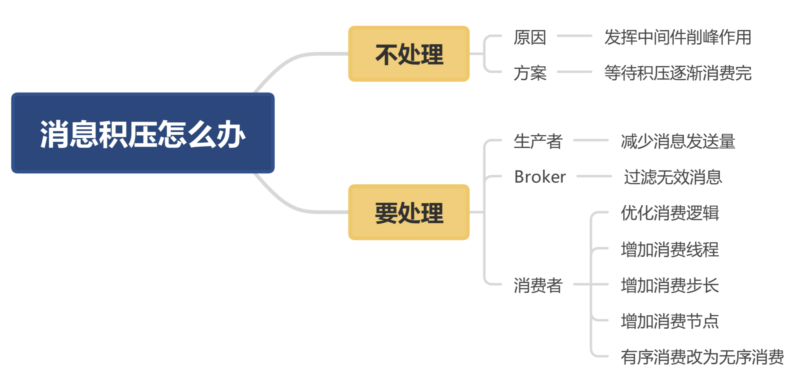
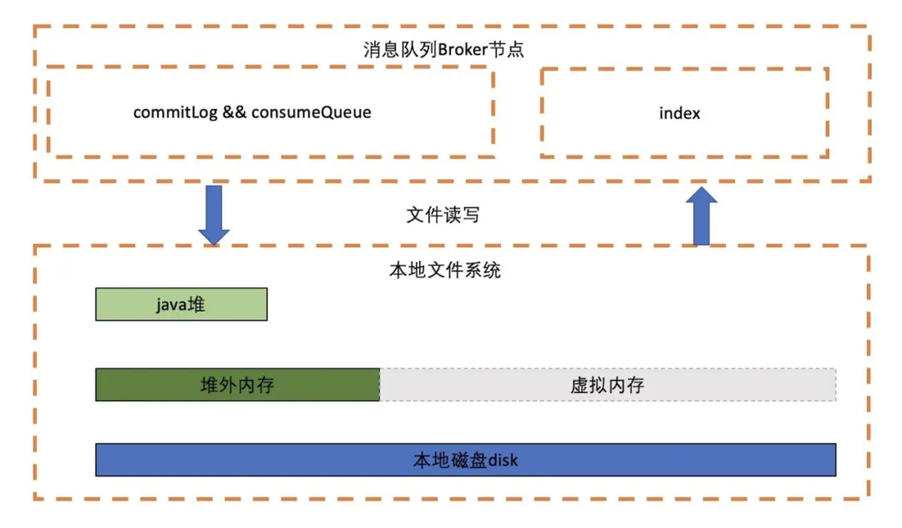
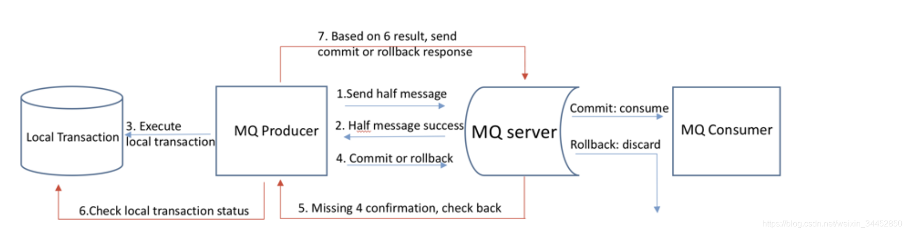

## 一、设计目标

- 一致性：因为追求最终一致性，容忍分钟级别的不一致。所以通过自研NameServer来实现元数据管理，降低了实现的复杂度以及网络的要求，相比性能会比ZooKeeper提升不少

- 高效IO存储机制：追求高吞吐量，通过内存映射和存储顺序写的机制，极大地提高了消息写性能。同时还引入了消费队列文件与索引文件

- 容忍存在设计缺陷：只保证消息被消费者消费，允许消息被重复消费，使得实现消息发送高可用变得非常简单与高效，消息重复问题有消费者在消息消费时实现幂等

  > 在MQTT协议中，提供了三种传递消息时的服务质量标准
  >
  > - At most once: 最多一次。没什么消息可靠性保证，允许丢消息。适合监控场景，可以接受少量数据丢失
  > - At least once: 最少一次。不允许丢消息，但是允许有少量重复消息出现
  > - Exactly once:  恰好一次。只会被送达一次，不允许丢失也不允许重复


### 1. 架构模式

采用发布订阅模式。参与的组件有消息发送者、消息服务器（消息存储）、消息消费、路由发现

### 2. 顺序消息

消息消费者按照消息达到消息存储服务器的顺序消费

#### 怎样保证消息有序


### 3. 消息过滤

消费者可以对同一主题下的消息按照规则只消费自己感兴趣的消息


### 4. 消息存储

### 5. 消息高可用

### 6. 消息到达低延迟

### 7. 确保消息必须被消费一次

### 8. 回溯消息

### 9. 消息堆积

### 10. 定时消息

### 11. 消息重试机制


## 二、RocketMQ是怎么解决消息堆积的问题



### 1. 现象

生产者生产消息的速率  大于  消费者消费消息的速率


### 2. 解决方案


#### 2.1 不处理

消息中间件的其中一个功能就是削峰，扛住流量压力，保护重要的系统，所以这种情况就不用处理


#### 2.2 生产者

- 流量爆发。可以采用限流降级的方式控制流量，减少消息发送的数量
- 减少内容大小


#### 2.3 Broker


#### 2.4 消费者

- 定位bug。是不是因为bug的原因导致消息一直重复消费引起的消息堆积
- 优化消费逻辑。
  - 慢sql、慢服务，可以用arthas进行诊断
  - 增加消费线程
  - 增加消费步长，一次多拉几条进行批量处理
- 水平扩容。增加topic的队列数和消费者的实例数，**一个Topic中，一个队列只会分配给一个消费者**


### 3. Broker如何存储消息

消息生产者发送消息到broker，按顺序写入CommitLog文件中，每个文件大小1G。
CommmitLog：存储所有消息的元数据，包括topic、queueID及message
ConsumerQueue：消费逻辑队列：存储消息在CommitLog中的Offset
Indexfile：索引文件。存储消息的Key和时间戳等信息。


## 三、如何保证消息不丢失


### 1. 生产者

会发生的问题：

- 可能会因为网络的问题导致丢失
- Broker宕机了

#### 1.1 解决方法一

- **同步发送**，发消息的时候同步阻塞等待broker返回结果，这个是最可靠的。失败就重试，默认两次
- 异步发送，通过回调方法得知发送的结果。
- 单向发送，调用该发送接口后立刻返回，并不返回发送的结果，最不靠谱


假如Broker宕机了，那么它会被踢下线，producer重试的时候会换一台broker


### 2. Broker

Broker肯定是先把消息放到内存的，然后根据刷盘策略持久化到硬盘中，刚收到Producer的消息，在内存中了，但是异常宕机了，导致消息丢失。


目前RocketMQ存储模型使用本地磁盘进行存储，数据写入为producer -> direct memory -> pagecache -> 磁盘，数据读取如果pagecache有数据则直接从pagecache读，否则需要先从磁盘加载到pagecache中。Broker存储节点的文件存储模式如下图所示：




#### 2.1 同步刷盘

消息写入内存的 PageCache后，立刻通知刷盘线程刷盘，然后等待刷盘完成，刷盘线程执行完成后唤醒等待的线程，返回消息写成功的状态。这种方式可以保证数据绝对安全，但是吞吐量不大。


#### 2.2 异步刷盘

消息写入到内存的 PageCache中，就立刻给客户端返回写操作成功，当 PageCache中的消息积累到一定的量时，触发一次写操作，或者定时等策略将 PageCache中的消息写入到磁盘中。这种方式吞吐量大，性能高，但是 PageCache中的数据可能丢失，不能保证数据绝对的安全。


### 3. 消费者

先消费后提交

#### 3.1 消费重试

消费者从RocketMQ拉取到消息之后，需要返回消费成功来表示业务方正常消费完成。因此只有返回CONSUME_SUCCESS才算消费完成，如果返回CONSUME_LATER则会按照不同的messageDelayLevel时间进行再次消费，时间分级从秒到小时，最长时间为2个小时后再次进行消费重试，如果消费满16次之后还是未能消费成功，则不再重试，会将消息发送到死信队列，从而保证消息存储的可靠性。


#### 3.2 死信队列

未能成功消费的消息，消息队列并不会立刻将消息丢弃，而是将消息发送到死信队列。

可以通过RocketMQ提供的相关接口从死信队列获取到相应的消息，保证了消息消费的可靠性


#### 3.3 消息回溯

回溯消费是指Consumer已经消费成功的消息，或者之前消费业务逻辑有问题，现在需要重新消费


RocketMQ Broker提供了一种机制，可以按照时间维度来回退消费进度，这样就可以保证只要发送成功的消息，只要消息没有过期，消息始终是可以消费到的	


## 四、如何保证顺序消费

### 1. 生产者

为了保证消息有序发送，RocketMQ提供了MessageQueueSelector队列选择机制

- SelectMessageQueueByHash
- SelectMessageQueueByMachineRoom
- SelectMessageQueueByRandom

可以让需要顺序消费的消息通过Hash的方式**同步发送**到同一个队列中，这样就满足了生产者的顺序发送


```java
 public MessageQueue select(List<MessageQueue> mqs, Message msg, Object arg) {
   			// arg是一个固定值，eventName
        int value = arg.hashCode();
        if (value < 0) {
            value = Math.abs(value);
        }
				// 从队列中取余数来确定要发送到哪一条队列
        value %= mqs.size();
        return (MessageQueue)mqs.get(value);
    }
```


### 2. Broker

因为Topic内的队列是满足FIFO的，所以生产者保证消息是顺序进入队列的，那么broker就可以保证是顺序发送的


### 3. 消费者

每个队列对应一个单线程处理的消费者


## 五、如何解决重复消费的问题

QTT 协议中，给出了三种传递消息时能够提供的服务质量标准，这三种服务质量从低到高依次是：
1. At most once: 至多一次。消息在传递时，最多会被送达一次。换一个说法就是，没什么消息可靠性保证，允许丢消息。一般都是一些对消息可靠性要求不太高的监控场景使用，比如每分钟上报一次机房温度数据，可以接受数据少量丢失。
2. At least once: 至少一次。消息在传递时，至少会被送达一次。也就是说，不允许丢消息，但是允许有少量重复消息出现。
3. Exactly once：恰好一次。消息在传递时，只会被送达一次，不允许丢失也不允许重复，这个是最高的等级。


### 1. 为什么消息队列不做成Exactly Once

如果consumer消费成功，但是ack失败，consumer还是会取到重复的消息，所以消息队列花大力气做成Exactly once并不能解决业务侧消息重复的问题


### 2. 原因

- 发送时消息重复
  - 消息发送到了Broker，并完成了持久化，这时候宕机了，没有对生产者进行应答。那么生产者会再次发送消息
- 投递时消息重复
  - 消息已经投递到了消费者，消费者处理完业务之后，反馈应答的时候Broker挂了，当Broker恢复之后，会再次尝试发送之前的消息


### 3. 解决

- 消费端处理消息的业务逻辑保持幂等性
  - MySQL记录（版本号或者唯一键）
  - Redis记录，缓存消息ID，然后对比之后发送过来的消息

- 保证每条消息都有唯一编号且保证消息处理成功与去重表的日志同时出现


## 六、如何实现分布式事务


半消息：暂不能投递的消息，发送方已经将消息成功发送到了消息队列 RocketMQ 服务端，但是服务端未收到生产者对该消息的二次确认，此时该消息被标记成“暂不能投递”状态，处于该种状态下的消息即半消息

消息回查：由于网络闪断、生产者应用重启等原因，导致某条事务消息的二次确认丢失，消息队列 RocketMQ 服务端通过扫描发现某条消息长期处于“半消息”时，需要主动向消息生产者询问该消息的最终状态（Commit 或是 Rollback）





- Producer向Broker端发送Half Message；
- Broker ACK，Half Message发送成功；
- Producer执行本地事务；
- 本地事务完毕，根据事务的状态，Producer向Broker发送二次确认消息，确认该Half Message的Commit或者Rollback状态。Broker收到二次确认消息后，对于Commit状态，则直接发送到Consumer端执行消费逻辑，而对于Rollback则直接标记为失败，一段时间后清除，并不会发给Consumer。正常情况下，到此分布式事务已经完成，剩下要处理的就是超时问题，即一段时间后Broker仍没有收到Producer的二次确认消息；
- 针对超时状态，Broker主动向Producer发起消息回查；
- Producer处理回查消息，返回对应的本地事务的执行结果；
- Broker针对回查消息的结果，执行Commit或Rollback操作，同Step4。


## 七、页缓存

在RocketMQ中，ConsumeQueue逻辑消费队列存储的数据较少，并且是顺序读取，在page cache机制的预读取作用下，Consume Queue文件的读性能几乎接近读内存，即使在有消息堆积情况下也不会影响性能。而对于CommitLog消息存储的日志数据文件来说，读取消息内容时候会产生较多的随机访问读取，严重影响性能


## 八、内存映射

RocketMQ主要通过**MappedByteBuffer**对文件进行读写操作。其中，利用了NIO中的FileChannel模型将磁盘上的物理文件直接映射到用户态的内存地址中，（这种Mmap的方式减少了传统IO将磁盘文件数据在操作系统内核地址空间的缓冲区和用户应用程序地址空间的缓冲区之间来回进行拷贝的性能开销），将对文件的操作转化为直接对内存地址进行操作，从而极大地提高了文件的读写效率（正因为需要使用内存映射机制，故RocketMQ的文件存储都使用定长结构来存储，方便一次将整个文件映射至内存）。


## 九、RocketMQ笔记

特性/使用场景：解耦、广播、削峰


