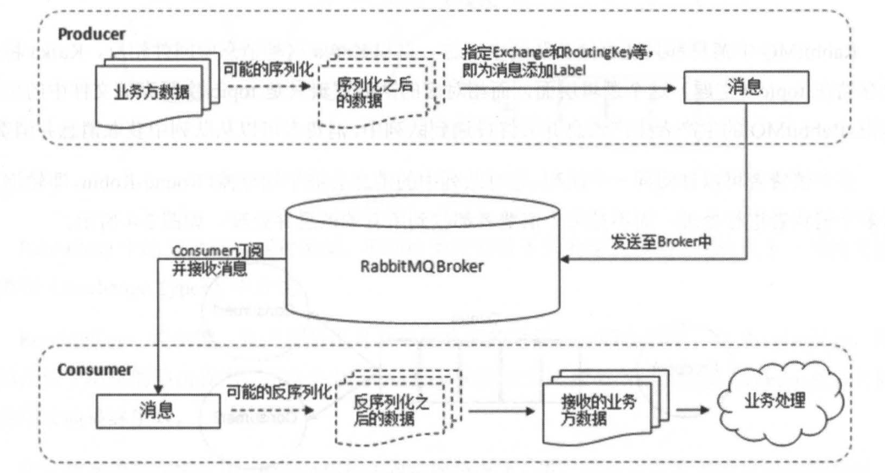
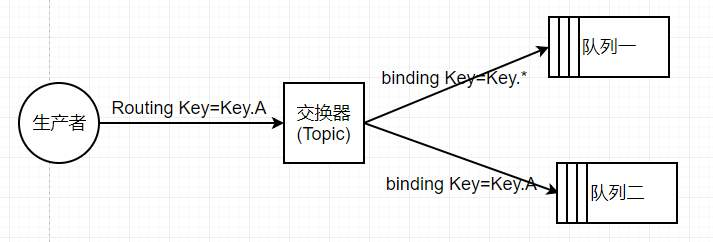

* [一、RabbitMQ的简介](#一RabbitMQ的简介)
* [二、Rabbit入门](#二Rabbit入门)
    * [1.RabbitMQ相关概念]
    * [2.AMQP协议]

# 一、RabbitMQ的简介
**消息中间件（Message Queue Middleware）：是指利用高效可靠的消息传递机制进行与平台无关的数据交流，并基于数据通信来进行分布式系统的集成**
  
消息中间件能在不同平台之间通信，它常用来屏蔽各种平台以及协议之间的特性，实现应用程序之间的协同，其优点在于能够在客户端和服务端之间提供同步和异步的链接，并且在任何时刻都可以将消息进行传送或者存储转发，这也是它比RPC更进步的原因

>传递模式
> 1. 点对点模式：基于队列，消息生产者发送消息到队列，消息消费者从队列中接收消息，队列的存在使得消息的异步传输称为可能
> 2. 发布/订阅模式：定义了如何向一个内容节点（主题，消息传递的中介）发布和订阅消息，消息发布者将消息发布到某个主题，而消息订阅者从主题中订阅消息。主题使得消息发布者与消息订阅者保持相互独立，一般在一对多广播时采用

> 消息中间件的好处
> 1. 解耦：消息中间件在处理过程中间插入了一个隐含的、基于数据的接口层，两边的处理过程都要实现这一接口，这允许你独立地扩展两边地处理过程
> 2. 存储（持久化）：消息中间件可以把数据进行持久化直到它们已经被完全处理，通过这一方式规避了数据丢失风险。
> 3. 扩展性：因为解耦了处理过程，所以不需要改变代码或调节参数，只要增加处理过程即可
> 4. 削峰：在访问量剧增地情况下，消息中间件可以支撑突发访问压力
> 5. 可恢复性：当系统一部分组件失效时，不会影响到整个系统，消息中间件可以在系统恢复后再处理消息
> 6. 顺序保证：数据处理地顺序很重要，大部分中间件支持一定程度上地顺序性
> 7. 缓冲：消息中间件通过一个缓冲层来邦族任务最高效地执行，写入消息中间件地处理会尽可能快速
> 8. 异步通信：消息中间件支持异步处理消息
  

>RabbitMQ的特点
> 1. 可靠性。RabbitMQ使用一些机制来保证可靠性，如持久化、传输确认以及发布确认等
> 2. 灵活的路由。在消息进入队列之前，可以通过交换器来路由消息
> 3. 扩展性。多个RabbitMQ节点可以组成一个集群，也可以动态地扩展节点
> 4. 高可用。队列可以在集群仲的机器上设置镜像，使得在部分节点出现问题的情况下队列仍可用
> 5. 多种协议。RabbitMQ支持AMQP、STOMP、MQTT等多种消息协议
> 6. 多语言客户端
> 7. 管理界面。RabbitMQ提供了一个易用的用户界面，用户可以监控和管理消息、集群中的节点
> 8. 插件机制。RabbitMQ提供了许多插件，以实现从多方面进行扩展。

# 二、RabbitMQ入门
## 1. RabbitMQ相关概念

RabbitMQ整体上是一个生产者与消费者模型，主要负责接收、存储和转发消息。
 

### I.生产者和消费者
> Producer: 生产者，投递消息的一方。  
> 生产者创建消息发布到RabbitMQ中，消息一般可以包含两个部分
> 1. 消息体 (payload)：消息体一般是带有业务逻辑结构的数据，比如JSON字符串
> 2. 标签 (label):用来表述这条消息，比如一个交换器的名称和一个路由键。RabbitMQ会根据标签把消息发送给感兴趣的消费者

  

> Consumer: 消费者，就是接收消息的一方  
> 消费者连接到RabbitMQ服务器，并订阅到队列上。当消费者消费一条消息时，只是消费消息的消息体，消息的标签会在消息路由的过程中丢弃，存入队列中的消息只有消息体。

 

> Broker: 消息中间件的服务节点  
> 对于RabbitMQ来说，一个Broker可以简单看作一个RabbitMQ服务节点。 

 

### II.队列
> Queue：队列，是RabbitMQ的内部对象，用于存储消息  
> 生产者生产消息并最终投递到队列中，消费者可以从队列中获取消息并消费

 

### III.交换器、路由键、绑定
> Exchange: 交换器。真实的生产环境是生产者将消息发送到Exchange，由Exchange将消息路由到一个或者多个队列。
> 如果路由不到，或许会返回给生产者，或许直接丢弃。

 

> RoutingKey: 路由键。生产者将消息发送给Exchange的时候，一般会指定一个RoutingKey，
> 用来指定这个消息的路由规则。而这个路由键需要与交换器类型和BindingKey联合使用才能最终生效

 

> Binding: 绑定。RabbitMQ中通过绑定将交换器与队列关联起来，在绑定的时候一般会指定BindingKey
> 当BindingKey与RoutingKey相匹配时，消息就会被交换器路由到相应的队列

 

### IV.交换器类型
常用的交换器类型有fanout、direct、topic、headers这四种

> 1. fanout: