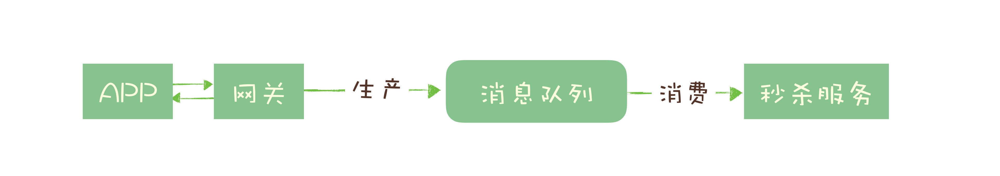
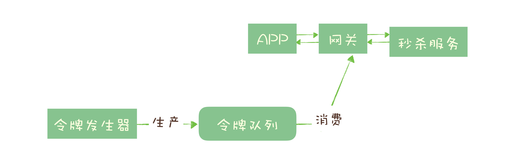
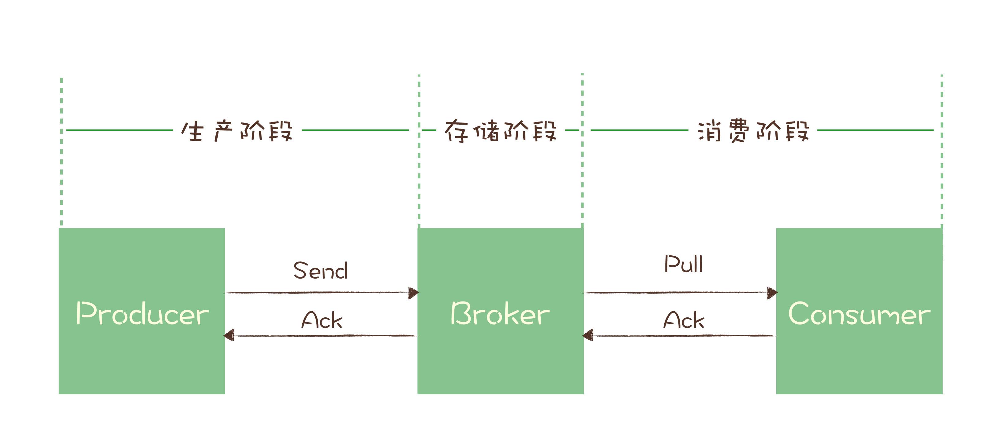

- [消息队列适合用来解决哪些问题](#消息队列适合用来解决哪些问题)
    - [1.异步处理](#1异步处理)
    - [2.流量控制（削峰）](#2流量控制削峰)
    - [3.流量控制升级版（令牌桶）](#3流量控制升级版令牌桶)
    - [小结](#小结)
- [如何选择消息队列](#如何选择消息队列)
    - [消息队列的基本标准](#消息队列的基本标准)
- [产品](#产品)
    - [1.RabbitMQ](#1rabbitmq)
    - [2.RocketMQ](#2rocketmq)
    - [3.Kafka](#3kafka)
- [第二梯度的产品](#第二梯度的产品)
- [总结](#总结)
    - [RabbitMQ](#rabbitmq)
    - [RocketMQ](#rocketmq)
    - [kafka](#kafka)
    - [pulsar](#pulsar)
    - [场景](#场景)
- [主题和队列有什么区别](#主题和队列有什么区别)
    - [RabbitMQ的消息模型](#rabbitmq的消息模型)
    - [RocketMQ的消息模型](#rocketmq的消息模型)
    - [如何在第四步提交事务之后失败了怎么办](#如何在第四步提交事务之后失败了怎么办)
    - [确保消息可靠传递](#确保消息可靠传递)
        - [生产阶段](#生产阶段)
        - [存储阶段](#存储阶段)
        - [消费阶段](#消费阶段)
        - [小结](#小结-1)
- [如何处理消费过程中的重复消息](#如何处理消费过程中的重复消息)
    - [用幂等性解决重复消息问题](#用幂等性解决重复消息问题)
        - [利用数据库的唯一约束实现幂等](#利用数据库的唯一约束实现幂等)
        - [为更新的数据设置前置条件](#为更新的数据设置前置条件)
        - [记录并检查操作](#记录并检查操作)
    - [小结](#小结-2)
- [消息挤压了如何处理](#消息挤压了如何处理)
    - [优化性能来避免消息积压](#优化性能来避免消息积压)
        - [发送端性能优化](#发送端性能优化)
        - [消费端性能优化](#消费端性能优化)
    - [积压了之后如何处理](#积压了之后如何处理)
    - [小结](#小结-3)
- [学习开源代码如何入手](#学习开源代码如何入手)
    - [通过文档来了解开源项目](#通过文档来了解开源项目)
    - [用以点带面的方式来阅读源码](#用以点带面的方式来阅读源码)
    - [理想的异步网络架构](#理想的异步网络架构)
- [序列化与反序列化](#序列化与反序列化)
    - [选择哪种序列化实现](#选择哪种序列化实现)
- [kafka如何实现高性能IO](#kafka如何实现高性能io)
    - [使用批量消息提升服务端处理能力](#使用批量消息提升服务端处理能力)
    - [使用顺序读写提升磁盘IO性能](#使用顺序读写提升磁盘io性能)
    - [利用PageCache加速消息读写](#利用pagecache加速消息读写)
    - [ZeroCopy：零拷贝](#zerocopy零拷贝)
    - [小结](#小结-4)
- [缓存策略：如何使用缓存来减少磁盘IO](#缓存策略如何使用缓存来减少磁盘io)
    - [选择只读缓存还是读写缓存](#选择只读缓存还是读写缓存)
    - [保持缓存数据新鲜](#保持缓存数据新鲜)
    - [缓存置换策略](#缓存置换策略)
- [如何正确使用锁保护共享数据，协调异步线程](#如何正确使用锁保护共享数据协调异步线程)
    - [避免滥用锁](#避免滥用锁)
    - [用法](#用法)
    - [如何避免死锁](#如何避免死锁)
- [数据压缩：时间换空间的游戏](#数据压缩时间换空间的游戏)
    - [什么情况下适合用数据压缩](#什么情况下适合用数据压缩)

## 消息队列适合用来解决哪些问题
### 1.异步处理
用例：秒杀场景。在秒杀期间，可以把大量的服务器资源用来处理秒杀请求，秒杀结束后再把资源用于处理后面的步骤，充分利用有限的服务器资源处理更多的秒杀请求
 
 
 
 好处：
 1. 将请求前置，可以更快地返回结果
 2. 减少等待，自然实现了步骤之间的并发，提升系统总体的性能
 
### 2.流量控制（削峰）
用例：秒杀场景。使用消息队列将网关和后端服务隔离，以达到流量控制和保护后端服务的目的

 
 
 好处：
 1. 当短时间内大量的秒杀请求到达网关时，不会直接冲击到后端的秒杀服务，而是先堆积在消息队列中，后端服务按照自己的最大处理能力，从消息队列中消费请求进行处理。
 2. 运维人员还可以随时增加秒杀服务的实例数量进行水平扩容，而不用对系统的其他部分做任何更改。
 
缺点：
1. 增加了系统调用链环节，导致总体的响应时延变长
2. 上下游系统都要将同步调用改为异步消息，增加了系统的复杂度

### 3.流量控制升级版（令牌桶）
原理：单位时间内只发放固定数量的令牌到令牌桶中，规定服务在处理请求之前必须先从令牌桶中拿出一个令牌，如果令牌桶中没有令牌，则拒绝请求。这样就保证单位时间内，能处理的请求不超过发放令牌的数量，起到了流量控制的作用

 
 
 实现：令牌发生器按照预估的处理能力，匀速生产令牌并放入令牌队列（如果队列满了则丢弃令牌），网关在收到请求时去令牌队列消费一个令牌，获取到令牌则继续调用后端秒杀服务，如果获取不到令牌则直接返回秒杀失败。
 
 ### 4.服务解耦
 上游服务发送数据到消息队列的一个主题Order中，所有下游服务都订阅这个主题Order
 
 好处：
 1. 每个下游服务都能获取一份实时完整的数据
 2. 无论增加、减少下游服务或下游服务需求变化，上游服务无需更改
 

### 小结
场景还包括：
1. 作为发布 / 订阅系统实现一个微服务级系统间的观察者模式；
2. 连接流计算任务和数据
3. 用于将消息广播给大量接收者

消息队列的适用场景还是很多的，如秒杀、发邮件、发短信、高并发订单等，不适合的场景如银行转账、电信开户、第三方支付等

Pros:
1. 可在模块、服务、接口等不同粒度上实现解耦
2. 订阅/消费模式也可在数据粒度上解耦
3. 可提高系统的并发能力，集中力量办大事(同步部分)，碎片时间做小事(异步部分)
4. 可提高系统可用性，因为缓冲了系统负载

Cons:
1. 降低了数据一致性，如要保持强一致性，需要高代价的补偿(如分布式事务、对账)
2. 有数据丢失风险，如宕机重启，如要保证队列数据可用，需要额外机制保证(如双活容灾)
3. 引入消息队列带来的延迟问题
4. 增加了系统复杂度

所以我们说没有最好的架构，只有最适合的架构，根据目标业务的特点和自身条件选择合适的架构，才是体现一个架构师功力的地方

   

## 如何选择消息队列

### 消息队列的基本标准
1. 开源：遇到Bug可以快速解决，而不是束手无策地等待开发者发布下一个版本
2. 近年来比较流行且有一定的社区活跃度：大部分你可能遇到的 Bug，其他人早就遇到并且修复了，而且遇到问题时，也容易找到解决方案
3. 与周边产品有很好的集成和兼容性
4. 消息的可靠传递：确保不丢失消息
5. Custer：支持集群，确保不会因为某个节点宕机导致服务不可用，当然也不能丢消息
6. 性能：具备足够好的性能，能满足绝大多数场景的性能要求

## 产品
### 1.RabbitMQ
优点：
1. 轻量级、迅捷,RabbitMQ 是一个相当轻量级的消息队列，非常容易部署和使用
2. 支持非常灵活的路由配置,路由的规则也非常灵活
3. RabbitMQ 的客户端支持的编程语言大概是所有消息队列中最多的

缺点：
1. RabbitMQ 对消息堆积的支持并不好。当大量消息积压的时候，会导致 RabbitMQ 的性能急剧下降
2. RabbitMQ 的性能是我们介绍的这几个消息队列中最差的，依据硬件配置的不同，它大概每秒钟可以处理几万到十几万条消息
3. RabbitMQ 使用的编程语言 Erlang，如果你想基于 RabbitMQ 做一些扩展和二次开发什么的，建议你慎重考虑一下可持续维护的问题

### 2.RocketMQ
优点：
1. 有着不错的性能，稳定性和可靠性，具备一个现代的消息队列应该有的几乎全部功能和特性，并且它还在持续的成长中
2. 有非常活跃的中文社区
3. RocketMQ 使用Java语言开发，它的贡献者大多数都是中国人，你很容易对 RocketMQ 进行扩展或者二次开发
4. RocketMQ 对在线业务的响应时延做了很多的优化，大多数情况下可以做到毫秒级的响应，如果你的应用场景很在意响应时延，那应该选择使用 RocketMQ。每秒钟大概能处理几十万条消息

缺点：
1. 作为国产的消息队列，在国际上还没有那么流行，与周边生态系统的集成和兼容程度要略逊一筹

### 3.Kafka
优点：
1. Kafka 与周边生态系统的兼容性是最好的没有之一，尤其在大数据和流计算领域，几乎所有的相关开源软件系统都会优先支持 Kafka
2. 设计上大量使用了批量和异步的思想，Kafka 的性能，尤其是异步收发的性能，是三者中最好的，但与 RocketMQ 并没有量级上的差异，大约每秒钟可以处理几十万条消息

缺点：
1. Kafka 不太适合在线业务场景。当客户端发送一条消息的时候，Kafka并不会立即发送出去，而是要等一会儿攒一批再发送。所以当每秒钟消息数量没有那么多的时候，Kafka 的时延反而会比较高。

## 第二梯度的产品
1. ActiveMQ是十年前唯一可供选择的开源消息队列，目前已进入老年期，社区不活跃。无论是功能还是性能方面，ActiveMQ 都与现代的消息队列存在明显的差距，它存在的意义仅限于兼容那些还在用的爷爷辈儿的系统。
2. ZeroMQ 并不能称之为一个消息队列，而是一个基于消息队列的多线程网络库，如果你的需求是将消息队列的功能集成到你的系统进程中，可以考虑使用 ZeroMQ
3. Pulsar 是一个新兴的开源消息队列，其他消息队列最大的不同是，Pulsar采用存储和计算分离的设计。目前处于成长期，流行度和成熟度相对没有那么高

## 总结

选择中间件的考量维度：可靠性，性能，功能，可运维行，可拓展性，是否开源及社区活跃度

### RabbitMQ
1. 优点：轻量，迅捷，容易部署和使用，拥有灵活的路由配置
2. 缺点：性能和吞吐量较差，不易进行二次开发

### RocketMQ
1. 优点：性能好，稳定可靠，有活跃的中文社区，特点响应快
2. 缺点：兼容性较差，但随意影响力的扩大，该问题会有改善

### kafka
1. 优点：拥有强大的性能及吞吐量，兼容性很好
2. 缺点：由于“攒一波再处理”导致延迟比较高

### pulsar
采用存储和计算分离的设计，是消息队里产品中黑马，值得持续关注

### 场景
1. 如果你的系统使用消息队列主要场景是处理在线业务，比如在交易系统中用消息队列传递订单，那 RocketMQ 的低延迟和金融级的稳定性是你需要的
2. 如果你需要处理海量的消息，像收集日志、监控信息或是前端的埋点这类数据，或是你的应用场景大量使用了大数据、流计算相关的开源产品，那 Kafka 是最适合你的消息队列。
3. 如果说，消息队列并不是你将要构建系统的主角之一，你对消息队列功能和性能都没有很高的要求，只需要一个开箱即用易于维护的产品，我建议你使用 RabbitMQ。

## 主题和队列有什么区别
这两种模型，生产者就是发布者，消费者就是订阅者，队列就是主题，并没有本质的区别。它们最大的区别其实就是，一份消息数据能不能被消费多次的问题

### RabbitMQ的消息模型
在 RabbitMQ 中，Exchange位于生产者和队列之间，生产者并不关心将消息发送给哪个队列，而是将消息发送给 Exchange，由Exchange上配置的策略来决定将消息投递到哪些队列中

 

同一份消息如果需要被多个消费者来消费，需要配置 Exchange 将消息发送到多个队列，每个队列中都存放一份完整的消息数据，可以为一个消费者提供消费服务

### RocketMQ的消息模型
RocketMQ 使用的消息模型是标准的发布 - 订阅模型

每个主题包含多个队列，通过多个队列来实现多实例并行生产和消费。需要注意的是，RocketMQ只在队列上保证消息的有序性，主题层面是无法保证消息的严格顺序的。

在 Topic 的消费过程中，由于消息需要被不同的组进行多次消费，所以消费完的消息并不会立即被删除，这就需要 RocketMQ 为每个消费组在每个队列上维护一个消费位置（Consumer Offset），这个位置之前的消息都被消费过，之后的消息都没有被消费过，每成功消费一条消息，消费位置就加一。这个消费位置是非常重要的概念，我们在使用消息队列的时候，丢消息的原因大多是由于消费位置处理不当导致的。

 
 
 
 ### kafka的消息模型
 在 Kafka 中，队列这个概念的名称不一样，Kafka中对应的名称是“分区（Partition）”，含义和功能是没有任何区别的
 
 
 
 ## 如何利用事务消息实现分布式事务
 消息队列中的“事务”，主要解决的是消息生产者和消息消费者的数据一致性问题
 
 
 
 1. 订单系统在消息队列上开启一个事务
 2. 单系统给消息服务器发送一个“半消息”。它包含的内容就是完整的消息内容，半消息和普通消息的唯一区别是，在事务提交之前，对于消费者来说，这个消息是不可见的
 3. 半消息发送成功后，订单系统就可以执行本地事务了，在订单库中创建一条订单记录，并提交订单库的数据库事务
 4. 根据本地事务的执行结果决定提交或者回滚事务消息
 5. 如果订单创建成功，那就提交事务消息，购物车系统就可以消费到这条消息继续后续的流程。
 

### 如何在第四步提交事务之后失败了怎么办
1. kafka。直接抛出异常，让用户自行处理。我们可以在业务代码中反复重试提交，直到提交成功，或者删除之前创建的订单进行补偿
2. 在 RocketMQ中的事务实现中，增加了事务反查的机制来解决事务消息提交失败的问题。为了支撑这个事务反查机制，我们的业务代码需要实现一个反查本地事务状态的接口，告知 RocketMQ 本地事务是成功还是失败

 
 
 去哪儿的qmq队列是将消息表和业务表放在一个库里，这样就利用了数据库的事务保证了一致性，消息表里的消息再通过调度任务发到broker。
 
 
 
 ## 如何确保消息不会丢失
 ### 利于消息的有序性检查
 在 Producer 端，我们给每个发出的消息附加一个连续递增的序号，然后在Consumer端来检查这个序号的连续性。
 
 大多数消息队列的客户端都支持拦截器机制，你可以利用这个拦截器机制，在 Producer 发送消息之前的拦截器中将序号注入到消息中，在 Consumer 收到消息的拦截器中检测序号的连续性，这样实现的好处是消息检测的代码不会侵入到你的业务代码中，待你的系统稳定后，也方便将这部分检测的逻辑关闭或者删除。
 
 注意：
 1. 像 Kafka 和 RocketMQ 这样的消息队列，它是不保证在 Topic 上的严格顺序的，只能保证分区上的消息是有序的，所以我们在发消息的时候必须要指定分区，并且，在每个分区单独检测消息序号的连续性
 2. 如果你的系统中 Producer 是多实例的，由于并不好协调多个 Producer 之间的发送顺序，所以也需要每个 Producer 分别生成各自的消息序号，并且需要附加上 Producer 的标识，在 Consumer 端按照每个 Producer 分别来检测序号的连续性
 

### 确保消息可靠传递

一条消息从生产到消费完成这个过程，可以划分三个阶段:
1. 生产阶段: 在这个阶段，从消息在 Producer 创建出来，经过网络传输发送到 Broker 端
2. 存储阶段: 在这个阶段，消息在 Broker 端存储，如果是集群，消息会在这个阶段被复制到其他的副本上
3. 消费阶段: 在这个阶段，Consumer 从 Broker 上拉取消息，经过网络传输发送到 Consumer 上

#### 生产阶段
只要 Producer 收到了 Broker 的确认响应，就可以保证消息在生产阶段不会丢失。有些消息队列在长时间没收到发送确认响应后，会自动重试，如果重试再失败，就会以返回值或者异常的方式告知用户

你在编写发送消息代码时，需要注意，正确处理返回值或者捕获异常，就可以保证这个阶段的消息不会丢失

#### 存储阶段
在存储阶段正常情况下，只要 Broker 在正常运行，就不会出现丢失消息的问题，但是如果 Broker 出现了故障，比如进程死掉了或者服务器宕机了，还是可能会丢失消息的

如果对消息的可靠性要求非常高，可以通过配置 Broker 参数来避免因为宕机丢消息。

1. 单个节点：需要配置 Broker 参数，在收到消息后，将消息写入磁盘后再给 Producer 返回确认响应
2. 多个节点：至少将消息发送到 2 个以上的节点，再给客户端回复发送确认响应

#### 消费阶段
不要在收到消息后就立即发送消费确认，而是应该在执行完所有消费业务逻辑之后，再发送消费确认

#### 小结
1. 在生产阶段，你需要捕获消息发送的错误，并重发消息。
2. 在存储阶段，你可以通过配置刷盘和复制相关的参数，让消息写入到多个副本的磁盘上，来确保消息不会因为某个 Broker 宕机或者磁盘损坏而丢失。
3. 在消费阶段，你需要在处理完全部消费业务逻辑之后，再发送消费确认。

如何防止重复消息：
1. 业务处理逻辑本身就是幂等的，那天然就去掉了
2. 业务处理逻辑非幂等，那就消息先去重，根据业务ID(标识消息唯一性的就行)，去查询是否消费过此消息了，消费了，则抛弃，否则就消费

## 如何处理消费过程中的重复消息
MQTT 协议中，给出了三种传递消息时能够提供的服务质量标准，这三种服务质量从低到高依次是：
1. At most once: 至多一次。消息在传递时，最多会被送达一次。换一个说法就是，没什么消息可靠性保证，允许丢消息。一般都是一些对消息可靠性要求不太高的监控场景使用，比如每分钟上报一次机房温度数据，可以接受数据少量丢失。
2. At least once: 至少一次。消息在传递时，至少会被送达一次。也就是说，不允许丢消息，但是允许有少量重复消息出现。
3. Exactly once：恰好一次。消息在传递时，只会被送达一次，不允许丢失也不允许重复，这个是最高的等级。

### 用幂等性解决重复消息问题
在消费端，让我们消费消息的操作具备幂等性。

幂等：其任意多次执行所产生的影响均与一次执行的影响相同

一个幂等的方法，使用同样的参数，对它进行多次调用和一次调用，对系统产生的影响是一样的。所以，对于幂等的方法，不用担心重复执行会对系统造成任何改变。

#### 利用数据库的唯一约束实现幂等
基于这个思路，不光是可以使用关系型数据库，只要是支持类似“INSERT IF NOT EXIST”语义的存储类系统都可以用于实现幂等，比如，你可以用 Redis 的 SETNX 命令来替代数据库中的唯一约束，来实现幂等消费。

#### 为更新的数据设置前置条件
给数据变更设置一个前置条件，如果满足条件就更新数据，否则拒绝更新数据，在更新数据的时候，同时变更前置条件中需要判断的数据

更加通用的方法是，给你的数据增加一个版本号属性，每次更数据前，比较当前数据的版本号是否和消息中的版本号一致，如果不一致就拒绝更新数据，更新数据的同时将版本号 +1

#### 记录并检查操作
通用性最强，适用范围最广的实现幂等性方法

记录并检查操作，也称为“Token 机制或者 GUID（全局唯一ID）机制”，实现的思路特别简单：在执行数据更新操作之前，先检查一下是否执行过这个更新操作。

注意：在“检查消费状态，然后更新数据并且设置消费状态”中，三个操作必须作为一组操作保证原子性，才能真正实现幂等，否则就会出现 Bug。

### 小结
这些实现幂等的方法，不仅可以用于解决重复消息的问题，也同样适用于，在其他场景中来解决重复请求或者重复调用的问题。比如，我们可以将HTTP服务设计成幂等的，解决前端或者APP重复提交表单数据的问题；也可以将一个微服务设计成幂等的，解决RPC框架自动重试导致的重复调用问题。这些方法都是通用的

为什么大部分消息队列都选择只提供 At least once 的服务质量，而不是级别更高的 Exactly once 呢
1. 消费端在pull消息时，需要检测此消息是否被消费，这个检测机制无疑会拉低消息消费的速度。可以预想到，随着消息的剧增，消费性能势必会急剧下降，导致消息积压
2. 检查机制还需要业务端去配合实现，若一条消息长时间未返回ack，消息队列需要去回调看下消费结果（这个类似于事物消息的回查机制）。这样就会增加业务端的压力
3. 如果consumer消费成功，但是ack失败，consumer还是会取到重复的消息，所以消息队列花大力气做成Exactly once并不能解决业务侧消息重复的问题

所以，消息队列不实现exactly once，而是at least once + 幂等性，这个幂等性让给我们去处理

## 消息挤压了如何处理
消息积压的直接原因，一定是系统中的某个部分出现了性能问题，来不及处理上游发送的消息，才会导致消息积压

### 优化性能来避免消息积压
在消息的收发两端，我们的业务代码怎么和消息队列配合，达到一个最佳的性能。

#### 发送端性能优化
如果说，你的代码发送消息的性能上不去，你需要优先检查一下，是不是发消息之前的业务逻辑耗时太多导致的。因为一般发送端都是先执行自己的业务逻辑，最后再发送消息

Producer 发送消息的过程，Producer 发消息给 Broker，Broker 收到消息后返回确认响应，这是一次完整的交互
1. 发送端准备数据、序列化消息、构造请求等逻辑的时间，也就是发送端在发送网络请求之前的耗时
2. 发送消息和返回响应在网络传输中的耗时
3. Broker 处理消息的时延

解决：无论是增加每次发送消息的批量大小，还是增加并发，都能成倍地提升发送性能。至于到底是选择批量发送还是增加并发，主要取决于发送端程序的业务性质。简单来说，只要能够满足你的性能要求，怎么实现方便就怎么实现。

#### 消费端性能优化
在设计系统的时候，一定要保证消费端的消费性能要高于生产端的发送性能，这样的系统才能健康的持续运行

消费端的性能优化除了优化消费业务逻辑以外，也可以通过水平扩容，增加消费端的并发数来提升总体的消费性能。特别需要注意的一点是，在扩容 Consumer 的实例数量的同时，必须同步扩容主题中的分区（也叫队列）数量，确保 Consumer 的实例数和分区数量是相等的。如果 Consumer 的实例数量超过分区数量，这样的扩容实际上是没有效果的。原因我们之前讲过，因为对于消费者来说，在每个分区上实际上只能支持单线程消费。

### 积压了之后如何处理
1. 如果是单位时间发送的消息增多，短时间内不太可能优化消费端的代码来提升消费性能，唯一的方法是通过扩容消费端的实例数来提升总体的消费能力，实在不行就系统降级，通过关闭一些不重要的业务，减少发送方发送的数据量
2. 无论是发送消息的速度还是消费消息的速度和原来都没什么变化，这时候你需要检查一下你的消费端，是不是消费失败导致的一条消息反复消费这种情况比较多，这种情况也会拖慢整个系统的消费速度

### 小结
一、如何预防消息积压
1. 发送端提高并发及批量大小；
2. 消费端增加实例且同步宽容分区；

二、如何处理消息积压
1. 消费端扩容；
2. 服务降级；
3. 异常监控。

## 学习开源代码如何入手
### 通过文档来了解开源项目
通过看文档，你可以快速地掌握这个软件整体的结构，它有哪些功能特性，它涉及到的关键技术、实现原理和它的生态系统等等。在掌握了这些之后，你对它有个整体的了解，然后再去看它的源代码，就不会再有那种盲人摸象找不到头绪的感觉了

会有一个比较全面的了解：
1. 这个项目是干什么的？
2. 能解决哪些问题？
3. 适合在哪些场景使用？
4. 有哪些功能？
5. 如何使用？

对于某些开源项目，它背后的这篇论文就是整个项目的灵魂，你如果能把这篇论文看完并且理解透了，这个项目的实现原理也就清楚了

### 用以点带面的方式来阅读源码
推荐大家阅读源码的方式是，带着问题去读源码，最好是带着问题的答案去读源码

如果说你就想学习一下源代码，或者说提不出这些问题怎么办呢？答案还是，看文档。

### 理想的异步网络架构
一个 TCP 连接建立后，用户代码会获得一个用于收发数据的通道，每个通道会在内存中开辟两片区域用于收发数据的缓存。

发送数据的过程比较简单，我们直接往这个通道里面来写入数据就可以了。用户代码在发送时写入的数据会暂存在缓存中，然后操作系统会通过网卡，把发送缓存中的数据传输到对端的服务器上

只要这个缓存不满，或者说，我们发送数据的速度没有超过网卡传输速度的上限，那这个发送数据的操作耗时，只不过是一次内存写入的时间，这个时间是非常快的。所以，发送数据的时候同步发送就可以了，没有必要异步。

关于JAVA的网络，之前有个比喻形式的总结

例子：有一个养鸡的农场，里面养着来自各个农户（Thread）的鸡（Socket），每家农户都在农场中建立了自己的鸡舍（SocketChannel）
1. BIO：Block IO，每个农户盯着自己的鸡舍，一旦有鸡下蛋，就去做捡蛋处理；
2. NIO：No-Block IO-单Selector，农户们花钱请了一个饲养员（Selector），并告诉饲养员（register）如果哪家的鸡有任何情况（下蛋）均要向这家农户报告（select keys）；
3. NIO：No-Block IO-多Selector，当农场中的鸡舍逐渐增多时，一个饲养员巡视（轮询）一次所需时间就会不断地加长，这样农户知道自己家的鸡有下蛋的情况就会发生较大的延迟。怎么解决呢？没错，多请几个饲养员（多Selector），每个饲养员分配管理鸡舍，这样就可以减轻一个饲养员的工作量，同时农户们可以更快的知晓自己家的鸡是否下蛋了；
4. Epoll模式：如果采用Epoll方式，农场问题应该如何改进呢？其实就是饲养员不需要再巡视鸡舍，而是听到哪间鸡舍的鸡打鸣了（活跃连接），就知道哪家农户的鸡下蛋了；
5. AIO：Asynchronous I/O, 鸡下蛋后，以前的NIO方式要求饲养员通知农户去取蛋，AIO模式出现以后，事情变得更加简单了，取蛋工作由饲养员自己负责，然后取完后，直接通知农户来拿即可，而不需要农户自己到鸡舍去取蛋。

## 序列化与反序列化
在 TCP 的连接上，它传输数据的基本形式就是二进制流，也就是一段一段的1和0。在一般编程语言或者网络框架提供的 API 中，传输数据的基本形式是字节，也就是 Byte。一个字节就是8个二进制位，8个Bit，所以在这里，二进制流和字节流本质上是一样的。

作用：序列化的用途除了用于在网络上传输数据以外，另外的一个重要用途是，将结构化数据保存在文件中，因为在文件内保存数据的形式也是二进制序列，和网络传输过程中的数据是一样的，所以序列化同样适用于将结构化数据保存在文件中。

### 选择哪种序列化实现

衡量因素：
1. 序列化后的数据最好是易于人类阅读的；
2. 实现的复杂度是否足够低；
3. 序列化和反序列化的速度越快越好；
4. 序列化后的信息密度越大越好，也就是说，同样的一个结构化数据，序列化之后占用的存储空间越小越好；

大多数情况下，选择一个高性能的通用序列化框架都可以满足要求，在性能可以满足需求的前提下，推荐优先选择 JSON 这种可读性好的序列化方法。

如果说我们需要超高的性能，或者是带宽有限的情况下，可以使用专用的序列化方法，来提升序列化性能，节省传输流量。不过实现起来很复杂，大部分情况下并不划算。

## kafka如何实现高性能IO

### 使用批量消息提升服务端处理能力
发送端：会先把这条消息，存放在内存中缓存起来，然后选择合适的时机把缓存中的所有消息组成一批，一次性发给 Broker

服务端：每批消息都会被当做一个“批消息”来处理

消费端：从 Broker 拉到一批消息后，在客户端把批消息解开，再一条一条交给用户代码处理

不仅减轻了 Broker 的压力，最重要的是减少了 Broker 处理请求的次数，提升了总体的处理能力

### 使用顺序读写提升磁盘IO性能
对于磁盘来说，它有一个特性，就是顺序读写的性能要远远好于随机读写

操作系统每次从磁盘读写数据的时候，需要先寻址，也就是先要找到数据在磁盘上的物理位置，然后再进行数据读写

顺序读写相比随机读写省去了大部分的寻址时间，它只要寻址一次，就可以连续地读写下去，所以说，性能要比随机读写要好很多。

Kafka：把从 Producer 收到的消息，顺序地写入对应的 log 文件中，一个文件写满了，就开启一个新的文件这样顺序写下去。消费的时候，也是从某个全局的位置开始，也就是某一个 log 文件中的某个位置开始，顺序地把消息读出来。

### 利用PageCache加速消息读写
PageCache 就是操作系统在内存中给磁盘上的文件建立的缓存。无论我们使用什么语言编写的程序，在调用系统的 API 读写文件的时候，并不会直接去读写磁盘上的文件，应用程序实际操作的都是 PageCache，也就是文件在内存中缓存的副本。

应用程序在写入文件的时候，操作系统会先把数据写入到内存中的 PageCache，然后再一批一批地写到磁盘上。读取文件的时候，也是从 PageCache 中来读取数据，这时候会出现两种可能情况。

PageCache有数据：直接读取，这样就节省了从磁盘上读取数据的时间

PageCache没有数据：操作系统会引发一个缺页中断，应用程序的读取线程会被阻塞，操作系统把数据从文件中复制到 PageCache 中，然后应用程序再从 PageCache 中继续把数据读出来，这时会真正读一次磁盘上的文件，这个读的过程就会比较慢

用户的应用程序在使用完某块 PageCache 后，操作系统并不会立刻就清除这个 PageCache，而是尽可能地利用空闲的物理内存保存这些 PageCache，除非系统内存不够用，操作系统才会清理掉一部分 PageCache。清理的策略一般是 LRU 或它的变种算法

kafka：一般来说，消息刚刚写入到服务端就会被消费，按照 LRU 的“优先清除最近最少使用的页”这种策略，读取的时候，对于这种刚刚写入的 PageCache，命中的几率会非常高

好处：一个是读取的速度会非常快，另外一个是，给写入消息让出磁盘的 IO 资源，间接也提升了写入的性能。

### ZeroCopy：零拷贝

在服务端，处理消费的大致逻辑是这样的：
- 首先，从文件中找到消息数据，读到内存中
- 然后，把消息通过网络发给客户端。

这个过程实际上做了2次或者3次复制
1. 从文件复制数据到 PageCache 中，如果命中 PageCache，这一步可以省掉；
2. 从 PageCache 复制到应用程序的内存空间中，也就是我们可以操作的对象所在的内存；
3. 从应用程序的内存空间复制到 Socket 的缓冲区，这个过程就是我们调用网络应用框架的 API 发送数据的过程。

Kafka 使用零拷贝技术可以把这个复制次数减少一次，上面的 2、3 步骤两次复制合并成一次复制。直接从 PageCache 中把数据复制到 Socket 缓冲区中，这样不仅减少一次数据复制，更重要的是，由于不用把数据复制到用户内存空间，DMA 控制器可以直接完成数据复制，不需要 CPU 参与，速度更快。

如果你遇到这种从文件读出数据后再通过网络发送出去的场景，并且这个过程中你不需要对这些数据进行处理，那一定要使用这个零拷贝的方法，可以有效地提升性能

### 小结

Kafka高性能的关键点：
- 使用批量处理的方式来提升系统吞吐能力--减少网络通信开销
- 基于磁盘文件高性能顺序读写的特性来设计的存储结构--减少寻道移臂开销
- 利用操作系统的 PageCache 来缓存数据，减少 IO 并提升读性能--减少磁盘IO开销
- 使用零拷贝技术加速消费流程--减少数据多次拷贝的开销

## 缓存策略：如何使用缓存来减少磁盘IO

使用磁盘的好处：
1. 持久化的存储，即使服务器掉电也不会丢失数据
2. 磁盘很便宜，这样我们就可以用比较低的成本，来存储海量的消息  

致命问题：读写速度很慢。它有多慢呢？一般来说 SSD（固态硬盘）每秒钟可以读写几千次，如果说我们的程序在处理业务请求的时候直接来读写磁盘，假设处理每次请求需要读写 3～5 次，即使每次请求的数据量不大，你的程序最多每秒也就能处理 1000 次左右的请求

解决方法：使用内存作为缓存来加速应用程序的访问速度，是几乎所有高性能系统都会采用的方法

思想：就是把低速存储的数据，复制一份副本放到高速的存储中，用来加速数据的访问

需要考虑的问题：缓存的命中率如何？或者说怎样才能提高缓存的命中率？缓存是否总能返回最新的数据？如果缓存返回了过期的数据该怎么办？

### 选择只读缓存还是读写缓存
两者区别：在更新数据的时候，是否经过缓存。例如PageCache就是属于读写缓存

读写缓存：它天然就是不可靠的，是一种牺牲数据一致性换取性能的设计

### 保持缓存数据新鲜

选择什么时候更新缓存：
- 更新磁盘中数据的同时，更新一下缓存中的数据
    1. 优点：缓存中的数据会一直保持最新
    2. 缺点：无论是同步还是异步更新缓存，都会可能出现一致性问题，用分布式事务解决的代价大
- 定时同步缓存（数据大的时候可以增量同步）
    1. 优点：实现简单，鲁棒性好
    2. 缺点：缓存更新不那么及时
- 不去更新缓存中的数据，而是给缓存中的每条数据设置一个比较短的过期时间
    1. 优点：实现简单
    2. 缺点：缓存更新不及时
    
### 缓存置换策略
除了考虑一致性问题，还要考虑命中率。就是在内存有限的情况下，要优先缓存哪些数据，让缓存的命中率最高

1. 数据可以预知的系统，比如同步，像这样的系统，缓存策略很简单，就是你要访问什么数据，就缓存什么数据，甚至可以做到百分之百的命中
2. 一般的系统，就在首次数据被访问时把数据加入缓存，随着访问数据越来越多，总有把缓存占满的时刻，这个时候就需要把缓存中的一些数据删除掉，以便存放新的数据，这个过程称为缓存置换

命中率最高的置换策略，一定是根据你的业务逻辑，定制化的策略。比如，已经删除的数据、离线用户等，置换这些数据

还有就是通用的置换算法，LRU 算法，总是把最长时间未被访问的数据置换出去

## 如何正确使用锁保护共享数据，协调异步线程
锁的原理：任何时间都只能有一个线程持有锁，只有持有锁的线程才能访问被锁保护的资源

### 避免滥用锁
如果能不用锁，就不用锁；如果你不确定是不是应该用锁，那也不要用锁

用锁的代价：
1. 加锁和解锁过程都是需要 CPU 时间
2. 使用锁会阻塞其他线程，过多的等待线程会显著降低程序的性能
3. 如果对锁使用不当，很容易造成死锁，且难以调试

使用情况：只有在并发环境中，共享资源不支持并发访问，或者说并发访问共享资源会导致系统错误的情况下，才需要使用锁

### 用法
1. 访问共享变量之前，先获取锁
2. 获取成功才可以访问共享资源
3. 一定要释放锁，不然会造成死锁

### 如何避免死锁
1. 避免滥用锁
2. 对于同一把锁，加锁和解锁必须要放在同一个方法中，这样一次加锁对应一次解锁，代码清晰简单，便于分析问题。
3. 避免同时持有多把锁
4. 如果需要持有多把锁，一定要注意加解锁的顺序，解锁的顺序要和加锁顺序相反
5. 在所有需要加锁的地方，按照同样的顺序加解锁

## 数据压缩：时间换空间的游戏
数据压缩不仅能节省存储空间，还可以用于提升网络传输性能

### 什么情况下适合用数据压缩
- 不压缩直接传输需要的时间是：传输未压缩数据的耗时
- 使用数据压缩需要的时间是： 压缩耗时 + 传输压缩数据耗时 + 解压耗时

压缩和解压的操作都是计算密集型的操作，非常耗费 CPU 资源

压缩它的本质是资源的置换，是一个时间换空间，或者说是 CPU 资源换存储资源的游戏。

