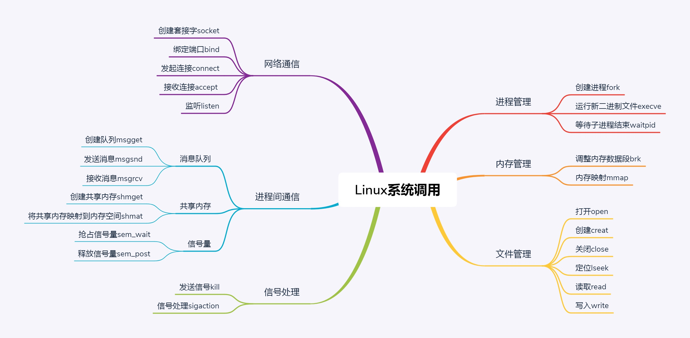

## 一、快速上手的几个命令

### 1. 用户与密码

- passwd : 更改密码

- useradd username : 创建用户，创建的用户是放在/etc/passwd文件里的

```shell script
# cat /etc/passwd
root:x:0:0:root:/root:/bin/bash 
cliu8:x:1000:1000::/home/cliu8:/bin/bash
# 注册名:密码:用户ID:组ID:用户名:用户的主目录:默认交互命令行

# cat /etc/group
root:x:0:
cliu8:x:1000:
```

### 2. 文件与软件

- ls -l : 用列表的方式列出文件
```shell script
# ls -l
drwxr-xr-x 6 root root    4096 Oct 20  2017 apt
-rw-r--r-- 1 root root     211 Oct 20  2017 hosts
# 文件类型：d为目录，-为文件
# 第一个字段剩下九个字符为权限位，3个一组，每一组rwx表示"读（read）- 1""写（write）- 3""执行（execute） - 4"
# 第二字段为硬连接数目，第三字段为所属用户，第四个为所属组
# 第五个为文件大小，第六个为文件被修改的日期

```

- rpm 或 dpkg : -i为安装，查看安装软件列表，rpm -qa， dpkg -l

- rpm -e 或 dpkg -r : 删除

- ｜: 管道，用于连接两个程序

### 3. 软件管家

- yum 或 apt-get

Centos配置文件在/etc/yum.repos.d/CentOS-Base.repo里

Ubuntu配置文件在/etc/apt/sources.list里

### 4. vim


### 5. 运行程序

- ./filename : 只要文件有x执行权限，可通过该方式执行，如果设置了PATH，就不用./了

- nohup : 当前交互命令行退出的时候，程序还要在。 在命令最后加上&就变成后台运行了

- ps -ef |grep 关键字  |awk '{print $2}'|xargs kill -9 : 可以通过该方式关闭后台运行的进程

- systemctl : 以服务的方式运行


## 二、系统调用

### 1. 创建进程-fork
在Linux里，要创建一个新的进程，需要一个老的进程调用fork来实现，其中老的进程叫作父进程（Parent Process），新的进程叫作子进程（Child Process）

当父进程调用fork创建进程的时候，子进程将各个子系统为父进程创建的数据结构也全部拷贝了一份，甚至连程序代码也是拷贝过来的

对于fork系统调用的返回值，如果当前进程是子进程，就返回0, 需要请求另一个系统调用execve来执行另一个程序，这个时候，子进程和父进程就彻底分道扬镳了；如果当前进程是父进程，就返回子进程的进程号，父进程接着做原来应该做的事情

### 2. 内存管理
- 代码段：存放代码的空间
- 数据段：存放执行过程中产生的数据的空间

#### 2.1 brk
分配的内存数量比较小的时候，使用brk，会和原来的堆数据连在一起

#### 2.2 mmap
当分配的内存数量比较大的时候，使用mmap，会重新划分一块区域

### 3. 文件管理
Linux有一个特点，一切皆文件

对于文件操作，下面六个系统调用最重要：
- 对于已经有的文件，可以使用open打开这个文件，close关闭这个文件；
- 对于没有的文件，可以使用creat创建文件；
- 打开文件以后，可以使用lseek跳到文件的某个位置；
- 可以对文件的内容进行读写，读的系统调用是read，写是write。

每个文件，Linux都会分配一个文件描述符(File Descriptor)，这是一个整数，通过文件描述符，我们就可以使用系统调用，查看或者干预进程的方方面面


### 4. 进程间通信

#### 4.1 消息队列-不需要很长的数据
消息队列是在内核里的，我们可以通过msgget创建一个新的队列

msgsnd将消息发送到消息队列

msgrcv可以从队列中拉取消息

#### 4.2 共享内存-交互的信息比较大时
通过shmget创建一个共享内存块

通过shmat将共享内存映射到自己的内存空间，然后进行读写（会出现竞争）

#### 4.3 信号量的机制Semaphore
占用信号量sem_wait，释放信号量sem_post




## 三、x86架构


### 1. 名次解释

- CPU: 中央处理器，加算计的大脑，所有的设备都围绕它展开。主要由运算单元、数据单元和控制单元三部分组成
- 总线：负责CPU和其他设备的连接
- 地址总线：拿地址数据的总线，地址总数的位数决定能访问的地址范围有多广，能管理的内存范围有多广
- 数据总线：负责拿真正的数据的总线，它的位数决定了一次能拿多少个数据，位数越多，访问速度就越快
- 内存：单靠CPU没办法完成计算任务的，很多复杂的计算任务都需要将中间结果保存，这就要依赖内存
- 运算单元：只管算，例如做加法、做位移，但它不知道应该算哪些数据，结果应该放在哪里
- 数据单元：为了避免运算单元每次都要通过总线到内存中拿数据，就有了数据单元。它包括CPU内部的缓存和寄存器组，可以暂时存放数据和运算结果
- 控制单元：指挥到底做什么运算的地方，是一个统一的指挥中心。它可以获得下一条指令，然后执行这条指令，这个指令会指导运算单元取出数据单元中的某几个数据，计算出结果，然后放在数据单元的某个地方
- 指令指针寄存器：存放的是下一条指令在内存中的地址，控制单元会不停地将代码段的指令拿进来先放入指令寄存器
- 偏移量：存储单元的实际地址与其所在段的段地址之间的距离称为段内偏移

### 2. CPU和内存如何配合工作


数据单元根据数据的地址，从数据段里读到数据寄存器里，运算单元做完运算，产生的结果会暂存在数据单元的数据寄存器里，最终，会有指令将数据写回内存中的数据段