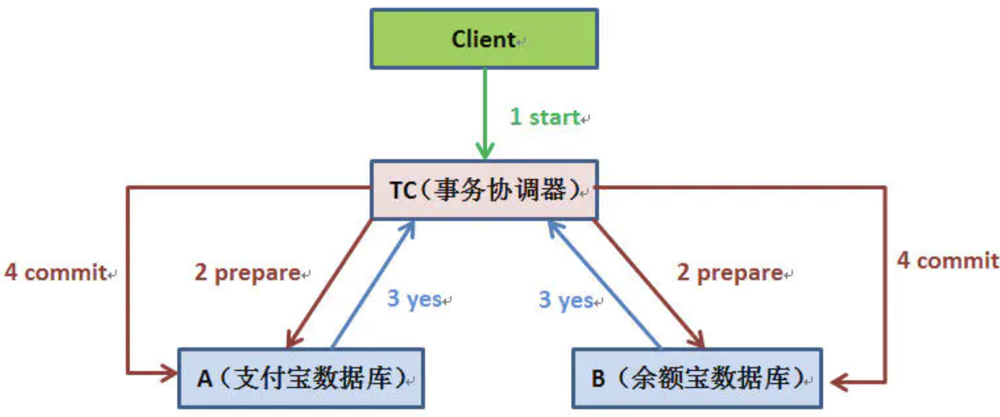

# 一、分布式锁

## 1. 使用分布式锁要考虑什么

### 1.1  互斥

在分布式高并发的条件下，最需要保证在同一时刻只能有一个线程获得锁，这是最基本的一点。

### 1.2 安全、防止死锁

如果因为系统故障导致或者其它原因使它无法执行释放锁的命令,导致其它线程都无法获得锁，造成**死锁**

**所以我们一定要设置过期时间，或者利用框架组件的特性来确保锁一定会被释放掉**

### 1.3 性能

对于访问量大的资源，我们要尽量减少线程的等待时间，避免有大量线程阻塞

所以在设计锁的时候需要考虑两点

- 锁的颗粒度要尽可能的小，比如你要通过锁来减库存，那这个锁的名称你可以设置成是商品的ID,而不是任取名称。这样这个锁只对当前商品有效,锁的颗粒度小
- 锁的范围也要尽可能的小，锁两行就能搞定的东西就别锁十行

#### 1.3.1 锁的时长

还是就是锁的过期时间

- 太长可能会导致大量线程被阻塞，导致QPS低
- 太短可能会导致线程在执行还未完成就导致锁被释放了
  - WatchDog，Redission的处理机制，获取锁的时候会新建一个线程来续期锁

### 1.4 重入

同一个线程可以重复拿到同一个资源的锁。重入锁非常有利于资源的高效利用

## 2. 会遇到的问题

https://www.infoq.cn/article/dvaaj71f4fbqsxmgvdce

### 2.1 锁超时的问题

#### 2.1.1 锁提前被释放

#### 2.1.2  锁被误删

## 3. 分布式锁有哪些，优缺点是什么

### 3.1 数据库

实现方式简单，创建一个lock表

- 申请锁：就往表中插入一条唯一的数据
- 释放锁：就删除这条数据

优点：简单，而且不需要引入其他第三方中间件

缺点：实现起来比较繁琐，需要自己考虑锁超时，事务等。

​			性能方面也比缓存低，对于高并发场景并不太合适

### 3.2 ZooKeeper

优点：不会出现死锁，实例宕机了，节点会自动释放，临时顺序节点

​			会按照请求顺序加锁，对于公平锁来说比较友好

缺点：ZK需要额外维护，增加维护成本，性能和MySQL差不多，并且需要开发人员理解ZK

### 3.3 Redis

优点：性能好，如果功能简单直接使用SETNX实现，还可以借鉴成熟框架Redission或者RedLock实现

缺点：需要维护Redis集群，如果要实现RedLock还需要维护多个集群

# 二、分布式事务

## 1. 二阶段提交

一般分为协调器TC和若干事务执行者两种角色，这里的事务执行者就是具体的数据库，协调器可以和事务执行器在一台机器上

# 三、分布式ID

## 1. UUID 

### 1.1 优点

- 安全。不容易被人看出规律
- 全局唯一，可作为分布式id
- 屏蔽了不同语言之间的数据类型差异。返回的都是string，前后端无差异
- 简单，很多语言自带实现
- 适合分库，随机性保证了分库的平均，而且

### 1.2 缺点

- 性能问题（根因，不是自增）
  - 插入。因为无序，每次插入都会损耗不少性能（页分裂）
  - 查询。因为无序，临近的数据没有相关性，导致不能很好地利用局部性原理
- 即使使用了Binary作为存储类型，也要16个字节。相比Bigint多了8字节，虽然说磁盘不怎么值钱，但是内存、CPU cache，磁盘IO操作数量/延迟也会受影响
- 查bug的时候，因为要类型转换，非常繁琐
- 使用格式不统一，有的是用string、有的直接用uuid。而且string转uuid容易出错

## 2. 雪花算法

### 1.1 优点

- 递增，id都是递增趋势的，所以插入效率就很高
- 灵活，可以根据自身业务的特点分配bit

### 1.2 缺点

- 强依赖机器时钟，会出现时钟回拨的问题
  - 序列号减少两位，集群减少一位，时钟回拨3位。每次发生时钟回拨，回拨位+1，所以，在同一个时间戳，同一个序号，最多能发生7次时钟回拨。足够了
- 与前端的数据类型不兼容， number 最大值 是2的53次方减1

### 1.3 实现

#### 1.3.1 机器号生成

##### 分布式锁

雪花算法里面最重要的位，就是根据它来保证在同一集群里面，生成的id是唯一的

生成的时候，需要用到分布式锁，来保证生成时唯一。

注意，这里需要续期锁，防止机器号还没生成完，锁已经被释放的情况

续期线程用分布式锁的value来判断是不是当前实例获取的锁，再续期

##### 存储结构

redis的hash来存，field为ip，value为机器号。

当实例重启时，能继续使用原来的机器号，不用生成额外的机器号

##### 防止宕机导致的机器号浪费

需要设计机器号的存活时间，以免因宕机而造成的机器号浪费。当实例存活时，用定时任务去续期存活时间

# 三、CAP

## 1. 一致性模型

弱一致性：DNS、Gossip

强一致性：同步、Paxos、Raft、ZAB

要解决什么问题： 数据不能存在单点上。

### 1.1 主从同步

- Master接受写请求
- Master复制日志到slave
- Master等待，直到所有从库返回

存在问题：一个节点失败，Master阻塞，导致整个集群不可用，保证了一致性，可用性却大大降低

### 1.2  多数派

多数派就是说，写入大于N/2的节点，从N/2的节点中读取数据

但是也解决不了并发的问题，所以顺序也是非常重要的

### 1.3 Paxos

#### 1.3.1 角色

- Client：系统外部角色，请求发起者。像民众
- Proposer：接受Client请求，向集群提出提议（Propose）。并在冲突发生时，起到冲突调节的作用。像议员 
- Acceptor（Voter）：提议投票和接收者，只有在形成法定人数时，提议才会最终被接受
- Learner：提议接受者，像记录员

#### 1.3.2  步骤

- Prepare ：proposer提出一个提案，编号为N，此N大于它之前提出的编码，请求acceptors的quorum接受
- Promise：如果N大于此acceptor之前接受的任何提案编号，就接受 
- Accept：如果达到了多数，proposer会发出accept请求，此请求包含提案编号N，以及提案内容
- Accepted：如果此acceptor在此期间没有收到任何编号大于N的提案，则接受此提案内容

#### 1.3.3 潜在问题

活锁：加个随机过期时间，重新提出编号

难实现，效率低：多角色，2轮RPC

#### 1.3.4 Multi paxos

减少角色，所有请求都先经过leader，减少一轮RPC，去掉活锁的发生

### 1.4 Raft

简单版本的paxos

#### 1.4.1 角色

- Leader
- Follower
- Candidate

#### 1.4.2 步骤

- Leader Election
- Log Replication
- Safety
