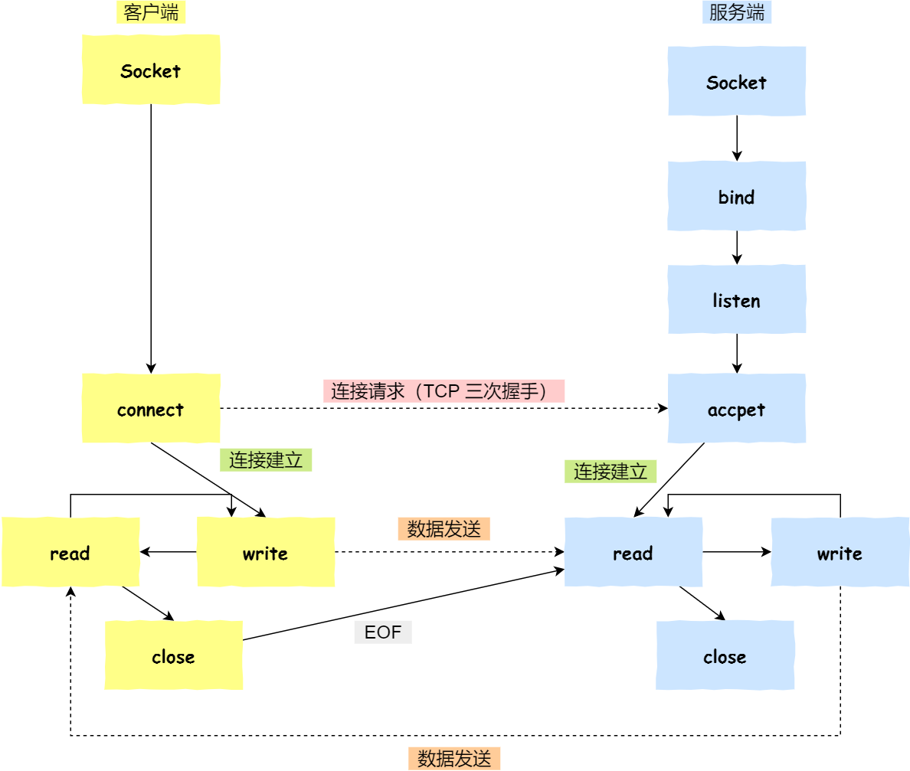
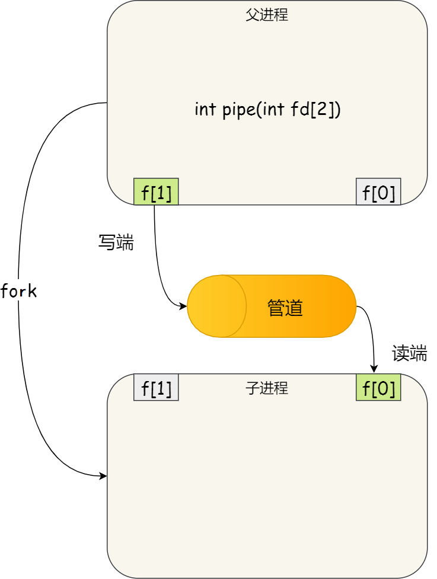
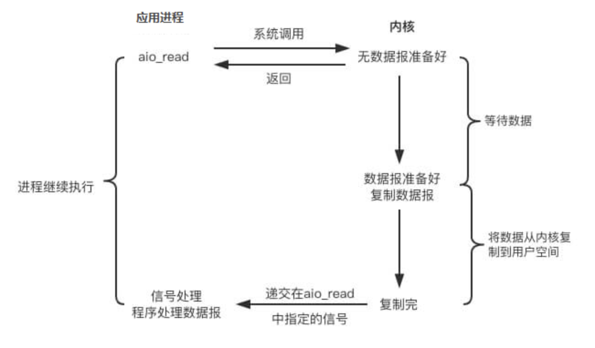

## 一、常用术语总结

| 名词              | 概念                                                         |
| ----------------- | :----------------------------------------------------------- |
| PCB               | 进程控制块（PCB Process Control Block）,系统中存放、管理和控制进程信息的数据结构称为PCB<br />OS是根据PCB来对并发执行的进程进行控制管理的 |
| TCB               | 线程控制块                                                   |
| FCB               | 文件控制块                                                   |
| PID               | 进程ID(Process ID)                                           |
| PSW               | 程序状态字寄存器，用于存放PC、IR等的信息                     |
| PC                | 程序计数器，存放下一条指令地址                               |
| IR                | 指令寄存器，存放到当前进行的指令                             |
| 半双工            | 半双工和全双工是计算机网络中的概念，意思是通讯同一时间只允许一方发送数据(对讲机) |
| 全双工            | 通信允许两方向上同时传输数据(电话)                           |
| P操作             | 来自荷兰语proveren，代表wait原语，通常使用P(S)代替wait(S)    |
| V操作             | 来自荷兰语verhogen，代表原语signal,通常使用V(S)代替signal(S) |
| 用户态            | 一般的操作系统对执行权限进行分级，分别为用保护态和内核态。用户态相较于内核态有较低的执行权限，很多操作是不被操作系统允许的，从而保证操作系统和计算机的安全。 |
| 内核态            | 内核态相当于一个介于硬件与应用之间的层，可以进行硬件的调度、使用，可以执行任何cpu指令，也可以引用任何内存地址，包括外围设备, 例如硬盘, 网卡，权限等级最高。 |
| 用户态内核态切换  | 三种情况下，用户态会转换到内核态，`系统调用、程序异常(例如/0，内存资源耗尽等)、来自外围设备的中断` |
| 系统调用/程序接口 | 用户程序通过系统调用的方式才能对硬件进行使用，或者说操作系统将使用硬件的接口提供给用户程序 |
| 中断              | 中断是操作系统内核程序夺取cpu的唯一途径，或者说用户程序调用内核代码的唯一途径，因为在一般情况下，操作系统会将cpu使用权交给应用程序。 |

**局部性原理：**

时间局部性：如果执行了程序中的某条指令，那么不久后这条指令很有可能再次执行；如果某个数据被访问过，不久之后该数据很可能再次被访问。（因为程序中存在大量的循环）
空间局部性：一旦程序访问了某个存储单元，在不久之后，其附近的存储单元也很有可能被访问。（因为很多数据在内存中都是连续存放的）

## 二、进程、线程

### 2.1 进程

什么是进程：系统中正在运行的一个应用程序，程序一旦运行就是进程。系统进行资源分配的独立实体， 且每个进程拥有独立的地址空间

组成：进程由**PCB、程序段、数据段**组成，包含了PID、资源分配情况、进程运行情况。

存在意义：为了程序能和其他程序并发执行，**以提高资源利用率和系统吞吐量**


对用户而言，我们能看到**一个个PID**，而对操作系统而言，底层需要处理的是**一个个PCB**。


PCB包括：

- 程序计数器：接着要运行的指令地址
- 进程状态：可以是new、ready、running、waiting或blocking
- CPU暂存器：主要用于中断时，暂时存储数据，以便稍后继续利用
- 存储器管理：如标签页等


程序段： 存放要执行的代码

数据段：存放程序运行过程中处理的各种数据


#### 2.1.1 进程的特征

1. 动态性：进程是程序的一次执行，它有着创建、就绪、运行、阻塞、结束等过程，具有一定的生命周期。
2. 并发性：多个进程实体，能同时存在内存中，能在一段时间内同时运行。引入进程的目的就是为了程序能和其他程序并发执行，**以提高资源利用率**
3. 独立性：指进程实体是一个能独立运行、独立获取资源和独立接收调度的基本单元。
4. 异步性：进程之间相互制约，使进程具有执行的间断性。为此，操作系统中必须配置相应的同步机制
5. 结构性：每个进程都配置了一个PCB对其进行描述。进程由PCB、程序段、数据段组成


#### 2.1.2 进程控制

进程控制的原语：**创建、终止、阻塞、唤醒、切换**。

原语的执行具有原子性，不允许被中断，原语的实现可以通过“关中断指令”和“开中断指令”实现


**操作系统创建一个新进程的过程如下（创建原语）：**

- 为新进程分配一个唯一的进程标识符（PID），并申请一个PCB
- 为进程分配资源（程序段、数据段）
- 初始化PCB。初始化标识信息、初始化处理器状态信息和初始化处理器控制信息，以及设置进程的空闲等
- 如果进程就绪队列能接纳新进程，就讲新进程插入到就绪队列，等待被调度运行。


引起终止的事件主要有：正常结束（进程的任务已经完成）、异常结束（发生了异常事件）、外界干预（操作系统、父进程干预）。

**操作系统撤销进程的过程如下（撤销原语）：**

- 根据被终止进程的标识符，检索PCB，从中读取出进程的状态
- 若被终止进程处于运行状态，立即终止进程的执行，将处理器的资源分配给其他进程
- 若该进程还有子进程，则应将其所有子进程终止
- 将该进程的资源归还给父进程或操作系统
- 将该PCB从所在队列（链表）中删除


**操作系统阻塞进程的过程如下（阻塞原语）：**

- 找到将要被阻塞的进程的标识符对应的PCB
- 若进程处于运行状态，则保护现场，并把PCB从运行队列移至阻塞队列
- 若进程处于就绪状态，则把PCB从就绪队列移至阻塞队列


**操作系统唤醒进程的过程如下（唤醒原语）：**

- 在该事件的等待队列中找到相应进程的PCB
- 把该PCB移至就绪队列中，等待调度


无论进程的什么操作，都是在内核中完成的

**进程切换的过程如下（切换原语）：**

- 保存处理器上下文，包括程序计数器和其他寄存器
- 更新PCB信息，如进程的状态
- 把进程对应的PCB移入相应队列
- 选择另一个进程执行，并更新其PCB
- 恢复处理器上下文


#### 2.1.3 进程状态

进程状态（三态模型）：**运行态、就绪态、阻塞态**

进程五种状态：

- 运行状态：进程正在处理器上运行。在单处理器的环境下，每一时刻最多只有一个进程处于运行状态。

- 就绪状态：进程已处于准备运行的状态，即进程获得了除CPU之外的一切所需资源，一旦得到处理器即可运行。

- 阻塞状态：又称为等待状态：进程正在等待某一事件而暂停运行，如等待某资源为可用（不包括处理器），或等待输入输出的完成。及时处理器空闲，该进程也不能运行。

- 创建状态：进程正在被创建，尚未转到就绪状态。创建进程通常需要多个步骤：首先申请一个空白的PCB，并向PCB中填写一些控制和管理进程的信息；然后由系统为该进程分配运行时所必须的资源；最后把该进程转入到就绪状态。

- 结束状态：进程正在从系统中消失，这可能是进程正常结束或其他原因中断退出运行。当进程需要结束运行时，系统首先必须置该进程为结束状态，然后再进一步处理资源释放和回收工作。

进程状态转换的条件：

- 运行 -> 阻塞：等待IO或事件完成
- 运行 -> 就绪：进程的CPU时间片用完了
- 就绪 -> 运行：获得了CPU的时间片
- 阻塞 -> 就绪：IO或事件完成了


#### 2.1.4 进程的组织形式

> 在一个系统中，通常有数十、数百乃至数千个PCB。为了能对他们加以有效的管理，应该用适当的方式把这些PCB组织起来。


#### 2.1.5 进程间通信


**为什么会有进程间通信呢？**

因为每个进程的用户地址空间是独立的，不能相互访问，但内核空间是每个进程共享的，所以进程之间要通信必须通过内核

 


进程通信是指进程之间的信息交换。进程是分配系统资源的单位，因此各个进程拥有的内存地址相互独立，为了保证安全，一个进程不能直接访问另一个进程的地址空间


进程通信方法：**共享存储、信号量、消息队列/信箱、管道通信、套接字(这个在计算机网络有涉及相关知识，可以把套接字理解为一个窗口)**


##### 2.1.5.-2 Socket

**跨网络与不同主机上的进程之间通信，就需要 Socket 通信了。**

实际上，Socket 通信不仅可以跨网络与不同主机的进程间通信，还可以在同主机上进程间通信



- 服务端和客户端初始化 `socket`，得到文件描述符；
- 服务端调用 `bind`，将绑定在 IP 地址和端口;
- 服务端调用 `listen`，进行监听；
- 服务端调用 `accept`，等待客户端连接；
- 客户端调用 `connect`，向服务器端的地址和端口发起连接请求；
- 服务端 `accept` 返回用于传输的 `socket` 的文件描述符；
- 客户端调用 `write` 写入数据；服务端调用 `read` 读取数据；
- 客户端断开连接时，会调用 `close`，那么服务端 `read` 读取数据的时候，就会读取到了 `EOF`，待处理完数据后，服务端调用 `close`，表示连接关闭


##### 2.1.5.-1 信号

上面说的进程间通信，都是常规状态下的工作模式。**对于异常情况下的工作模式，就需要用「信号」的方式来通知进程**

是什么：通知进程发生了异常情况

来源：信号事件的来源主要有硬件来源（如键盘 Cltr+C ）和软件来源（如 kill 命令）

```kill -9 1050 ，表示给 PID 为 1050 的进程发送 SIGKILL 信号，用来立即结束该进程；```

是进程间通信机制里面唯一的**异步通信机制**，因为可以在任何时候发送信号给某一进程，一旦有信号产生，我们就有下面这几种，用户进程对信号的处理方式

**1.执行默认操作**。Linux 对每种信号都规定了默认操作，例如，上面列表中的 SIGTERM 信号，就是终止进程的意思。Core 的意思是 Core Dump，也即终止进程后，通过 Core Dump 将当前进程的运行状态保存在文件里面，方便程序员事后进行分析问题在哪里。

**2.捕捉信号**。我们可以为信号定义一个信号处理函数。当信号发生时，我们就执行相应的信号处理函数。

**3.忽略信号**。当我们不希望处理某些信号的时候，就可以忽略该信号，不做任何处理。有两个信号是应用进程无法捕捉和忽略的，即 `SIGKILL` 和 `SEGSTOP`，它们用于在任何时候中断或结束某一进程。


##### 2.1.5.0 信号量

背景：用了共享内存通信方式，带来新的问题，那就是如果多个进程同时修改同一个共享内存，很有可能就冲突了

用处/解决了什么：**信号量**就实现了这一保护机制。为了防止多进程竞争共享资源，而造成的数据错乱，所以需要保护机制，使得共享的资源，在任意时刻只能被一个进程访问

如何实现：**信号量其实是一个整型的计数器，主要用于实现进程间的互斥与同步，而不是用于缓存进程间通信的数据**


信号量表示资源的数量，控制信号量的方式有两种原子操作：

- 一个是 **P 操作**，这个操作会把信号量减去 -1，相减后如果信号量 < 0，则表明资源已被占用，进程需阻塞等待；相减后如果信号量 >= 0，则表明还有资源可使用，进程可正常继续执行。
- 另一个是 **V 操作**，这个操作会把信号量加上 1，相加后如果信号量 <= 0，则表明当前有阻塞中的进程，于是会将该进程唤醒运行；相加后如果信号量 > 0，则表明当前没有阻塞中的进程；

P 操作是用在进入共享资源之前，V 操作是用在离开共享资源之后，这两个操作是必须成对出现的。


初始化1代表是互斥信号量，它可以保证共享内存在任何时刻只有一个进程在访问，这就很好的保护了共享内存

初始化为0代表同步信号量，可以用信号量来实现多进程同步的方式


##### 2.1.5.1 共享存储

消息队列的读取和写入的过程，都会有发生用户态与内核态之间的消息拷贝过程。那**共享内存**的方式，就很好的解决了这一问题

**共享内存的机制，就是拿出一块虚拟地址空间来，映射到相同的物理内存中**。这样这个进程写入的东西，另外一个进程马上就能看到了，都不需要拷贝来拷贝去，传来传去，大大提高了进程间通信的速度


基于数据结构的共享：比如共享空间内只能放一个长度为10 的数组，这种方式速度慢、限制多，是一种低级通信

**基于存储区的共享**：在内存中划分一块共享内存，数据的形式、存放位置都由进程来控制。相比之下速度更快，是一种高级通信


两个进程对共享空间的访问必须是互斥的


##### 2.1.5.2 消息传递

前面说到管道的通信方式是效率低的，因此管道不适合进程间频繁地交换数据

用法：**消息队列是保存在内核中的消息链表**，在发送数据时，会分成一个一个独立的数据单元，也就是消息体（数据块），消息体是用户自定义的数据类型，消息的发送方和接收方要约定好消息体的数据类型，所以每个消息体都是固定大小的存储块，不像管道是无格式的字节流数据。如果进程从消息队列中读取了消息体，内核就会把这个消息体删除

生命周期：消息队列生命周期随内核，如果没有释放消息队列或者没有关闭操作系统，消息队列会一直存在，而前面提到的匿名管道的生命周期，是随进程的创建而建立，随进程的结束而销毁。

缺点：**一是通信不及时，二是附件也有大小限制，三是存在用户态与内核态之间的数据拷贝开销**


通过原语控制，进程1发送消息到消息缓冲队列或者信箱中，进程2从消息队列或者信箱中接收消息。

消息由消息头和消息体构成。

消息头：发送进程ID、接受进程ID、消息类型、消息长度等格式化的信息


消息传递的方式有直接通信和间接通信

直接通信：消息直接挂到接收进程的消息缓冲队列中

间接通信：消息要先发到中间实体（信箱中）


##### 2.1.5.3 管道通信

```shell
ps -ef | grep 8080
```


其实就是我们敲命令的那条竖线。**它的传输数据是单向的，如果要互相通信，需要创建两个管道才行**

而且像这种管道是没有名字的，所以｜表示的管道称为**匿名管道**，用完就销毁


匿名管道的创建，需要通过下面的系统调用：```int pipie(int fd[2])```

这里表示创建一个匿名管道，并返回了两个描述符，一个是管道的读取端描述符 `fd[0]`，另一个是管道的写入端描述符 `fd[1]`。注意，这个匿名管道是特殊的文件，只存在于内存，不存于文件系统中

可以使用fork创建子进程，**创建的子进程会复制父进程的文件描述符**，这样就做到了两个进程各有两个「 `fd[0]` 与 `fd[1]`」，两个进程就可以通过各自的 fd 写入和读取同一个管道文件实现跨进程通信了。


**所谓的管道，就是内核里面的一串缓存**。从管道的一段写入的数据，实际上是缓存在内核中的，另一端读取，也就是从内核中读取这段数据。另外，管道传输的数据是无格式的流且大小受限


管道只能一端写入，另一端读出，所以上面这种模式容易造成混乱，通常的做法是：




在 shell 里面执行 `A | B`命令的时候，A 进程和 B 进程都是 shell 创建出来的子进程，A 和 B 之间不存在父子关系，它俩的父进程都是 shell


所以说，在 shell 里通过「`|`」匿名管道将多个命令连接在一起，实际上也就是创建了多个子进程，那么在我们编写 shell 脚本时，能使用一个管道搞定的事情，就不要多用一个管道，这样可以减少创建子进程的系统开销


“管道”是指用于连接读写进程的一个共享文件。其实就是在内存中开辟了一个大小固定的缓冲区


1. 管道只能采用**半双工通信**，某一段时间段内只能实现单向的传输。如果要实现双向同时通信，需要设置两个管道
2. 各个进程要互斥地访问管道
3. 数据以字符流的形式写入管道，当管道写满时，写进程的write()系统调用将会阻塞，等待读进程将数据取走。同理，管道为空时，读进程的read()系统调用将会阻塞
4. 如果没写满，则不允许读，如果没读空，就不允许写
5. 数据一旦被读出，就从管道中被丢弃，就意味着读进程最多只有一个。
6. 缓冲区大小有限，默认4k
7. 只能用于亲缘关系的进程


##### 2.1.5.4 命名管道（FIFO）

使用前，先用```mkfifo myPipe```命令来创建，并且指定管道名字

myPipe 就是这个管道的名称，基于 Linux 一切皆文件的理念，所以管道也是以文件的方式存在，我们可以用 ls 看一下，这个文件的类型是 p，也就是 pipe（管道） 的意思


```shell
echo "hello" > myPipe
# 命令会停在这，因为管道的内容没有被读取，只有管道里的数据被读完后，命令才能正常退出
```

可以看出，**管道这种通信方式效率低，不适合进程间频繁地交换数据**

好处，自然就是简单，同时也我们很容易得知管道里的数据已经被另一个进程读取了


命名管道不同于匿名管道之处在于它提供了一个路径名与之关联，以命名管道的文件形式存在于文件系统中。这样，即使与命名管道的创建进程不存在亲缘关系的进程，只要可以访问该路径，就能够彼此通过命名管道相互通信


###### 匿名管道和命名管道总结

1. 管道是特殊类型的文件，在满足先入先出的原则条件下可以进行读写，但不能进行定位读写。
2. 匿名管道是单向的，只能在有亲缘关系的进程间通信；有名管道以磁盘文件的方式存在，可以实现本机任意两个进程通信。
3. 无名管道阻塞问题：无名管道无需显示打开，创建时直接返回文件描述符，在读写时需要确定对方的存在，否则将退出。如果当前进程向无名管道的一端写数据，必须确定另一端有某一进程。如果写入无名管道的数据超过其最大值，写操作将阻塞，如果管道中没有数据，读操作将阻塞，如果管道发现另一端断开，将自动退出。
4. 命名管道阻塞问题：命名管道在打开时需要确实对方的存在，否则将阻塞。即以读方式打开某管道，在此之前必须一个进程以写方式打开管道，否则阻塞。此外，可以以读写（O_RDWR）模式打开命名管道，即当前进程读，当前进程写，不会阻塞。


#### 2.1.6 调度算法

##### 2.1.6.1 调度原则

- **CPU利用率**：调度程序应确保CPU始终是匆忙的状态，这样可以提高CPU的利用率
- **系统吞吐量**：吞吐量表示的是单位时间内 CPU 完成进程的数量，长作业的进程会占用较长的 CPU 资源，因此会降低吞吐量，相反，短作业的进程会提升系统吞吐量；
- **周转时间**：周转时间是进程运行和阻塞时间总和，一个进程的周转时间越小越好；
- **等待时间**：这个等待时间不是阻塞状态的时间，而是进程处于就绪队列的时间，等待的时间越长，用户越不满意；
- **响应时间**：用户提交请求到系统第一次产生响应所花费的时间，在交互式系统中，响应时间是衡量调度算法好坏的主要标准。


1. **先来先服务调度算法（FCFS）（非抢占）**：从就绪队列中选择一个最先进入该队列的进程为之分配资源，使它立即执行并一直执行到完成或发生某事件而被阻塞放弃占用 CPU 时再重新调度

   > 算法简单，但是效率低
   >
   > 有利于长作业进程，不利于短作业，体现在平均等待时长上。（P1: 24ms，P2: 3ms, P3: 3ms），平均等待时长最长为17ms，最短为3ms
   >
   > 有利于CPU密集型进程，不利于IO密集型，体现在使用CPU上。IO密集型大部分时间都处于等待队列，这时候CPU空闲，CPU密集型进程分配CPU，IO密集型需要在就绪队列等待CPU密集型进程释放CPU

2. **短作业优先调度算法（SJF）（可抢占、可非抢占）：**从就绪队列中选出一个估计运行时间最短的进程为之分配资源，使它立即执行并一直执行到完成或发生某事件而被阻塞放弃占用 CPU 时再重新调度

   > 该算法的平均等待时间最少
   >
   > 该算法对长作业不利
   >
   > 由于作业的长短只根据用户所提供的估计执行时间而定的，而用户又可能会有意或无意的缩短其作业的估计运行时间，致使该算法不一定能真正做到算作业优先调度

3. **时间片轮询调度算法（RR）（抢占）**：每个进程被分配一个时间段，称作它的时间片，即该进程允许运行的时间

4. **多级反馈队列调度算法**：目前**被公认的一种较好的进程调度算法**。根据不同 CPU 执行的特点来区分进程。如果进程使用过多的 CPU 时间，那么它会被移到更低的优先级队列。这种方案将 I/O 密集型和交互进程放在更高优先级队列上。此外，在较低优先级队列中等待过长的进程会被移到更高优先级队列。这种形式的老化可阻止饥饿的发生

   > 每个进程在进入就绪队列后，就被添加到队列 0 内。队列 0 内的每个进程都有 8ms 的时间片。如果一个进程不能在这一时间片内完成，那么它就被移到队列 1 的尾部。如果队列 0 为空，队列 1 头部的进程会得到一个 16ms 的时间片。如果它不能完成，那么将被抢占，并添加到队列 2。只有当队列 0 和 1 为空时，队列 2 内的进程才可根据[ FCFS](http://c.biancheng.net/view/1242.html) 来运行

5. **优先级调度**（可抢、可非抢）： 为每个流程分配优先级，首先执行具有最高优先级的进程，依此类推。具有相同优先级的进程以 FCFS 方式执行。可以根据内存要求，时间要求或任何其他资源要求来确定优先级

   > 可能会发生无穷阻塞或饥饿（用老化解决低优先级进程无穷等待问题）


#### 2.1.7 进程同步

多道程序环境下，进程是并发执行的，不同进程间存在着不同的相互制约关系。**为了协调进程之间的相互制约关系，达到资源共享和进程协作，避免进程之间的冲突**，引入了进程同步的概念


##### 2.1.7.1 临界资源

多个进程可以共享系统中的各种资源，但其中**许多资源一次只能为一个进程所使用**，这种一次只允许一个进程使用的资源称为临界资源


##### 2.1.7.2 实现临界区互斥的基本方法

硬件能够实现进程互斥，有三种方式：**利用“开/关中断指令”实现**、**TSL指令**、**SWAP指令**。


信号量机制：用户进程可以通过使用操作系统提供的原语对信号量进行操作，从而很方便的实现进程的互斥、同步、前驱


#### 2.1.8 写时拷贝技术（Copy-on-write）


在fork之后exec之前两个进程**用的是相同的物理空间**（内存区），子进程的代码段、数据段、堆栈都是指向父进程的物理空间，也就是说，两者的虚拟空间不同，但其对应的**物理空间是同一个**

当父子进程中**有更改相应段的行为发生时**，再**为子进程相应的段分配物理空间**。


实现原理：

> fork()之后，kernel把父进程中所有的内存页的权限都设为read-only，然后子进程的地址空间指向父进程。当父子进程都只读内存时，相安无事。当其中某个进程写内存时，CPU硬件检测到内存页是read-only的，于是触发页异常中断（page-fault），陷入kernel的一个中断例程。中断例程中，kernel就会**把触发的异常的页复制一份**，于是父子进程各自持有独立的一份。


好处：

- COW技术可减少分配和复制大量资源时带来的瞬间延时
- 可减少不必要的资源分配。父进程的代码段和只读数据段都不被允许修改，所以无需复制

缺点：

- 如果fork()之后，父子进程都还需要继续进行写操作，那么产生大量的分页错误(页一场终端page-fault)


##### 2.1.8.1 fork()函数

**fork()函数用于创建子进程，新的进程要通过老的进程复制自身得到**

这个函数有两次返回，将子进程的PID返回给父进程，0返回给子进程


##### 2.1.8.2 exec()函数

**exec()：装载一个新的程序（可执行映像）覆盖当前进程内存空间中的映像，从而执行不同的任务**


### 2.2 线程

定义：“轻量级线程”。进程是资源分配的基本单位，线程是调度的基本单位，往往一个进程包含多个线程。

组成：由线程ID、程序计数器、寄存器集合和堆栈组成

目的：**引入进程的目的，是为了是多道程序能并发执行，以提高资源利用率和系统吞吐量；而引入线程，则是为了减小程序在并发执行时所付出的时空开销，提高操作系统的并发性能**


#### 2.2.1 线程与进程的比较

1. 调度：在引入线程的操作系统中，线程是独立调度的基本单位，进程是资源拥有的基本单位。
2. 拥有资源：进程是拥有资源的基本单位，而线程不拥有系统资源，单线程可以访问其隶属进程的系统资源。
3. 并发性：在引入线程的操作系统中，不仅进程之间可以并发执行，线程之间也可以并发执行，从而是操作系统具有更好的并发性，大大提高了系统的吞吐量
4. 系统开销：在进行进程切换时，1.切换页目录以使用新的地址空间2.切换内核栈和硬件上下文，而线程切换时只需保存和设置少量寄存器内容，开销很小
5. 线程间可以通过直接读写同一进程中的数据进行通信，但是进程通信需要借助 IPC


线程比进程的开销小，体现在：

- 线程比进程创建要快，因为进程的创建需要申请资源，比如说内存、文件等，而线程的创建不会涉及到资源的申请
- 同理，线程释放要比进程快
- 线程切换要比进程切换快，因为线程共享同一地址空间，就意味着同一进程的线程共享同一个页表，那么在切换的时候，就不需要切换页表。而进程之间的切换是需要切换页表的，开销较大
- 由于线程共享同一个内存空间和文件资源，所以线程间传递数据是不需要经过内核的，交互数据的效率也比进程高


#### 2.2.2 线程的实现模型

线程的实现可以分为两类：用户级线程和内核级线程。


实现用户级线程和内核级线程的连接方式：

- 多对一模型：多对一模型将多个用户级线程映射到一个内核级线程。线程管理在用户空间完成
- 一对一模型
- 多对多模型：克服了多对一模型的并发度不高的缺点，又克服了一对一模型中一个用户进程占用太多内核级线程，开销太大的缺点


### 2.3 上下文切换

#### 2.3.1 CPU的上下文切换


##### 2.3.1.1 什么是CPU上下文

任务交给了CPU，那么CPU需要知道这些任务从哪里来的，又要从哪里开始运行。因此，操作系统会事先给CPU设置好CPU寄存器和程序计数器

**所以，CPU寄存器和程序计数器，是CPU在运行任何任务之前，必须依赖的环境，这些依赖的环境就叫做CPU上下文**


##### 2.3.1.2 CPU寄存器与程序计数器

**CPU寄存器就是CPU里面一个容量极小的内存**

寄存器像是你的口袋，内存像你的书包，硬盘则是你家里的柜子，如果你的东西存放到口袋，那肯定是比你从书包或家里柜子取出来要快的多。


**程序计数器就是CPU正在执行的指令位置，或者下一条指令的位置**


##### 2.3.1.3 CPU上下文切换的过程

**CPU上下文切换就是，先把前一个任务的CPU上下文给保存起来，加载新任务的CPU上下文设值到寄存器和程序计数器上。**

系统内核会存储保持下来的上下文信息，当此任务再次被分配给 CPU 运行时，CPU 会重新加载这些上下文，这样就能保证任务原来的状态不受影响，让任务看起来还是连续运行。


> 上面说到所谓的「任务」，主要包含进程、线程和中断。所以，可以根据任务的不同，把 CPU 上下文切换分成：**进程上下文切换、线程上下文切换和中断上下文切换**。


#### 2.3.2 进程上下文

由于进程是由内核管理和调度的，所以进程上下文切换发生在内核态


##### 2.3.2.1 什么是进程上下文

进程的上下文是指运行进程时所依赖的环境。

**进程的上下文切换不仅包含了虚拟内存、栈、全局变量等用户空间的资源，还包括了内核堆栈、寄存器等内核空间的资源**


##### 2.3.2.2 进程上下文切换过程

**通常，我们会把进程上下文的信息保存到进程的PCB里面，然后运行另一个进程时，把它的上下文从PCB中取出，恢复至CPU中，使得其可以继续运行**


##### 2.3.2.3 进程上下文切换发生的场景

我们希望进程上下文切换的开销越小越好，因为这样可以让进程把更多时间花费在执行中，而不是上下文切换

- 当某个进程的时间片耗尽了，进程就从运行状态变为就绪状态，系统从就绪队列选择另外一个进程运行
- 进程在系统资源不足（比如内存不足）时，要等到资源满足后才可以运行，这个时候进程也会被挂起，并由系统调度其他进程运行
- 进程调用睡眠函数将自己主动挂起
- 当有更高优先级的进程运行
- 发生硬件中断时，CPU 上的进程会被中断挂起，转而执行内核中的中断服务程序


#### 2.3.3 线程上下文

线程是系统调度的基本单位，进程时系统分配资源的基本单元

所以，线程是共享进程的虚拟内存、文件资源和全局变量的


##### 2.3.3.1 什么是线程上下文

- 当进程只有一个线程的时候，可以认为线程等于进程
- 当进程由多个线程的时候，这些线程会共享进程的虚拟内存、全局变量，这些在线程上下文切换的时候是不需要修改的


**因为线程也有自己私有的数据，比如栈和寄存器，这些在上下文切换时是需要保存的**


##### 2.3.3.2 线程上下文切换过程

- 当不同进程中的线程进行上下文切换时，跟进程上下文切换一样
- 当同一进程的不同线程进行上下文切换时，只需要切换线程的栈、寄存器、程序计数器等不共享的数据即可

所以线程的上下文切换开销要比进程上下文切换的开销要小


## 三、内存

内存是现代计算机系统执行的中心。**内存**是一个大的字节数组，大小从数十万到数十亿。每个字节都有地址。内存是个快速访问的数据仓库，并为 CPU 和 I/O 设备所共享

4G的内存空间，有4*2^30^个字节，也就是2^32^个字节，要表示全部的字节就需要**32位的二进制地址**，这也就是我们以前流行的32位操作系统的由来。但目前内存基本上都是8G，16G，所以32位已经不能满足需求，当前主流是**64位操作系统**，能表示2^64个字节，最高4,294,967,296G的内存空间，远远满足当前的任何个人电脑地址表达需求。


### 3.1 内存管理

虽然内存容量在不断增长，但仍不可能将所有用户进程和系统所需的全部程序放入主存中，所以操作系统必须将内存空间进行合理的划分和有效的动态分配。**操作系统对内存空间的分配与回收、内存空间扩充、地址转换、内存保护，就是内存管理的概念。**

作用：方便用户使用存储器、提高内存利用率、通过虚拟技术从逻辑上扩充存储器


### 3.2 程序装入内存

#### 3.2.1  编译

由编译程序将用户源代码编译成若干个目标模块


#### 3.2.2 链接

由链接程序将编译后形成的一组目标模块，以及所需库函数链接，形成完整的装入模块


1. 静态链接：在程序运行之前，先将各目标模块及它们所需的库函数链接成一个完整的可执行程序，以后不再拆开
2. 装入时动态链接：将用户源程序编译后所得到的一组目标模块，在装入内存时，采用边装入边链接的方式
3. 运行时动态链接：对某些目标模块的连接，是在程序执行中需要该目标模块时，才对它进行链接。其优点是便于修改和更新，便于实现对目标模块的共享


#### 3.2.3 装入

由装入程序将装入模块装入内存

1. 绝对装入：在编译时，如果知道程序将驻留在内存的某个位置，编译程序将产生绝对地址的目标代码。绝对装入程序按照装入模块的地址，将程序和数据装入内存。装入模块被装入内存后，由于程序中的逻辑地址与实际地址完全相同，故不需对程序和数据的地址进行修改（只适用于单道程序环境）
2. 可重定位装入：**在多道程序环境下，多个目标模块的起始地址通常都是从0开始，程序中的其他地址都是相对于起始地址的，此时应采用可重定位装入方式**。装入时对目标程序中指令和数据的修改过程称为重定位，地址变换通常是装入时一次完成，所以称为静态重定位（一旦装入就没办法再更改、申请内存空间）
3. 动态重定位：又称动态运行时装入。编译、链接后的装入模块的地址都是从0开始的。装入程序把装入模块装入内存后，并不会立即把逻辑地址转换为物理地址，而是把地址转换推迟到**程序真正要执行时才进行**


### 3.3 覆盖技术

背景：程序所需的运行空间大于实际内存大小，需要让内存发挥出更大的作用

基本思想：由于程序运行时并非任何时候都要访问程序和数据的各个部分，因此可以把用户空间分成一个固定区和若干个覆盖区（不可能同时被访问的程序段共享一个覆盖区）


### 3.4 交换技术

背景：程序所需的运行空间大于实际内存大小，需要让内存发挥出更大的作用

基本思想：把处于等待状态（或在CPU调度原则下被剥夺运行权利）的进程从内存移到辅存，把内存空间腾出来，这一过程又叫换出；把准备好竞争CPU运行的进程从辅存移到内存，这一过程又称为换入


#### 3.4.1注意事项

- 交换需要备份存储
- 为了有效使用CPU，需要每个进程的执行时间 比交换时间长。影响交换时间的主要是转移时间，转移时间与所交换的内存空间成正比
- 如果换出进程，必须确保该进程时完全处于空闲的
- 交换空间通常作为磁盘的一整块，且独立于文件系统，因此使用起来比较快
- 交换通常在有许多进程运行且内存空间吃紧时开始启动，而系统负荷降低就暂停


#### 3.4.2 与覆盖技术的区别

交换技术主要是在不同进程之间进行，而覆盖则用于同一个程序中


### 3.5 连续分配管理技术

单一连续分配：用于早期操作系统，内存被划分为系统区和用户区，内存只能有一道用户程序，局限性不言而喻。

固定分区分配：整个用户空间划分为若干个固定大小的分区，在每个分区中只装入一道作业。

**动态分区分配:不会预先划分内存分区，而是在进程装入内存时，根据进程的大小动态地建立分区。**（会产生外部碎片，内存中的某些空闲分区由于太小而难以利用）


#### 3.5.1 动态分区分配算法

- **首次适应算法：空闲分区以地址递增的次序链接。分配内存时顺序查找，找到大小能满足要求的第一个空闲分区**
- 最佳适应算法：空闲分区按容量递增形成分区链，找到第一个能满足要求的空闲分区
- 最坏适应算法：又称最大适应算法，空闲分区以容量递减次序链接。找到第一个能满足要求的空闲分区，也就是挑选最大的分区
- 临近适应算法：又称循环首次适应算法，由首次适应算法演变而成。不同之处是分配内存时从此查找结束的位置开始继续查找


### 3.6 非连续分配管理方式

非连续分配方式允许一个程序分散的装入不相邻的内存分区中，根据分区的大小是否固定分为分页存储管理方式和分段存储管理方式

**这些策略都有相同的目标，就是同时将多个进程保存在内存中**


#### 3.6.1 页式管理

**分页的基本方法涉及将物理内存分为固定大小的块，称为帧或页帧，而将逻辑内存也分为同样大小的块，称为页或页面**。当需要执行一个进程时，它的页从文件系统或备份存储等处，加载到内存的可用帧。备份存储划分为固定大小的块


由 CPU 生成的每个地址分为两部分：页码和页偏移。页码作为页表的索引。页表包含每页所在物理内存的基地址。这个基地址与页偏移的组合就形成了物理内存地址，可发送到物理单元


采用分页方案不会产生外部碎片：每个空闲帧都可以分配给需要它的进程。不过，分页有内部碎片。注意，分配是以帧为单位进行的。如果进程所要求的内存并不是页的整数倍，那么最后一个帧就可能用不完


优势：**相对相比于块式管理的划分力度更大（基于计算机的角度考虑设计的），提高了内存利用率，减少了碎片**

访问内存次数：两次。一次是访问页表，确定物理地址。第二次才根据该地址存取数据或指令。


##### 3.6.1.1 快表

地址变换机构中增设了一个具有并行查找能力的高速缓冲存储器——快表，又称联想寄存器TLB，用以存放当前访问的若干页表项。与此对应，主存中的页表也常称为慢表


TLB 与页表一起使用的方法如下，TLB 只包含少数的页表条目。当 CPU 产生一个逻辑地址后，它的页码就发送到 TLB。如果找到这个页码，它的帧码也就立即可用，可用于访问内存。如上面所提到的，这些步骤可作为 CPU 的流水线的一部分来执行；与没有实现分页的系统相比，这并没有减低性能。

如果页码不在 TLB 中（称为TLB未命中），那么就需访问页表。取决于 CPU，这可能由硬件自动处理或通过操作系统的中断来处理。当得到帧码后，就可以用它来访问内存。另外，将页码和帧码添加到 TLB，这样下次再用时就可很快查找到


##### 3.6.1.2 两级页表

为什么需要两级页表？

根据局部性原理，进程某个时间段内只需要访问几个页面就可以正常运行了，没必要让整个页面都在内存中常驻。同时，过大的页表还会占用很多页框，也就是内存空间。


当整个页表被分为多个页表，在内存中只需要放入有需求的页表，从而提高效率，节省空间。


#### 3.6.2 段式管理

段式管理把主存分为一段段的，每一段的空间又要比一页的空间小很多 。但是，最重要的是段是有实际意义的，每个段定义了一组逻辑信息


虽然用户现在能够通过二维地址来引用程序内的对象，但是实际物理内存仍然是一维的字节序列。因此，我们应定义一个实现方式，以便映射用户定义的二维地址到一维物理地址。这个地址是通过段表来实现的。

段表的每个条目都有段基地址和段界限。段基地址包含该段在内存中的开始物理地址，而段界限指定该段的长度。


优势：分段管理方式的提出则考虑了用户和程序员，以满足方便编程、信息保护和共享、动态增长及动态链接等多方面的需要


#### 3.6.3 段页式管理

段页式管理机制结合了段式管理和页式管理的优点。简单来说段页式管理机制就是把主存先分成若干段，每个段又分成若干页，也就是说 **段页式管理机制** 中段与段之间以及段的内部的都是离散的


在段页式系统中，作业的逻辑地址分为三部分：段号、页号和页内偏移量。

在进行地址变换时，首先通过段表查到页表起始地址，然后通过页表找到帧号，最后形成物理地址。进行一次访问实际需要三次访问主存，这里同样可以使用快表提供加快速度，其关键字由段号、页号组成，值是对应的页帧号和保护码


#### 3.6.3 共同特性

- 一次性：作业必须一次性全部装入内存后，方可运行。这会导致两种情况发生：1当作业很大，不能全部被装入内存时，将使该作业无法运行；2当大量作业要求运行时，由于内存不足以容纳所有作业，只能使少数作业先运行，导致系统难以运行多道程序
- 驻留性：作业被装入内存后，就一直驻留在内存中，其任何部分都不会被换出，直至作业运行结束。运行中的进程，会因等待IO而被阻塞，可能处于长期等待状态


### 3.7 虚拟内存

定义/是什么：是一种技术，虚拟内存将用户逻辑内存与物理内存分开。这在现有物理内存有限的情况下，为程序员提供了巨大的虚拟内存。

解决什么问题：允许执行进程不必完全处于内存，使得程序可以大于物理内存


#### 3.7.1 实现

需要基于非连续分配的内存管理机制上，因为虚拟内存允许讲一个作业分多次调入内存。采用连续分配方式时，会使相当一部分内存空间都处于暂时或永久的空闲状态，造成内存资源的严重浪费，而且也无法从逻辑上扩大内存容量


- 基于局部性原理：程序装入时，可以将程序中很快会用到的部分装入内存，暂时用不到的部分**留在外存**，就可以让程序开始执行
- 在程序执行过程中，当所访问的信息不在内存时，由操作系统负责将所需信息从**外存调入内存**，然后继续执行程序
- 若内存空间不够，由操作系统负责将内存中暂时用不到的信息换出到外存。在操作系统的管理下，在用户看来似乎有一个比实际内存大得多的内存，这就是**虚拟内存**


#### 3.7.2 请求分页管理方式

在程序执行过程中，当所访问的信息不在内存时，由操作系统负责将所需信息从外存调入内存，然后继续执行程序。若内存空间不够，由操作系统负责将内存中暂时用不到的信息换出到外存

请求分页系统建立在基本分页系统基础上，为了支持虚拟存储器功能而增加了请求掉页功能和页面置换功能。请求分也是目前最常用的一种实现虚拟存储器的方法。


**缺页中断：** 在请求分页系统中，每当要访问的页面不在内存时，便产生一个缺页中断，然后由操作系统的缺页中断处理程序处理中断。

缺页的进程阻塞，放入阻塞队列，调页完成后再将其唤醒，放回就绪队列。如果内存中有空闲块，则为进程分配一个空闲块，将所缺页面装入该块，并修改页表中相应的页表项。如果内存中没有空闲块，则由**页面置换算法**选择一个页面淘汰，同时要注意，若某个页面被换出外存，则**快表**中的相应表项也要删除，否则可能访问错误的页面


#### 3.7.3 页面置换算法

置换算法的评价指标是：缺页的次数，某种算法让缺页次数最低，调度效率最高，那就是最优的算法

- 最佳置换算法：每次淘汰的页面都是以后永久不用或最长时间不使用的页面，保证最低的缺页率。**显然，这种需要预测未来的算法不可能实现。**
- 先进先出算法FIFO：缺页时，淘汰最早进入的页面。算法简单，但局限性也明显，例如某些经常使用的页面一直被换进换出，和使用频率低的页面有相同的被换出的机会
- 最近最久未使用置换算法LRU：每次淘汰的页面都是最近最久未使用的页面。需要在页面中添加一个记录项，记录上次被访问以来经历的时间t，当需要淘汰页面时，选择时间t最大的淘汰，也就是最久未使用的淘汰。**算法设计虽好，但开销很大，实现困难**


#### 3.7.4 系统抖动

**如果一个进程的调页时间多于它的执行时间，那么这个进程就在抖动。**


##### 3.7.4.1 产生抖动的原因

如果进程没有需要支持活动使用页面的帧数，那么它会很快产生缺页错误。此时，必须置换某个页面。然而，由于它的所有页面都在使用中，所以必须立即置换需要再次使用的页面。因此，它会再次快速产生缺页错误，再一次置换必须立即返回的页面，如此快速进行

这种高度的页面调度活动称为抖动。


##### 3.7.4.2 防止抖动

为了防止出现抖动现象，需要选择合适的驻留集大小。驻留集（或工作集）是指在某段时间间隔内，进程要访问的页面集合。经常被使用的页面需要在驻留集中，而长期不被使用的页面要从驻留集中被丢弃


## 四、文件系统


### 4.1 文件

`文件(Files)`是由进程创建的逻辑信息单元。可以把每个文件都看作一个独立的地址空间


#### 4.1.1 文件的结构


**a. 无结构的字节序列，操作系统并不关心内容，其文件内容的任何含义只在用户进程中进行解释**。UNIX和Windows采用这种办法

> 优点：灵活，用户程序可以向字节序列写入任何内容，操作系统不会为用户写入内容进行干扰或者帮助

b. 在这个模型中，文件是具有固定长度记录的序列，每个记录都有其内部结构。**读操作返回一个记录，而写操作重写或者追加一个记录**

c. 件由一颗记录树构成，记录树的长度不一定相同，每个记录树都在记录中的固定位置包含一个key 字段。这棵树按 key 进行排序，从而可以对特定的 key 进行快速查找


#### 4.1.2 文件类型

- **常规文件(Regular files)** 是包含有用户信息的文件。用户一般使用的文件大都是常规文件，常规文件一般包括 可执行文件、文本文件、图像文件，从常规文件读取数据或将数据写入时，内核会根据文件系统的规则执行操作，是写入可能被延迟，记录日志或者接受其他操作

- 字符特殊文件和输入/输出有关，用于串行 I/O 类设备，如终端、打印机、网络等

- 块特殊文件用于磁盘类设备。我们主要讨论的是常规文件


##### 4.1.2.1 常规文件

常规文件一般分为 `ASCII` 码文件或者二进制文件

- ASCII 码文件由文本组成。ASCII 文件的优点在于`显示` 和 `打印`，还可以用任何文本编辑器进行编辑，如果许多应用程序使用 ASCII 码作为输入和输出，那么很容易就能够把多个程序连接起来，一个程序的输出可能是另一个程序的输入，就像管道一样
- 二进制文件打印出来是无法理解的，从技术上来看这个文件只是字节序列，但是操作系统只有在文件格式正确的情况下才会执行


#### 4.1.3 文件的访问

- 序列访问：在早期的操作系统，进程可以按照顺序读取所有的字节或文件中的记录，但是不能跳过并乱序执行它们。顺序访问文件是可以返回到起点的，需要时可以多次读取该文件。当存储介质是磁带而不是磁盘时，顺序访问文件很方便
- 随机访问文件(random access file)：在使用磁盘来存储文件时，可以不按照顺序读取文件中的字节或者记录，或者按照关键字而不是位置来访问记录


### 4.2 目录

文件系统通常提供`目录(directories)` 或者 `文件夹(folders)` 用于记录文件的位置，**在很多系统中目录本身也是文件**


目录系统最简单的形式是有一个能够包含所有文件的目录。这种目录被称为`根目录(root directory)`


层次目录系统（目录树）：可以用很多目录把文件进行分组


### 4.3 文件系统的实现


#### 4.3.1 文件系统布局

文件系统存储在磁盘中。

大部分磁盘能够划分出一到多个分区，叫做**磁盘分区或者磁盘分片**。


每个文件都有一个inode（index node），它说明了文件的方方面面。每个索引节点都存储对象数据的属性和磁盘块位置

inode节点主要包括了

- 模式/权限
- 所有者ID
- 组ID
- 文件大小
- 文件的硬连接数
- 上次访问的时间
- 最后修改的时间
- inode上次修改时间


### 4.4 文件系统的管理和优化

#### 4.4.1 磁盘空间管理

在文件上进行存有两种策略：分配n个字节的连续磁盘空间；或者把文件拆分成多个并不一定连续的块。


因为当文件扩大时，有可能需要在磁盘上移动文件，因此，几乎所有的文件系统都把文件分割成固定大小的块来存储。


#### 4.4.2 块大小

一旦把文件分成固定大小的块来存储，就会出现问题，块大小是多少？

**按照磁盘组织方式，扇区、磁道和柱面显然都可以作为分配单位。**


**如果分配的块`太大`会浪费`空间`；分配的块`太小`会浪费`时间`**。拥有大的块尺寸意味着每个文件，甚至 1 字节文件，都要占用一个柱面空间，也就是说小文件浪费了大量的磁盘空间。另一方面，小块意味着大部分文件将会跨越多个块，因此需要多次搜索和旋转延迟才能读取它们，从而降低了性能


#### 4.4.3 空闲块


第一种是采用磁盘块链表，链表的每个块中包含极可能多的空闲磁盘块号

第二种是位图，n个磁盘需要n位位图


### 4.5 磁盘组织与管理

#### 4.5.1 磁盘的结构


磁盘的表面上数据存储在一组同心圆中，称为磁道

磁道有划分为几百个扇区，每个扇区固定存储大小（通常为512B），一个扇区称为一个盘块

由于扇区按固定圆心角划分，所以每季度从最外道向里道增加，磁盘的存储能力受限于最内道的最大记录密度

磁盘地址用“柱面号-盘面号-扇区号（或块号）”来表示。


#### 4.5.2 磁盘调度算法

##### 4.5.2.1 先来先服务算法(FCFS)

根据进程请求访问磁盘的先后顺序进行调度处理

> 简单、公平，如果大部分请求都是访问簇聚的文件扇区，则会达到较好的性能
>
> 如果有大量进程竞争使用磁盘，那么性能往往低于随机调度

##### 4.5.2.2 最短寻找时间优先算法(SSTF)

选择调度处理的磁道是与当前磁头所在磁道距离最近的磁道。

> 每次寻找时间最短，但不能保证平均寻找时间最小
>
> 可能会产生饥饿

##### 4.5.2.3 扫描算法（SCAN）｜电梯算法

在磁头当前移动方向上选择与当前磁道距离最近的请求作为下一次服务的对象

> 对扫描过的区域不公平，因此访问局部性方面不如FCFS和SSTF

##### 4.5.2.4 循环扫描算法（C-SCAN）

在扫描算法的基础上规定磁头单向移动来提供服务，回返时直接快速移动至起始端而不服务任何请求


## 五、输入输出

### 5.1 IO设备

I/O 设备又叫做输入/输出设备，它是人类用来和计算机进行通信的外部硬件。输入/输出设备能够向计算机`发送数据（输出）`并从计算机`接收数据（输入`)


I/O管理目标：

- 方便使用：方便用户使用外部设备，控制设备工作以完成用户的输入输出要求
- 提高效率：提高系统的并行工作能力，提高设备的使用效率
- 方便控制：提高外围设备和系统的可靠性和安全性，以使系统能正常工作


I/O管理的功能：

- 设备的分配和回收
- 外围设备的启动
- 对磁盘的驱动调度
- 外部设备中断处理
- 虚拟设备的实现


I/O设备可以分成两种：块设备和字符设备


块设备是一个能存储固定大小块的设备，它支持以固定大小的块，扇区或群集读取和写入数据。（硬盘、蓝光光盘、USB）

> 缺点：必须在块的开头开始读取或写入


字符设备以字符为单位发送或接收一个字符流，而不考虑任何块结构。（打印机、网络设备、鼠标）


### 5.2 IO的控制方式

设备管理的主要任务之一是控制设备和内存或处理器之间的数据传送，外围设备和内存之间的输入输出控制方式有四种


#### 5.2.1 使用程序控制I/O

是指由 CPU 在驱动程序软件控制下启动的数据传输，来访问设备上的寄存器或者其他存储器

CPU 会发出命令，然后等待 I/O 操作的完成。由于 CPU 的速度比 I/O 模块的速度快很多，因此可编程 I/O 的问题在于，CPU 必须等待很长时间才能等到处理结果

- CPU 请求 I/O 操作
- I/O 模块执行响应
- I/O 模块设置状态位
- CPU 会定期检查状态位
- I/O 不会直接通知 CPU 操作完成
- I/O 也不会中断 CPU
- CPU 可能会等待或在随后的过程中返回

**在该方式中，CPU之所以要不断地测试IO设备的状态，就是因为在CPU中无中断结构，使IO设备无法向CPU报告它已完成了一个字符的输入操作**

实现简单，但由于CPU和外部设备只能串行工作，导致CPU的利用率相当低


#### 5.2.2 使用中断驱动I/O

鉴于上面可编程 I/O 的缺陷，我们提出一种改良方案，我们想要**在 CPU 等待 I/O 设备的同时，能够做其他事情，等到 I/O 设备完成后，它就会产生一个中断，这个中断会停止当前进程并保存当前的状态**

- CPU 进行读取操作
- I/O 设备从外围设备获取数据，同时 CPU 执行其他操作
- I/O 设备中断通知 CPU
- CPU 请求数据
- I/O 模块传输数据

**尽管中断减轻了CPU和I/O设备的等待时间的负担，但是由于还需要再CPU和I/O模块之间进行大量的逐字传输，因此在大量数据传输中效率仍然很低**


#### 5.2.3 使用DMA的I/O

DMA 的中文名称是直接内存访问。

它意味着CPU授予I/O模块权限在不涉及CPU的情况下读取或写入内存


特点：

- 基本单位是数据块
- 所传输的数据，是从设备直接送入内存的
- 仅在传送一个或多个数据块的开始和结束时，才需CPU干预，整块数据的传送是在DMA控制器的控制下完成的


为了实现在主机与控制器之间成块数据的直接交换，必须在DMA控制器设置如下四类寄存器：

- 命令/状态寄存器(CR)：用于接收从CPU发来的IO命令或有关控制信息或设备的状态
- 内存地址寄存器（MAR）：在输入时，它存放把数据从设备传送到内存的起始目标地址；输出时，它存放由内存到设备的内存源地址
- 数据寄存器（DR）：用于暂存设备到内存或从内存到设备的数据
- 数据计数器（DC）：存放本次CPU要读或写的字节数


DMA的工作过程：

- CPU读写数据时，他给IO控制器发出一条命令，启动DMA控制器
- CPU继续其他工作
- DMA控制器直接与存储器交互，传送整个数据块
- 传送完成后，DMA控制器发送一个中断信号给处理器


DMA控制方式与中断驱动方式的主要区别

- 中断驱动方式在每个数据传送玩后中断CPU，而DMA控制方式则是在所要求传送的一批数据全部传送结束时中断CPU
- 中断驱动方式数据传送的是在中断处理时由CPU控制完成，而DMA控制方式则是在DMA控制器的控制下完成的


#### 5.2.4 IO通道方式

它是DMA方式的发展，可以进一步减少CPU的干预。广义来说，DMA也属于通道


解决了两个问题：

- **由CPU承担输入输出的工作。**虽然DMA无需CPU进行外设与内存的数据交换工作，但是这只是减少了CPU的负担。因而DMA中,输入输出的初始化仍然要由CPU来完成
- **大型计算机系统中高速设备共享DMA接口的问题。**大型计算机系统的外设太多以至于不得不共享有限的DMA接口(小型计算机系统比如pc机中每个高速设备分配一个DMA接口)。


与DMA的共同点：都能实现IO设备和内存之间建立数据直传通路

不同点：

- DMA只能实现固定的数据传送控制，而通道有自己的指令和程序，具有更强的独立处理数据输入和输出的能力
- DMA只能控制一台或者少数几台同类设备，而一个通道可以控制多台同类或者不同的设备

​	

### 5.3 IO模型

对于一次IO访问（以read举例），数据会先被拷贝到操作系统内核的缓冲区中，然后才会从操作系统内核的缓冲区拷贝到应用程序的地址空间

- 等待数据准备
- 将数据从内核拷贝到进程中


#### 5.3.1 阻塞IO

当应用发去读取数据申请时，在内核数据没有准备好之前，应用会一直处于等待数据的状态，直到内核把数据准备好了交给应用B

**在应用调用recvfrom读取数据时，其系统调用知道数据包到达切被复制到应用缓冲区中或者发送错误时才返回，在此期间一直会等待，进程从调用到返回这段时间内都是被阻塞的成为阻塞IO**

- 应用进程向内核发起recvfrom读取数据
- 准备数据（应用进程阻塞）
- 将数据从内核复制到应用空间
- 复制完成后，返回成功提示


#### 5.3.2 非阻塞IO

当应用发起读取数据申请时，如果内核数据没有准备好时，会立马告诉应用，不会让应用在这里等待

**非阻塞IO是在应用调用recvfrom读取数据时，如果该缓冲区没有数据的话，就会直接返回一个EWOULDBLOCK错误，不会让应用一直等待中。在没有数据的时候会即刻返回错误标识，那也意味着如果应用要读取数据就需要不断的调用recvfrom请求，直到读取到它数据要的数据为止**

- 应用进程向内核发起recvfrom读取数据
- 没有数据报准备好，立即返回EWOULDBLOCK错误码
- 应用进程向内核发起recvfrom读取数据
- 已有准备好的数据报就进行下一步，否则还是返回错误码
- 将数据从内核拷贝到应用空间
- 完成后，返回成功提示          


#### 5.3.3 IO复用模型

产生原因：

- 每个请求都需要一个线程去读取数据，浪费资源
- 每个线程都需要不断向内核发送recvfrom请求来读取数据，意味着能做其他事情的线程就变少


解决方案：

由一个线程监控多个网络请求（Linux把网络请求以FD来标识），当数据准备就绪之后，在分配对应的线程去读取数据，这样就可以**节省出大量的线程资源**（目的/本质）


思路：

IO复用模型就是系统提供了一种函数（select、poll、epoll）可以同时监控多个fd的操作。

应用线程通过调用函数就可以同时监控多个fd，函数监控的fd只要有任何一个数据状态准备就绪，函数就会返回刻度状态，这时候询问线程再去通知处理数据的线程，此时线程再发起recvfrom请求去读取数据


##### 5.3.3.1 select/poll


select有一个限制，就是存在连接数限制，针对于此，又提出了poll。其与select相比，主要是解决了连接限制


select/poll 虽然解决了NIO重复无效系统调用用的问题，但同时又引入了新的问题。问题是：

1. 用户空间和内核空间之间，大量的数据拷贝
2. 内核循环遍历IO状态，浪费CPU时间

换句话说，select/poll虽然减少了用户进程的发起的系统调用，但内核的工作量只增不减。在高并发的情况下，内核的性能问题依旧。所以select/poll的问题本质是：**内核存在无效的循环遍历**


select的缺点：

1. 单个进程能够监视的文件描述符的数量存在最大限制，通常是1024，当然可以更改数量，但由于select采用轮询的方式扫描文件描述符，文件描述符数量越多，性能越差；(在linux内核头文件中，有这样的定义：#define __FD_SETSIZE  1024)
2. 内核 / 用户空间内存拷贝问题，select需要复制大量的句柄数据结构，产生巨大的开销；
3. select返回的是含有整个句柄的数组，应用程序需要遍历整个数组才能发现哪些句柄发生了事件；
4. select的触发方式是水平触发，应用程序如果没有完成对一个已经就绪的文件描述符进行IO操作，那么之后每次select调用还是会将这些文件描述符通知进程。

相比select模型，poll使用链表保存文件描述符，因此没有了监视文件数量的限制，但其他三个缺点依然存在


##### 5.3.3.2 epoll


epoll相较于select/poll，多了两次系统调用，其中epoll_create建立与内核的连接，epoll_ctl注册事件，epoll_wait阻塞用户进程，等待IO事件


##### 5.3.3.3 epoll的数据结构

原先的select/poll调用分成了3个部分：

1）调用epoll_create()建立一个epoll对象(在epoll文件系统中为这个句柄对象分配资源)

2）调用epoll_ctl向epoll对象中添加套接字

3）调用epoll_wait收集发生的事件的连接

```java
struct eventpoll{
    ....
    /*红黑树的根节点，这颗树中存储着所有添加到epoll中的需要监控的事件*/
    struct rb_root  rbr;
    /*双链表中则存放着将要通过epoll_wait返回给用户的满足条件的事件*/
    struct list_head rdlist;
    ....
};
```

每一个epoll对象都有一个独立的eventpoll结构体，用于存放通过epoll_ctl方法向epoll对象中添加进来的事件。这些事件都会挂载在红黑树中，如此，重复添加的事件就可以通过红黑树而高效的识别出来(红黑树的插入时间效率是lgn，其中n为树的高度)。

而所有添加到epoll中的事件都会与设备(网卡)驱动程序建立回调关系，也就是说，当相应的事件发生时会调用这个回调方法。这个回调方法在内核中叫ep_poll_callback,它会将发生的事件添加到rdlist双链表中。


```java
// 每一个事件，都会建立一个epitem结构体
struct epitem{
    struct rb_node  rbn;//红黑树节点
    struct list_head    rdllink;//双向链表节点
    struct epoll_filefd  ffd;  //事件句柄信息
    struct eventpoll *ep;    //指向其所属的eventpoll对象
    struct epoll_event event; //期待发生的事件类型
}
```


#### 5.3.4 信号驱动IO模型

产生原因：

复用IO模型解决了一个线程可以监控多个fd的问题，但是采用轮询的方式来监控多个fd的，大部分情况下的轮询都是无效的。


解决方案：

**避免大量无效的数据状态轮询操作**

信号驱动IO在调用sigaction的时候建立一个SIGIO的信号联系，当内核数据准备好之后再通过SIGIO信号通知线程数据准备好后的可读状态，当线程收到可读状态的信号后，此时再向内核发起recvfrom读取数据的请求


#### 5.3.5 异步IO

产生原因：

不管是IO复用还是信号驱动，我们要读取一个数据总是要发起两阶段的请求，第一次发送select请求，询问数据状态是否准备好，第二次发送recevform请求读取数据

解决方案：

内核收到请求后会建立一个信号联系，当数据准备就绪，内核会主动把数据从内核复制到用户空间，等所有操作都完成之后，内核会发起一个通知告诉应用，我们称这种一劳永逸的模式为异步IO模型




## 六、死锁

计算机系统中有很多`独占性`的资源，在同一时刻只能每个资源只能由一个进程使用

两个进程独占性的访问某个资源，从而等待另外一个资源的执行结果，会导致两个进程都被阻塞，并且两个进程都不会释放各自的资源，这种情况就是 `死锁(deadlock)`

一个进程申请资源时，如果这时没有可用资源，那么这个进程进入等待状态。有时，如果所申请的资源被其他等待进程占有，那么该等待进程有可能再也无法改变状态。这种情况称为**死锁**

### 6.1 资源类型

#### 6.1.1 可抢占资源

可抢占资源(preemptable resource) 可以从拥有它的进程中抢占而不会造成其他影响，内存就是一种可抢占性资源，任何进程都能够抢先获得内存的使用权


#### 6.1.2 不可抢占资源

不可抢占资源(nonpreemtable resource) 指的是除非引起错误或者异常，否则进程无法抢占指定资源，这种不可抢占的资源比如有光盘，在进程执行调度的过程中，其他进程是不能得到该资源的


#### 6.1.3 资源获取


### 6.2 死锁特点

**必要条件**

- 互斥：一次只有一个进程可食用 
- 占有并等待：一个进程应占有至少一个资源，并等待另一个资源，而等待的资源被其他进程所占有
- 非抢占：资源不能被抢占，即资源只能被进程在完成任务之后释放
- 循环等待：有两个或者两个以上的进程组成一条环路，该环路中的每个进程都在等待下一个进程所占有的资源


发生死锁时，上面的情况必须同时会发生。如果其中任意一个条件不会成立，死锁就不会发生。可以通过破坏其中任意一个条件来破坏死锁


### 6.3 鸵鸟算法

把头埋在沙子里，假装问题根本没有发生

每个人看待这个问题的反应都不同。数学家认为死锁是不可接受的，必须通过有效的策略来防止死锁的产生。工程师想要知道问题发生的频次，系统因为其他原因崩溃的次数和死锁带来的严重后果。**如果死锁发生的频次很低，而经常会由于硬件故障、编译器错误等其他操作系统问题导致系统崩溃，那么大多数工程师不会修复死锁**


### 6.4 死锁的检测和恢复

#### 6.4.1 死锁的检测

1. 通过构建资源分配表来检测。
2. 基于向量比较。C 表示的是当前分配矩阵(current allocation matrix) ，R 表示的是 请求矩阵(request matrix)。Ci 表示的是 Pi 持有每一种类型资源的资源数。所以，Cij 表示 Pi 持有资源 j 的数量。Rij 表示 Pi 所需要获得的资源 j 的数量


#### 6.4.2 死锁的恢复

1. 通过抢占恢复。这种恢复方式一般比较困难而且有些简单粗暴，并不可取。
2. 通过回滚恢复。进程的检测点意味着进程的状态可以被写入到文件以便后面进行恢复。检测点不仅包含存储映像(memory image)，还包含资源状态(resource state)
3. 杀死进程恢复。


### 6.5 死锁的避免

银行家算法。它本身是一种死锁的调度算法。它的模型是基于一个城镇中的银行家，银行家向城镇中的客户承诺了一定数量的贷款额度。算法要做的就是**判断请求是否会进入一种不安全的状态。如果是，就拒绝请求，如果请求后系统是安全的，就接受该请求**


这里注意一点：不安全状态并不一定引起死锁，由于客户不一定需要其最大的贷款额度，但是银行家不敢抱着这种侥幸心理


### 6.6 破坏死锁

- 破坏互斥使用条件。如果资源不被一个进程独占，那么死锁肯定不会产生

- 破坏保持等待的条件。

  > 1. 进程请求其他资源之前，先释放占用的资源，然后再尝试一次获取全部的资源。
  > 2. 开始执行前请求全部的资源，但是很多进程无法在执行完成前就知道到底需要多少资源，如果知道的话，就可以使用银行家算法

- 破坏不可抢占条件也是可以的。可以通过虚拟化的方式来避免这种情况。

- 破坏循环等待条件。

  > 1.  制定一个标准，一个进程在任何时候只能使用一种资源。如果需要另外一种资源，必须释放当前资源
  >
  > 2. 将所有的资源统一编号.进程可以在任何时间提出请求，但是所有的请求都必须按照资源的顺序提出


### 6.7 其他问题

#### 6.7.1 两阶段提交

随着时间的推移，提出了很多优秀的算法用来处理死锁。

一种解决方式是使用 两阶段提交(two-phase locking)。顾名思义分为两个阶段，一阶段是进程尝试一次锁定它需要的所有记录。如果成功后，才会开始第二阶段，第二阶段是执行更新并释放锁。第一阶段并不做真正有意义的工作

如果在第一阶段某个进程所需要的记录已经被加锁，那么该进程会释放所有锁定的记录并重新开始第一阶段。从某种意义上来说，这种方法类似于预先请求所有必需的资源或者是在进行一些不可逆的操作之前请求所有的资源


#### 6.7.2 通信死锁

**进程 A 给进程 B 发了一条消息，然后进程 A 阻塞直到进程 B 返回响应。假设请求消息丢失了，那么进程 A 在一直等着回复，进程 B 也会阻塞等待请求消息到来，这时候就产生通信死锁**

可以使用通信中一个非常重要的概念来避免：`超时(timeout)`


在通信过程中，只要一个信息被发出后，发送者就会启动一个定时器，定时器会记录消息的超时时间，如果超时时间到了但是消息还没有返回，就会认为消息已经丢失并重新发送，通过这种方式，可以避免通信死锁


#### 6.7.3 活锁

如果说死锁很`痴情`的话，那么`活锁`用一则成语来表示就是 `弄巧成拙`。

**某些情况下，当进程意识到它不能获取所需要的下一个锁时，就会尝试礼貌的释放已经获得的锁，然后等待非常短的时间再次尝试获取**


假想有一对并行的进程用到了两个资源。它们分别尝试获取另一个锁失败后，两个进程都会释放自己持有的锁，再次进行尝试，这个过程会一直进行重复。很明显，这个过程中没有进程阻塞，但是进程仍然不会向下执行，这种状况我们称之为 活锁(livelock)。


活锁和死锁的问题有些相似，它们都是一种进程无法继续向下执行的状态。

#### 6.7.4 饥饿

对于进程来讲，最重要的就是资源，如果一段时间没有获得资源，那么进程会产生饥饿，这些进程会永远得不到服务

由于进程调度策略导致尝试获取进程的一方永远无法获得资源后，进程会导致饥饿的出现


## 八、硬件


### 8.1 CPU

CPU 是计算机的大脑，它主要和内存进行交互，从内存中提取指令并执行它


#### 8.1.1 特殊的寄存器

- 程序计数器（Program counter）：指示下一条需要从内存提取指令的地址
- 堆栈指针（stack pointer）：指向内存中当前栈的顶端，它会包含输入过程中的有关参数、局部变量以及没有保存在寄存器的临时变量
- PSW（Program Status Word）程序状态字寄存器：它是由操作系统维护的8个字节long类型的数据结构集合，它会跟着当前系统的状态，PSW在系统调用和IO调用中起着重要作用


#### 8.1.2 两种模式

通常情况下，PSW寄存器中的一个二进制位会控制当前状态是内核态还是用户态。


为什么会有两种模式：

​	**由于需要限制不同的程序之间的访问能力, 防止他们获取别的程序的内存数据, 或者获取外围设备的数据, 并发送到网络, CPU划分出两个权限等级 -- 用户态和内核态**


**当运行在内核态时，CPU能够执行任何指令并且能够使用任何硬件。**

用户程序通常运行在用户态下，**CPU只能执行指令集中的一部分并且只能访问硬件的一部分功能，有关I/O和内存保护的所有指令都是禁止的，设置PSW模式的二进制位也是禁止的**


用户态切换内核态的三种方式：**系统调用，异常事件（如缺页），外围设备的中断**


#### 8.1.3 系统调用

为了获取操作系统的服务，用户程序必须使用**系统调用**，系统调用会转换为内核态并且调用操作系统


### 8.2 总线


## 1. 大端地址还是小端地址，如何判断是哪种


大端是把字符串的尾端数据存在内存高地址处；

小端是把字符串的尾端数据存在内存的低地址处


## 2. 二维数组

- 二维数组的内存地址是连续的，当前行的尾与下一行的头相邻
- 缓存从内存中抓取一般都是整个数据块的，如果按列的方式进行遍历，将会使整个缓存块无法被利用，从而不得不到内存里面进行读数据，而从内存读取速度是远远小于从高速缓存中读取的


当处理器发出内存访问请求时，会先查看缓存内是否有请求数据。如果存在（命中），则不经访问内存直接返回该数据；如果不存在（失效），则要先把内存中的相应数据载入缓存，再将其返回处理器。缓存之所以有效，主要是因为程序运行时对内存的访问呈现局部性（Locality）特征。这种局部性既包括空间局部性（Spatial Locality），也包括时间局部性（Temporal Locality）。有效利用这种局部性，缓存可以达到极高的命中率。


# 问答


## 1. A是B的父进程，A挂了，B的父进程是谁

**孤儿进程：一个父进程退出，而它的一个或多个子进程还在运行，那么那些子进程将成为孤儿进程。孤儿进程将被init进程(进程号为1)所收养，并由init进程对它们完成状态收集工作**


僵尸进程：一个进程使用fork创建子进程，如果子进程退出，而父进程并没有调用wait或waitpid获取子进程的状态信息，那么子进程的进程描述符仍然保存在系统中。这种进程称之为僵死进程。


## 2. 什么是内核态什么是用户态

本质是为了解决安全问题，通过控制可执行指令的范围来区分内核态和用户态


### 2.1 指令集

指令集是 CPU 实现软件指挥硬件执行的媒介，具体来说每一条汇编语句都对应了一条 `CPU 指令`，而非常非常多的 `CPU 指令` 在一起，可以组成一个、甚至多个集合，指令的集合叫 `CPU 指令集`


硬件的操作是非常复杂的，参数众多，出问题的几率相当大，必须谨慎的进行操作，对开发人员来说是个艰巨的任务，还会增加负担，同时开发人员在这方面也不被信任，所以操作系统内核直接屏蔽开发人员对硬件操作的可能，都不让你碰到这些 `CPU 指令集`

