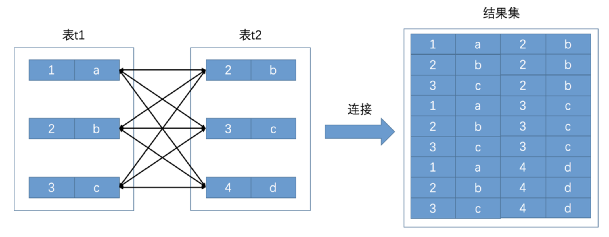

# 一、数据类型
## 1. 整数类型
> TINYINT:  8位<br>
> SMALLINT:  16位<br>
> MEDIUMINT:  24位<br>
> INT:  32位<br>
> BIGINT:  64位<br>

存储值的范围从 -2^(N-1) 到 2^(N-1) - 1

还有可选的UNSIGNED属性，表示不允许负值，存值范围就从 0 到 2^(N-1)，性能、存储空间都相同

MySQL可以为整数类型指定宽度，它不会限制值的合法范围，只是用来显示字符的个数


## 2. 实数类型
> DOUBLE: 64位 （默认）<br> 
> FLOAT: 32位 <br>
> DECIMAL: 允许最多65个数字


1. 如果你要表示的浮点型数据转成二进制之后能被32位float存储，或者可以容忍截断，则使用float，这个范围大概为要精确保存6位数字左右的浮点型数据
比如10分制的店铺积分可以用float存储，小商品零售价格(1000块之内)

2. 如果你要表示的浮点型数据转成二进制之后能被64位double存储，或者可以容忍截断，这个范围大致要精确到保存13位数字左右的浮点型数据
比如汽车价格,几千万的工程造价

3. 相比double，已经满足我们大部分浮点型数据的存储精度要求，如果还要精益求精，则使用decimal定点型存储
比如一些科学数据，精度要求很高的金钱

## 3. 字符串类型

### 3.1 普通字符串
> VARCHAR: 可变长字符串 （需额外的空间记录长度）<br>
> CHAR: 定长字符串 

VARCHAR适用场景: 
1. 字符串列的最大长度比平均长度大很多
2. 列更新少，所以碎片不是问题
3. 使用了复杂的字符集，每个字符都使用不同的字节数进行存储

CHAR适用场景:
1. 值的长度十分接近或一样，如密码的MD5值
2. 非常短的列，因为不用额外记录长度的字节
3. 经常变更的数据，因为不容易产生碎片


慷慨是不明智的，更长的列会消耗更多的内存，因为MySQL会分配固定大小的内存块来保存内部值


### 3.3 二进制字符串
BINARY和VARBINARY与CHAR和VARCHAR类似，他们存储的是二进制字符串，里面存储的是字节码<br>所以填充时，MySQL采用的是\0(零字节)而不是空格，而且检索时也不会去掉填充值


优势：
在比较BINARY字符串时，每次按一个字节，并且根据该字节的数值进行比较，所以比字符比较简单多，也更快

### 3.2 大数据字符串数据
1. 存储：BLOB和TEXT都是为存储很大的数据而设计的字符串数据类型，分别采用二进制和字符方式存储

2. 特殊处理：当它们太大时，InnoDB会"外部"存储区域存储实际的值，此时每个值在行内需要1～4个字节存储一个指针

3. 排序：只对每个列的最前max_sort_length字节而不是整个字符串做排序。可以减少max_sort_length配置或者用ORDER BY SUBSTRING(column, length)

小知识：如果EXPLAIN执行计划的Extra列包含"Using temporary"，则说明查询使用了隐式临时表


### 3.3 枚举
MySQL在内部会将每个值在列表中的位置保存为整数，并且在表的.frm文件中保存"数字-字符串"映射关系的查找表中

```mysql
CREATE TABLE enum_test(
    e ENUM('fish', 'apple', 'dog') NOT NULL
);

# 这三行数据实际存储为整数 1 3 2
INSERT INTO enum_test(e) VALUES('fish'), ('dog'), ('apple');
```

而且，枚举字段是按照内部存储的整数进行排序的

缺点：
1. 字符串列表是固定的，添加和删除字符串必须使用ALTER TABLE
2. 保存的是整数，必须要进行查找才能转换为字符串

### 3.4 BIT
BIT(1)定义一个包含单个位的字段，BIT(2)存储2个位，最大长度是64位

Memory和InnoDB为每个BIT列使用一个足够存储的最小整数类型来存放

MySQL把BIT当作字符串类型，而不是数字类型
```mysql
CREATE TABLE bittest(a bit(8));
INSERT INTO bittest VALUES(b'00111001');
SELECT a, a + 0 FROM bittest;
# 得到的是字符码为57的字符串，也就是得到ASCII码为57的字符"9"
# 但在数字上下文中，得到的是数字57
```

## 4. 日期和时间类型

- DATETIME

这个类型能保存大范围的值，从1001年到9999年，精度为秒，装到YYYYMMDDHHMMSS的整数中，与时区无关，使用8个字节的存储空间


- TIMESTAMP

只使用了4个字节的存储空间，只能表示1970年到2038年。它显示的值依赖时区

## 5. 选择标识符
当选择标识列的类型时，不仅仅需要考虑存储类型，还需要考虑MySQL对这种类型怎么执行计算和比较

一旦选定一种类型，要确保在所有关联表中都使用同样的类型

在可以满足值的范围的需求，并且预留未来增长空间的前提下，应选择最小的数据类型

### 1. 整数类型
整数通常是标识列最好的选择，因为很快而且可以使用AUTO_INCREMENT

### 2. 字符串类型
应该避免使用字符串类型作为标识列，因为它们很消耗空间，而且通常比数字类型慢

对于随机生成的字符串，会有两个问题
1. 因为插入值会随机写到索引的不同位置，导致INSERT变慢，页分裂、磁盘随机访问、产生聚簇索引碎片等问题
2. SELECT语句会变慢，因为逻辑上相邻的行会分布在磁盘和内存的不同地方，导致缓存赖以工作的访问局部性原理失效


## 二、范式与反范式
在范式化的数据库中，每个事实数据会出现并只出现一次。<br>
在反范式化的数据库中，信息是冗余的，可能会存储在多个地方

### 1. 范式
- 第一范式：表的每一列都是不可分割的原子数据项。理解为不能表中套表
```shell script
# 符合
| 字段1 | 字段2 |

# 不符合，不是关系型数据库
｜ 字段1 ｜      字段2       ｜
｜       ｜ 字段2.1 | 字段2.2 |
```
- 第二范式：表中的每个实例或记录必须可以被唯一地区分，并且不存在对主键的部分函数依赖。

```shell script
｜ id ｜ name ｜ age ｜ address｜ course | grade |
这里的主键是(学号, 课程号)，但是姓名、年龄、地址只要学号就可以决定，就说这三个属性对主键存在部分依赖

# 插入异常
# 删除异常
# 数据冗余
# 难以维护

拆成两张表，一张表只管一件事情

```

- 第三范式：属性不依赖于其它非主属性(消除传递依赖)
```shell script
| id | sal_level | salary |
工资依赖与工资级别，工资级别依赖与员工id，所以就存在传递依赖了

# 插入异常
# 删除异常
# 数据冗余
# 难以维护

拆表，一张表只做一件事
```

- BCNF范式：即在3NF基础上，消除主属性对候选码的部分函数依赖和传递函数依赖
```shell script
| repo_id | obj_id | admin_id | num |
# 一个管理员只在一个仓库工作，一个仓库可以存储多种物品

# 存在以下关系
#  （repo_id, obj_id） -> (admin_id, num)
#   (admin_id, obj_id) -> (repo_id, num)

既存在关键字段决定关键字段的情况

# 删除异常
# 插入异常
# 更新异常

拆表，分成两个关系表

```

### 2. 范式的优点缺点
优点：
- 更新操作通常比反范式快
- 重复数据较少或没有，修改的数据更少
- 表更小，可以更好地放在内存里，执行操作会更快
- 冗余数据较少，检索数据时不太需要DISTINCT或GROUP BY

缺点：
- 查询时需要连接多张，增加了查询复杂度
- 查询时需要连接多张表，降低了数据库的查询性能


### 3. 反范式

优点：
- 避免关联
- 冗余数据提高性能


## 三、MySQL架构与历史


- 最上层的服务用于连接处理、授权认证、安全等等
- 第二层为核心服务功能，比如查询解析、分析、优化、缓存以及内置函数，还有所有跨存储引擎的功能
- 第三层为存储引擎，负责MySQL中数据的存储和提取，不同的存储引擎bu hui


### 3.1 连接管理

客户端进程可以采用我们上边介绍的`TCP/IP`、`命名管道或共享内存`、`Unix域套接字`这几种方式之一来与服务器进程建立连接，每当有一个客户端进程连接到服务器进程时，服务器进程都会创建一个线程来专门处理与这个客户端的交互，当该客户端退出时会与服务器断开连接，服务器并不会立即把与该客户端交互的线程销毁掉，而是把它缓存起来，在另一个新的客户端再进行连接时，把这个缓存的线程分配给该新客户端


### 3.2 解析与优化

其中的几个比较重要的部分分别是`查询缓存`、`语法解析`和`查询优化`

#### 3.2.1 查询缓存

这个查询缓存可以在不同客户端之间共享，也就是说如果客户端A刚刚查询了一个语句，而客户端B之后发送了同样的查询请求，那么客户端B的这次查询就可以直接使用查询缓存中的数据

- 缓存不命中：如果两个查询请求在任何字符上的不同（例如：空格、注释、大小写），都会导致缓存不会命中

- 不缓存：如果查询请求中包含某些系统函数、用户自定义变量和函数、一些系统表，那这个请求就不会被缓存
- 缓存失效：MySQL的缓存系统会监测涉及到的每张表，只要该表的结构或者数据被修改，如对该表使用了`INSERT`、 `UPDATE`、`DELETE`、`TRUNCATE TABLE`、`ALTER TABLE`、`DROP TABLE`或 `DROP DATABASE`语句，那使用该表的所有高速缓存查询都将变为无效并从高速缓存中删除

#### 3.2.2 语法解析

如果查询缓存没有命中，接下来就需要进入正式的查询阶段了。因为客户端程序发送过来的请求只是一段文本而已，所以`MySQL`服务器程序首先要对这段文本做分析，判断请求的语法是否正确，然后从文本中将要查询的表、各种查询条件都提取出来放到`MySQL`服务器内部使用的一些数据结构上来。

#### 3.2.3 查询优化

因为我们写的`MySQL`语句执行起来效率可能并不是很高，`MySQL`的优化程序会对我们的语句做一些优化，如外连接转换为内连接、表达式简化，优化的结果就是生成一个执行计划，这个执行计划表明了应该使用哪些索引进行查询，表之间的连接顺序是啥样的

我们可以使用`EXPLAIN`语句来查看某个语句的执行计划


### 3.3 存储引擎

`MySQL`服务器把数据的存储和提取操作都封装到了一个叫`存储引擎`的模块里。物理上如何表示记录，怎么从表中读取数据，怎么把数据写入具体的物理存储器上，这都是`存储引擎`负责的事情

| 存储引擎    | 描述                                 |
| ----------- | ------------------------------------ |
| `ARCHIVE`   | 用于数据存档（行被插入后不能再修改） |
| `BLACKHOLE` | 丢弃写操作，读操作会返回空内容       |
| `CSV`       | 在存储数据时，以逗号分隔各个数据项   |
| `FEDERATED` | 用来访问远程表                       |
| `InnoDB`    | 具备外键支持功能的事务存储引擎       |
| `MEMORY`    | 置于内存的表                         |
| `MERGE`     | 用来管理多个MyISAM表构成的表集合     |
| `MyISAM`    | 主要的非事务处理存储引擎             |
| `NDB`       | MySQL集群专用存储引擎                |


### 3.4 常用字符集

| 字符集名称 | Maxlen |
| ---------- | ------ |
| `ascii`    | `1`    |
| `latin1`   | `1`    |
| `gb2312`   | `2`    |
| `gbk`      | `2`    |
| `utf8`     | `3`    |
| `utf8mb4`  | `4`    |


## 四、InnoDB的记录结构

`InnoDB`采取的方式是：将数据划分为若干个页，以页作为磁盘和内存之间交互的基本单位，InnoDB中页的大小一般为 ***16*** KB。也就是在一般情况下，一次最少从磁盘中读取16KB的内容到内存中，一次最少把内存中的16KB内容刷新到磁盘中


### 4.1 COMPACT行格式


一条完整的记录其实可以被分为`记录的额外信息`和`记录的真实数据`两大部分


#### 4.1.1 变长字段长度列表

变长字段中存储多少字节的数据是不固定的，所以我们在存储真实数据的时候需要顺便把这些数据占用的字节数也存起来，这样才不至于把`MySQL`服务器搞懵，所以这些变长字段占用的存储空间分为两部分：

1. 真正的数据内容
2. 占用的字节数


#### 4.1.2 NULL值列表

`Compact`行格式把这些值为`NULL`的列统一管理起来，存储到`NULL`值列表中

- 统计表中允许存储NULL的列有哪些
- 没有NULL值，NULL值列表不存在。否则将每个允许存储NULL的列队迎一个二进制位，二进制位按列的顺序逆序排列
- 因为NULL值列表必须用整数个字节的位表示，所以有必要的话，需要在字节的高位补0


#### 4.1.3 记录头信息

还有一个用于描述记录的`记录头信息`，它是由固定的`5`个字节组成。`5`个字节也就是`40`个二进制位，不同的位代表不同的意思

| 名称           | 大小（单位：bit） | 描述                                                         |
| -------------- | ----------------- | ------------------------------------------------------------ |
| `预留位1`      | `1`               | 没有使用                                                     |
| `预留位2`      | `1`               | 没有使用                                                     |
| `delete_mask`  | `1`               | 标记该记录是否被删除                                         |
| `min_rec_mask` | `1`               | B+树的每层非叶子节点中的最小记录都会添加该标记               |
| `n_owned`      | `4`               | 表示当前记录拥有的记录数                                     |
| `heap_no`      | `13`              | 表示当前记录在记录堆的位置信息                               |
| `record_type`  | `3`               | 表示当前记录的类型，`0`表示普通记录，`1`表示B+树非叶子节点记录，`2`表示最小记录，`3`表示最大记录 |
| `next_record`  | `16`              | 表示下一条记录的相对位置                                     |

- delete_mask

  这个属性标记着当前记录是否被删除，占用1个二进制位，值为`0`的时候代表记录并没有被删除，为`1`的时候代表记录被删除掉了。

  这些被删除的记录之所以不立即从磁盘上移除，是因为移除它们之后把其他的记录在磁盘上重新排列需要性能消耗，所以只是打一个删除标记而已，所有被删除掉的记录都会组成一个所谓的`垃圾链表`，在这个链表中的记录占用的空间称之为所谓的`可重用空间`，之后如果有新记录插入到表中的话，可能把这些被删除的记录占用的存储空间覆盖掉。

- min_rec_mask

  B+树的每层非叶子节点中的最小记录都会添加该标记

- n_owned

- record_type

  这个属性表示当前记录的类型，一共有4种类型的记录，`0`表示普通记录，`1`表示B+树非叶节点记录，`2`表示最小记录，`3`表示最大记录。从图中我们也可以看出来，我们自己插入的记录就是普通记录，它们的`record_type`值都是`0`，而最小记录和最大记录的`record_type`值分别为`2`和`3`

- next_record

  这玩意儿非常重要，它表示从当前记录的真实数据到下一条记录的真实数据的地址偏移量。比方说第一条记录的`next_record`值为`32`，意味着从第一条记录的真实数据的地址处向后找`32`个字节便是下一条记录的真实数据


### 4.2 行溢出数据

#### 4.2.1 VARCHAR(M)最多能存储的数据

对于`VARCHAR(M)`类型的列最多可以占用`65535`个字节。其中的`M`代表该类型最多存储的字符数量

我们为了存储一个`VARCHAR(M)`类型的列，其实需要占用3部分存储空间

- 真实数据
- 真实数据占用字节的长度
- NULL值表示，如果有NOT NULL，则可以没有这部分空间

如果该`VARCHAR`类型的列没有`NOT NULL`属性，那最多只能存储`65532`个字节的数据，因为真实数据的长度可能占用2个字节，`NULL`值标识需要占用1个字节


#### 4.2.2 记录中的数据太多产生的溢出

在`Compact`和`Redundant`行格式中，对于占用存储空间非常大的列，在`记录的真实数据`处只会存储该列的一部分数据，把剩余的数据分散存储在几个其他的页中，然后`记录的真实数据`处用20个字节存储指向这些页的地址


### 4.3 Page Directory (页目录)


页目录的制作过程

- 将所有正常的记录（包括最大和最小记录，不包括标记为已删除的记录）划分为几个组
- 每个组的最后一条记录的头信息中的n-owned属性表示该记录拥有几条记录
- 将每个组的最后一条记录的地址偏移量单独提取出来按顺序存储到靠近`页`的尾部的地方，这个地方就是所谓的`Page Directory`，也就是`页目录`（此时应该返回头看看页面各个部分的图）。页面目录中的这些地址偏移量被称为`槽`（英文名：`Slot`），所以这个页面目录就是由`槽`组成的

在一个数据页中查找指定主键值的记录的过程分为两步：

1. 通过二分法确定该记录所在的槽，并找到该槽所在分组中主键值最小的那条记录。
2. 通过记录的`next_record`属性遍历该槽所在的组中的各个记录


### 4.4 B+树索引

各个数据页可以组成一个`双向链表`，而每个数据页中的记录会按照主键值从小到大的顺序组成一个`单向链表`，每个数据页都会为存储在它里边儿的记录生成一个`页目录`，在通过主键查找某条记录的时候可以在`页目录`中使用二分法快速定位到对应的槽，然后再遍历该槽对应分组中的记录即可快速找到指定的记录


#### 4.4.1 没有索引的查找

##### 4.4.1.1 在一个页中的查找


- 以主键位搜索条件

可以在`页目录`中使用二分法快速定位到对应的槽，然后再遍历该槽对应分组中的记录即可快速找到指定的记录


- 以其他列作为搜索条件

在数据页中并没有对非主键列建立所谓的`页目录`，所以我们无法通过二分法快速定位相应的`槽`。这种情况下只能从`最小记录`开始依次遍历单链表中的每条记录，然后对比每条记录是不是符合搜索条件


##### 4.4.1.2 在很多页中查找

1. 定位到记录所在的页。
2. 从所在的页内中查找相应的记录

**在没有索引的情况下**，不论是根据主键列或者其他列的值进行查找，由于我们并不能快速的定位到记录所在的页，所以**只能从第一个页沿着双向链表一直往下找**，在每一个页中根据我们刚刚唠叨过的查找方式去查找指定的记录


#### 4.4.2 InnoDB中的索引方案

`InnoDB`怎么区分一条记录是普通的`用户记录`还是`目录项记录`呢？别忘了记录头信息里的`record_type`属性，它的各个取值代表的意思如下

- `0`：普通的用户记录
- `1`：目录项记录
- `2`：最小记录
- `3`：最大记录


#### 4.4.3 B+树索引适用的条件

- 全值匹配
- 匹配左边的列
- 匹配列前缀
- 匹配范围值
- 精确匹配某一列并范围匹配另外一列
- 用于排序
  - 不可以使用索引进行排序的几种情况：
  - ASC、DESC混用
  - 排序列包含非同一个索引的列
  - 排序列使用了复杂的表达式
- 用于分组


#### 4.4.4 回表

索引`idx_name_birthday_phone_number`对应的`B+`树中的记录首先会按照`name`列的值进行排序，所以值在`Asa`～`Barlow`之间的记录在磁盘中的存储是相连的，集中分布在一个或几个数据页中，我们可以很快的把这些连着的记录从磁盘中读出来，这种读取方式我们也可以称为`顺序I/O`。根据第1步中获取到的记录的`id`字段的值可能并不相连，而在聚簇索引中记录是根据`id`（也就是主键）的顺序排列的，所以根据这些并不连续的`id`值到聚簇索引中访问完整的用户记录可能分布在不同的数据页中，这样读取完整的用户记录可能要访问更多的数据页，这种读取方式我们也可以称为`随机I/O`。一般情况下，顺序I/O比随机I/O的性能高很多


需要回表的记录越多，使用二级索引的性能就越低，甚至让某些查询宁愿使用全表扫描也不使用`二级索引`


那什么时候采用全表扫描的方式，什么时候使用采用`二级索引 + 回表`的方式去执行查询呢？这个就是传说中的查询优化器做的工作，**查询优化器会事先对表中的记录计算一些统计数据，然后再利用这些统计数据根据查询的条件来计算一下需要回表的记录数，需要回表的记录数越多，就越倾向于使用全表扫描，反之倾向于使用`二级索引 + 回表`的方式**


#### 4.4.5 覆盖索引

我们把这种只需要用到索引的查询方式称为`索引覆盖`。排序操作也优先使用`覆盖索引`的方式进行查询


#### 4.4.6 如何挑选索引

- 只为用于搜索、排序或分组的列创建索引
- 为列的基数大的列创建索引
- 索引列的类型尽量小
- 可以只对字符串值的前缀建立索引
- 只有索引列在比较表达式中单独出现才可以适用索引
- 为了尽可能少的让`聚簇索引`发生页面分裂和记录移位的情况，建议让主键拥有`AUTO_INCREMENT`属性。
- 定位并删除表中的重复和冗余索引
- 尽量使用`覆盖索引`进行查询，避免`回表`带来的性能损耗。


## 五、单表的访问方法

### 1. 访问方法（access method）的概念

#### 1.1 const 常数级别

- 直接利用**主键值**在聚簇索引中定位对应的用户记录
- 根据**唯一二级索引**列来定位一条记录

这种`const`访问方法只能在主键列或者唯一二级索引列和一个常数进行等值比较时才有效，如果主键或者唯一二级索引是由多个列构成的话，索引中的每一个列都需要与常数进行等值比较，这个`const`访问方法才有效（这是因为只有该索引中全部列都采用等值比较才可以定位唯一的一条记录）


#### 1.2 ref

对某个普通的二级索引列与常数进行等值比较

``````
SELECT * FROM single_table WHERE key1 = 'abc';
``````

可以选择全表扫描来逐一对比搜索条件是否满足，也可以使用二级索引找到对应的id值，再回表

把这种搜索条件为二级索引列与常数等值比较，采用二级索引来执行查询的访问方法称为：`ref`

- 二级索引列值为NULL的情况
  - 不论是普通的二级索引，还是唯一二级索引，它们的索引列对包含`NULL`值的数量并不限制，所以我们采用`key IS NULL`这种形式的搜索条件最多只能使用`ref`的访问方法，而不是`const`的访问方
- 对于某个包含多个索引列的二级索引来说，只要是最左边的连续索引列是与常数的等值比较就可能采用`ref`的访问方法


#### 1.3 ref_or_null

不仅想找出某个二级索引列的值等于某个常数的记录，还想把该列的值为`NULL`的记录也找出来，就像下边这个查询：

```
SELECT * FROM single_table WHERE key1 = 'abc' OR key1 IS NULL;
```


#### 1.4 range

利用索引进行范围匹配的访问方法称之为：`range`

```
SELECT * FROM single_table WHERE key2 IN (1438, 6328) OR (key2 >= 38 AND key2 <= 79);
```

我们可以把那种索引列等值匹配的情况称之为`单点区间`，上边所说的`范围1`和`范围2`都可以被称为单点区间，像`范围3`这种的我们可以称为连续范围区间


#### 1.5 index

采用遍历二级索引记录的执行方式称之为：`index`

```
SELECT key_part1, key_part2, key_part3 FROM single_table WHERE key_part2 = 'abc';
```

- 它的查询列表只有3个列：`key_part1`, `key_part2`, `key_part3`，而索引`idx_key_part`又包含这三个列。
- 搜索条件中只有`key_part2`列。这个列也包含在索引`idx_key_part`中。


#### 1.6 all

使用全表扫描执行查询的方式称之为：`all`。


### 2. 注意事项

#### 2.1 二级索引 + 回表

一般情况下只能利用单个二级索引执行查询

```
SELECT * FROM single_table WHERE key1 = 'abc' AND key2 > 1000;
```


优化器一般会根据`single_table`表的统计数据来判断到底使用哪个条件到对应的二级索引中查询扫描的行数会更少，选择那个扫描行数较少的条件到对应的二级索引中查询

这里假设优化器决定使用`idx_key1`索引进行查询，那么整个查询过程可以分为两个步骤：

- 使用二级索引定位记录的阶段，也就是根据条件`key1 = 'abc'`从`idx_key1`索引代表的`B+`树中找到对应的二级索引记录
- 回表阶段，也就是根据上一步骤中找到的记录的主键值进行`回表`操作，也就是到聚簇索引中找到对应的完整的用户记录，再根据条件`key2 > 1000`到完整的用户记录继续过滤。将最终符合过滤条件的记录返回给用户

**二级索引的节点中的记录只包含索引列和主键，所以在步骤1中使用`idx_key1`索引进行查询时只会用到与`key1`列有关的搜索条件**，其余条件，比如`key2 > 1000`这个条件在步骤1中是用不到的，只有在步骤2完成回表操作后才能继续针对完整的用户记录中继续过滤


#### 2.2 明确range访问方法使用的范围区间

其实对于`B+`树索引来说，只要索引列和常数使用`=`、`<=>`、`IN`、`NOT IN`、`IS NULL`、`IS NOT NULL`、`>`、`<`、`>=`、`<=`、`BETWEEN`、`!=`（不等于也可以写成`<>`）或者`LIKE`操作符连接起来，就可以产生一个所谓的`区间`


**当我们想使用`range`访问方法来执行一个查询语句时，重点就是找出该查询可用的索引以及这些索引对应的范围区间**


#### 2.3  有的搜索条件无法使用索引的情况

```
SELECT * FROM single_table WHERE key2 > 100 AND common_field = 'abc';
```

个查询语句中能利用的索引只有`idx_key2`一个，而`idx_key2`这个二级索引的记录中又不包含`common_field`这个字段，所以在使用二级索引`idx_key2`定位记录的阶段用不到`common_field = 'abc'`这个条件，这个条件是在回表获取了完整的用户记录后才使用的，而`范围区间`是为了到索引中取记录中提出的概念，所以在确定`范围区间`的时候不需要考虑`common_field = 'abc'`这个条件，我们在为某个索引确定范围区间的时候只需要把用不到相关索引的搜索条件替换为`TRUE`就好了。


#### 2.4 复杂都锁条件下找出范围匹配的区间

```SELECT * FROM single_table WHERE         (key1 > 'xyz' AND key2 = 748 ) OR        (key1 < 'abc' AND key1 > 'lmn') OR        (key1 LIKE '%suf' AND key1 > 'zzz' AND (key2 < 8000 OR common_field = 'abc')) ;```


### 3. 索引合并

#### 3.1 Intersection合并

某个查询可以使用多个二级索引，将从多个二级索引中查询到的结果取交集 


虽然读取多个二级索引比读取一个二级索引消耗性能，但是读取二级索引的操作是`顺序I/O`，而回表操作是`随机I/O`，所以如果只读取一个二级索引时需要回表的记录数特别多，而读取多个二级索引之后取交集的记录数非常少，当节省的因为`回表`而造成的性能损耗比访问多个二级索引带来的性能损耗更高时，读取多个二级索引后取交集比只读取一个二级索引的成本更低


只有在以下情况才可能会使用到Intersection索引合并：

- 二级索引列是等值匹配的情况，对于联合索引来说，在联合索引中的每个列都必须等值匹配
- 主键列可以是范围匹配


之所以在二级索引列都是等值匹配的情况下才可能使用`Intersection`索引合并，是因为只有在这种情况下根据二级索引查询出的结果集是按照主键值排序的

> 小贴士： 按照有序的主键值去回表取记录有个专有名词儿，叫：Rowid Ordered Retrieval，简称ROR，以后大家在某些地方见到这个名词儿就眼熟了。


#### 3.2 Union合并

`Intersection`是交集的意思，这适用于使用不同索引的搜索条件之间使用`AND`连接起来的情况；

`Union`是并集的意思，适用于使用不同索引的搜索条件之间使用`OR`连接起来的情况


只有在以下情况才可能会使用到Union索引合并：

- 二级索引列是等值匹配的情况，对于联合索引来说，在联合索引中的每个列都必须等值匹配，不能出现只出现匹配部分列的情况
- 主键列可以是范围匹配
- 使用`Intersection`索引合并的搜索条件


#### 3.3 Sort-Union合并

Sort-Union的适用场景是单独根据搜索条件从某个二级索引中获取的记录数比较少，这样即使对这些二级索引记录按照主键值进行排序的成本也不会太高 而Intersection索引合并的适用场景是单独根据搜索条件从某个二级索引中获取的记录数太多，导致回表开销太大，合并后可以明显降低回表开销，但是如果加入Sort-Intersection后，就需要为大量的二级索引记录按照主键值进行排序，这个成本可能比回表查询都高了，所以也就没有引入Sort-Intersection这个玩意儿


## 六、连接的原理

#### 1. 连接简介

##### 1.1 连接的本质

`连接`的本质就是把各个连接表中的记录都取出来依次匹配的组合加入结果集并返回给用户



##### 1.2 连接查询的过程

```
SELECT * FROM t1, t2 WHERE t1.m1 > 1 AND t1.m1 = t2.m2 AND t2.n2 < 'd';
```


#### 2. 内连接和外连接

- 对于`内连接`的两个表，驱动表中的记录在被驱动表中找不到匹配的记录，该记录不会加入到最后的结果集
- 对于`外连接`的两个表，驱动表中的记录即使在被驱动表中没有匹配的记录，也仍然需要加入到结果集
  - 左外连接：选取左侧的表为驱动表。
  - 右外连接：选取右侧的表为驱动表
  - 对于外连接的驱动表的记录来说，如果无法在被驱动表中找到匹配`ON`子句中的过滤条件的记录，那么该记录仍然会被加入到结果集中，对应的被驱动表记录的各个字段使用`NULL`值填充。


一般情况下，我们都把只涉及单表的过滤条件放到`WHERE`子句中，把涉及两表的过滤条件都放到`ON`子句中，我们也一般把放到`ON`子句中的过滤条件也称之为`连接条件`


### 3. 连接的原理

#### 3.1 嵌套循环连接

- 选取驱动表，使用与驱动表相关的过滤条件，选取代价最低的单表访问方法来执行对驱动表的单表查询
- 对上一步骤中查询驱动表得到的结果集中每一条记录，都分别到被驱动表中查找匹配的记录。

#### 3.2 使用索引加快连接速度

#### 3.3 基于块的嵌套循环连接


## 七、基于规则优化


## 八、Explain

### 1. 执行计划输出中各列详解

#### 1.1 


## 九、事务

事务是一个抽象的概念，对于数据库来说，它对应着一个或多个操作

### 1. 事务的四个特性

#### 1.1 原子性

事务的原子性是指事务里面操作，要么全部成功，要么全部失败。

#### 1.2 隔离性

事务的隔离性是指， 一个事务未提交之前，所做的操作，另一个事务不可见

#### 1.3 一致性

事务的一致性是指，事务不能破坏数据的完整性和业务上的一致性

#### 1.4 持久性

持久性是指，事务一旦提交了，那么对数据的更改是永久的


## 十、redo日志

### 10.1 redo日志是啥

**`redo`日志本质上只是记录了一下事务对数据库做了哪些修改**

首先我们先明确一下InnoDB的修改数据的基本流程，当我们想要修改DB上某一行数据的时候，InnoDB是把数据从磁盘读取到内存的缓冲池上进行修改。这个时候数据在内存中被修改，与磁盘中相比就存在了差异，我们称这种有差异的数据为**脏页**


假如这些脏页还没写入到磁盘，服务器就出故障了，那么刚才做的修改也就跟着丢失了。


那如何保证这个持久性呢？在事务提交之前，把该事务所修改的页面都刷新到磁盘，但这个简单粗暴的做法有些问题

- 刷新一个完整的数据页太浪费了。有时候仅仅修改了一个字节，就把整个16KB的页刷新到磁盘，有点浪费
- 随机IO刷起来慢。一个事务可能包含很多语句，修改的页面可能不相邻，那么从缓冲池里刷新到磁盘时，需要进行很多的随机IO


怎么解决呢？**在事务提交的时候，把修改的记录刷新到磁盘，即使系统奔溃了，重启之后按记录的步骤重新更新一下数据页就好了。保存这些修改记录的文件就叫重做日志（redo log）**

- redo日志占用的空间小，只存储了表空间ID、页号、偏移量以及需要更新的值
- redo日志时顺序写入磁盘的。每执行一条语句，就可能产生若干条redo日志，这些日志是按照产生的顺序写入磁盘的，也就是使用顺序IO


### 10.2 redo日志格式


### 10.3 redo日志缓冲区

为了解决磁盘速度过慢的问题而引入了`Buffer Pool`。同理，写入`redo`日志时也不能直接直接写到磁盘上，实际上在服务器启动时就向操作系统申请了一大片称之为`redo log buffer`的连续内存空间

redo日志被刷新到磁盘里的情况：

- log buffer空间不足时。当写入log buffer的redo日志量已经占满了log buffer总容量的一半左右，就需要把这些日志刷新到磁盘上
- 事务提交时。事务提交时可以不把修改过的Buffer Pool页面刷新到磁盘，但是为了保证持久性，必须要把修改这些页面对应的redo日志刷新到磁盘
- 后台新城不停的刷。后台有一个线程，大约每秒都会刷新一次log bffer中的redo日志到磁盘
- 正常关闭服务器时


## 十一、undo日志

**undo日志就是为了回滚而记录对数据的改动，所以查询语句不回生成undo日志**

**只有在事务对表中的记录做改动时才会为这个事务分配一个唯一的事物id**


### 11.1 事务id是怎么生成的

事务id本质上是一个数字，与row_id的分配策略大抵相同

- 服务器会在内存中维护一个全局变量，每当需要为事务分配一个事务id时，就会把该变量的值当作事务id分配给该事务，并且变量自增1
- 每当这个变量的值为256的倍数时，就会将该变量的值刷新到系统表空间的页号为`5`的页面中一个称之为`Max Trx ID`的属性处，这个属性占用`8`个字节的存储空间
- 当系统下一次重新启动时，会将上边提到的`Max Trx ID`属性加载到内存中，将该值加上256之后赋值给我们前边提到的全局变量


事务id记录在聚簇索引记录里的trx_id，就是某个对这个聚簇索引记录做改动的语句所在的事务对应的`事务id`而已


### 11.2 undo日志的格式

为了实现事务的`原子性`，`InnoDB`存储引擎在实际进行增、删、改一条记录时，都需要先把对应的`undo日志`记下来


- undo no在一个事务中是从0开始递增的
- 


## 十二、MVCC原理

### 1. 版本链

- trx_id: 每次一个事务对某条聚簇索引记录进行改动时，都会把该事务的事物id赋值给trx_id隐藏列
- roll_pointer: 每次对某条聚簇索引记录进行改动时，都会把旧的版本写入到undo日志，然后这个隐藏列相当于一个指针，可以通过它找到该记录修改前的信息


### 2. ReadView

因为Read Commited 和 Repeatable Read都必须保证读到已经提交了事务修改过的记录，所以，**需要判断一下版本链中的哪个版本时当前事务可见的**


#### 2.1 ReadView包含的内容

- m_ids: 表示生成ReadView时当前系统中活跃的读写事务的事物id列表
- min_trx_id: 表示在生成ReadView时当前系统中活跃的读写事务中最小的`事务id`，也就是`m_ids`中的最小值
- `max_trx_id`：表示生成`ReadView`时系统中应该分配给下一个事务的`id`值
- creator_trx_id：表示生成该ReadView的事务的事务id


#### 2.2 ReadView判断的步骤

- 如果被访问版本的`trx_id`属性值与`ReadView`中的`creator_trx_id`值相同，意味着当前事务在访问它自己修改过的记录，所以该版本可以被当前事务访问。
- 如果被访问版本的`trx_id`属性值小于`ReadView`中的`min_trx_id`值，表明生成该版本的事务在当前事务生成`ReadView`前已经提交，所以该版本可以被当前事务访问。
- 如果被访问版本的`trx_id`属性值大于或等于`ReadView`中的`max_trx_id`值，表明生成该版本的事务在当前事务生成`ReadView`后才开启，所以该版本不可以被当前事务访问。
- 如果被访问版本的`trx_id`属性值在`ReadView`的`min_trx_id`和`max_trx_id`之间，那就需要判断一下`trx_id`属性值是不是在`m_ids`列表中，如果在，说明创建`ReadView`时生成该版本的事务还是活跃的，该版本不可以被访问；如果不在，说明创建`ReadView`时生成该版本的事务已经被提交，该版本可以被访问。

如果某个版本的数据对当前事务不可见的话，那就顺着版本链找到下一个版本的数据，继续按照上边的步骤判断可见性，依此类推，直到版本链中的最后一个版本。如果最后一个版本也不可见的话，那么就意味着该条记录对该事务完全不可见，查询结果就不包含该记录。


#### 2.3 RC生成ReadView的时机

**使用READ COMMITTED隔离级别的事务在每次查询开始时都会生成一个独立的ReadView**


#### 2.4 RR生成ReadView的时机

在第一次读取数据时生成一个ReadView


## 十二、锁

### 1. 行锁

#### 1.1 Record Locks

记录锁可以分为共享记录锁（S锁）和排他记录锁（X锁）

#### 1.2 Gap Locks

MySQL在Repeatable Read采用间隙锁来解决幻读。


#### 1.3 Next-Key Locks

就是记录锁和间隙锁的结合体，既能保护该条记录，又能阻止别的事物将新纪录插入被保护记录前边的间隙

#### 1.4 Insert Intention Locks


### 2. 锁结构