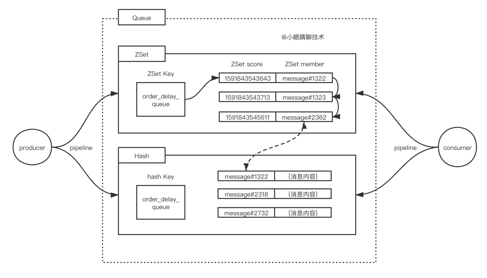
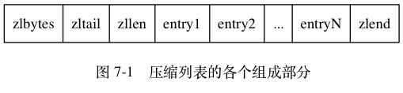
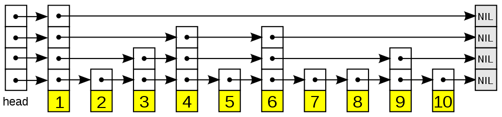

### 一、Redis更新策略

#### 1. 先删缓存，再更新数据库

并发场景存在问题

- 操作A，删除缓存，还没更新数据库
- 操作B，这时候去查询，发现没有命中缓存，就去读取数据库

那么旧的数据就会被缓存起来，导致后续的查询都是脏数据

#### 2. 先更新数据库，再删缓存（常用做法）

并发场景也会存在问题，概率小

- 操作A，没有命中缓存，查询数据库，这时候，查询的值还没写入到缓存
- 操作B，更新数据库，删除缓存

这时候操作A查询的值就是脏数据了

##### 2.1 更新数据库成功，删除缓存失败导致数据不一致怎么办

- 重试删除缓存的操作
- 延迟双删

#### 3. 更新数据库，然后更新缓存

也会存在问题

- 操作A更新了数据库，这时候还没更新缓存
- 操作B也更新了数据库，把值写入了缓存中

这时候操作A才更新值，那么更新的值就会出现问题

### 二、Redis查询问题

#### 1. 缓存穿透

缓存穿透就是指，**查询某些key的时候，缓存和数据库都没有命中，而这些空的值又不会保存起来**，导致每次请求，都会去请求数据库

解决方案

- 把这些空值缓存起来
- 提供一个能迅速判断请求是否有效的拦截机制。比如布隆过滤器

#### 2. 缓存击穿

缓存击穿是指，某个Key失效了，在生成新的缓存之前，有大量的请求落到了数据库上

解决方案

- 定时更新缓存中过期的Key，适用于热点数据的，而且Key比较固定的
- 懒更新。查询的时候，更新过期时间小于一定值的Key
- 互斥锁。缓存失效，更新时，其他线程阻塞等待更新结果

#### 3. 缓存雪崩

缓存在同一时刻大面积的失效，类似雪崩，这时候又来一波请求，导致请求全落到数据库上

解决方案：

- 给过期时间增加一个随机值，避免集体失效
- 加互斥锁或者用队列，来保证缓存单进程写

### 三、缓存删除策略

#### 1. 定时删除

在设置expire过期时间时，会创建一个定时器，当key到了过期时间时，就会立即删除

- 优点：对内存友好
- 缺点：对CPU时间不友好

#### 2. 惰性删除

只有在获取键时才对键进行过期检查，不会在删除其它无关的过期键花费过多的CPU时间

- 优点：对CPU友好
- 缺点：对内存不友好

#### 3. 定期删除

每隔一段时间，我们就对一些key进行检查，删除里面过期的key

- 优点：可以通过限制删除操作执行的时长和频率来减少删除操作对 CPU 的影响。另外定期删除，也能有效释放过期键占用的内存
- 缺点：难以确定删除操作执行的时长和频率

#### 4. 内存淘汰策略

| 策略            | 描述                                                 |
| --------------- | ---------------------------------------------------- |
| volatile-lru    | 从已设置过期时间的数据集中挑选最近最少使用的数据淘汰 |
| volatile-ttl    | 从已设置过期时间的数据集中挑选将要过期的数据淘汰     |
| volatile-random | 从已设置过期时间的数据集中任意选择数据淘汰           |
| allkeys-lru     | 从所有数据集中挑选最近最少使用的数据淘汰             |
| allkeys-random  | 从所有数据集中任意选择数据进行淘汰                   |
| noeviction      | 禁止驱逐数据                                         |

使用 Redis 缓存数据时，为了提高缓存命中率，需要保证缓存数据都是热点数据。可以将内存最大使用量设置为热点数据占用的内存量，然后启用 allkeys-lru 淘汰策略，将最近最少使用的数据淘汰

Redis 4.0 引入了 volatile-lfu 和 allkeys-lfu 淘汰策略，**LFU 策略通过统计访问频率，将访问频率最少的键值对淘汰**。

# 四、Redis持久化

有两种持久化的方式：快照文件（RDB）和追加式文件（AOF）

- RDB会在一个特定的时间间隔保存那个时间点的一个数据快照
- AOF持久化则会记录每个服务器收到的写操作。在服务启动时，这些记录的操作会逐条执行从而重建出原来的数据

## 1. RDB

### 1.1 工作原理

- 调用fork()，产生一个子进程
- 子进程把数据写到一个临时的RDB文件
- 当子进程写完新的RDB文件后，把旧的RDB文件替换掉

### 1.2 优点

- RDB的性能很好，需要进行持久化时，主进程会fork一个子进程出来，然后把持久化的工作交给子进程，自己不会有相关的I/O操作
- RDB文件是一个很简洁的单文件，它保存了某个时间点的Redis数据，很适合用于做备份。你可以设定一个时间点对RDB文件进行归档，这样就能在需要的时候很轻易的把数据恢复到不同的版本

### 1.3 缺点

- RDB容易造成数据的丢失。假设每5分钟保存一次快照，如果Redis因为某些原因不能正常工作，那么从上次产生快照到Redis出现问题这段时间的数据就会丢失了。

- RDB使用`fork()`产生子进程进行数据的持久化，如果数据比较大的话可能就会花费点时间，造成Redis停止服务几毫秒。如果数据量很大且CPU性能不是很好的时候，停止服务的时间甚至会到1秒。

  

## 2. AOF

每当Redis接受到会修改数据集的命令时，就会把命令追加到AOF文件里，当你重启Redis时，AOF里的命令会被重新执行一次，重建数据

### 2.1 重写原理

- Redis调用fork()，产生一个子进程。
- 子进程把新的AOF写到一个临时文件里。
- 主进程持续把新的变动写到内存里的buffer，同时也会把这些新的变动写到旧的AOF里，这样即使重写失败也能保证数据的安全。
- 当子进程完成文件的重写后，主进程会获得一个信号，然后把内存里的buffer追加到子进程生成的那个新AOF里

### 2.2 优点

- 比RDB可靠。你可以制定不同的fsync策略：不进行fsync、每秒fsync一次和每次查询进行fsync。默认是每秒fsync一次。这意味着你最多丢失一秒钟的数据
- AOF日志文件是一个纯追加的文件。就算是遇到突然停电的情况，也不会出现日志的定位或者损坏问题。甚至如果因为某些原因（例如磁盘满了）命令只写了一半到日志文件里，我们也可以用`redis-check-aof`这个工具很简单的进行修复
- 当AOF文件太大时，Redis会自动在后台进行重写。重写很安全，因为重写是在一个新的文件上进行，同时Redis会继续往旧的文件追加数据。新文件上会写入能重建当前数据集的最小操作命令的集合。当新文件重写完，Redis会把新旧文件进行切换，然后开始把数据写到新文件上

### 2.3 缺点

- 在相同的数据集下，AOF文件的大小一般会比RDB文件大。
- 在某些fsync策略下，AOF的速度会比RDB慢。通常fsync设置为每秒一次就能获得比较高的性能，而在禁止fsync的情况下速度可以达到RDB的水平。

### 2.4 写后数据保存

AOF属于写后日志，就是想让系统执行命令，只有命令能执行成功，才会被记录到日志中

好处：

- 避免记录错误命令
- **不会阻塞当前的写操作**

风险：（都是跟磁盘相关）

- 丢失风险，执行完命令还没记录就宕机
- 虽然避免了当前命令的阻塞，但可能会给下一个操作带来阻塞风险。因为AOF日志也是在主线程中执行的，如果把日志文件写入磁盘时，磁盘写压力大，就导致写盘很慢

### 2.5 写回策略 (按需选择)

- Always，同步写回：每个写命令执行完，立马同步地将日志写回磁盘
- Everysec，每秒写回：每个写命令执行完，只是先把日志写到AOF文件的内存缓冲区，每隔一秒把缓冲区中的内容写入磁盘
- No，操作系统控制的写回：每个写命令执行完，只是先把日志写到AOF文件的内存缓冲区，由操作系统决定何时将缓冲区内容写回磁盘

### 2.6  AOF文件太大了

太大会带来什么问题：

- 文件系统本身对文件大小有限制
- 追加命令记录效率变低
- 恢复数据时缓慢

#### 2.6.1  AOF重写机制

AOF文件重写并不需要对现有的AOF进行任何读取、分析或者写入操作，这个功能是**通过读取服务器当前的数据库状态来实现的**

首先从数据库中读取键现在的值，然后用一条命令去记录键值对，代替之前记录这个键值对的多条命令

当键包含的元素数量、或者列表键超过64个（常量值），重写程序会用多条RPUSH命令来保存这个列表

#### 2.6.2  AOF后台重写

AOF重写程序放到子进程里执行，这样做可以同时达到两个目的

- AOF重写期间，服务器进程可以继续处理命令请求
- 子进程带有服务器进程的数据副本，使用子进程而不是线程，可以避免使用锁的情况下，保证数据的安全性

服务器进程可以处理新的命令，如何解决子进程与服务器进程数据不一致的问题

 **同时将这个命令写入到AOF缓冲区和AOF重写缓冲区**

**只有在信号处理函数执行时会对服务器进程造成阻塞**

当子进程完成AOF重写工作之后，它会向父进程发送一个信号，之后父进程会调用一个信号处理函数：

- 将AOF重写缓冲区中的所有内容写入到新的AOF文件中，此时新AOF文件保存数据库状态和当前服务器数据库状态一致
- 对新的AOF文件进行改名，原子地覆盖现有的AOF文件，完成新旧两个AOF文件的替换

### 五、为什么Redis单线程也能这么高效

Redis的网络IO和键值对读写是由一个线程来完成的，但其他如持久化、异步删除、集群数据同步等，其实是由额外的线程执行的

#### 1. 纯内存操作

Redis将所有数据放在内存中，内存的响应时长大约为100纳秒。

#### 2. 核心是基于非阻塞的IO多路复用机制

Redis使用epoll作为I/O多路复用技术的实现。多路指多个网络连接，复用指复用同一个线程，空闲时阻塞当前线程，有I/O流事件时，就从阻塞态中唤醒，用epoll轮询正在发生了事件的流，并依次执行

#### 3. 单线程避免了线程切换和竞态产生的消耗

为什么是单线程？1. Redis基于内存操作的，CPU并不是Redis的瓶颈，瓶颈可能是内存大小或网络带宽。2. 单线程实现容易

Redis6.0 引入多线程主要是为了提高网络 IO 读写性能，因为这个算是 Redis 中的一个性能瓶颈（Redis 的瓶颈主要受限于内存和网络）。虽然，Redis6.0 引入了多线程，但是 Redis 的多线程只是在网络数据的读写这类耗时操作上使用了， 执行命令仍然是单线程顺序执行。因此，你也不需要担心线程安全问题

#### 4. 多线程的开销

**多线程编程模式面临的共享资源的并发访问控制问题**。为了保证共享资源的正确性，就需要有额外的机制进行保证，而这个额外的机制，就会带来额外的开销

### 六、ZSet 的应用场景是什么

#### 1. 延迟队列

zset 会按 score 进行排序，如果 score 代表想要执行时间的时间戳。在某个时间将它插入 zset 集合中，它变会按照时间戳大小进行排序，也就是对执行时间前后进行排序

起一个死循环线程不断地进行取第一个 key 值，如果当前时间戳大于等于该 key 值的 score 就将它取出来进行消费删除，可以达到延时执行的目的（类似非阻塞IO）

如何优化： 采用epoll的方式，事件驱动

没有ack机制，消费失败了怎么办：消费失败，重新将消息放回redis中即可

#### 2. 排行榜

我们以当前小时的时间戳作为 zset 的 key，把贴子ID 作为 member ，点击数评论数等作为 score，当 score 发生变化时更新 score。利用 `ZREVRANGE` 或者 `ZRANGE` 查到对应数量的记录

#### 3. 限流

滑动窗口是限流常见的一种策略。如果我们把一个用户的 ID 作为 key 来定义一个 zset ，member 或者 score 可以都为访问时的时间戳。我们只需统计某个 key 下在指定时间戳区间内的个数，就能得到这个用户滑动窗口内访问频次，与最大通过次数比较，来决定是否允许通过

### 七、数据类型

| 数据类型 | 可以存储的值           | 操作                                                         | 数据结构                                                     | 数据结构                                            |
| -------- | ---------------------- | ------------------------------------------------------------ | ------------------------------------------------------------ | --------------------------------------------------- |
| STRING   | 字符串、整数或者浮点数 | 对整个字符串或者字符串的其中一部分执行操作对整数和浮点数执行自增或者自减操作 | int：整数值且可被long表示                                    | sds 简单动态字符串：字符串值且大于32字节，用raw编码 |
| LIST     | 列表                   | 从两端压入或者弹出元素 对单个或者多个元素进行修剪，只保留一个范围内的元素 | 压缩列表 ZipList：所有字符串长度小于64字节，且元素数量小于512个 | 双向列表Linkedlist                                  |
| SET      | 无序集合               | 添加、获取、移除单个元素检查一个元素是否存在于集合中计算交集、并集、差集从集合里面随机获取元素 | intset 整型集合：所有元素都是整数值且数量小于512个           | 字典hashtable                                       |
| HASH     | 包含键值对的无序散列表 | 添加、获取、移除单个键值对获取所有键值对检查某个键是否存在   | 压缩列表：键值长度小于64字节且数量小于512个                  | 字典hashtable                                       |
| ZSET     | 有序集合               | 添加、获取、删除元素根据分值范围或者成员来获取元素计算一个键的排名 | 压缩列表：元素个数小于128个且长度小于64字节                  | 跳表skiplist                                        |

#### 1. String

##### 1.1 编码形式

int：8个字节的长整数

embstr: 小于等于39字节的字符串

raw：大于39个字节的字符串

> 为什么是39个字节

##### 1.2 典型使用场景

- 计数
- 缓存
- 共享Session

##### 1.3  为什么不考虑直接使用C语言字符串

C语言使用了长度为N+1的字符数组来表示长度为N的字符串，最后一个元素为/0

会有以下问题

- 获取字符串长度的时间复杂度为O(n)
- 执行拼接或者缩短操作时，操作不当容易引起缓冲区溢出或者内存泄漏
- 只能保存文本，如果中间出现\0则可能会误判

##### 1.3 特点

- 常数复杂度获取字符串长度**。SDS在len属性中记录了SDS本身的长度。

- 杜绝缓冲区溢出。

- 空间预分配和惰性空间释放

- 二进制安全

- 兼容部分C字符串函数

#### 2. Hash

在Redis中，哈希类型是一个string类型的field和value的映射表，hash特别适合用于存储对象，每个哈希可以存储2的32次方-1个键值对

##### 2.1 编码形式

- ziplist 压缩列表：当哈希类型元素个数小于hash-max-ziplist-entries配置(默认521个)，同时所有值都小于hash-max-ziplist-value配置(默认64字节)时，Redis会使用ziplist作为哈希的内部实现
- hashtable 哈希表：当哈希类型无法满足ziplist的条件时， Redis会使用hashtable作为内部实现，因为此时ziplist的读写效率会下降

##### 2.2 应用场景

存储对象，存储常用的属性，比整个存储整个字符串要高效以及节省内存 

##### 2.3 渐进式hash

Redis的哈希表使用了链地址法来解决键冲突。

Redis对字典的哈希表执行 rehash 的步骤：

- 为字典的 ht[1] 分配空间，空间大小根据执行的操作以及 ht[0].used 决定

- 将ht[0]保存的键值对rehash到 ht[1] 上

-  迁移完成后，释放 ht[0] 并交换两个 ht 的角色

注意，为了避免一次性执行过多rehash给服务器带来过大的负担，这个rehash的动作并不是一次性、集中式地完成的。

渐进式 rehash 通过记录 dict 的 rehashidx 完成，它从 0 开始，然后每执行一次 rehash 都会递增。例如在一次 rehash 中，要把 dict[0] rehash 到 dict[1]，这一次会把 dict[0] 上 table[rehashidx] 的键值对 rehash 到 dict[1] 上，dict[0] 的 table[rehashidx] 指向 null，并令 rehashidx++。

在 rehash 期间，每次对字典执行添加、删除、查找或者更新操作时，都会执行一次渐进式 rehash。查找一个键，会现在 ht[0]查找，没找到就继续到 ht[1] 去查找。

#### 3. List

列表类型是用来存储等，多个有序的字符串，一个列表最多可以存储2的32次方-1个元素。

在Redis中，可以对列表两端插入和弹出，还可以取指定范围的元素列表、获取指定索引下标的元素

特点：第一、有序。第二、可重复。

##### 3.1 编码形式

-  ziplist 压缩列表：当列表类型元素个数小于hash-max-ziplist-entries配置(默认521个)，同时所有值都小于hash-max-ziplist-value配置(默认64字节)时，Redis会使用ziplist作为列表的内部实现。
- linkedlist 链表：当无法满足ziplist的条件时，使用链表左右内部实现。

##### 3.2 应用场景

- 消息队列

  > Redis的lpush+brpop命令组合即可实现阻塞队列，生产者客户端使用lpush从队列左侧插入元素，多个消费者客户端使用brpop命令阻塞式的获取列表尾部的元素。
  >
  > lpush + lpop = Stack 栈
  >
  > lpush + rpop = Queue 队列
  >
  > lpush + ltrim = Capped Collection 有限集合
  >
  > lpush + brpop = Message Queue 消息队列

  

#### 4. Set

集合类型也是用来保存多个的字符串元素

特点：一、无序。二、不允许重复。

##### 4.1 编码形式

- intset (整数集合)：当集合中的元素都是整数且元素个数小于set-max-intset-entries配置(默认512个)时，redis采用intset来减少内存的使用
- hashtable(哈希表)：不满足intset时采用哈希表来作为集合的内部实现

##### 4.2 应用场景

sadd = Tagging 标签

spop/srandmember = Random item 生成随机数

sadd + sinter = Social Graph 社交需求

#### 5. ZSet

它保留了集合不能有重复成员的特性，不同的是，有序集合中的元素可以排序，但它排序的依据跟列表不同，有序集合给每一个元素设置一个分数(score)作为排序的依据。

##### 5.1 编码形式

- ziplist (压缩列表)：当集合中的元素都是整数且元素个数小于set-max-intset-entries配置(默认128个)时，redis采用ziplist来减少内存的使用
- skiplist (跳跃表)：当ziplist条件不满足时，有序集合会使用跳跃表作为内部实现。

##### 5.2 应用场景

### 八、数据结构

#### 1. int

#### 2. SDS

#### 3. ZipList

压缩列表（ziplist）是列表键和哈希键的底层实现之一。

一个压缩列表可以包含任意多个节点（entry）， 每个节点可以保存一个字节数组或者一个整数值

#### 4. HashTable

首先dict有四个部分组成，分别是dictType(类型，不咋重要),dictht（核心），rehashidx(渐进式hash的标志)，iterators（迭代器），这里面最重要的就是dictht和rehashidx

#### 5. SkipList

 跳跃表以有序的方式在层次化的链表中保存元素， 效率和平衡树媲美 —— 查找、删除、添加等操作都可以在对数期望时间下完成， 并且比起平衡树来说， 跳跃表的实现要简单直观得多

- 表头（head）：负责维护跳跃表的节点指针。
- 跳跃表节点：保存着元素值，以及多个层。
- 层：保存着指向其他元素的指针。高层的指针越过的元素数量大于等于低层的指针，为了提高查找的效率，程序总是从高层先开始访问，然后随着元素值范围的缩小，慢慢降低层次。
- 表尾：全部由 `NULL` 组成，表示跳跃表的末尾

- 跳跃表是一种随机化数据结构，查找、添加、删除操作都可以在对数期望时间下完成。
- 跳跃表目前在 Redis 的唯一作用，就是作为有序集类型的底层数据结构（之一，另一个构成有序集的结构是字典）。
- 为了满足自身的需求，Redis 基于 William Pugh 论文中描述的跳跃表进行了修改，包括：
  1. `score` 值可重复。
  2. 对比一个元素需要同时检查它的 `score` 和 `memeber` 。
  3. 每个节点带有高度为 1 层的后退指针，用于从表尾方向向表头方向迭代。

##### 5.1 为什么不用红黑树

- 有序集合通常有许多范围操作，如ZRANGE，跳表很好地支持区间查找，而红黑树找到最小值后，还需要中序遍历
- 实现简单，容易调试
- 插入删除时，红黑树需要自旋，而跳表只需要修改相邻的节点指针

##### 5.2 为什么zset要使用跳表

因为zset要支持随机的插入和删除，所以它不宜用数组来实现。

至于排序为什么不用红黑树或者平衡树。一是性能问题，要自旋，二是实现比较复杂

#### 6. Zset的底层实现

##### 6.1 使用ziplist

保存元素小于128，并且每个元素长度小于64个字节

##### 6.2 使用字典和跳跃表

字典的键保存元素的值，字典的值则保存元素的分值；跳跃表节点的 object 属性保存元素的值，跳跃表节点的 score 属性保存元素的分值。

##### 6.3 为什么不直接使用跳表

假如单独使用字典，虽然能以O(1)的时间复杂度查找成员的值，但是它是无序的，所以每次进行范围操作时都要进行排序

假如单独使用跳跃表，虽然能执行范围查找，但是查找操作的时间复杂度会从O(1)变成O(logN)

### 九、主从复制

Redis的主从复制是异步复制的。

- master服务器在将数据同步到slave时是异步的，因此master仍可以接受其他请求
- slave服务器在接受同步数据时也是异步的

#### 9.1 全量同步

- 当master服务器收到slave服务器的全量同步请求时，master便开始执行bgsave命令，同时用一个缓冲区记录从现在开始执行的所有写命令
- 当master执行完bgsave命令后，会将生成的RDB文件发送给slave服务器。然后slave服务会将这个rdb文件保存在硬盘中，然后加载到内存中
- master服务器将缓冲区所有缓存的命令发送到slave服务器，slave服务器接收并执行这些命令，将slave服务器同步至master服务器的相同状态

#### 9.2 增量同步

- 复制偏移量
- 复制缓冲区
- 运行ID

#### 9.3 主从复制的作用

- 保存Redis数据副本：RDB和AOF把数据持久化毕竟只是在本地，并不能保证绝对的安全
- 读写分离：读数据在slave服务器上，从而减轻master服务器的访问压力
- 高可用和故障转移：通过哨兵管理多个Redis服务器，当master发生故障时，可将slave升级为master继续提供服务

### 十、哨兵模式

#### 10.1 主要功能

**主节点存活检测**、**主从运行情况检测**、**自动故障转移**、主从切换

#### 10.2 主观下线和客观下线

每个哨兵节点会以**每秒一次**的频率对Redis节点和其他哨兵节点**发送PING命令**，通过节点的回复来判断节点是否在线

- 主观下线：适用于所有主从节点。在down-after-milliseconds毫秒内，哨兵节点没有收到目标节点的回复，则判定该节点为主观下线
- 客观下线：只适用于主节点。哨兵节点会通过sentinel is-master-down-by-addr命令，向其他哨兵节点询问对该节点的状态判断。超过<quorum>个数的哨兵判断主节点不可断，则该哨兵节点会判断主节点为客观下线

#### 10.3 工作原理

- 每个哨兵节点以每秒一次的频率，向主从服务器以及其他哨兵节点发送一个PING命令

- 如果一个实例距离最后一次有效回复PING命令的事件超过down-after-milliseconds所指定的值，那么这个实例会被标记为主观下线

- 如果一个主服务器被标记为主观下线，并且有足够数量的哨兵同意这一判断，那么这个主服务器就会被标记为客观下线

- 一般情况下，哨兵会以每10秒一次的频率，向它已知的所有主服务器和从服务器发送INFO命令。当一个主服务器被标记为客观下线时，哨兵会向所有的从服务器发送每秒一次的INFO命令
- 哨兵们协商主节点的状态，如果主节点处于SDOWN状态，则投票选出新的主节点，将剩余的从节点指向新的主节点进行数据复制

- 当没有足够数量的 `Sentinel` 同意 **主服务器** 下线时， **主服务器** 的 **客观下线状态** 就会被移除。当 **主服务器** 重新向 `Sentinel` 的 `PING` 命令返回 **有效回复** 时，**主服务器** 的 **主观下线状态** 就会被移除

#### 10.4 选举领头哨兵

#### 10.5 如何选举出新的master

- 跟master断开的时长：如果一个slave跟master断开连接已经超过了down-after-milliseconds的10倍，外加master宕机的时长，那么slave就被认为不适合选举为master.
- slave的优先级。按照从节点优先级进行排序，priority越低，优先级越高
- 复制偏移量：偏移量越大，说明复制得越完整
- 运行ID：运行ID越小，说明越早启动

#### 10.6 被选中的从节点如何变成主节点

- 被选中的从节点执行SLAVE on one命令让它成为新的master节点。哨兵每秒向它发送INFO命令知道它成功变成master节点
- 它向剩余的从节点发送SLAVEOF 新master  命令，让它们成为自己的从节点
- 让剩余的从节点复制新mater的数据
- 更新原来master节点为slave节点，并保持关注，一旦它重新恢复正常后，命令它去复制新master节点的信息

十一、Redis、Memcached、MongoDB