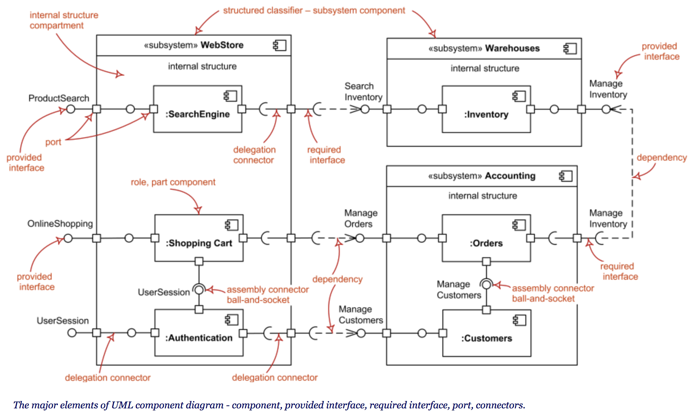

* [一、类图](#一类图)
* [二、包图](#二包图)
* [三、用例图](#三用例图)
* [四、组件图](#四组件图)
* [五、活动图](#五活动图)
* [六、时序图](#六时序图)

## UML
UML全程为统一建模语言(Unified Modeling Language)，作为一种建模语言，它主要用于软件领域的建模，用来表达我们的设计，方便与其他的同事进行沟通

# 一、类图
## 使用场景
类图适用于面向对象进行建模的场景，通过类图，我们可以知道系统被抽象成哪些类，已经类之间的关系

## 类图元素K
UML类图从上到下被分为三个部分
### 1. 类名
一般的类名直接写就好。 <br>
抽象类为斜体字类名 <br>
对象类图在名字下加下划线
    
### 2. 属性
格式： +/#/- name : type
<br>
+表示public、#表示protected、-表示private<br>
如： + str ： String  代表类型为String的str属性是public的

### 3. 方法
格式：  +/#/- name( type ) : return type
<br>
+ setter(int) : int

## 类图关系
### 1. 依赖
依赖是行为间产生关联
<br>
表现：局部变量、方法的参数或者对静态方法的调用
<br>

```java
class A {
  function fn(B b) { }
  function fn2() {
    B b = new B();
  }
  function fn3() {
    return new B();
  }
}
```
用带燕尾虚线箭头表示，箭头指向被使用者

### 2. 泛化
通常指一个类（或接口）继承另一个类（或接口），并可以增加它自己的新功能的能力。
<br>
```java
class B extends A {}
```
带三角箭头的实线，箭头指向父类

### 3. 实现
是一种类与接口的关系
<br>
带三角箭头的虚线，箭头指向接口

### 4. 关联
表示对象与对象的持有关系，可以单向，也可以双向持有

代码体现：成员变量

带普通箭头的实心线，指向被拥有者


### 5. 聚合
是整体与部分的关系，且部分离开整体而单独存活的

代码体现：成员变量

带空心菱形的实心线，菱形指向整体

### 6. 组合
也是整体与部分的关系，但是部分不能离开整体，例如公司和部门

代码体现：成员变量

带实心菱形的实心线，菱形指向整体


# 二、包图
包的概念：从包的层级将系统抽象化

包图内容：包名 + 包元素 + 依赖关系

包元素可见性符号表示： + / - / #

包元素：包中可以容纳各种高级的模型元素，如类和类的关系、状态机、用例图、交互、协作等，甚至是一个完整的UML图，还可以是包。

## 1. 分包作用
除了将程序文件分类管理，最重要的就是要让软件组织有序并且职责清晰

## 2. 分包原则

### 2.1 自顶向下原则
意思是分包时要像组织架构一样，从顶级自顶向下延伸，避免平行化无层次分包

做到不跨级访问，不自下而上访问

### 2.2 职能集中原则
尽量将与一组业务功能有关的类分在同一个包，达到高内聚的目的，并且能带来结构清晰和编程简便

而且应当服从于自顶向下原则

### 2.3 互不交叉原则
意思是包与包之间的类尽量独立，不要产生依赖关系，以达到低耦合的目的，否则会产生逻辑混乱、难以维护和扩展能力差的问题

## 3. 如何应用分包原则
通常情况下，应当先遵循自顶向下原则，再应用职能集中，最后应用互不交叉原则

### 3.1 左右为难
但是应用职能集中原则和互不交叉原则会产生两难的情况。比如有一些类被多个模块共同使用的，但从职能上说，它们又属于其中一个模块

这时，应当优先选择互不交叉，因为相互依赖带来的是软件整体依赖关系混乱、难以维护、扩展性差等更严重的问题。

所以，当高内聚和低耦合发生冲突时，通常低耦合是更好的选择。此时应将这些类分到"公共包"里更好。

> 另一个问题，这个所谓的"公共包"里面的类几乎是毫无关系的，既难于管理，又难于理解<br>
> 折衷的办法是从接口设计入手，为模块设计出公共接口包，宁愿产生接口依赖也不产生实现依赖

# 三、用例图
用例图是用于描述行为的图，用于描述一系列角色与用例之间的关系。比较适合通过用例图来表达产品需求，确定系统边界

## 1. 用例图元素
### 角色
角色代表的是直接或间接使用这个系统的用户或系统、设备。在面向用户的产品中，角色可能是人，比如学生，在面向技术的产品中（比如 broker，mq），则角色可能是客户端，业务系统

### 用例
用例就是角色能够执行的动作，描述了角色能够怎么使用我们提供的系统。他表达的是一个系统的功能，比如用户注册、添加购物车、支付等等

### 包含关系
包含关系，顾名思义，即表达一个用例（基础用例）包含另一个用例（新增用例）的场景。一般是某个用例包含很大的范围，专门抽出子用例来着重表达，又或者是复用用例

虚线箭头指向被包含用例
### 扩展关系
扩展关系表明的是一个用例（基础用例）执行过程中的可选过程，基础用例本身可以完整的场景，扩展用例作为一个可选（optional)过程插入到基础用例中

虚线箭头指向被扩展的用例


# 四、组件图
组件图用来描述各个模块之间的关系。每个模块都有自己的职责，每个模块再通过组件图来交流、依赖的

组件图适用于基于组件的开发模式（Component-Based Development, CBD），它通过组件，及组件的接口、端口来表达组件的构成及其关系。当我们使用 CBD 进行开发时，其实是对行为进行了抽象，一个组件提供了若干的行为，组件图通过接口、端口的方式来表达组件间的连接，很形象的表达出组件是可被替换的概念，一个组件可以被另一个提供了相同接口的组件替换。因此，当我们通过组件进行建模时，能够设计出一个扩展性良好的系统。



# 五、活动图
用例图类似，也是描述行为的图，不同在于活动图描述的是活动（activity）的流程。他从 when 和 how 的维度来表达对应的事件

1. 活动图必须有起点和终点
2. 活动图的流程节点叫做 activity，起点、终点与 activity 已经可以组成最简单的活动图
3. 决策用于实现分支流程，当分支流程最终走向同一个流程时，应使用合并（merge node）
4. 分叉用于实现并行流程，加入用于表达多个子流程结束后，再执行下一个流程的场景
5. 使用泳道可以为 activity 分类，配合用例图表达需求时，每个泳道可以作为一个角色


# 六、时序图
时序图是一种动态图，表明对象（lifelines）之间的消息交换顺序，它关注的是消息交换的方式，消息交换的时机、顺序以及执行的时间

时序图一般配合组件图、类图一起使用，表明对象之间的通讯流程。

活动图粒度比较粗，它只关注 activity 之间是怎么流传的，因此比较适合在需求分析的阶段来表达需求场景。而时序图关注点在于消息交换，转换成代码就是代码调用的流程，因此更适合在程序设计阶段，表达更细节的，更接近程序实现的流程场景


