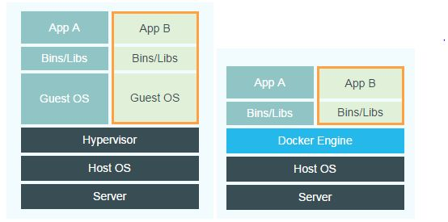

- [1. docker是什么](#1-docker是什么)
- [2. 虚拟机技术 vs 容器虚拟化技术](#2-虚拟机技术-vs-容器虚拟化技术)       
    - [虚拟机](#虚拟机)       
    - [容器虚拟化](#容器虚拟化)
- [3. 容器的基本组成](#3-容器的基本组成)       
    - [镜像](#镜像)       
    - [容器](#容器)       
    - [仓库](#仓库)
- [4. docker安装](#4-docker安装)
- [5. run的执行步骤](#5-run的执行步骤)
- [6. docker的帮助命令](#6-docker的帮助命令)
- [7. 镜像命令](#7-镜像命令)       
    - [I. docker images](#i-docker-images)       
    - [II. docker search](#ii-docker-search)       
    - [III. docker pull](#iii-docker-pull)       
    - [IV. docker rmi](#iv-docker-rmi)
- [8. 容器命令](#8-容器命令)       
    - [I. 新建并启动应用](#i-新建并启动应用)       
    - [II. docker ps](#ii-docker-ps)       
    - [III. 退出](#iii-退出)       
    - [IV. 启动容器](#iv-启动容器)       
    - [V. 重启容器](#v-重启容器)       
    - [VI. 停止容器](#vi-停止容器)       
    - [VII. 强制停止容器](#vii-强制停止容器)       
    - [VIII. 删除已停止容器](#viii-删除已停止容器)       - [IX. 查看容器日志](#ix-查看容器日志)       
    - [X. 查看容器内运行的进程](#x-查看容器内运行的进程)       
    - [XI. 查看容器内部的细节](#xi-查看容器内部的细节)       
    - [XII. 进入正在运行容器并以命令行交互](#xii-进入正在运行容器并以命令行交互)       
    - [XIII. 从容器内拷贝文件到主机上](#xiii-从容器内拷贝文件到主机上)
- [9. 镜像](#9-镜像)       
    - [docker commit](#docker-commit)
- [10. docker容器数据卷](#10-docker容器数据卷)   
    - [数据卷容器](#数据卷容器)
- [11. DockerFile](#11-dockerfile)       
    - [语法](#语法)       
    - [执行流程](#执行流程)   
    - [结构体系](#结构体系)      
        - [I. FROM](#i-from)       
        - [II. MAINTAINER](#ii-maintainer)       
        - [III. RUN](#iii-run)       
        - [IV. EXPOSE](#iv-expose)       
        - [V. WORKDIR](#v-workdir)       
        - [VI. ENV](#vi-env)       
        - [VII. COPY](#vii-copy)       
        - [VIII. ADD](#viii-add)       
        - [IX. VOLUME](#ix-volume)       
        - [X. CMD](#x-cmd)       
        - [XI. ENTRYPOINT](#xi-entrypoint)       
        - [XII. ONBUILD](#xii-onbuild)       
        - [XIII. USER](#xiii-user)

## 1. docker是什么
是基于Go语言的开源应用容器引擎。它解决了因运行环境和配置问题不一致出现的种种问题，方便做持续集成并有助于整体发布的容器虚拟化技术

一次构建，随处运行

优点：
1. 更快速的应用交付和部署
2. 更便捷的升级和扩缩容
3. 更简单的系统运维
4. 更高效的计算资源利用

## 2. 虚拟机技术 vs 容器虚拟化技术

 
#### 虚拟机

多个虚拟机系统在hypervisor上运行，以达到虚拟化，而hypervisor是基于硬件的虚拟化技术

而且作为访客的虚拟机运行在主机上，会带来许多额外的开支，并不能达到轻量级的效果

虚拟机将操作系统和代码打包在一起，一台主机被多个虚拟机共享。

优点：
1. 应用程序毫无感知，与真实环境一样，彻底隔离了环境
2. 对于底层系统来说只是一个文件

缺点：
1. 占用资源多
2. 冗余步骤多
3. 启动慢

#### 容器虚拟化

所有容器共享同一个操作系统内核，将应用进程与系统其他部分进行隔离，以达到轻量级

优点：
1. 轻便：容器内的应用进程直接运行于宿主内核，不需要虚拟出内核和硬件
2. 隔离：每个容器都有自己的文件系统，容器之间的进程不会相互影响，能区分计算资源
3. 速度快：直接依赖操作系统内核 

缺点：
1. 容器不能独立，必须依赖一个环境，比如虚拟机，而虚拟机可以当作操作系统使用
2. 隔离性不如虚拟机强

## 3. 容器的基本组成
#### 镜像

镜像可以就是一个只读的模版，它可以用来创建Docker容器

#### 容器

容器是与系统其他部分隔离开的"盒子"，其中包含了应用需要的所有依赖项，具有可移植性和一致性

#### 仓库
集中存放镜像文件的场所

仓库和仓库注册服务器是有区别的。仓库注册服务器上往往存放着多个仓库，每个仓库中又包含了多个镜像，每个镜像又有不同的标签

## 4. docker安装

## 5. run的执行步骤
1. 在本机中寻找该镜像，有的话就以该镜像作为模版生产容器实例运行
2. 没有就到仓库上查找，找到就下载并生产容器实例运行

## 6. docker的帮助命令
1. docker version
2. docker info
3. docker --help

## 7. 镜像命令
#### I. docker images
列出本地主机上的镜像
1. REPOSITORY：表示镜像的仓库源
2. TAG：表示镜像的标签
3. IMAGE ID：镜像id
4. CREATED：镜像创建时间
5. SIZE：镜像大小

options
1. -a：列出本地所有的镜像（含中间映像层）
2. -q：只显示镜像id
3. --digest：显示镜像的摘要信息
4. --no-trunc：显示完整的镜像信息

同一仓库源可以有多个TAG，代表这个仓库的不同版本，我们使用REPOSITORY:TAG来定义不同的镜像

#### II. docker search
某个xxx镜像的名字 docker search [options] 镜像名

options：
1. --no-trunc: 显示完整的镜像信息
2. -s：列出收藏数不小于指定值的镜像
3. --automated：只列出automated build类型的镜像

#### III. docker pull
docker pull 镜像名字[:TAG] 
默认docker pull 镜像名字:latest

#### IV. docker rmi
删除某个镜像 docker rmi [options] 镜像id

options：
1. 删除单个：docker rmi -f 镜像id
2. 删除多个：docker rmi -f 镜像名1:TAG 镜像名2:TAG
3. 删除全部：docker rmi -f ${docker images -qa}

rmi已被deprecated，改为用docker image rm

## 8. 容器命令
#### I. 新建并启动应用
docker run [options] image [command] [arg...]

options：
1. --name="容器新名字"：为容器指定一个名称
2. -d：后台运行容器，并返回容器id
3. -i：以交互模式运行容器，通常与-t同时使用
4. -t：为容器重新分配一个伪输入终端，通常与-i同时使用
5. -P：随机端口映射
6. -p：指定端口映射
 ip:hostPort:containerPort
 ip::containerPort
 hostPort:containerPort
 containerPort

#### II. docker ps
列出当前正在运行的所有容器

options：
1. -a：列出当前正在运行的容器+历史运行过的
2. -l：显示最近创建的容器
3. -n：显示最近n个创建的容器
4. -q：静默模式，只显示容器编号
5. --no-trunc：不截断输出

#### III. 退出
1. exit  关闭退出
2. ctrl+P+Q  退出，不关闭

#### IV. 启动容器
docker start 容器id或容器名

如果容器A的name和容器B的ID一样，只能启动A，B只能通过B的name启动，name优先级高于id

#### V. 重启容器
docker restart 容器id或容器名

#### VI. 停止容器
docker stop 容器id或容器名

#### VII. 强制停止容器
docker kill 容器id或容器名

#### VIII. 删除已停止容器
docker rm 容器id

一次性删除多个容器
1. docker rm -f ${docker ps -qa}
2. docker ps -a -q | xargs docker rm

#### IX. 查看容器日志
docker logs [options] 容器id

options：
1. -t: 加入时间戳
2. -f：跟随最新的日志打印
3. --tail 数字：显示最后多少条 

#### X. 查看容器内运行的进程
docker top 容器id

#### XI. 查看容器内部的细节
docker inspect 容器id

#### XII. 进入正在运行容器并以命令行交互
1. docker exec -it 容器id bashShell。 是在容器中打开新的终端，并且可以启动新的进程。所以exit退出容器，容器不会停止
2. 重新进入：docker attach 容器id。 直接进入容器启动命令的终端，不会启动新的进程。所以exit退出容器，容器会停止

#### XIII. 从容器内拷贝文件到主机上
docker cp 容器id：容器内路径 目的主机路径

## 9. 镜像
镜像是一种轻量级、可执行的独立软件包，用来打包软件运行环境和基于运行环境开发的软件

特点：Docker镜像都是只读的

#### docker commit
提交容器副本使之成为一个新的镜像

docker commit -m "描述信息" -a "作者" 容器id 目标镜像名:[标签名]

## 10. docker容器数据卷
数据卷是一个可供容器使用的特殊目录，它将主机操作系统目录直接映射进容器，类似于Linux中的mount操作。

作用：持久化、共享数据，完全独立与容器的生命周期

特点：
1. 数据卷可在容器之间共享或重用数据
2. 卷中的更改可以直接生效
3. 数据卷中的更改不会包含在镜像的更新中
4. 数据卷中的生命周期一直持续到没有容器使用它为止

添加方式：
1. 直接命令添加。  
docker run -it -v 宿主机绝对路径目录:/容器内目录[:ro] 镜像名
2. DockerFile添加  
VOLUME["/dataVolume"]

### 数据卷容器
命名的容器挂载数据卷，其它容器通过挂载这个（父容器）实现数据共享，挂载数据卷的容器，称之为数据卷容器

docker run -it --name 子容器 --volume-from 父容器 镜像名

## 11. DockerFile

用来描述镜像中安装的软件及其配置，以及容器启动时运行的应用程序

1. 编写一个DockerFile文件
2. 使用docker build 获得一个自定义的镜像
3. run

#### 语法
1. 每条保留字指令都必须为大写字母且后面要跟随至少一个参数
2. 指令按照从上到下，顺序执行
3. #表示注释
4. 每条指令都会创建一个新的镜像层，并对镜像进行提交

#### 执行流程
1. docker从基础镜像运行一个容器
2. 执行一条指令并对容器进行修改
3. 执行类似docker commit的操作提交一个新的镜像层
4. docker再基于刚提交的镜像运行一个新容器
5. 执行dockerfile中的下一条指令直到所有指令都执行完成

### 结构体系
#### I. FROM
基础镜像，当前新镜像是基于哪个镜像的

FROM <image> 或 FROM <image>:<tag> 或 FROM <image>:<digest>

注意：
1. FROM 必须 是 Dockerfile 中第一条非注释命令
2. 在一个 Dockerfile 文件中创建多个镜像时，FROM 可以多次出现。只需在每个新命令 FROM 之前，记录提交上次的镜像 ID。
3. 默认使用latest版本

#### II. MAINTAINER
镜像维护者的姓名和邮箱地址

#### III. RUN
在镜像的构建过程中执行特定的命令，并生成一个中间镜像

RUN <command> 或 RUN ["executable", "param1", "param2"]

RUN 指令创建的中间镜像会被缓存，并会在下次构建中使用。如果不想使用这些缓存镜像，可以在构建时指定 --no-cache 参数，如：docker build --no-cache
#### IV. EXPOSE
当前容器对外暴露的端口

EXPOSE <port> [<port>...]

EXPOSE 指令并不会让容器监听 host 的端口，如果需要，需要在 docker run 时使用 -p、-P 参数来发布容器端口到 host 的某个端口上

#### V. WORKDIR
指定在创建容器后，终端默认登陆进来的工作目录，一个落脚点

WORKDIR /path/to/workdir

#### VI. ENV
用来构建镜像的过程中设置环境变量

ENV <key> <value> 或 ENV <key1>=<value1> <key2>=<value2>...

#### VII. COPY
复制文件

COPY <源路径>... <目标路径> 
COPY ["<源路径1>",... "<目标路径>"]

<源路径>可以是多个，甚至可以是通配符，其通配符规则要满足 Go 的 filepath.Match 规则

<目标路径>可以是容器内的绝对路径，也可以是相对于工作目录的相对路径

#### VIII. ADD
更高级的复制文件

在 COPY 基础上增加了一些功能。比如<源路径>可以是一个 URL，这种情况下，Docker 引擎会试图去下载这个链接的文件放到<目标路径>去。还会解压tar压缩包

#### IX. VOLUME
用于创建挂载点，即向基于所构建镜像创始的容器添加卷

VOLUME ["/data"]

VOLUME 让我们可以将源代码、数据或其它内容添加到镜像中，而又不并提交到镜像中，并使我们可以多个容器间共享这些内容

#### X. CMD
用于指定在容器启动时所要执行的命令

CMD ["executable","param1","param2"] 
CMD ["param1","param2"] 
CMD command param1 param2 

多个CMD时，只有最后的生效且会被docker run后面的参数覆盖

#### XI. ENTRYPOINT
ENTRYPOINT 用于给容器配置一个可执行程序。也就是说，每次使用镜像创建容器时，通过 ENTRYPOINT 指定的程序都会被设置为默认程序

ENTRYPOINT ["executable", "param1", "param2"] 
ENTRYPOINT command param1 param2

追加命令，也可以通过覆盖docker run --entrypoint

#### XII. ONBUILD
用于设置镜像触发器。当所构建的镜像被用做其它镜像的基础镜像，该镜像中的触发器将会被钥触发

ONBUILD ADD . /app/src  
ONBUILD RUN /usr/local/bin/python-build --dir /app/src

#### XIII. USER
USER 用于指定运行镜像所使用的用户

使用USER指定用户时，可以使用用户名、UID 或 GID，或是两者的组合

