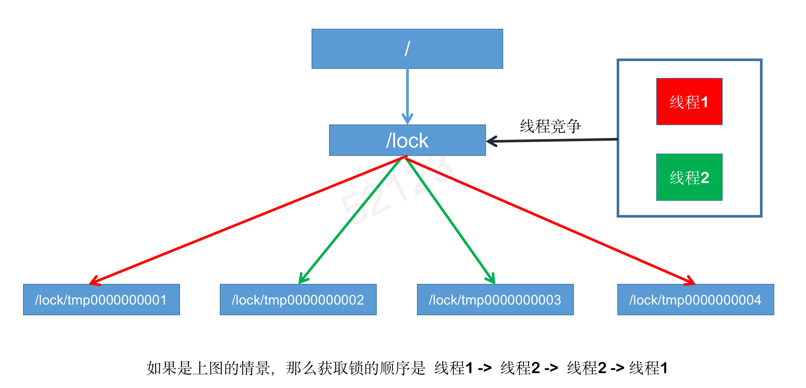

### 1. 不通用的略过
自我介绍、实习做了什么，怎么做的，有什么收获、项目

## 2. 分布式锁的实现原理

### I. ZooKeeper实现分布式锁
答：ZooKeeper使用临时顺序节点来实现分布式锁 
> 当有线程来请求锁时，就在锁的节点下创建一个临时顺序节点，默认获取到最小子节点的线程持有锁，释放锁时删除该节点。那么下一节点便成了最小节点，创建该节点的线程持有锁

补充：

1. 为什么要用临时顺序节点
>假如获得线程的服务器宕机了，那么ZooKeeper与该服务器的会话便中断，ZooKeeper会自动删除该线程创建的节点，且最小子节点对应的线程获取锁

2. Znode的类型
> 1. 持久节点（PERSISTENT）：节点创建后，就一直存在，直到有删除操作来主动清除这个节点
> 2. 持久顺序节点（PERSISTENT_SEQUENTIAL）：保留持久节点的特性，额外的特性是，每个节点会为其第一层子节点维护一个顺序，记录每个子节点创建的先后顺序，ZK会自动为给定节点名加上一个数字后缀（自增的），作为新的节点名。
> 3. 临时节点（EPHEMERAL）：和持久节点不同的是，临时节点的生命周期和客户端会话绑定，当然也可以主动删除。
> 4. 临时顺序节点（EPHEMERAL_SEQUENTIAL）：保留临时节点的特性，外加顺序特性，参考持久顺序节点

### II. Redis实现分布式锁
i. SETNX KEY VALUE
>SETNX是SET if Not eXists的简写，当该Key不存在时才能保存Value，所以可以利用该命令实现同一个方法在多台服务器上同一时刻只有一条线程可以执行。 
>即当一个线程成功写入某键值对后，就获得了锁。执行完后可以删除该键或设置过期时间来释放锁
>
>缺点： 在保存该键值对后，还没来得及设置过期时间或删除键时，持有该锁的服务器宕机了，会造成死锁

ii. SET key value [expiration EX seconds| PX milli] [NX|XX]
> 与SETNX具有相同的功能，不同的是，该命令保存键值对时还可以设置过期时间(原子操作)，即使获取了锁的服务器宕机了，也不会造成死锁

iii. RedLock
>它的基本原理是，利用多个集群（完全独立，不存在主从复制），需要加锁的客户端在大多数集群上成功获取了锁，且总消耗时间不超过锁释放时间，才算成功获取锁

i和ii还有一个问题，就是加锁时只作用在一个Redis节点上，即使使用哨兵模式，如果这个master节点发生了主从切换，那么还是有可能出现死锁的情况，iii能避免这种情况

### III. Redis和ZooKeeper实现分布式锁的区别
Redis性能高，可以支撑高并发的获取、释放锁操作。设计上它不是强一致性的，另外实现需要自旋获取锁，比较消耗性能

ZooKeeper设计上就是要求强一致性的，适合做分布式锁，通过监听获取锁，性能消耗较小。不过在高并发下，频繁获取、释放锁对集群压力大

### IV. ZooKeeper如何实现强一致性