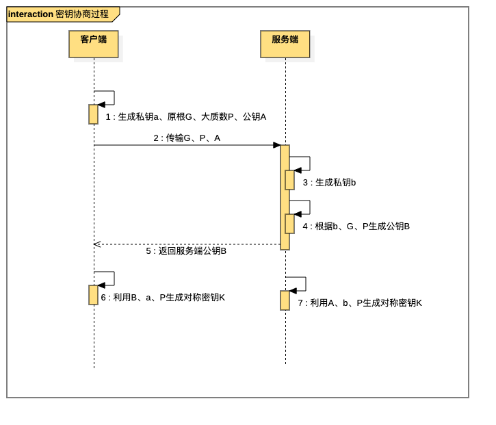

## 一、HTTPS

### 1. 是什么

HTTPS（超文本传输安全协议）是HTTP建立在SSL/TLS上一个传输协议。

本质：要在不可信的网络上建立可信的通道

### 2. 作用

#### 2.1 加密传输的数据

如何加密：先用非对称加密交换对称密钥，再用对称密钥进行数据加密

##### 2.1.1 为什么TLS握手时要用非对称加密交换密钥

>非对称加密，是指加密解密不是同一个密钥，分为公钥和密钥，公钥加密的数据只能由私钥解密
>
>RSA是基于大素数分解难题的加密算法，即因为大素数分解困难，所以难以用公钥推出私钥，反之亦然

**安全**，**利用非对称加密的特点，公钥加密的数据只能由私钥解密**。

一般来说，客户端会存放着公钥，利用公钥把对称密钥加密，那么按理来说，这个密文只有拥有私钥的服务器能解开。

##### 2.1.2 为什么不继续使用非对称加密来加密要传输的数据呢

> 非对称加解密的原理：大数乘法、大数模等运算
>
> 对称加解密的原理：位运算、替换

**不继续使用非对称加密进行数据传输，是一种折衷方案，因为没有一种加解密算法能做到既安全又快速**

使用非对称加密固然安全，但是效率低下，不适合频繁地数据传输，而对称加密的本质是位运算和替换，效率比非对称加密高，所以数据传输时，使用已经交换好了的对称密钥进行加解密。


#### **2.2 身份认证**

在TLS四次握手的时候，客户端会收到服务端下发的证书，利用证书，客户端就能识别建立的另一端是否为真正的服务端


#### 2.3 数据完整性校验

利用非对称加密的另一个用法：**数字签名**，来实现数据完整性的校验

##### 2.3.1 数字签名的原理

也是利用到了非对称加密的特性：私钥加密的内容，只有公钥能解开

生成签名：先把传输的数据进行哈希（哈希值1），利用私钥对哈希值1进行签名

验证签名：先把收到的数据进行哈希（哈希值2），利用公钥把数字签名给解密，对比哈希值1和哈希值2

##### 2.3.2 签名与加密的区别

加密就是你拿到了不该拿的数据，你也解不开

签名就是你做了任何事，都抵赖不了


### 3. 建立过程

HTTPS是基于HTTP上利用SSL/TLS进行加密和身份认证的一种传输协议

HTTPS = HTTP （TCP三次握手）+ SSL/TLS （TLS四次握手）


#### 3.1 TLS第一次握手

客户端会发送一个Client Hello消息，跟服务端打招呼

这个消息里面包含：

- 随机数1: 用于生成对称密钥的材料之一
- TLS版本号
- 支持的加解密算法列表：由多行组成，每一行的结构为“**密钥交换算法 + 签名算法 + 对称加密算法 + 摘要算法**”


##### 3.1.1 服务器有多个域名，怎么知道要返回对应域名的证书呢

客户端在发送Client Hello消息时，会带上对应的请求域名


#### 3.2 TLS第二次握手

服务端收到Client Hello时，会返回**Sever Hello**消息

这个消息里面包含：

- 随机数2: 用于生成对称密钥的材料之一
- 一个合适的加解密算法


除了Server Hello，为了证明自己的身份，服务端还会下发一个**Server Certificate**消息

这个消息里面包含：

- 数字证书：通常由多个证书（证书链）


最后，服务端还会发送一条**Server Hello Done**消息，目的是告诉客户端，东西传完（意味着第二次握手结束）


#### 3.3 客户端校验数字证书（最重要的一步）

收到服务端下发的证书，客户端会校验数字证书的合法性，来确认服务端的身份


##### 3.3.1 数字证书的作用

数字证书是用来认证服务端的身份，以免有人冒充，只有证书合法，才代表服务端是合法的


##### 3.3.2 数字证书包含的信息

- 服务端的公钥
- 服务端的信息（最重要的是域名）
- 证书认证机构的信息
- 生成这个证书所用的算法以及数字签名
- 证书有效期


##### 3.3.3 数字证书是如何生成的

- 服务端向CA机构提交申请信息
  - 服务端的公钥
  - 服务端的信息
- CA机构利用服务端提供的信息，生成一个数字证书，并记录一些额外信息
- CA机构会对证书的内容信息进行哈希计算，得到一个哈希值
- CA机构利用私钥对这个哈希值进行加密，然后放入数字证书中（也就是CA对数字证书进行了签名）


##### 3.3.4 客户端如何校验数字证书

- 客户端会根据数字证书里同样的哈希算法，获取这个数字证书的哈希值1
- 根据数字证书里面的CA机构信息，找到对应的公钥信息，并利用该公钥，对数字证书里面的签名信息进行解密，得到CA机构利用私钥进行签名的哈希值2
- 对比哈希值1和哈希值2，如果相同，这说明该证书可信赖


#### 3.4 TLS第三次握手

**首先**，客户端验证完证书以后，会生成一个新的随机数（pre-master），然后服务器的公钥对pre-master进行加密，并发送**Change Cipher Key Exchange**

这个消息里面包含：

- 用公钥加密过后的pre-master


>  至此，客户端和服务端已经共享了三个随机数：随机数1、随机数2、pre-master
>
> 生成会话密钥（Master Secret）的材料已全部集齐


**其次**，客户端还会发送一个**Change Cipher Spec**消息，用于通知服务端开始使用加密方式发送数据


**然后**，客户端还会发送一个**Encrypted Handshake Message（Finishd）**消息，把之前发送的所有数据做个摘要，再用会话密钥进行加密，让服务端验证一下之前的数据是否有被篡改过


##### 3.4.1 为什么要用随机数来生成会话密钥

本质：提高随机性、安全性，一个随机数只是伪随机，但是三个伪随机就真的接近于随机了

使用三个随机数，是因为TLS协议默认不信任每个主机能产生完全随机的数，如果只客户端直接生成会话密钥，就很容易被破解


#### 3.5 TLS第四次握手

服务器也同样会发送Change Cipher Spec、Encrypted Handshake Message（Finishd）消息，如果双方的加密解密都没问题，那么握手就正式结束


3.6 密钥交换算法


## 二、中间人攻击

就是攻击人与通讯的两端分别建立通信，并交换其所收到的数据


### 1. 实现原理

从上面我们知道，HTTPS最重要的一步是通过内置的CA证书信息来校验服务端下发的数字证书，只要验证通过，就说明该服务端是可信的。

因为**攻击者没有CA机构**用来生成数字签名**的密钥**，所以伪造出来的证书，是**没有办法通过**系统内置的**CA证书公钥进行签名验证**


所以，**想要实现中间人攻击，就让客户端信任攻击者的证书**

如果是浏览器，浏览器会提示该站点证书不可信


#### 1.1 客户端信任中间人的证书

当客户端信任了攻击者的证书，那么攻击者就可以伪造出携带服务端信息的证书了

所以，在客户端看来，中间人就是“服务端”，对于服务端，中间人就是“客户端”。


##### 1.1.1 ARP欺骗

原理：利用了主机不会验证ARP报文的真实性这一点，进行疯狂发送假的ARP报文，去更改这台主机和网关的ARP缓存表，从而实现流量劫持

局限：只能在同一个局域网进行

预防：动态ARP检测


##### 1.1.2 DNS劫持

DNS 劫持即域名劫持，是通过将原域名对应的 IP 地址进行替换从而使得用户访问到错误的网站或者使得用户无法正常访问网站的一种攻击方式


### 2. 如何防范

- 使用HTTPS
- 客户端不要轻易相信证书
- 不要随便连未知的WIFI


## 三、证书链

一般来说，证书验证过程还会存在一条证书信任链的问题，这是因为我们申请的证书，一般是由中间证书签发的

根证书 -> 中间证书 -> 服务端的证书


### 1. 为什么需要中间证书

让根证书可以完全离线保存，安全性更好


### 2. 为什么根证书是可受信的

这是因为根证书是系统自带的，它是不经过网络传输就存储在了系统内部，因此，它不会被伪造，所以它是值得信任的

> 根证书是一个自签发的证书，就是使用者和颁发者是同一个


### 3. 如何维护中间证书

#### 3.1 CRL

CRL（Certificate Revocation List，证书吊销列表） 是由 CA 机构维护的一个列表，列表中包含已经被吊销的证书序列号和吊销时间。浏览器可以定期去下载这个列表用于校验证书是否已被吊销。可以看出，CRL 只会越来越大，而且当一个证书刚被吊销后，浏览器在更新 CRL 之前还是会信任这个证书的，实时性较差。这时，OCSP弥补了这一点缺陷


#### 3.3 OCSP

OCSP（Online Certificate Status Protocol，在线证书状态协议），是一个在线证书查询接口，它建立一个可实时响应的机制，让浏览器发送查询证书请求到CA服务器，然后CA服务器实时响应验证证书是否合法有效，这样可以实时查询每一张证书的有效性，解决了 CRL 的实时性问题。

但是 OCSP 又有另外两个问题：CA服务器上的隐私和性能问题。

由于OCSP要求浏览器直接请求第三方CA以确认证书的有效性，因此会损害隐私。CA知道什么网站访问了该CA以及哪些用户访问了该网站。而这些数据对于跨国业务网站或者政企网站尤为敏感。

另一方面，某些客户端会在 SSL 握手时去实时查询 OCSP 接口，并在获得查询结果前会阻塞后续流程，在网络不佳时（尤其是内陆地区）会造成较长时间的页面空白，降低了HTTPS性能，严重影响用户体验。在服务器上部署OCSP Stapling将可以解决以上问题。


#### 3.3 OCSP Stapling

OCSP Stapling 就是为了解决 OCSP 隐私问题和性能问题而生的。其原理是：网站服务器将自行查询OCSP服务器并缓存响应结果，然后在与浏览器进行TLS连接时返回给浏览器，这样浏览器就不需要再去查询了。因此，浏览器客户端也不再需要向任何第三方披露用户的浏览习惯，完美解决了隐私问题。同时，当有客户端向服务器发起 SSL 握手请求时，服务器将证书的 OCSP 信息随证书链一同发送给客户端，从而避免了客户端验证会产生的阻塞问题，提升了HTTPS性能。由于 OCSP 响应是无法伪造的，因此这一过程也不会产生额外的安全问题。


## 四、相关算法

### 1. DH算法

DH算法解决了密钥在双方不直接传递密钥的情况下完成密钥交换

**核心数学思想**：**离散对数**

#### 1.1.1 离散对数

指数运算： y = $2^x$   其中x为对数，y为真数

对数运算： x = $log_2$y


离散对数就是在对数运算的基础上加上了模运算。

离散对数：

**如果对于一个整数b和质数P的一个原根G，可以找到一个唯一的指数i，使得**

​				**G^i^ % P = b成立**

**那么指数i称为b的以G为底的模P的离散对数**


其中，G和P为离散对数的公共参数，b是真数，i是对数，所以，知道了对数，就可以计算出真数。

但是，知道真数却很难推算出对数


#### 1.1.2 DH算法如何交换密钥（DHE）

- 客户端和服务端生成随机整数作为对数（私钥），分别记作a和b。交换离散对数的公参（生成对称密钥的材料）分别为P和G

-  客户端和服务端分别根据上面的参数生成真数（公钥）A和B，并交换
  - 客户端：A = G^a^ % P
  - 服务端:   B = G^b^ % P

- 交换参数之后，服务端和客户端各自持有的参数
  - 客户端：P、G、a、A、B
  - 服务端：P、G、b、A、B
- 因为离散对数的幂运算具有**交换律**，所以根据上面的参数，客户端和服务端都能得到一个相同的结果K（对称密钥）
  - K = A^b^ % p = (G^a^ % p)^b^ % p = G^ab^ % p = (G^b^ % p)^a^  % p = B^a^ % p
  - 客户端：K = B^a^ % p
  - 服务端：K = A^b^ % p




#### 1.1.3 DHE算法-DH的实现之一

DH算法有两种实现（根据私钥生成的方式）

- 静态DH算法，已废弃（私钥固定写死）
- DHE算法，常用（每次协商密钥都会生成随机密钥）


前向安全（前向保密）：能够保护过去进行的通讯不受密码或密钥在未来暴露的威胁

- 静态DH算法：因为协商密钥的时候，会公开某些参数，攻击者可以依据这些数据暴力破解出写死的私钥，那么之前获取的加密数据都会被破解
- DHE算法：E是ephemeral（临时性）。由于每次协商时，依赖的私钥都不一样，即使某一次被攻击者破解了，其他被截获的数据也不会因此而泄漏，因为**每次通信的私钥都是独立的**


#### 1.1.4 DH算法如何保证安全

客户端和服务端经过网络交换（公开）的有四个信息，分别是真数（公钥）A、B和公参G、P

对数（私钥）a、b是客户端和服务端各自保管的

**因为从公开的信息A、B、G、P计算出对数a、b是很难破解的，尤其当模数P是一个大数时。**


#### 1.1.5 实例

- 客户端和服务端生成对数（私钥）分别为 4、 5， 并约定公参G为2和P为10
- 客户端和服务端根据上面参数生成真数（公钥）6、5
  - 客户端： A = 2^4^ % 10  = 6
  - 服务端： B = 2^5^ % 10  = 2
- 交换参数后，客户端和服务端各自持有的参数
  - 客户端：P 10、 G 2、 a 4、A 6、B 2
  - 服务端：P 10、 G 2、 a 4、A 6、B 2
- 因为离散对数的幂运算具有**交换律**，所以根据上面的参数，客户端和服务端都能得到一个相同的结果（对称密钥）
  - K = A^b^ % p = (G^a^ % p)^b^ % p = G^ab^ % p = (G^b^ % p)^a^  % p = B^a^ % p
  - 客户端：K = B^a^ % p = 2^4^ % 10 = 6
  - 服务端：K = A^b^ % p = 6^5^ % 10  = 6


### 2. ECDHE算法

因为DHE算法是基于离散对数进行计算的，因此需要做大量乘法，为了提升DHE算法的性能，就出现了密钥交换算法- ECDHE算法（HTTPS中也有使用）


ECDHE 算法是在 DHE 算法的基础上利用了 ECC 椭圆曲线特性，可以用更少的计算量计算出公钥，以及最终的会话密钥


#### 2.1 ECDHE算法的过程

- 双方实现确定好使用哪种椭圆曲线，和曲线上的基点G1、G2，这两个参数都是公开的
- 双方各自随机生成一个随机数作为私钥a、b，并与基点G相乘等到公钥A、B
  - 客户端：A = aG1
  - 服务端：B = bG


## 五、Nginx

### 1. 正向代理

#### 1.1 是什么

客户端发送请求给代理服务器，代理服务器代替客户把请求发送给服务器


解决了什么问题

### 2. 反向代理

是什么

解决了什么问题


## 六、生成自签名证书

ca配置

```
[ req ]
#default_bits		= 2048
default_md		= sha256
#default_keyfile 	= privkey.pem
distinguished_name	= req_distinguished_name
attributes		= req_attributes

[ ca ]
default_ca              = CA_default 

[ CA_default ]
dir                     = /Users/user/Desktop/mitm/
certs      = $dir/certs           # Where the issued certs are kept

crl_dir     = $dir/crl            # Where the issued crl are kept

database   = $dir/index.txt       # database index file.

#unique_subject = no              # Set to 'no' to allow creation of
                                  # several ctificates with same subject.
new_certs_dir = $dir/newcerts     # default place for new certs.

certificate   = $dir/cacert.pem   # The CA certificate 自签名证书，局域网内的根CA自证证书
serial        = $dir/serial       # The current serial number

crlnumber   = $dir/crlnumber      # the current crl number     下一个吊销证书的编号
                                  # must be commented out to leave a V1 CRL
crl     = $dir/crl.pem            # The current CRL                证书吊销列表
private_key  = $dir/private/cakey.pem   # The private key          CA的私钥文件
RANDFILE     = $dir/private/.rand  # private random number file    私钥随机数文件
#x509_extensions = usr_cert         # The extentions to add to the cert

default_days    = 365              # how long to certify for    默认ca有效期
default_crl_days= 30               # how long before next CRL

default_md      = md5           # use SHA-256 by default  默认加密算法
preserve        = no               # keep passed DN ordering
policy= policy_match


# For the CA policy 
[policy_match]
countryName= match
stateOrProvinceName= match
organizationName= match
organizationalUnitName= optional
commonName= supplied
emailAddress= optional


[ req_distinguished_name ]
countryName			= Country Name (2 letter code)
countryName_min			= 2
countryName_max			= 2
stateOrProvinceName		= State or Province Name (full name)
localityName			= Locality Name (eg, city)
0.organizationName		= Organization Name (eg, company)
organizationalUnitName		= Organizational Unit Name (eg, section)
commonName			= Common Name (eg, fully qualified host name)
commonName_max			= 64
emailAddress			= Email Address
emailAddress_max		= 64

[ req_attributes ]
challengePassword		= A challenge password
challengePassword_min		= 4
challengePassword_max		= 20


[ v3_ca ]
subjectKeyIdentifier=hash
authorityKeyIdentifier=keyid:always,issuer
basicConstraints = CA:true

```


**1、将openssl.cnf配置文件拷贝到当前目录下并创建以下在配置文件中指定的子文件夹**

mkdir demoCA

cd demoCA

index.txt为空，serial必须写入内容，且为字符串格式的数字（比如1000)

mkdir srl certs newcerts

touch index.txt serial

echo 1000 > serial

cd ..

sudo cp /usr/lib/ssl/openssl.cnf .

 

**2、生成根证书**

mkdir ca

**a**)**.**生成根证书私钥(**key**文件)

openssl genrsa -aes256 -out ca/ca.key 2048

**b**)**.**生成根证书签发申请文件(**csr**文件)

openssl req -new -key ca/ca.key -out ca/ca.csr -config ./openssl.cnf

**c**)**.**自签发根证书(**crt**文件)

openssl x509 -req -days 3650 -sha1 -extensions v3_ca -signkey ca/ca.key -in ca/ca.csr -out ca/ca.crt

 

**3、用根证书签发server端证书**

mkdir server

**a**)**.**生成根证书私钥(**key**文件)

openssl genrsa -aes256 -out server/server.key 2048

**b**)**.**生成根证书签发申请文件(**csr**文件)

openssl req -new -key server/server.key -out server/server.csr -config ./openssl.cnf

**c**)**.**使用根证书签发服务端证书

openssl ca -in server/server.csr -out server/server.crt -cert ca/ca.crt -keyfile ca/ca.key -config ./openssl.cnf

**c**)**.**将密钥和证书合并成一个文件

cp server/server.key server/server.pem

**生成私钥**

cat server/server.crt >> server/server.pem

mkdir client 

openssl genrsa -aes256 -out client/client.key 2048

openssl req -new -key client/client.key -out client/client.csr -config ./openssl.cnf

openssl ca -in client/client.csr -out client/client.crt -cert ca/ca.crt -keyfile ca/ca.key -config ./openssl.cnf

cp client/client.key client/client.pem

**生成公钥**

cat client/client.crt >> client/client.pem


## 七、HTTP/3

基于UDP协议的QUIC协议实现

为了解决：解决HTTP/2中存在的[队头阻塞](https://zh.wikipedia.org/wiki/队头阻塞)问题。由于HTTP/2在单个TCP连接上使用了[多路复用](https://zh.wikipedia.org/wiki/多路复用)，受到TCP[拥塞控制](https://zh.wikipedia.org/wiki/拥塞控制)的影响，少量的丢包就可能导致整个TCP连接上的所有流被阻塞


### 1. HTTP/1的缺陷

#### 1.1 连接无法复用

连接无法复用会导致每次请求都经历三次握手和慢启动。三次握手在高延迟的场景下影响较明显，慢启动则对大量小文件请求影响较大

- HTTP/1.0 传输数据时，每次都需要重新建立连接
- HTTP/1.1 虽然加入了keep-alive，可以复用一部分连接，但域名分片等情况还是需要建立多个连接


#### 1.2 Head-Of-Line-Block (HOLB)

队头阻塞是指第一个数据包（队头）受阻而导致整列数据包受阻


##### 1.2.1 HTTP/1.0

下个请求必须在前一个请求返回后才能发出，`request-response`对按序发生。显然，如果某个请求长时间没有返回，那么接下来的请求就全部阻塞了


##### 1.2.2 HTTP/1.1

尝试使用 pipeling 来解决，即浏览器可以一次性发出多个请求（同个域名，同一条 TCP 链接）。但 pipeling 要求返回是按序的，那么前一个请求如果很耗时（比如处理大图片），那么后面的请求即使服务器已经处理完，仍会等待前面的请求处理完才开始按序返回。所以，pipeling 只部分解决了 HOLB


##### 1.2.3 HTTP/2.0

HTTP/2 通过引入“帧”（frames）标识每个资源块属于哪个“流”（stream）来解决这个问题

如果一个 TCP 包丢失，所有后续的包都需要等待它的重传，即使它们包含来自不同流的无关联数据。TCP 具有传输层队头阻塞


#### 1.3 协议开销大

HTTP1.x 在使用时，header 里携带的内容过大，在一定程度上增加了传输的成本，并且每次请求 header 基本不怎么变化，尤其在移动端增加用户流量


#### 1.4 安全因素

HTTP1.x 在传输数据时，所有传输的内容都是明文，客户端和服务器端都无法验证对方的身份，这在一定程度上无法保证数据的安全性


### 2 HTTP/2.0的新特性

#### 2.1 二进制传输

**HTTP/2 将请求和响应数据分割为更小的帧，并且它们采用二进制编码**

- 流：流是连接中的一个虚拟信道，可以承载双向的消息；每个流都有一个唯一的整数标识符（1、2…N）
- 消息：是指逻辑上的 HTTP 消息，比如请求、响应等，由一或多个帧组成
- 帧：HTTP 2.0 通信的最小单位，每个帧包含帧首部，至少也会标识出当前帧所属的流，承载着特定类型的数据，如 HTTP 首部、负荷


HTTP/2 中，同域名下所有通信都在单个连接上完成，该连接可以承载任意数量的双向数据流。每个数据流都以消息的形式发送，而消息又由一个或多个帧组成。多个帧之间可以乱序发送，根据帧首部的流标识可以重新组装。


#### 2.2 多路复用

因为流 ID 的存在， 通过同一个 HTTP 请求可以实现多个 HTTP 请求传输，客户端和服务器可以通过流 ID 来标识究竟是哪个流从而定位到是哪个 HTTP 请求


一般来说同一域名下只需要使用一个 TCP 连接。但当这个连接中出现了丢包的情况，那就会导致 HTTP/2 的表现情况反倒不如 HTTP/1 了

因为在出现丢包的情况下，整个 TCP 都要开始等待重传，也就导致了后面的所有数据都被阻塞了。但是对于 HTTP/1.1 来说，可以开启多个 TCP 连接，出现这种情况反到只会影响其中一个连接，剩余的 TCP 连接还可以正常传输数据。


#### 2.3 Header压缩

在 HTTP/1 中，我们使用文本的形式传输 header，在 header 携带 cookie 的情况下，可能每次都需要重复传输几百到几千的字节。

为了减少这块的资源消耗并提升性能， HTTP/2 对这些首部采取了压缩策略：

- HTTP/2 在客户端和服务器端使用“首部表”来跟踪和存储之前发送的键－值对，对于相同的数据，不再通过每次请求和响应发送；
- 首部表在 HTTP/2 的连接存续期内始终存在，由客户端和服务器共同渐进地更新;
- 每个新的首部键－值对要么被追加到当前表的末尾，要么替换表中之前的值


#### 2.4 Server Push

服务端可以主动推送，客户端也有权利选择是否接收。如果服务端推送的资源已经被浏览器缓存过，浏览器可以通过发送 RST_STREAM 帧来拒收。主动推送也遵守同源策略，换句话说，服务器不能随便将第三方资源推送给客户端，而必须是经过双方确认才行


### 3. HTTP/3

HTTP/1.x  HTTP/2.0都是基于TCP进行传输的，那么为什么不修改TCP协议呢？

其实这已经是一件不可能完成的任务了。因为 TCP 存在的时间实在太长，已经充斥在各种设备中，并且这个协议是由操作系统实现的，更新起来不大现实


**Google 就更起炉灶搞了一个基于 UDP 协议的 QUIC 协议，并且使用在了 HTTP/3 上**，HTTP/3 之前名为 HTTP-over-QUIC，从这个名字中我们也可以发现，HTTP/3 最大的改造就是使用了 QUIC


#### 3.1 QUIC

##### 3.1.1 0-RTT

> RTT(Round-Trip Time): 往返时延。在计算机网络中它是一个重要的性能指标，表示从发送端发送数据开始，到发送端收到来自接收端的确认（接收端收到数据后便立即发送确认），总共经历的时延

通过利用类似TFO的技术，缓存当前会话的上下文，在下次恢复会话的时候，只需要将之前的缓存传递给服务端验证通过就可以进行传输了。**0RTT 建连可以说是 QUIC 相比 HTTP2 最大的性能优势**


另外 QUIC 在移动端的表现也会比 TCP 好。因为 TCP 是基于 IP 和端口去识别连接的，这种方式在多变的移动端网络环境下是很脆弱的。但是 **QUIC 是通过 ID 的方式去识别一个连接，不管你网络环境如何变化，只要 ID 不变，就能迅速重连上**。


#### 3.2 多路复用

同 HTTP2.0 一样，同一条 QUIC 连接上可以创建多个 stream，来发送多个 HTTP 请求，但是，QUIC 是基于 UDP 的，一个连接上的多个 stream 之间没有依赖。比如 stream2 丢了一个 UDP 包，不会影响后面跟着 Stream3 和 Stream4，不存在 TCP 队头阻塞。虽然 stream2 的那个包需要重新传，但是 stream3、stream4 的包无需等待，就可以发给用户


#### 3.3 加密认证的报文

TCP 协议头部没有经过任何加密和认证，所以在传输过程中很容易被中间网络设备篡改，注入和窃听。比如修改序列号、滑动窗口。这些行为有可能是出于性能优化，也有可能是主动攻击。

但是 QUIC 的 packet 可以说是武装到了牙齿。除了个别报文比如 PUBLIC_RESET 和 CHLO，所有报文头部都是经过认证的，报文 Body 都是经过加密的。

这样只要对 QUIC 报文任何修改，接收端都能够及时发现，有效地降低了安全风险