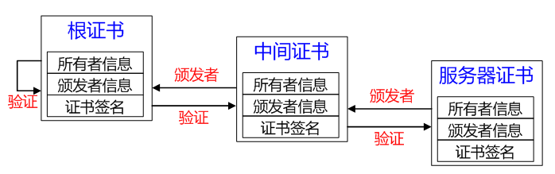

## 一、HTTPS

### 1. 是什么

HTTPS（超文本传输安全协议）是HTTP建立在SSL/TLS上一个传输协议。

本质：要在不可信的网络上建立可信的通道

### 2. 作用

#### 2.1 加密传输的数据

如何加密：先用非对称加密交换对称密钥，再用对称密钥进行数据加密

##### 2.1.1 为什么TLS握手时要用非对称加密交换密钥

>非对称加密，是指加密解密不是同一个密钥，分为公钥和密钥，公钥加密的数据只能由私钥解密
>
>RSA是基于大素数分解难题的加密算法，即因为大素数分解困难，所以难以用公钥推出私钥，反之亦然

**安全**，**利用非对称加密的特点，公钥加密的数据只能由私钥解密**。

一般来说，客户端会存放着公钥，利用公钥把对称密钥加密，那么按理来说，这个密文只有拥有私钥的服务器能解开。

##### 2.1.2 为什么不继续使用非对称加密来加密要传输的数据呢

> 非对称加解密的原理：大数乘法、大数模等运算
>
> 对称加解密的原理：位运算、替换

**不继续使用非对称加密进行数据传输，是一种折衷方案，因为没有一种加解密算法能做到既安全又快速**

使用非对称加密固然安全，但是效率低下，不适合频繁地数据传输，而对称加密的本质是位运算和替换，效率比非对称加密高，所以数据传输时，使用已经交换好了的对称密钥进行加解密。

#### **2.2 身份认证**

在TLS四次握手的时候，客户端会收到服务端下发的证书，利用证书，客户端就能识别建立的另一端是否为真正的服务端

#### 2.3 数据完整性校验

利用非对称加密的另一个用法：**数字签名**，来实现数据完整性的校验

##### 2.3.1 数字签名的原理

也是利用到了非对称加密的特性：私钥加密的内容，只有公钥能解开

生成签名：先把传输的数据进行哈希（哈希值1），利用私钥对哈希值1进行签名

验证签名：先把收到的数据进行哈希（哈希值2），利用公钥把数字签名给解密，对比哈希值1和哈希值2

##### 2.3.2 签名与加密的区别

加密就是你拿到了不该拿的数据，你也解不开

签名就是你做了任何事，都抵赖不了

### 3. 建立过程

HTTPS是基于HTTP上利用SSL/TLS进行加密和身份认证的一种传输协议

HTTPS = HTTP （TCP三次握手）+ SSL/TLS （TLS四次握手）

#### 3.1 TLS第一次握手

客户端会发送一个Client Hello消息，跟服务端打招呼

这个消息里面包含：

- 随机数1: 用于生成对称密钥的材料之一
- TLS版本号
- 支持的加解密算法列表：由多行组成，每一行的结构为“**密钥交换算法 + 签名算法 + 对称加密算法 + 摘要算法**”

##### 3.1.1 服务器有多个域名，怎么知道要返回对应域名的证书呢

客户端在发送Client Hello消息时，会带上对应的请求域名

#### 3.2 TLS第二次握手

服务端收到Client Hello时，会返回**Sever Hello**消息

这个消息里面包含：

- 随机数2: 用于生成对称密钥的材料之一
- 一个合适的加解密算法

除了Server Hello，为了证明自己的身份，服务端还会下发一个**Server Certificate**消息

这个消息里面包含：

- 数字证书：通常由多个证书（证书链）

最后，服务端还会发送一条**Server Hello Done**消息，目的是告诉客户端，东西传完（意味着第二次握手结束）

#### 3.3 客户端校验数字证书（最重要的一步）

收到服务端下发的证书，客户端会校验数字证书的合法性，来确认服务端的身份

##### 3.3.1 数字证书的作用

数字证书是用来认证服务端的身份，以免有人冒充，只有证书合法，才代表服务端是合法的

##### 3.3.2 数字证书包含的信息

- 服务端的公钥
- 服务端的信息（最重要的是域名）
- 证书认证机构的信息
- 生成这个证书所用的算法以及数字签名
- 证书有效期

##### 3.3.3 数字证书是如何生成的

- 服务端向CA机构提交申请信息
  - 服务端的公钥
  - 服务端的信息
- CA机构利用服务端提供的信息，生成一个数字证书，并记录一些额外信息
- CA机构会对证书的内容信息进行哈希计算，得到一个哈希值
- CA机构利用私钥对这个哈希值进行加密，然后放入数字证书中（也就是CA对数字证书进行了签名）

##### 3.3.4 客户端如何校验数字证书

- 客户端会根据数字证书里同样的哈希算法，获取这个数字证书的哈希值1
- 根据数字证书里面的CA机构信息，找到对应的公钥信息，并利用该公钥，对数字证书里面的签名信息进行解密，得到CA机构利用私钥进行签名的哈希值2
- 对比哈希值1和哈希值2，如果相同，这说明该证书可信赖

#### 3.4 TLS第三次握手

**首先**，客户端验证完证书以后，会生成一个新的随机数（pre-master），然后服务器的公钥对pre-master进行加密，并发送**Change Cipher Key Exchange**

这个消息里面包含：

- 用公钥加密过后的pre-master

>  至此，客户端和服务端已经共享了三个随机数：随机数1、随机数2、pre-master
>
> 生成会话密钥（Master Secret）的材料已全部集齐

**其次**，客户端还会发送一个**Change Cipher Spec**消息，用于通知服务端开始使用加密方式发送数据

**然后**，客户端还会发送一个**Encrypted Handshake Message（Finishd）**消息，把之前发送的所有数据做个摘要，再用会话密钥进行加密，让服务端验证一下之前的数据是否有被篡改过

##### 3.4.1 为什么要用随机数来生成会话密钥

本质：提高随机性、安全性，一个随机数只是伪随机，但是三个伪随机就真的接近于随机了

使用三个随机数，是因为TLS协议默认不信任每个主机能产生完全随机的数，如果只客户端直接生成会话密钥，就很容易被破解

#### 3.5 TLS第四次握手

服务器也同样会发送Change Cipher Spec、Encrypted Handshake Message（Finishd）消息，如果双方的加密解密都没问题，那么握手就正式结束

3.6 密钥交换算法

## 二、中间人攻击

就是攻击人与通讯的两端分别建立通信，并交换其所收到的数据

### 1. 实现原理

从上面我们知道，HTTPS最重要的一步是通过内置的CA证书信息来校验服务端下发的数字证书，只要验证通过，就说明该服务端是可信的。

因为**攻击者没有CA机构**用来生成数字签名**的密钥**，所以伪造出来的证书，是**没有办法通过**系统内置的**CA证书公钥进行签名验证**

所以，**想要实现中间人攻击，就让客户端信任攻击者的证书**

如果是浏览器，浏览器会提示该站点证书不可信

#### 1.1 客户端信任中间人的证书

当客户端信任了攻击者的证书，那么攻击者就可以伪造出携带服务端信息的证书了

所以，在客户端看来，中间人就是“服务端”，对于服务端，中间人就是“客户端”。

##### 1.1.1 ARP欺骗

原理：利用了主机不会验证ARP报文的真实性这一点，进行疯狂发送假的ARP报文，去更改这台主机和网关的ARP缓存表，从而实现流量劫持

局限：只能在同一个局域网进行

预防：动态ARP检测

##### 1.1.2 DNS劫持

DNS 劫持即域名劫持，是通过将原域名对应的 IP 地址进行替换从而使得用户访问到错误的网站或者使得用户无法正常访问网站的一种攻击方式

### 2. 如何防范

- 使用HTTPS
- 客户端不要轻易相信证书
- 不要随便连未知的WIFI

## 三、证书链

一般来说，证书验证过程还会存在一条证书信任链的问题，这是因为我们申请的证书，一般是由中间证书签发的

根证书 -> 中间证书 -> 服务端的证书

### 1. 为什么需要中间证书

让根证书可以完全离线保存，安全性更好

### 2. 为什么根证书是可受信的

这是因为根证书是系统自带的，它是不经过网络传输就存储在了系统内部，因此，它不会被伪造，所以它是值得信任的

> 根证书是一个自签发的证书，就是使用者和颁发者是同一个

### 3. 如何维护中间证书

#### 3.1 CRL

CRL（Certificate Revocation List，证书吊销列表） 是由 CA 机构维护的一个列表，列表中包含已经被吊销的证书序列号和吊销时间。浏览器可以定期去下载这个列表用于校验证书是否已被吊销。可以看出，CRL 只会越来越大，而且当一个证书刚被吊销后，浏览器在更新 CRL 之前还是会信任这个证书的，实时性较差。这时，OCSP弥补了这一点缺陷

#### 3.3 OCSP

OCSP（Online Certificate Status Protocol，在线证书状态协议），是一个在线证书查询接口，它建立一个可实时响应的机制，让浏览器发送查询证书请求到CA服务器，然后CA服务器实时响应验证证书是否合法有效，这样可以实时查询每一张证书的有效性，解决了 CRL 的实时性问题。

但是 OCSP 又有另外两个问题：CA服务器上的隐私和性能问题。

由于OCSP要求浏览器直接请求第三方CA以确认证书的有效性，因此会损害隐私。CA知道什么网站访问了该CA以及哪些用户访问了该网站。而这些数据对于跨国业务网站或者政企网站尤为敏感。

另一方面，某些客户端会在 SSL 握手时去实时查询 OCSP 接口，并在获得查询结果前会阻塞后续流程，在网络不佳时（尤其是内陆地区）会造成较长时间的页面空白，降低了HTTPS性能，严重影响用户体验。在服务器上部署OCSP Stapling将可以解决以上问题。

#### 3.3 OCSP Stapling

OCSP Stapling 就是为了解决 OCSP 隐私问题和性能问题而生的。其原理是：网站服务器将自行查询OCSP服务器并缓存响应结果，然后在与浏览器进行TLS连接时返回给浏览器，这样浏览器就不需要再去查询了。因此，浏览器客户端也不再需要向任何第三方披露用户的浏览习惯，完美解决了隐私问题。同时，当有客户端向服务器发起 SSL 握手请求时，服务器将证书的 OCSP 信息随证书链一同发送给客户端，从而避免了客户端验证会产生的阻塞问题，提升了HTTPS性能。由于 OCSP 响应是无法伪造的，因此这一过程也不会产生额外的安全问题。

