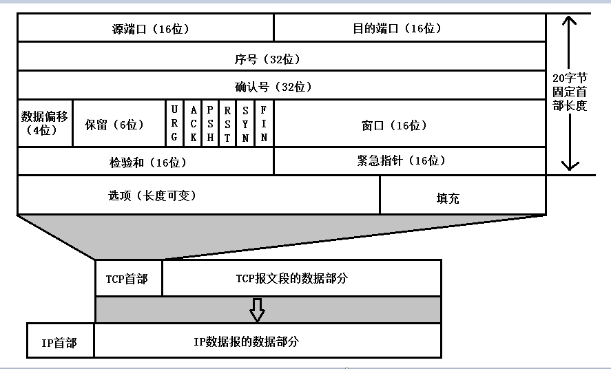

### 一、TCP与UDP的区别

#### TCP的特性

1. 面向连接的、可靠的、基于字节流的传输层通信协议
2. 将应用层的数据流分割成报文段并发送给目标节点的TCP层
3. 数据包都有序号，对方收到则发送ACK确认，未收到则重传
4. 使用校验和来检验数据再传输过程中是否有误	
5. 尽最大努力交付，不保证可靠交付

#### UPD的特性

1. 面向非连接的
2. 不维护连接状态，支持同事多个客户端传输相同的消息
3. 数据包包头只有8个字节，额外开销小
4. 吞吐量只受限于数据生成速率、传输速率以及机器性能
5. 面向报文的，不对应用程序提交的报文信息进行拆分或合并

#### 区别

1. 连接：TCP是面向连接的、而UDP是无连接的
2. 安全：TCP提供可靠的服务，即通过TCP传送的数据是无差错、不丢失、不重复且按需抵达（握手、序号、重传），而UDP尽最大努力交付，即不提供可靠的交付
3. 传输：TCP传输效率相对较低，UDP传输效率高，适用于高速传输和实时性较强的通信
4. 连接数量：TCP只能是点对点、一对一的，而UDP支持一对一，一对多，多对一，多对多
5. 适用场景：TCP适合在分布式高精度计算系统的数据传输，而UDP适合网络语音和在线视频

### 二、TCP三次握手

1. Client将标志位SYN置1，随机产生一个值seq=J，并将该数据包发送给Server，Client进入SYN_SENT状态
2. Server收到数据包后，由标志位SYN=1知道Client请求建立连接，Server将标志位SYN和ACK都置为1，ack=J+1，随机产生一个值seq=k，并将该数据包发送给Client以确认连接请求，Server进入SYN_RCVD状态
3. Client收到确认后，检测ack是否为J+1，ACK是否为1，如果正确则将标志位ACK置为1，ack=K+1，并将该数据包发送给Server。

​       Server检查ack是否为K+1，ACK是否为1，正确则连接建立成功，Client和Server进入ESTABLISHED状态，完成三次握手

#### 为什么需要三次握手

1. **为了初始化双方的Sequence Number**，互相通知对方自己的seq值，作为以后数据通信的序号，以保证应用层接收到的数据不回因为网络传输问题而乱序
2. **为了防止失效的连接请求到达服务器，占用服务器资源**

#### 为什么握手需要三次，而不是两次或四次

**因为两端建立连接之前，要完成资源分配和初始化序列号交换**。所以收到建立连接请求的SYN报文后，把ACK和SYN放在一个报文里发送给客户端了。最少三次交互即可完成

### 三、TCP四次挥手

1. Client发送一个FIN，用来关闭Client到Server的数据传送，Client进入FIN_WAIT_1状态

2. Server收到FIN后，发送一个报文client，确认序号为收到序号+1（与SYN相同，一个FIN占用一个序号），Server进入CLOSE_WAIT状态

   Client收到确认后，就进入了FIN-WAIT-2状态，等待Server发出连接释放报文

3. Server发送一个FIN，用来关闭Server到Client的数据传送，Server进入LAST_ACK状态，最后确认

4. Client收到FIN后，Client进入TIME_WAIT状态，接着发送一个ACK给Server，确认序号为接收序号+1，Server进入CLOSERD状态，完成四次挥手

#### **为什么Client在TIME-WAIT状态必须等到2MSL的时间**

​    **为了保证A发送的最后一个ACK报文能到达B。**假如这个ACK报文丢失了，处于LAST-ACK状态的B收不到确认，会超市憧穿，A就能在2MSL时间内收到这个重传的FIN + ACK报文，再重新启动2MSL计时器

#### 为什么需要四次挥手才能断开

TCP断开连接的目标是：回收资源、终止数据传输。当关闭连接时，收到对方的FIN报文，仅表示对方不再发送数据了，但是还能接收数据（半关闭状态），因此ACK和FIN一般都会分开发送

#### 服务器出现大量CLOSE_WAIT状态的原因

这个状态出现的原因，是为了让服务端发送还未传送完的数据，传送完毕之后，服务端会发送FIN连接释放报文

### 四、TCP如何保证可靠性

#### TCP首部

- 每个TCP段都包含16位的原端口和目的端口，用于寻找发端和收端的应用进程
- 32位的序号用来表示从TCP发端到收端发送的数据字节流，它表示在这个报文段中的第一个数据字节
- 标志位：共有六个，URG、ACK、PSH、RST、SYN、FIN，可多个同时设为1
  - URG: 紧急指针有效
  - ACK：确认序号有效
  - PSH：接收方应该尽快将这个报文段交给应用层
  - RST：重建连接
  - SYN：同步序号，用来发起一个连接
  - FIN：发端完成发送任务
- 首部长度：需要这个值是因为任选字段的长度是可变的。占4位，因此TCP最多有60个字节的首部，正常长度是20字节。
- 窗口：是一个16位字段，大小为字节，因此窗口大小最大为65535字节。TCP的流量控制由连接的每一端通过声明的窗口大小来提供
- 检验和：由发端计算和存储，并由收端进行验证

#### 1. 检验和

	1. 首先将校验和部分归零
 	2. 将TCP首部、数据都划分成16位的一个个16进制数
 	3. 将这些数逐个想家，溢出的部分驾到最低位上
 	4. 将得到的结果取反

#### 2. 确认应答与序列号

 序列号：TCP传输时将每个字节的数据都进行了编号（保证了数据的按序到达，去除重复数据）

 确认应答：TCP传输过程中，每次接收方收到数据后，都会对传输方进行确认应答，也就是ACK报文

#### 3. 超时重传

当报文发出后在一定时间内未收到接收方的确认，发送方就会进行重传

#### 4. 流量控制

如果发送端的发送速度太快，导致接收方的接收缓冲区很快就被填满了。**TCP根据接收方对数据的处理能力，决定发送方的发送速度，这就是流量控制**

在TCP的报头信息中，有一个16位字段的窗口大小，它实际上是接收方接收数据缓冲区的剩余大小，接收方在确认应答发送ACK报文时，将自己的即时窗口大小填入，随ACK报文一起发送过去。

#### 5. 拥塞控制

**流量控制是为了让接收方能来得及接收，而拥塞控制是为了降低整个网络的拥塞程度**

主要是通过四个算法来进行拥塞控制的：慢开始、拥塞避免、快重传、快恢复

- 慢开始：最初执行慢开始，令拥塞窗口(cwnd)设置为1，当收到确认后，cwnd加倍。如果存在超时的丢包时间，则将ssthresh(慢启动阈值)设为cwnd的一半，并将cwnd设为1重新慢开始

- 拥塞避免：当cwnd的值等于ssthresh时，进入拥塞避免模式，每个轮次只将cwnd加1

- 快重传与快速恢复：在接收方，要求每次接收到报文段都应该对最后一个已收到的有序报文段进行确认。例如已经接收到 M1 和 M2，此时收到 M4，应当发送对 M2 的确认。

  在发送方，如果收到三个重复确认，那么可以知道下一个报文段丢失，此时执行快重传，立即重传下一个报文段。例如收到三个 M2，则 M3 丢失，立即重传 M3。

  在这种情况下，只是丢失个别报文段，而不是网络拥塞。因此执行快恢复，令 ssthresh = cwnd / 2 ，cwnd = ssthresh，注意到此时直接进入拥塞避免。

慢开始和快恢复的快慢指的是 cwnd 的设定值，而不是 cwnd 的增长速率。慢开始 cwnd 设定为 1，而快恢复 cwnd 设定为 ssthresh。

