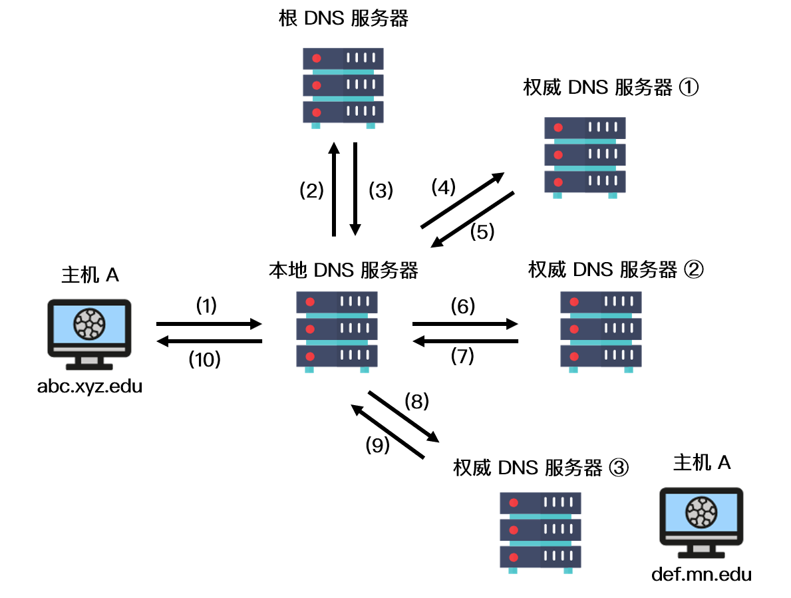

## 一、协议层次以及它们的服务类型


### 1. OSI七层模型

OSI 模型全称为开放式通信系统互连参考模型，是国际标准化组织 ( ISO ) 提出的一个试图使各种计算机在世界范围内互连为网络的标准框架

#### 1.1 应用层

作用：通过应用程序间的交互来完成特定的网络应用。**该层协议定义了应用进程之间的交互规则，通过不同的应用层协议为不同的网络应用提供服务**

协议：DNS、HTTP、SMTP

在应用层交互的数据单元我们称之为**报文**


#### 1.2 表示层

作用：使通信的应用程序能够解释交换数据的含义。该层提供的服务主要包括数据压缩、数据加密以及数据描述


#### 1.3 会话层

作用：负责建立、管理和终止表示层实体之间的通信会话。该层提供了数据交换的定界和同步功能，包括了建立检查点和恢复方案的方法


#### 1.4 传输层

作用：**为两台主机进程之间的通信提供服务。应用程序利用该服务传送应用层报文**。该服务并不针对某一特定的应用，多种营养可以复用同一个运输层服务，同一个运输层服务可以把收到的信息分发给上面应用层的相应进程


#### 1.5 网络层

两台计算机之间传送数据时其通信链路往往不止一条，所传输的信息甚至可能经过很多通信子网

作用：**选择合适的网间路由和交换节点，确保数据按时成功传送**

**在发送数据时，网络层把运输层产生的报文或用户数据报封装成分组和包向下传输到数据链路层**

协议：IP


#### 1.6 数据链路层

两台主机之间的数据传输，总是在一段一段的链路上传送的

作用：**在两个相邻节点之间传送数据时，数据链路层将网络层交下来的 IP 数据报组装成帧，在两个相邻节点间的链路上传送帧**

每一帧包括数据和必要的控制信息。通过控制信息我们可以知道一个帧的起止比特位置，此外，也能使接收端检测出所收到的帧有无差错，如果发现差错，数据链路层能够简单的丢弃掉这个帧，以避免继续占用网络资源


#### 1.7 物理层

作用：实现计算机节点之间比特流的透明传送，尽可能屏蔽掉具体传输介质和物理设备的差异

使其上面的数据链路层不必考虑网络的具体传输介质是什么。该层的主要任务是确定与传输媒体的接口的一些特性（机械特性、电气特性、功能特性，过程特性）。


### 2. TCP/IP参考模型

OSI七层模型是基于标准化的考虑，没有考虑到具体的市场需求，使得该模型结构复杂，部分功能冗余

TCP/IP参考模型是直接面向市场需求的，实现起来也比较容易

#### 2.1 应用层

将OSI模型中的**应用层、表示层、会话层**的功能合并到一个应用层实现

作用：通过不同的应用层协议为不同的应用层提供服务（FTP、Telnet、DNS、SMTP）


#### 2.2 传输层

作用：为上层实体提供源端到对端主机的通信功能

传输层定义了两个主要协议：传输控制协议TCP和用户数据报协议UDP


#### 2.3 网际互联层

作用：主要负责相同或不同的网络中计算机之间的通信


IP协议提供的是一个可靠、无连接的数据报传递服务。该协议实现两个基本功能：寻址和分段

根据数据报报头重的目的地址将数据传送到目的地址，IP负责选择传送线路。

另外两个主要协议是互联网组管理协议IGMP和互联网控制报文协议ICMP


#### 2.4 网络接入层

网络接入层的功能对应于 OSI 参考模型中的**数据链路层和物理层**

作用：负责监视数据在主机和网络之间的交换。

实际上TCP/IP并未真正描述着一层的实现，而由参与互连的各网络使用自己的物理层和数据链路层协议，然后与TCP/IP的网络接入层进行连接


### 3. TCP/IP五层协议

五层体系的协议结构是综合了 OSI 和 TCP/IP 优点的一种协议，包括应用层、传输层、网络层、数据链路层和物理层。其中应用层对应 OSI 的上三层，下四层和 OSI 相同。五层协议的体系结构只是为介绍网络原理而设计的，实际应用还是 TCP/IP 四层体系结构


### 4. OSI模型和TCP/IP模型的异同比较

相同点：

- OSI 参考模型与 TCP/IP 参考模型都采用了层次结构
- 都能够提供面向连接和无连接两种通信服务机制


不同点：

- OSI 采用的七层模型； TCP/IP 是四层结构
- TCP/IP 参考模型没有对网络接口层进行细分，只是一些概念性的描述； OSI 参考模型对服务和协议做了明确的区分
- OSI 先有模型，后有协议规范，适合于描述各种网络；TCP/IP 是先有协议集然后建立模型，不适用于非 TCP/IP 网络
- TCP/IP 一开始就提出面向连接和无连接服务，而 OSI 一开始只强调面向连接服务，直到很晚才开始制定无连接的服务标准
- OSI 参考模型虽然被看好，但将网络划分为七层，实现起来较困难；相反，TCP/IP 参考模型虽然有许多不尽人意的地方，但作为一种简化的分层结构还是比较成功的


### 5. OSI和TCP/IP协议之间的关系


### 6. 为什么去掉了表示层和会话层

OSI 参考模型在提出时，他们的理想是非常好的。但实际上，**由于会话层、表示层、应用层都是在应用程序内部实现的，最终产出的是一个应用数据包，而应用程序之间是几乎无法实现代码的抽象共享的**，这也就造成 OSI 设想中的应用程序维度的分层是无法实现的

所以在后来的 TCP/IP 协议框架的设计中，便将表示层和会话层与应用层整合在一起，让整个过程更为清晰明了


### 7. 数据如何在各层之间进行传输（封装过程）

- 在发送主机端，一个应用层报文被传送到运输层，在最简单的情况下，运输层收取到报文并附上附加信息，该首部将被接收端的运输层使用
- 应用层报文和运输层首部信息一道构成了运输层报文段，附加的信息可能包括：允许接收端运输层向上向适当的应用程序交付报文的信息以及差错检测位信息。该信息让接收端能够判断报文中的比特是否在途中已被改变
- 运输层则向网络层传递该报文段，网络层增加了如源和目的端系统地址等网络层首部信息，生成了网络层数据报
- 该数据报接下来被传递给链路层，在数据链路层数据包添加发送端 MAC 地址和接收端 MAC 地址后被封装成数据帧
- 在物理层数据帧被封装成比特流，之后通过传输介质传送到对端


### 8. 分层的好处

分层的本质是通过分离关注点而让复杂问题简单化，通过分层可以做到：

- 各层独立：限制了依赖关系的范围，各层之间使用标准化的接口，各层不需要知道上下层是如何工作的，增加或者修改一个应用层协议不会影响传输层协议
- 灵活性更好：比如路由器不需要应用层和传输层，分层以后路由器就可以只用加载更少的几个协议层
- 易于测试和维护：提高了可测试性，可以独立的测试特定层，某一层有了更好的实现可以整体替换掉
- 能促进标准化：每一层职责清楚，方便进行标准化


### 9. IP收到数据包解析后，它怎么这个分组应该投递给哪一个协议

网络互联层中IP 头中有个字段 protocol 可用来表示上层用的哪个协议，TCP（6）

1 ICMP，2 IGMP，6 TCP，17 UDP


### 10. 分层结构中，每一层都有自己的标识

数据链路层：MAC地址

网络层：IP地址

传输层：端口


## 二、应用层

### 1. Keep-Alive和非Keep-Alive的区别，对服务器性能有影响吗

在早期的 HTTP/1.0 中，浏览器每次 发起 HTTP 请求都要与服务器创建一个新的 TCP 连接，服务器完成请求处理后立即断开 TCP 连接

对于非 Keep=Alive 来说，必须为每一个请求的对象建立和维护一个全新的连接。对于每一个这样的连接，客户机和服务器都要分配 TCP 的缓冲区和变量，这给服务器带来的严重的负担


建和关闭连接的过程需要消耗资源和时间，为了减少资源消耗，缩短响应时间，就需要重用连接

Keep-Alive 并不是没有缺点的，**当长时间的保持 TCP 连接时容易导致系统资源被无效占用**，若对 Keep-Alive 模式配置不当，将有可能比非 Keep-Alive 模式带来的损失更大。因此，我们需要正确地设置 keep-alive timeout 参数，当 TCP 连接在传送完最后一个 HTTP 响应，该连接会保持 keepalive_timeout 秒，之后就开始关闭这个链接


### 2. HTTP方法


### 3. GET和POST的区别

1. HTTP报文层面：GET将请求信息放在URL，POST放在报文中，想获取请求信息必须解析报文，因此安全性比get高

2. Get可以被缓存、被存储，POST不行

3. GET回退无害，POST回退会重新提交

5. GET符合幂等性，POST不符合。幂等的意味着对同一URL的多个请求应该返回同样的结果

6. GET 参数通过 URL 传递，并且长度有限制，而 POST 放在 request body 并且长度没有限制

7. GET是从服务器上获取数据，POST是向服务器传送数据


### 4. HTTP与HTTPS的工作方式

#### 4.1 HTTP

HTTP（Hyper Text Transfer Protocol: 超文本传输协议） 是一种简单的请求 - 响应协议，被用于在 Web 浏览器和网站服务器之间传递消息

HTTP 使用 TCP（而不是 UDP）作为它的支撑运输层协议。其默认工作在 TCP 协议 80 端口，HTTP 客户机发起一个与服务器的 TCP 连接，一旦连接建立，浏览器和服务器进程就可以通过套接字接口访问 TCP


##### 4.1.1 为什么HTTP要用TCP协议

- 如果使用UDP，那么HTTP在传输文件时可能会经常出错，因为UDP不可靠
- HTTP协议只定义了应用层的东西，所以要下层来保证可靠性，其实也不一定非要HTTP，只要可以保证可靠性传输的传输层协议，都可以用来承接HTTP


##### 4.1.2 HTTP是无状态的协议，那么它如何保存用户的信息

1. 基于Session实现的会话保持

   > 在客户端第一次向服务器发送 HTTP 请求后，服务器会创建一个 Session 对象并将客户端的身份信息以键值对的形式存储下来，然后分配一个会话标识（SessionId）给客户端,这个会话标识一般保存在客户端 Cookie 中，之后每次该浏览器发送 HTTP 请求都会带上 Cookie 中的 SessionId 到服务器，服务器根据会话标识就可以将之前的状态信息与会话联系起来，从而实现会话保持
   >
   > 实现方式：**Cookie、URL回写实现（就是把session id直接附加在URL路径的后面），表单隐藏字段**
   >
   > 优点：安全，因为状态信息保存在服务器端
   >
   > 缺点：假如用的是分布式服务器，可能信息会落到不同的服务器上，导致找不到Session（采用中间件解决，利用Redis解决）
   >
   > ​			占用服务器的资源
   >
   > 

2. 基于Cookie实现的会话保持

   > 当服务器发送响应消息时，在 HTTP 响应头中设置 Set-Cookie 字段，用来存储客户端的状态信息。客户端解析出 HTTP 响应头中的字段信息，并根据其生命周期创建不同的 Cookie，这样一来每次浏览器发送 HTTP 请求的时候都会带上 Cookie 字段，从而实现状态保持。基于 Cookie 的会话保持与基于 Session 实现的会话保持最主要的区别是前者完全将会话状态信息存储在浏览器 Cookie 中
   >
   > 优点：服务器不用保存状态，减少服务器存储压力
   >
   > 缺点：不安全，因为会话的信息存在客户端上，意味着会话中不能有机密信息
   >
   > ​           每次请求都需要额外发送Cookie，会占用更多带宽

Cookie被禁用了怎么办？可以通过重写 URL 的方式将会话标识放在 URL 的参数里，也可以实现会话保持


##### 4.1.3 HTTP状态码

200 ok：正常返回信息

201 Created：已创建。成功请求并创建了新的资源

202 Accepted：已接受。已经接受请求，但未处理完成

203 Non-Atuoriative Information: 非授权信息。请求成功

204 No Content：无内容。服务器成功处理，但未返回内容

205 Reset Content: 重置内容，服务器处理成功

206 Partial Content: 成功处理了部分内容


300 Multiple Choices：多种选择。被请求的资源有一系列可供选择的回馈信息，用户或浏览器能够自行选择一个首选地址进行重定向

301 Moved Permanently: 永久移动，请求的资源已被永久的移动到新URI，返回信息会包括新的URI

302 FOUND：临时移动，客户端应继续使用原有的URI


400 Bad Request: 客户端请求的语法错误，服务器无法理解

401 Unauthorizied：请求要求用户的身份认证

402 Payment Required：保留，将来使用

403 Forbidden：服务器理解客户端的请求，但拒绝执行此请求

404 Not Found：资源无法找到

405 Method Not Allowed：请求中的方被禁止

406 Not Acceptable：服务器无法根据客户端请求的内容特性完成请求


500 Internal Server Error：服务器发生不可预期的错误

501 Not Implement： 服务器不支持当前请求所需要的某个功能

502 Bad Gateway：请求未完成，服务器从上游服务器收到一个无效的响应

503 Service Unavaliable： 由于临时的服务器维护或者过载，服务器当前无法处理请求，一段时间后可能恢复正常

504 Gateway Time-out：充当网关或代理的服务器，未及时从远端服务器获取请求


#### 4.2 HTTPS

HTTPS（Hyper Text Transfer Protocol over Secure Socket Layer）是以安全为目标的 HTTP 协议，在 HTTP 的基础上通过传输加密和身份认证的方式保证了传输过程的安全性


##### 4.2.1 HTTPS的工作流程

- 浏览器将支持的加密算法信息发送给服务器
- 服务器选择一套浏览器支持的加密算法，以证书（证书发布的CA机构，证书的有效期，公钥，证书所有者，还有签名等）的形式发送给浏览器
- 浏览器验证证书合法性，并结合证书公钥加密信息发送给服务器
- 服务器使用私钥解密信息，验证哈希，加密响应消息回发浏览器
- 浏览器解密响应信息，并对消息进行验真，之后进行加密交互数据


https://blog.csdn.net/ustccw/article/details/76691248


##### 4.2.2 HTTP与HTTPS的区别

- HTTP 协议以明文方式发送内容，数据都是未加密的，安全性较差。HTTPS 数据传输过程是加密的，安全性较好
- HTTP 和 HTTPS 使用的是完全不同的连接方式，用的端口也不一样，前者是 80 端口，后者是 443 端口
- HTTPS 协议需要到数字认证机构（Certificate Authority, CA）申请证书，一般需要一定的费用
- HTTP 页面响应比 HTTPS 快，主要因为 HTTP 使用 3 次握手建立连接，客户端和服务器需要握手 3 次，而 HTTPS 除了 TCP 的 3 次握手，还需要经历一个 SSL 协商过程


##### 4.2.3 怎么保证去CA机构认证CA证书时不被伪造

**假设中间人篡改了证书原文，由于他没有 CA 机构的私钥，所以无法得到此时加密后的签名，因此无法篡改签名**

客户端浏览器收到该证书后会发现原文和签名解密后的值不一致，则说明证书被中间人篡改，证书不可信，从而终止向服务器传输信息


例如中间人拿到了 CA 机构认证的证书，它想窃取网站 A 发送给客户端的信息，于是它成为中间人拦截到了 A 传给客户端的证书，然后将其替换为自己的证书。此时客户端浏览器收到的是被中间人掉包后的证书，但由于**证书里包含了客户端请求的网站信息，因此客户端浏览器只需要把证书里的域名与自己请求的域名比对一下就知道证书有没有被掉包**了


证书是需要申请，并由专门的数字证书认证机构(CA)通过非常严格的审核之后颁发的电子证书。颁发证书的同时会产生一个私钥和公钥。私钥由服务端自己保存，不可泄漏。公钥则是附带在证书的信息中，可以公开的。证书本身也附带一个证书电子签名，这个签名用来验证证书的完整性和真实性，可以防止证书被串改。这里如果被替换的证书如果不是client的信任CA列表签发的，这个篡改证书一样过不了客户端的校验。另外，证书还有个有效期


### 4.2 证书链

如 CA根证书和服务器证书中间增加一级证书机构，即中间证书，证书的产生和验证原理不变，只是增加一层验证，只要最后能够被任何信任的CA根证书验证合法即可。
  a.服务器证书 server.pem 的签发者为中间证书机构 inter，inter 根据证书 inter.pem 验证 server.pem 确实为自己签发的有效证书;
  b.中间证书 inter.pem 的签发 CA 为 root，root 根据证书 root.pem 验证 inter.pem 为自己签发的合法证书;
  c.客户端内置信任 CA 的 root.pem 证书，因此服务器证书 server.pem 的被信任


#### 4.2.1 证书链的优势

- 同一本服务器证书可能存在多条合法的证书链。
    因为证书的生成和验证基础是公钥和私钥对，如果采用相同的公钥和私钥生成不同的中间证书，针对被签发者而言，该签发机构都是合法的 CA，不同的是中间证书的签发机构不同;

- 不同证书链的层级不一定相同，可能二级、三级或四级证书链。
    中间证书的签发机构可能是根证书机构也可能是另一个中间证书机构，所以证书链层级不一定相同。

  

#### 4.2.2 二级证书的优势

- 减少根证书结构的管理工作量，可以更高效的进行证书的审核与签发;

- **根证书一般内置在客户端（浏览器或操作系统）中**，私钥一般离线存储，一旦私钥泄露，则吊销过程非常困难，无法及时补救;
- 中间证书结构的私钥泄露，则可以快速在线吊销，并重新为用户签发新的证书;

- 证书链四级以内一般不会对 HTTPS 的性能造成明显影响。 


### 4.3 HTTP1.0和HTTP1.1的区别

- 缓存处理：在 HTTP/1.0 中主要使用 header 里的 if-modified-Since, Expries 来做缓存判断的标准。而 HTTP/1.1 请求头中添加了更多与缓存相关的字段，从而支持更为灵活的缓存策略，例如 Entity-tag, If-Unmodified-Since, If-Match, If-None-Match 等可供选择的缓存头来控制缓存策略
- 节约带宽：当客户端请求某个资源时，HTTP/1.0 默认将该资源相关的整个对象传送给请求方，但很多时候可能客户端并不需要对象的所有信息。而在 HTTP/1.1 的请求头中引入了 range 头域，它允许只请求部分资源，其使得开发者可以多线程请求某一资源，从而充分的利用带宽资源，实现高效并发
- 错误通知的管理：TTP/1.1 在 1.0 的基础上新增了 24 个错误状态响应码，例如 **414 表示客户端请求中所包含的 URL 地址太长，以至于服务器无法处理**；410 表示所请求的资源已经被永久删除
- Host请求头：早期 HTTP/1.0 中认为每台服务器都绑定一个唯一的 IP 地址并提供单一的服务，请求消息中的 URL 并没有传递主机名。而随着虚拟主机的出现，一台物理服务器上可以存在多个虚拟主机，并且它们共享同一个 IP 地址。为了支持虚拟主机，HTTP/1.1 中添加了 host 请求头，请求消息和响应消息中应声明这个字段，若请求消息中缺少该字段时服务端会响应一个 404 错误状态码
- **长连接**：HTTP/1.0 默认浏览器和服务器之间保持短暂连接，浏览器的每次请求都需要与服务器建立一个 TCP 连接，服务器完成后立即断开 TCP 连接。HTTP/1.1 默认使用的是持久连接，其支持在同一个 TCP 请求中传送多个 HTTP 请求和响应


### 4.4 HTTP 1.X 和 HTTP 2.0 的区别

- 相比于 HTTP/1.X 的文本（字符串）传送， **HTTP/2.0 采用二进制传送**。客户端和服务器传输数据时把数据分成帧，帧组成了数据流，流具有流 ID 标识和优先级，通过优先级以及流依赖能够一定程度上解决关键请求被阻塞的问题

- HTTP/2.0 支持多路复用。因为流 ID 的存在， 通过同一个 HTTP 请求可以实现多个 HTTP 请求传输，客户端和服务器可以通过流 ID 来标识究竟是哪个流从而定位到是哪个 HTTP 请求
- HTTP/2.0 头部压缩。HTTP/2.0 通过 gzip 和 compress 压缩头部然后再发送，同时通信双方会维护一张头信息表，所有字段都记录在这张表中，在每次 HTTP 传输时只需要传头字段在表中的索引即可，大大减小了重传次数和数据量


### 4.5 HTTP 3.0 

HTTP/2存在的问题：HTTP/2 多路复用只是减少了连接数，其队头的拥塞问题并没有完全解决，倘若 TCP 丢包率过大，则 HTTP/2 的表现将不如 HTTP/1.1


#### 4.5.1 QUIC协议

QUIC（Quick UDP Internet Connections），直译为快速 UDP 网络连接，是谷歌制定的一种基于 UDP 的低延迟传输协议。其主要目的是解决采用传输层 TCP 协议存在的问题，同时满足传输层和应用层对多连接、低延迟等的需求。该协议融合了 TCP, TLS, HTTP/2 等协议的特性，并基于 UDP传输

- QUIC 复用了 HTTP/2 协议的多路复用功能，由于 QUIC 基于 UDP，所以也避免了 HTTP/2存在的队头阻塞问题
- 低延迟连接。当客户端第一次连接服务器时，QUIC 只需要 1 RTT（Round-Trid Time）延迟就可以建立安全可靠的连接（采用 TLS 1.3 版本），相比于 TCP + TLS 的 3 次 RTT 要更加快捷。可缓存加密的认证信息，再次连接是可实现0RTT的连接建立延迟
- QUIC 的报文是经过加密和认证的，除了少量的报文，其它所有的 QUIC 报文头部都经过了认证，报文主体经过了加密。只要有攻击者篡改 QUIC 报文，接收端都能及时发现。
- 具有向前纠错机制，每个数据包携带了除了本身内容外的部分其他数据包的内容，使得在出现少量丢包的情况下，尽量地减少其它包的重传次数，其通过牺牲单个包所携带的有效数据大小换来更少的重传次数，这在丢包数量较小的场景下能够带来一定程度的性能提升

#### 4.5.2 HTTP 3

HTTP/3 是在 QUIC 基础上发展起来的，其底层使用 UDP 进行数据传输，上层仍然使用 HTTP/2

- 使用 UDP 作为传输层进行通信
- 在 UDP 之上的 QUIC 协议保证了 HTTP/3 的安全性。QUIC 在建立连接的过程中就完成了 TLS 加密握手
- 建立连接快，正常只需要 1 RTT 即可建立连接。如果有缓存之前的会话信息，则直接验证和建立连接，此过程 0 RTT。建立连接时，也可以带有少量业务数据
- 不和具体底层连接绑定，QUIC 为每个连接的两端分别分配了一个唯一 ID，上层连接只认这对逻辑 ID。网络切换或者断连时，只需要继续发送数据包即可完成连接的建立


### 4.6 SSL和TLS的定义和区别

SSL：（Secure Socket Layer，安全套接字层），位于可靠的面向连接的网络层协议和应用层协议之间的一种协议层。SSL通过互相认证、使用数字签名确保完整性、使用加密确保私密性，以实现客户端和服务器之间的安全通讯。该协议由两层组成：SSL记录协议和SSL握手协议。

TLS：(Transport Layer Security，传输层安全协议)，用于两个应用程序之间提供保密性和数据完整性。该协议由两层组成：TLS记录协议和TLS握手协议


TLS的主要目标是使SSL更安全，并使协议更完善和精确，主要增强如下：

- 更安全的MAC算法。TLS使用的HMAC算法比SSL的MAC算法更安全
- 更严格的警报。TLS支持几乎所有的SSL3.0报警代码，而且TLS还补充了很多报警代码，如解密失败、记录溢出、未知CA等
- “灰色区域”规范的更明确定义。


### 5. DNS的作用和原理

#### 5.1 DNS

DNS（Domain Name System）是域名系统的英文缩写，是一种组织成域层次结构的计算机和网络服务命名系统，用于 TCP/IP 网络


#### 5.2 DNS的作用

通常我们有两种方式来识别主机，通过主机名或者IP

**人们喜欢便于记忆的主机名来识别，而路由器则喜欢定长的、有着层次结构的IP地址**

为了满足这些不同的偏好，我们就**需要一种能够进行主机名到 IP 地址转换的目录服务，域名系统作为将域名和 IP 地址相互映射的一个分布式数据库，能够使人更方便地访问互联网**


#### 5.3 DNS域名解析原理

DNS 采用了分布式的设计方案，其域名空间采用一种树形的层次结构：**从上到下依次为根域名服务器、顶级域名服务器和权威域名服务器**


还有一类重要的 DNS 服务器，叫做本地 DNS 服务器。本地 DNS 服务器严格来说不在 DNS 服务器的层次结构中，但它对 DNS 层次结构是很重要的。一般来说，每个网络服务提供商（ISP） 都有一台本地 DNS 服务器。当主机与某个 ISP 相连时，该 ISP 提供一台主机的 IP 地址，该主机具有一台或多台其本地 DNS 服务器的 IP 地址


**工作原理：以def.mn.edu为例**

- 主机先向它的本地DNS服务器发送一个DNS查询报文。该报文包含需要被转换的def.mn.edu
- 本地DNS服务器将该报文转发到根DNS服务器，根DNS服务器注意到查询的IP地址为edu后，向本地DNS服务器返回负责edu的顶级域名服务器的IP地址列表
- 该本地DNS再次向这些顶级服务器发送查询报文，该顶级域名服务器注意到 [mn.edu](http://mn.edu/) 的前缀，并用权威域名服务器的 IP 地址进行响应
- 通常情况下，顶级域名服务器并不总是知道每台主机的权威 DNS 服务器的 IP 地址，而只知道中间的某个服务器，该中间 DNS 服务器依次能找到用于相应主机的 IP 地址
- 我们假设中间经历了权威服务器 ① 和 ②，最后找到了负责 def.mn.edu 的权威 DNS 服务器 ③，之后，本地 DNS 服务器直接向该服务器发送查询报文从而获得主机 B 的IP 地址




在上图中，IP 地址的查询其实经历了两种查询方式，分别是递归查询和迭代查询

- 递归查询：如果主机所询问的本地域名服务器不知道被查询域名的 IP 地址，那么本地域名服务器就以 DNS 客户端的身份，向其他根域名服务器继续发出查询请求报文，即替主机继续查询，而不是让主机自己进行下一步查询，如上图步骤（1）和（10）。
- 迭代查询：当根域名服务器收到本地域名服务器发出的迭代查询请求报文时，要么给出所要查询的 IP 地址，要么告诉本地服务器下一步应该找哪个域名服务器进行查询，然后让本地服务器进行后续的查询，如上图步骤（2）~（9）。


#### 5.4 为什么DNS使用UDP

更正确的答案是 DNS 既使用 TCP 又使用 UDP。

当进行区域传送（主域名服务器向辅助域名服务器传送变化的那部分数据）时会使用 TCP，因为数据同步传送的数据量比一个请求和应答的数据量要多，而 TCP 允许的报文长度更长，因此为了保证数据的正确性，会使用基于可靠连接的 TCP。

当客户端向 DNS 服务器查询域名 ( 域名解析) 的时候，一般返回的内容不会超过 UDP 报文的最大长度，即 512 字节。用 UDP 传输时，不需要经过 TCP 三次握手的过程，从而大大提高了响应速度，但这要求域名解析器和域名服务器都必须自己处理超时和重传从而保证可靠性。


#### 5.5 怎么实现DNS劫持的

**DNS 劫持即域名劫持，是通过将原域名对应的 IP 地址进行替换从而使得用户访问到错误的网站或者使得用户无法正常访问网站的一种攻击方式**

攻击者可以冒充原域名所属机构，通过电子邮件的方式修改组织机构的域名注册信息，或者将域名转让给其它组织，并将新的域名信息保存在所指定的 DNS 服务器中，从而使得用户无法通过对原域名进行解析来访问目的网址


具体的实施步骤：

- 获取要劫持的域名信息：攻击者首先会访问域名查询站点查询要劫持的域名信息
- 控制域名相应的 E-MAIL 账号：在获取到域名信息后，攻击者通过暴力破解或者专门的方法破解公司注册域名时使用的 E-mail 账号所对应的密码。更高级的攻击者甚至能够直接对 E-mail 进行信息窃取
- 修改注册信息：当攻击者破解了 E-MAIL 后，会利用相关的更改功能修改该域名的注册信息，包括域名拥有者信息，DNS 服务器信息
- 使用 E-MAIL 收发确认函：在修改完注册信息后，攻击者在 E-mail 真正拥有者之前收到修改域名注册信息的相关确认信息，并回复确认修改文件，待网络公司恢复已成功修改信件后，攻击者便成功完成 DNS 劫持


预防手段：

- 直接通过 IP 地址访问网站，避开 DNS 劫持
- 由于域名劫持往往只能在特定的网络范围内进行，因此一些高级用户可以通过网络设置让 DNS 指向正常的域名服务器以实现对目的网址的正常访问，例如将计算机首选 DNS 服务器的地址固定为 8.8.8.8


### 6. 套接字有哪些

套接字（Socket）是对网络中不同主机上的应用进程之间进行双向通信的端点的抽象，网络进程通信的一端就是一个套接字，不同主机上的进程便是通过套接字发送报文来进行通信

有三种类型：

- 流套接字（SOCK_STREAM）：流套接字基于 TCP 传输协议，主要用于提供面向连接、可靠的数据传输服务。由于 TCP 协议的特点，使用流套接字进行通信时能够保证数据无差错、无重复传送，并按顺序接收，通信双方不需要在程序中进行相应的处理
- 数据报套接字（SOCK_DGRAM）：和流套接字不同，数据报套接字基于 UDP 传输协议，对应于无连接的 UDP 服务应用。该服务并不能保证数据传输的可靠性，也无法保证对端能够顺序接收到数据。此外，通信两端不需建立长时间的连接关系，当 UDP 客户端发送一个数据给服务器后，其可以通过同一个套接字给另一个服务器发送数据。当用 UDP 套接字时，丢包等问题需要在程序中进行处理
- 原始套接字（SOCK_RAW）：由于流套接字和数据报套接字只能读取 TCP 和 UDP 协议的数据，当需要传送非传输层数据包（例如 Ping 命令时用的 ICMP 协议数据包）或者遇到操作系统无法处理的数据包时，此时就需要建立原始套接字来发送


### 7. URI（统一资源标识符）和 URL（统一资源定位符）之间的区别

URL，即统一资源定位符 (Uniform Resource Locator )，URL 其实就是我们平时上网时输入的网址，它标识一个互联网资源，并指定对其进行操作或获取该资源的方法

URI 是一种语义上的抽象概念，可以是绝对的，也可以是相对的，而URL则必须提供足够的信息来定位，是绝对的。简单地说，只要能唯一标识资源的就是 URI，在 URI 的基础上给出其资源的访问方式的就是 URL。


### 8. 为什么抓包工具能抓到你的包

**假如我们需要抓取客户端的数据包，需要监控客户端与服务器交互之间的网络节点，监控其中任意一个网络节点（网卡），获取所有经过网卡中的数据，对这些数据按照网络协议进行解析，这就是抓包的基本原理**

中间的网络节点是不受我们控制的，所以我们只能在客户端或者服务端进行抓包


#### 8.1 抓取HTTP的数据报

- **首先抓包工具会提出代理服务，客户端需要连接该代理**
- 客户端发出 HTTP 请求时，会经过抓包工具的代理，抓包工具将请求的原文进行展示
- 抓包工具使用该原文将请求发送给服务器
- 服务器返回结果给抓包工具，抓包工具将返回结果进行展示
- 抓包工具将服务器返回的结果原样返回给客户端

这里抓包工具相当于透明人，数据经过的时候它一只手接到数据，然后另一只手把数据传出去。


#### 8.2 抓取HTTPS的数据报

- **客户端连接抓包工具提供的代理服务，并安装抓包工具的根证书**
- 客户端发出 HTTPS 请求，抓包工具模拟服务器与客户端进行 TLS 握手交换密钥等流程
- 抓包工具发送一个 HTTPS 请求给客户端请求的目标服务器，并与目标服务器进行 TLS 握手交换密钥等流程
- 客户端使用与抓包工具协定好的密钥加密数据后发送给抓包工具
- 抓包工具使用与客户端协定好的密钥解密数据，并将结果进行展示
- 抓包工具将解密后的客户端数据，使用与服务器协定好的密钥进行加密后发送给目标服务器
- 服务器解密数据后，做对应的逻辑处理，然后将返回结果使用与抓包工具协定好的密钥进行加密发送给抓包工具
- 抓包工具将服务器返回的结果，用与服务器协定好的密钥解密，并将结果进行展示
- 抓包工具将解密后的服务器返回数据，使用与客户端协定好的密钥进行加密后发送给客户端
- 客户端解密数据

这个时候抓包工具对客户端来说相当于服务器，对服务器来说相当于客户端。在这个传输过程中，客户端会以为它就是目标服务器，服务器也会以为它就是请求发起的客户端


只要授信抓包工具的根证书，下面步骤才成立


### 9. 如果你访问一个网站很慢，怎么排查和解决

- **查看本地网络是否正常**。查看网络带宽是否被占用，例如当你正在下载电影时并且没有限速，是会影响你打开网页的速度的，这种情况往往是处理器内存小导致的
- 网速测试正常，可以对服务器速度进行排查。**通过 ping 命令查看链接到服务器的时间和丢包等情况**，观察丢包率和ping值
- 从网站本身找原因


### 10. 其他协议

#### 10.1 FTP

- FTP（File Transfer Protocol，文件传输协议）是用于在网络上进行文件传输的一套标准协议，使用客户/服务器模式，使用 TCP 数据报，提供交互式访问，双向传输
- TFTP（Trivial File Transfer Protocol，简单文件传输协议）一个小且易实现的文件传输协议，也使用客户/服务器方式，使用 UDP 数据报，只支持文件传输而不支持交互，没有列目录，不能对用户进行身份鉴定


#### 10.2 SMTP

SMTP（Simple Main Transfer Protocol，简单邮件传输协议）是在 Internet 传输 Email 的标准，是一个相对简单的基于文本的协议。在其之上指定了一条消息的一个或多个接收者（在大多数情况下被确认是存在的），然后消息文本会被传输。可以很简单地通过 Telnet 程序来测试一个 SMTP 服务器。SMTP 使用 TCP 端口 25。


#### 10.3 DHCP

DHCP ( Dynamic Host Configuration Protocol，动态主机设置协议 ) 是一个**局域网的网络协议**，使用 UDP 协议工作，主要有两个用途

- 用于内部网络或网络服务供应商自动分配 IP 地址给用户
- 用于内部网络管理员作为对所有电脑作中央管理的手段


#### 10.4 SNMP

SNMP（Simple Network Management Protocol，简单网络管理协议）构成了互联网工程工作小组（IETF，Internet Engineering Task Force）定义的 Internet 协议族的一部分。该协议能够支持网络管理系统，用以监测连接到网络上的设备是否有任何引起管理上关注的情况


10.5 NAT


### 11. 网页解析全过程


① DNS 解析：当用户输入一个网址并按下回车键的时候，浏览器获得一个域名，而在实际通信过程中，我们需要的是一个 IP 地址，因此我们需要先把域名转换成相应 IP 地址。【具体细节参看问题 16，17】

② TCP 连接：浏览器通过 DNS 获取到 Web 服务器真正的 IP 地址后，便向 Web 服务器发起 TCP 连接请求，通过 TCP 三次握手建立好连接后，浏览器便可以将 HTTP 请求数据发送给服务器了。【三次握手放在传输层详细讲解】

③ 发送 HTTP 请求：浏览器向 Web 服务器发起一个 HTTP 请求，HTTP 协议是建立在 TCP 协议之上的应用层协议，其本质是在建立起的TCP连接中，按照HTTP协议标准发送一个索要网页的请求。在这一过程中，会涉及到负载均衡等操作。

拓展：什么是负载均衡？

负载均衡，英文名为 Load Balance，其含义是指将负载（工作任务）进行平衡、分摊到多个操作单元上进行运行，例如 FTP 服务器、Web 服务器、企业核心服务器和其他主要任务服务器等，从而协同完成工作任务。负载均衡建立在现有的网络之上，它提供了一种透明且廉价有效的方法扩展服务器和网络设备的带宽、增加吞吐量、加强网络处理能力并提高网络的灵活性和可用性。

负载均衡是分布式系统架构设计中必须考虑的因素之一，例如天猫、京东等大型用户网站中为了处理海量用户发起的请求，其往往采用分布式服务器，并通过引入反向代理等方式将用户请求均匀分发到每个服务器上，而这一过程所实现的就是负载均衡。

④ 处理请求并返回：服务器获取到客户端的 HTTP 请求后，会根据 HTTP 请求中的内容来决定如何获取相应的文件，并将文件发送给浏览器。

⑤ 浏览器渲染：浏览器根据响应开始显示页面，首先解析 HTML 文件构建 DOM 树，然后解析 CSS 文件构建渲染树，等到渲染树构建完成后，浏览器开始布局渲染树并将其绘制到屏幕上。

⑥ 断开连接：客户端和服务器通过四次挥手终止 TCP 连接。【其中的细节放在传输层详细讲解】


## 三、传输层

### 1. 三次握手


三次握手是 TCP 连接的建立过程。在握手之前，主动打开连接的客户端结束 CLOSE 阶段，被动打开的服务器也结束 CLOSE 阶段，并进入 LISTEN 阶段。随后进入三次握手阶段

 **通过三次握手协商好双方后续通信的起始序列号、窗口缩放大小等信息**

- 首先客户端会发送SYN包给服务端，并等待服务端确认
  - 标志位为SYN，表示请求建立连接
  - 序号为seq=X
  - 随后客户端进入了SYN-SENT阶段
- 服务端接收到客户端的SYN包之后，对该包进行确认后就结束LISTEN阶段，并返回一段TCP报文
  - 标志位为SYN和ACK，表示确认客户端的报文seq序号有效，服务器能正常接收客户端发送的数据，并同意建立连接
  - 序号seq为y
  - 确认号ack=x+1，表示收到客户端的序号seq并将其加1作为自己确认号ack的值，随后服务端进入SYN-RCVD的阶段
- 客户端接收到服务端发送的SYN+ACK包后，明确了客户端到服务端的数据传输是正常的，从而结束掉SYN-SENT阶段，并返回最后一段报文
  - 标志位为ACK，表示确认收到服务端同意建立连接的信号
  - 序号seq为x+1，表示收到服务端的确认号ack，并将其作为自己的序号值
  - 确认号为y+1，表示收到服务端的序号值seq，并将其加1作为自己的确认号ack的值
  - 随后客户端进入ESTABLISHED阶段

服务端收到客户端的ACK报文之后，得知从服务端到客户端的数据传输是正常的，从而结束了SYN-RCVD阶段，进入 ESTABLISHED 阶段，从而完成三次握手


#### 1.1 如果三次握手的时候每次握手信息对方没有收到会怎样

- 若第一次握手服务器未接收到客户端请求建立连接的数据包时，服务器不会进行任何相应的动作，而客户端由于在一段时间内没有收到服务器发来的确认报文， 因此会**等待一段时间后重新发送 SYN 同步报文**，若仍然没有回应，则重复上述过程**直到发送次数超过最大重传次数限制**后，建立连接的系统调用会返回 -1。
- 若第二次握手客户端未接收到服务器回应的 ACK 报文时，**客户端会采取第一次握手失败时的动作**，而**服务器端此时将阻塞在 accept() 系统调用**处等待 client 再次发送 ACK 报文
- 若第三次握手**服务器未接收到客户端发送过来的 ACK 报文，同样会采取类似于客户端的超时重传机制，若重传次数超过限制后仍然没有回应**，则 accep() 系统调用返回 -1，**服务器端连接建立失败**。但此时客户端认为自己已经连接成功了，因此开始向服务器端发送数据，但是服务器端的 accept() 系统调用已返回，此时没有在监听状态。**因此服务器端接收到来自客户端发送来的数据时会发送 RST 报文给 客户端，消除客户端单方面建立连接的状态**


#### 1.2 为什么要三次握手？两次可以吗？四次呢？

- 确认自己和对方的发送和接收都是正常的
  - 第一次保证了客户端发送的是正常的
  - 第二次保证了服务端的收发是正常的
  - 第三次保证了客户端的接收是正常的
- **为了初始化双方的Sequence Number**，互相通知对方自己的seq值，作为以后数据通信的序号，以保证应用层接收到的数据不回因为网络传输问题而乱序。所以收到建立连接请求的SYN报文后，把ACK和SYN放在一个报文里发送给客户端了。最少三次交互即可完成
- **为了防止失效的连接请求到达服务器，占用服务器资源**


#### 1.3 第二次握手传回了ACK，为什么还要传回SYN

ACK 是为了告诉客户端发来的数据已经接收无误，而传回 SYN 是为了告诉客户端，服务端请求连接


#### 1.4 SYN FLOOD是什么

是种典型的DoS(拒绝服务)攻击，目的是通过消耗服务器所有可用资源使服务器无法用于处理合法请求。

通过重复发送初始连接请求(SYN)数据包，攻击者能够压倒目标服务器上的所有可用端口，导致目标设备根本不响应合法请求


在 TCP 建立连接的过程中，因为服务端不确定自己发给客户端的 SYN-ACK 消息或客户端反馈的 ACK 消息是否会丢在半路，所以会给每个待完成的半开连接状态设一个定时器，如果超过时间还没有收到客户端的 ACK 消息，则重新发送一次 SYN-ACK 消息给客户端，直到重试超过一定次数时才会放弃

服务端为了维持半开连接状态，需要分配内核资源维护半开连接。当攻击者伪造海量的虚假 IP 向服务端发送 SYN 包时，就形成了 SYN FLOOD 攻击。攻击者故意不响应 ACK 消息，导致服务端被大量注定不能完成的半开连接占据，直到资源耗尽，停止响应正常的连接请求


 解决方法：

- 直接的方法是**提高 TCP 端口容量的同时减少半开连接的资源占用时间**，然而该方法只是稍稍提高了防御能力
- 部署能够辨别恶意 IP 的路由器，将伪造 IP 地址的发送方发送的 SYN 消息过滤掉，该方案作用一般不是太大

根本解决方法：

- **SYN Cache**：该方法首先构造一个全局 Hash Table，用来缓存系统当前所有的半开连接信息。在 Hash Table 中的每个桶的容量大小是有限制的，当桶满时，会主动丢掉早来的信息。当服务端收到一个 SYN 消息后，会通过一个映射函数生成一个相应的 Key 值，使得当前半连接信息存入相应的桶中。当收到客户端正确的确认报文后，服务端才开始分配传输资源块，并将相应的半开连接信息从表中删除。和服务器传输资源相比，维护表的开销要小得多

- SYN Cookies：SYN Cookie 的原理是基于「无状态」的机制，服务端收到 SYN 包以后不马上分配为 `Inbound SYN`分配内存资源，而是根据这个 SYN 包计算出一个 Cookie 值，作为握手第二步的序列号回复 SYN+ACK，等对方回应 ACK 包时校验回复的 ACK 值是否合法，如果合法才三次握手成功，分配连接资源。


#### 1.5 为什么 SYN 段不携带数据却要消耗一个序列号呢？

**SYN 报文不携带数据，但是它占用一个序号，下次发送数据序列号要加一**

凡是消耗序列号的 TCP 报文段，一定需要对端确认。如果这个段没有收到确认，会一直重传直到达到指定的次数为止。


#### 1.6 初始化序列号能够是固定值

不能，TCP 连接四元组（源 IP、源端口号、目标 IP、目标端口号）唯一确定，所以就算所有的连接 ISN 都是一个固定的值，连接之间也是不会互相干扰的。但是会有几个严重的问题


1、出于安全性考虑。如果被知道了连接的ISN，很容易构造一个在对方窗口内的序列号，源 IP 和源端口号都很容易伪造，这样一来就可以伪造 RST 包，将连接强制关闭掉了。如果采用动态增长的 ISN，要想构造一个在对方窗口内的序列号难度就大很多了。

2、因为开启 SO_REUSEADDR 以后端口允许重用，收到一个包以后不知道新连接的还是旧连接的包因为网络的原因姗姗来迟，造成数据的混淆。如果采用动态增长的 ISN，那么可以保证两个连接的 ISN 不会相同，不会串包。


### 1.7 TFO (TCP FAST OPEN)


在开启 TCP Fast Open以后，从第二次请求开始，就可以在一个 RTT 时间拿到响应的数据。

还有一些其它的优点，比如可以防止 SYN-Flood 攻击之类的


### 2. 四次挥手


四次挥手即 TCP 连接的释放，这里假设客户端主动释放连接。在挥手之前主动释放连接的客户端结束 ESTABLISHED 阶段，随后开始四次挥手


- 客户端向服务端发送一段TCP报文表明自己想释放该TCP连接
  - 标志位为FIN，表示请求释放连接
  - 序号值seq为u
  - 随后客户端进入了FIN-WAIT-1阶段，即半关闭状态，并且停止向服务端发送通信数据
- 服务器接收到客户端请求断开连接的FIN报文后，结束掉ESTABLISHED阶段，进入CLOSE-WAIT阶段并返回确认报文
  - 标志位为ACK，表示接收到客户端想要释放连接的请求
  - 序号值seq为v
  - 确认号ack为u+1，表示是在收到客户端报文的基础上，将其序号值seq加1，作为本报文的确认号
  - 随后服务器开始准备释放服务器端到客户端方向上的连接

客户端收到服务端的ACK报文后，确认服务端已经收到了客户端的释放连接请求，随后客户端结束FIN-WAIT-1阶段，进入FIN-WAIT-2阶段

- 服务端在发出ACK报文之后，服务端会将待传输的数据发送给客户端，待传输完成后即经过 CLOSE-WAIT 阶段，便做好了释放服务端到客户端连接的准备，再次向客户端发送一段报文
  - 标志位为FIN和ACK，表示已经准备好释放连接了
  - 序号值seq为w
  - 确认号为ack为u+1，表示是在收到客户端报文的基础上，将其序号值seq加1，作为本报文的确认号
  - 随后服务端结束了CLOSE-WAIT阶段，进入LAST-ACK阶段，并且停止向客户端发送数据
- 客户端收到从服务端发送来的TCP报文，确认了服务端已经做好释放连接的准备，于是结束FIN-WAIT-2阶段，进入TIME-WAIT阶段，并向服务端发送确认报文
  - 标志位为ACK，表示接收到服务器准备好释放连接的信号
  - 序号为seq=u+1，表示是在收到服务端报文的基础上，将其确认号作为本段报文的序号值
  - 确认号ack = w + 1， 表示是在收到服务端报文的基础上，将其序号值加1，作为本段报文的确认号

随后，客户端进入TIME-WAIT阶段等待2MSL。服务端收到从客户端发出的TCP报文之后，结束LAST-ACK阶段，进入CLOSE阶段。由此正式确认关闭服务端到客户端方向上的连接。客户端等待2MSL之后，结束TIME-WAIT阶段，进入CLOST阶段，完成四次挥手


#### 2.1 为什么要四次挥手

**释放 TCP 连接时之所以需要四次挥手，是因为 FIN 释放连接报文和 ACK 确认接收报文是分别在两次握手中传输的**

TCP断开连接的目标是：回收资源、终止数据传输。当关闭连接时，收到对方的FIN报文，仅表示对方不再发送数据了，但是还能接收数据（半关闭状态），因此ACK和FIN一般都会分开发送


#### 2.2 CLOSE-WAIT和TIME-WAIT的状态的意义

在服务端收到客户端关闭连接的请求并告诉客户端自己已经成功收到了该请求之后，服务端进入了CLOSE-WAIT状态，然而此时有可能服务端还有一些数据没有传输完成，因此不能立即关闭连接，而**CLOSE-WAIT状态就是为了保证服务器在关闭连接之前将待发送的数据发送完成**


TIME-WAIT发生在第四次挥手，当客户端向服务端发送ACK确认报文后进入该状态。

- 可靠的实现 TCP 全双工的连接终止（处理最后 ACK 丢失的情况）
- 避免当前关闭连接与后续连接混淆（让旧连接的包在网络中消逝）

- 客户端立即关闭后,立即又用同样的端口握手并建立通信,此时上次的连接残留的数据包会被误认为是本次的,造成数据异常
- 客户端直接关闭后,若服务端重新发送 fin 包,客户端就会回应 RST,会报异常,但是其实是没有问题的


#### 2.3 TIME_WAIT状态会导致什么问题，怎么解决

在高并发短连接的TCP服务器上，每当服务器处理完请求后主动请求关闭连接，会出现大量的连接处于TIME_WAIT状态。

服务器维护每一个连接需要一个socket，也就是每个连接会占用一个文件描述符，而文件描述符是有上限的，会导致一些正常的，一些连接失败


解决方案：修改配置或设置SO_RESUEADDR套接字，使得服务器处于TIME-WAIT状态下的端口能够快速回收和重用

**设置 SO_REUSEADDR 套接字选项来通知内核，如果端口被占用，但 TCP 连接位于 TIME_WAIT 状态时可以重用端口**


#### 2.4 TIME-WAIT为什么是2MSL

**客户端要经历 2 MSL 时长的 TIME-WAIT 阶段，为的是确认服务器能否接收到客户端发出的 ACK 确认报文**

MSL（Maximum Segment Lifetime），指一段 TCP 报文在传输过程中的最大生命周期。2 MSL 即是服务器端发出 FIN 报文和客户端发出的 ACK 确认报文所能保持有效的最大时长。

**客户端发出最后的 ACK 确认报文时，并不能确定服务器端能够收到该段报文。所以客户端在发送完 ACK 确认报文之后，会设置一个时长为 2 MSL 的计时器**


- 若服务器在 1 MSL 内没有收到客户端发出的 ACK 确认报文，再次向客户端发出 FIN 报文。如果客户端在 2 MSL 内收到了服务器再次发来的 FIN 报文，说明服务器由于一些原因并没有收到客户端发出的 ACK 确认报文。客户端将再次向服务器发出 ACK 确认报文，并重新开始 2 MSL 的计时。

- 若客户端在 2MSL 内没有再次收到服务器发送的 FIN 报文，则说明服务器正常接收到客户端 ACK 确认报文，客户端可以进入 CLOSE 阶段，即完成四次挥手。


#### 2.5 有很多CLOSE-WAIT怎么解决

- 首先检查是不是自己的代码问题（看是否服务端程序忘记关闭连接），如果是，则修改代码。
- 调整系统参数，包括句柄相关参数和 TCP/IP 的参数，一般一个 CLOSE_WAIT 会维持至少 2 个小时的时间，我们可以通过调整参数来缩短这个时间。


#### 2.6 为什么挥手要四次，变为三次可以吗

当然可以，因为有**延迟确认**的存在，把第二步的 ACK 经常会跟随第三步的 FIN 包一起捎带会对端


#### 2.7 MSL (Max Segment Lifetime)

MSL（报文最大生存时间）是 TCP 报文在网络中的最大生存时间。这个值与 IP 报文头的 TTL 字段有密切的关系

IP 报文头中有一个 8 位的存活时间字段（Time to live, TTL）如下图。 这个存活时间存储的不是具体的时间，而是一个 IP 报文最大可经过的路由数，每经过一个路由器，TTL 减 1，当 TTL 减到 0 时这个 IP 报文会被丢弃


### 3. TCP和UDP的区别


- 连接：TCP是面向连接的、而UDP是无连接的
- 安全：TCP提供可靠的服务，即通过TCP传送的数据是无差错、不丢失、不重复且按需抵达（握手、序号、重传），而UDP尽最大努力交付，即不提供可靠的交付
- 传输：TCP传输效率相对较低，UDP传输效率高，适用于高速传输和实时性较强的通信
- 连接数量：TCP只能是点对点、一对一的，而UDP支持一对一，一对多，多对一，多对多
- 适用场景：TCP适合在分布式高精度计算系统的数据传输，而UDP适合网络语音和在线视频

#### TCP的特性

1. 面向连接的、可靠的、面向字节流、全双工的传输层通信协议
2. 将应用层的数据流分割成报文段并发送给目标节点的TCP层
3. 数据包都有序号，对方收到则发送ACK确认，未收到则重传
4. 使用校验和来检验数据再传输过程中是否有误	
5. 尽最大努力交付，不保证可靠交付


#### 面向字节流

TCP 是一种字节流（byte-stream）协议，**流的含义是没有固定的报文边界**。（最终会以多少条报文发出去是不确定的）

上面出现的情况取决于诸多因素：**路径最大传输单元 MTU、发送窗口大小、拥塞窗口大小**等。


#### 全双工的协议

在 TCP 中发送端和接收端可以是客户端/服务端，也可以是服务器/客户端，通信的双方在任意时刻既可以是接收数据也可以是发送数据，每个方向的数据流都独立管理序列号、滑动窗口大小、MSS 等信息


#### UPD的特性

1. 面向非连接的
2. 不维护连接状态，支持同事多个客户端传输相同的消息
3. 数据包包头只有8个字节，额外开销小
4. 吞吐量只受限于数据生成速率、传输速率以及机器性能
5. 面向报文的，不对应用程序提交的报文信息进行拆分或合并


### 4. TCP如何保持可靠性的

#### 4.1 检验和

每个 TCP 包首部中都有**两字节**用来表示校验和，防止在传输过程中有损坏。如果收到一个校验和有差错的报文，TCP 不会发送任何确认**直接丢弃**它，等待发送端重传

1. 首先将校验和部分归零

   	2. 将TCP首部、数据都划分成16位的一个个16进制数
      
   3. 将这些数逐个相加，溢出的部分加到最低位上

   4. 将得到的结果取反

      


#### 4.2 确认应答与序列号

 序列号：TCP传输时将每个字节的数据都进行了编号（保证了数据的按序到达，去除重复数据）

 确认应答：TCP传输过程中，每次接收方收到数据后，都会对传输方进行确认应答，也就是ACK报文


- 序列号的长度：32 位的无符号整数

- 回绕了怎么办

  - __u32无符号的32位整数、__s32表示有符号的32位整数

  - ```c
    static inline bool before(__u32 seq1, __u32 seq2)
    {
            return (__s32)(seq1-seq2) < 0;
    }
    ```

    以 seq1 为 0xFFFFFFFF、seq2 为 0x02（回绕）为例，它们相减的结果0xFFFFFFFD

    0xFFFFFFFD 最高位为 1，表示为负数，实际值为 -(0x00000002 + 1) = -3，这样即使 seq2 回绕了，也可以知道 seq1<seq2


#### 4.3 超时重传

当报文发出后在一定时间内未收到接收方的确认，发送方就会进行重传

**发送方在发送一次数据后就开启一个定时器，在一定时间内如果没有得到发送数据包的 ACK 报文，那么就重新发送数据，在达到一定次数还没有成功的话就放弃重传并发送一个复位信号**

因为当定时时间过长会造成网络利用率不高，定时太短会造成多次重传，使得网络阻塞。在 TCP 连接过程中，会参考当前的网络状况从而找到一个合适的超时时间。


#### 4.4 流量控制

如果发送端的发送速度太快，导致接收方的接收缓冲区很快就被填满了。**TCP根据接收方对数据的处理能力，决定发送方的发送速度，这就是流量控制**

在TCP的报头信息中，有一个16位字段的窗口大小，它实际上是接收方接收数据缓冲区的剩余大小，接收方在确认应答发送ACK报文时，将自己的即时窗口大小填入，随ACK报文一起发送过去。


接收方回应的 ACK 包是存在丢失的可能的，为了防止双方一直等待而出现死锁情况，此时就需要坚持计时器来辅助发送方周期性地向接收方查询，以便发现窗口是否变大【坚持计时器参考问题】，当发现窗口大小变为非零时，发送方便继续发送数据


#### 4.5 拥塞控制

**流量控制是为了让接收方能来得及接收，而拥塞控制是为了降低整个网络的拥塞程度**

主要是通过四个算法来进行拥塞控制的：慢开始、拥塞避免、快重传、快恢复


- 慢开始：最初执行慢开始，令拥塞窗口(cwnd)设置为1，当收到确认后，cwnd加倍。如果存在超时的丢包时间，则将ssthresh(慢启动阈值)设为cwnd的一半，并将cwnd设为1重新慢开始

- 拥塞避免：当cwnd的值等于ssthresh时，进入拥塞避免模式，每个轮次只将cwnd加1

- 快重传与快速恢复：在接收方，要求每次接收到报文段都应该对最后一个已收到的有序报文段进行确认。例如已经接收到 M1 和 M2，此时收到 M4，应当发送对 M2 的确认。

  在发送方，如果收到三个重复确认，那么可以知道下一个报文段丢失，此时执行快重传，立即重传下一个报文段。例如收到三个 M2，则 M3 丢失，立即重传 M3。

  在这种情况下，只是丢失个别报文段，而不是网络拥塞。因此执行快恢复，令 ssthresh = cwnd / 2 ，cwnd = ssthresh，注意到此时直接进入拥塞避免。

慢开始和快恢复的快慢指的是 cwnd 的设定值，而不是 cwnd 的增长速率。慢开始 cwnd 设定为 1，而快恢复 cwnd 设定为 ssthresh。


### 5. 为什么UDP是不可靠的？bind和connect对于UDP的作用是什么

- **UDP只有一个接收缓冲区，没有发送缓冲区**，只要有数据就发送，不管对方是否可以正确接收，**而在对方的 socket 接收缓冲区满了之后，新来的数据报无法进入到 socket 接受缓冲区，此数据报就会被丢弃**，因此 UDP 不能保证数据能够到达目的地

- **UDP 也没有流量控制和重传机制**，故UDP的数据传输是不可靠的


UDP 中调用 connect 只是把对端的 IP 和 端口号记录下来，和普通的 UDP 相比，调用 connect 的 UDP 会提升效率，并且在高并发服务中会增加系统稳定性

当 UDP 的发送端调用 bind 函数时，就**会将这个套接字指定一个端口**，若不调用 bind 函数，系统内核会随机分配一个端口给该套接字。当手动绑定时，**能够避免内核来执行这一操作，从而在一定程度上提高性能**


### 6. TCP的最大连接数限制

- Client最大TCP连接数

client 在每次发起 TCP 连接请求时，如果自己并不指定端口的话，系统会随机选择一个本地端口（local port），该端口是独占的，不能和其他 TCP 连接共享。TCP 端口的数据类型是 unsigned short，因此本地端口个数最大只有 65536，除了端口 0不能使用外，其他端口在空闲时都可以正常使用，这样可用端口最多有 65535 个

- Server最大TCP连接数

server 通常固定在某个本地端口上监听，等待 client 的连接请求。不考虑地址重用（Unix 的 SO_REUSEADDR 选项）的情况下，即使 server 端有多个 IP，本地监听端口也是独占的，因此 server 端 TCP 连接 4 元组中只有客户端的 IP 地址和端口号是可变的，因此最大 TCP 连接为客户端 IP 数 × 客户端 port 数，对 IPV4，在不考虑 IP 地址分类的情况下，最大 TCP 连接数约为 2 的 32 次方（IP 数）× 2 的 16 次方（port 数），也就是 server 端单机最大 TCP 连接数约为 2 的 48 次方。


### 7. TCP的粘包拆包

#### 7.1 为什么会发生粘包

- 发送方写入的数据小于套接字缓冲区大小，由于 TCP 默认使用 Nagle 算法，只有当收到一个确认后，才将分组发送给对端，当发送方收集了多个较小的分组，就会一起发送给对端，这将会发生粘包
- 发送方发送的数据太快，接收方处理数据的速度赶不上发送端的速度，将发生粘包

#### 7.2 为什么会发生拆包

- 发送方写入的数据大于套接字缓冲区的大小，此时将发生拆包
- 进行 MSS （最大报文长度）大小的 TCP 分段，当 TCP 报文的数据部分大于 MSS 的时候将发生拆包

#### 7.3 常见的解决办法/ 应用程序应该如何提供他们自己的记录标识呢？

- 在消息的头部添加消息长度字段，服务端获取消息头的时候解析消息长度，然后向后读取相应长度的内容。
- 固定消息数据的长度，服务端每次读取既定长度的内容作为一条完整消息，当消息不够长时，空位补上固定字符。但是该方法会浪费网络资源
-  设置消息边界，也可以理解为分隔符，服务端从数据流中按消息边界分离出消息内容，一般使用换行符


### 8. TCP报文包含哪些信息


- 每个TCP段都包含16位的原端口和目的端口，用于寻找发端和收端的应用进程
- 32位的序号用来表示从TCP发端到收端发送的数据字节流，它表示在这个报文段中的第一个数据字节
- 标志位：共有六个，URG、ACK、PSH、RST、SYN、FIN，可多个同时设为1
  - URG: 紧急指针有效
  - ACK：确认序号有效
  - PSH：接收方应该尽快将这个报文段交给应用层
  - RST：重建连接，这个标记用来强制断开连接，通常是之前建立的连接已经不在了、包不合法、或者实在无能为力处理
  - SYN：同步序号，用来发起一个连接。
  - FIN：发端完成发送任务，准备断开连接，后面我不会再发数据包给你了
- 首部长度：需要这个值是因为任选字段的长度是可变的。占4位，因此TCP最多有60个字节的首部，正常长度是20字节。
- 窗口：是一个16位字段，大小为字节，因此窗口大小最大为65535字节。TCP的流量控制由连接的每一端通过声明的窗口大小来提供
- 检验和：由发端计算和存储，并由收端进行验证


源 IP、源端口、目标 IP、目标端口构成了 TCP 连接的「四元组」。一个四元组可以唯一标识一个连接


#### 8.1 端口

TCP 用两字节的整数来表示端口，一台主机最大允许 65536 个端口号的

如果把 ip 地址比作一间房子，端口就是出入这间房子的门。房子一般只有几个门，但是一台主机端口最多可以有 65536 个。

**传输层就是用端口号来区分同一个主机上不同的应用程序的。操作系统为有需要的进程分配端口号，当目标主机收到数据包以后，会根据数据报文首部的目标端口号将数据发送到对应端口的进程。**


##### 8.1.1 端口的相关命令

- 如何查看对方端口是否打开：nc 和 telnet
  - telnet 10.211.55.12 6379     
  - nc -v  10.211.55.12 6379    

- 如何查看端口被什么进程监听占用： netstat和lsof
  - netstat -ltpn | grep :22
  - **使用 lsof** 因为在 linux 上一切皆文件，TCP socket 连接也是一个 fd。因此使用 lsof 也可以

- 如何查看进程监听的端口号:  netstat、lsof和/proc/pid
  - sudo netstat -atpn | grep 1333
  - lsof -n -P -p 1333 | grep TCP


#### 8.2 TCP 头部时间戳选项（TCP Timestamps Option，TSopt）

Timestamps 选项的提出初衷是为了解决两个问题：

1、两端往返时延测量（RTTM）

2、序列号回绕（PAWS），接下来我们来进行介绍。


#### 8.3 RST报文

在 TCP 协议中 RST 表示复位，用来**异常的**关闭连接，发送 RST 关闭连接时，不必等缓冲区的数据都发送出去，直接丢弃缓冲区中的数据，连接释放进入`CLOSED`状态。而接收端收到 RST 段后，也不需要发送 ACK 确认


##### 8.3.1 RST出现的情况

- 端口未监听
- 一方突然断电重启，之前建立的连接信息丢失，另一方并不知道

##### 8.3.2 RST包丢失了怎么办

在 RST 没有丢失的情况下，发出 RST 以后服务端马上释放连接，进入 CLOSED 状态，客户端收到 RST 以后，也立刻释放连接，进入 CLOSED 状态


服务端依然是在发送 RST 以后马上进入`CLOSED`状态，因为 RST 丢失，客户端压根搞不清楚状况，不会有任何动作。等到有数据需要发送时，一厢情愿的发送数据包给服务端。因为这个时候服务端并没有这条连接的信息，会直接回复 RST。

如果客户端收到了这个 RST，就会自然进入`CLOSED`状态释放连接。如果 RST 依然丢失，客户端只是会单纯的数据丢包了，进入数据重传阶段。如果还一直收不到 RST，会在一定次数以后放弃。


### 9. 什么情况下内核会一次性发出去，什么情况下内核会分两次等等？可以结合那些因素具体解析下吗？

kernel send buffer size < MTU && kernel send buffer size < peer kernel recv buffer size && kernel send buffer size < congestion window size 

内核缓冲区中的待发送数据量 小于 MTU(以太网一般为1500) AND 

内核缓冲区中的待发送数据量 小于 接收端缓冲区的大小 AND 

内核缓冲区中的待发送数据量 小于 当前网络环境下拥塞控制窗口的大小。


### 10. 在接收端，字节流也是无边界的，那怎么确定包的序列号呀？不是应该设置MTU，在这个范围内按发送端发送的一个包的大小然后接收端也接收同样大小的包吗？然后按序列号组合吗

所谓的“字节流也是无边界的”实际上是TCP作为传输层呈现给应用层的一种形态。 作为应用层，只能通过read/write(recv,send)这两个系统调用与内核打交道， n = read(socket_fd, buffer, buffer_size) n返回实际读取到的字节数，但并不代表TCP一次发送接/收到的包的大小.只有在读到EOF的时候才认为到达了边界（一般也意味着连接的关闭）。 在传输层, TCP的发送端发送了一个100字节的数据包，那么接收端要么完全接受了，要么发送端重传，这是一个“原子操作”，没有其他状态。这里的100字节，也是发送端，接收端协商并且根据网络状况决定的，所以接收方会接受。 注意，这是传输层干的事。 在应用层，作为接收端的应用层，当通过一次read系统调用读取数据的时候，实际读取的字节可就不一定是100了。


### 11. 当客户端发送了第三次握手的ack后，这个ack丢失了，服务端那里没有收到，服务端要重传第二次握手发送的数据，但是客户端会不会在这个时间间隙里就开始发送数据了呢？如果存在这种情况会怎么解决呢？

client经过两次握手之后，自身状态变成 ESTABLISHED 就可以发送数据了。从TCP flags可以知道，此时发送的数据，数据包还可以再捎带ack。这样对于服务端，等价于收到 ack，完成从 SYN-RECV 到 ESTABLISHED。如果是hack的情况，不捎带ack，那么server应该才会返回 rst。


### 12. TCP消息到达之后如何通知应用层

应用程序是怎么知道当前字节流的消息是自己的呢?难道所有的应用程序都来试一遍么

IO 多路复用。在数据的发送端，传输层收集各个套接字中需要发送的数据，将它们封装上首部信息后（之后用于分解），交给网络层；

IO 多路分解。在数据的接收端，传输层接收到网络层的报文后，将它交付到正确的套接字上。


#### 12.1 前提条件

- 每个套接字都有唯一标识
- 每一个传递到运输层的报文段，都包含一些特殊字段，来指明它需要交付到的套接字

**当一个报文段到达运输层时，运输层检测报文段中的端口号，根据端口号，将其定向到指定的套接字中**


#### 12.2 无连接的多路分解与复用

当进程需要发送`UDP`数据报时，首先要创建一个**UDP套接字**，然后应用层通过这个`UDP`套接字将数据传递到运输层，运输层为数据加上源端口号以及目的端口号，封装成数据报后交给网络层，网络层再为数据报封装上源IP以及目的IP。由于`UDP`协议仅仅只是将数据发出，所以对于`UDP`报文来说，最重要的就是**目的地址**的所在。可能正是因为这个原因，一个`UDP`套接字的标识就是**目的IP+目的端口号**。因此对于多个不同的`UDP`数据报，只要它们的目的`IP`+端口号相同，就算源地址不同，也会在目的主机中被定向到同一个`UDP`套接字中，被同一个进程所接收。目的IP决定了数据报将要发送到哪台主机，而目的端口号为运输层的的分解提供了标识


这里可能就会有些疑问了，既然这样，那`UDP`报文为什么需要包含源`IP`+源端口号呢（`IP`在网络层被封装）？这是因为`UDP`是无连接的，当接收到一个`UDP`报文时，可能想要回送一个报文，这时候不知道源在何处将无法实现。所以当需要向源主机回复报文时，只需提取`UDP`报文中的源`IP`和源端口号，然后将它们作为目的`IP`+目的端口号即可实现


### 13. TCP最大段MSS（Max Segment Size）

TCP 为了避免被发送方分片，会主动把数据分割成小段再交给网络层，最大的分段大小称之为 MSS（Max Segment Size）。

MSS = MTU - IP报头大小- TCP报头大小


## 四、网络层

网络层协议负责提供主机间的逻辑通信；运输层协议负责提供进程间的逻辑通信。

### 1. IP协议的定义和作用

IP 协议（Internet Protocol）又称互联网协议，是支持网间互联的数据包协议。该协议工作在网络层，主要目的就是为了提高网络的可扩展性，和传输层 TCP 相比，IP 协议提供一种无连接/不可靠、尽力而为的数据包传输服务，其与TCP协议（传输控制协议）一起构成了TCP/IP 协议族的核心

- 寻址和路由：在IP数据包中会携带源IP地址和目的IP地址来标识该数据包的源主机和目的主机。IP数据报在传输过程中，每个中间节点(IP网关、路由器)只根据网络地址进行转发，如果中间节点是路由器，则路由器会根据路由表选择合适的路径。IP协议根据路由选择协议提供的路由信息对IP数据包进行转发，直至抵达目的主机
- 分段与重组：IP数据包在传输过程中可能会经过不同的网络，在不同的网络中数据包的最大长度限制是不同的，IP协议通过给每个IP数据包分配一个标识符以及分段与重组的相关信息，使得数据包在不同的网络中能够传输，被分段后的IP数据包可以独立地在网络中进行转发，在到达目的主机后由目的主机完成重组工作，恢复出原来的IP数据包


### 2. IPV4地址不够如何解决

- DHCP：动态主机配置协议。动态分配IP地址，只给接入网络的设备分配IP地址，因此同一个MAC地址的设备，每次接入互联网时，得到的IP地址不一定是相同的，该协议使得空间的IP地址可以得到充分利用
- CIDR：无类别域间路由。CIDR消除了传统的A类、B类、C类地址以及划分子网的概念，因而更加有效的分配IPV4的地址空间，但无法从根本上解决地址耗尽问题
- NAT：网络地址转换协议。不同局域网的主机可以使用相同的IP地址，从而一定程度上缓解了IP资源枯竭的问题。主机在局域网中使用IP地址是不能在公网中使用的，当局域网主机想要与公网进行通信时，NAT可以将该主机IP地址转换成全球IP地址。
- IPv6： 作为接替IPv4的下一代互联网协议，可以实现2的128次方个地址，该协议能够从根本上解决IPv4地址不够用的问题


### 3. 路由器的分组转发流程

- 从IP数据包中提取出目的主机的IP地址，找到其所在的网络
- 判断目的IP地址所在的网络是否与本路由器直接相连，如果是，则不需要经过其他路由器直接交付
- 检查路由表中是否有目的IP地址的特定主机路由。如果有，则按照路由表传送到下一跳路由器中
- 逐条检查路由表，托找到匹配路由，则按照路由表进行转发到下一跳路由器中
- 若路由表中设置有默认路由，则按照默认路由转发到默认路由器中
- 无法找到合适路由，向源主机报错


#### 3.1 路由器和交换机的区别

- 交换机：交换机用于局域网，利用主机的物理地址确定数据转发的目的地址，它工作于数据链路层
- 路由器：路由器通过数据包中的目的IP地址识别不同的网络从而确定数据转发的目的地址，网络号是唯一的。路由器根据路由选择协议和路由表信息从而确定数据的转发路径，直到到达目的网络，它工作于网络层

路由器的区别在于，交换机使用硬件工作，快，只能处理简单的路由转发，路由器用软件实现，较慢，能实现复杂网络路由


### 4. ICMP协议概念/作用

ICMP（Internet Control Message Protocol）是因特网控制报文协议，主要是实现 IP 协议中未实现的部分功能，是一种网络层协议。

该协议并不传输数据，只传输控制信息来辅助网络层通信。

其主要的功能是验证网络是否畅通（确认接收方是否成功接收到 IP 数据包）以及辅助 IP 协议实现可靠传输（若发生 IP 丢包，ICMP 会通知发送方 IP 数据包被丢弃的原因，之后发送方会进行相应的处理）


#### 4.1 ICMP的应用

- Ping

> 因特网包探测器，是一种工作在网络层的服务命令，主要用于测试网络连接量。 
>
> 本地主机通过向目的主机发送ICMP Echo请求报文，目的主机收到之后会发送Echo响应报文，Ping会根据时间和成功响应的次数估算出数据包往返时间以及丢包率从而推断网络是否正常

- TraceRoute

> 主要用来跟踪一个分组从源点耗费最少TTL到达目的地的路径。


#### 4.2 TTL是什么，有什么作用

TTL表示数据包在网络中的时间。每经过一个路由器后 TTL 就减一，这样 TTL 最终会减为 0 ，当 TTL 为 0 时，则将数据包丢弃

通过设置 TTL 可以避免这两个路由器之间形成环导致数据包在环路上死转的情况，由于有了 TTL ，当 TTL 为 0 时，数据包就会被抛弃


### 5. ARP地址解析协议

#### 5.1 ARP地址解析协议的原理

ARP（Address Resolution Protocol）是地址解析协议的缩写，该协议提供根据 IP 地址获取物理地址的功能，它工作在第二层，是一个数据链路层协议

当通过以太网发送 IP 数据包时，需要先封装 32 位的 IP 地址和 48位 MAC 地址。**在局域网中两台主机进行通信时需要依靠各自的物理地址进行标识，但由于发送方只知道目标 IP 地址，不知道其 MAC 地址，因此需要使用地址解析协议**


#### 5.2 解析的过程

- 每个主机都会在自己的ARP缓冲区中建立一个ARP列表，以表示IP和MAC地址的对应关系
-  当源主机要发送数据时，首先检查 ARP 列表中是否有 IP 地址对应的目的主机 MAC 地址，如果存在，则可以直接发送数据，否则就向同一子网的所有主机发送 ARP 数据包。该数据包包括的内容有源主机的 IP 地址和 MAC 地址，以及目的主机的 IP 地址
- 当本网络中的所有主机收到该 ARP 数据包时，首先检查数据包中的 目的 主机IP 地址是否是自己的 IP 地址，如果不是，则忽略该数据包，如果是，则首先从数据包中取出源主机的 IP 和 MAC 地址写入到 ARP 列表中，如果已经存在，则覆盖，然后将自己的 MAC 地址写入 ARP 响应包中，告诉源主机自己是它想要找的 MAC 地址

- 源主机收到 ARP 响应包后。将目的主机的 IP 和 MAC 地址写入 ARP 列表，并利用此信息发送数据。如果源主机一直没有收到 ARP 响应数据包，表示 ARP 查询失败


### 6. NAT网络地址转换

NAT（Network Address Translation），即网络地址转换，它是一种**把内部私有网络地址翻译成公有网络 IP 地址的技术**

该技术不仅能解决 IP 地址不足的问题，而且还能隐藏和保护网络内部主机，从而避免来自外部网络的攻击

#### 三种实现方式：

- 静态转换：内部私有 IP 地址和公有 IP 地址是一对一的关系，并且不会发生改变。通过静态转换，可以实现外部网络对内部网络特定设备的访问，这种方式原理简单，但当某一公有 IP 地址被占用时，跟这个 IP 绑定的内部主机将无法访问 Internet
- 动态转换：采用动态转换的方式时，私有 IP 地址每次转化成的公有 IP 地址是不唯一的。当私有 IP 地址被授权访问 Internet 时会被随机转换成一个合法的公有 IP 地址。当 ISP 通过的合法 IP 地址数量略少于网络内部计算机数量时，可以采用这种方式

- 通过端口多路复用的方式，实现内部网络所有主机共享一个合法的外部 IP 地址进行 Internet 访问，从而最大限度地节约 IP 地址资源。同时，该方案可以隐藏内部网络中的主机，从而有效避免来自 Internet 的攻击


### 7. IP分段

当一个 IP 数据包大于 MTU 时，IP 会把数据报文进行切割为多个小的片段(小于 MTU），使得这些小的报文可以通过链路层进行传输

IP 头部中有一个表示分片偏移量的字段，用来表示该分段在原始数据报文中的位置，如下图所示


 IP 协议不会对丢包进行重传，那么 IP 分段中有分片丢失、损坏的话，会发生什么呢？ 这种情况下，目标主机将没有办法将分段的数据包重组为一个完整的数据包，依赖于传输层是否进行重传。


利用 IP 包分片的策略，有一种对应的网络攻击方式`IP fragment attack`，就是一直传`More fragments = 1`的包，导致接收方一直缓存分片，从而可能导致接收方内存耗尽。


## 五、数据链路层

### 1. MAC地址和IP地址分别有什么用

- MAC 地址是数据链路层和物理层使用的地址，是写在网卡上的物理地址。MAC 地址用来定义网络设备的位置。
- IP 地址是网络层和以上各层使用的地址，是一种逻辑地址。IP 地址用来区别网络上的计算机。


### 2. 为什么有了MAC地址还需要IP地址

本质：路由器内存大小，只用MAC寻址的缺点

如果只使用MAC地址进行寻址的话，路由器需要记住每个MAC地址属于哪一个子网，不然每一次路由器收到数据包时都要满世界寻找目的MAC地址。MAC地址长度为48位，也就是说最多总共有2的48次方个MAC地址，就意味着每个路由器都需要256T的内存

和MAC地址不同，IP地址是和地域想相关的，在一个子网中的设备，我们给其分配的IP前缀是一样的，这样路由器就能根据IP地址的前缀知道这个设备属于哪个子网，剩下的寻址就交给子网内部实现，从而大大减少了路由器所需要的内存


### 3. 为什么有了IP地址还需要MAC地址

只有当设备连入网络时，才能根据他进入了哪个子网来为其分配IP地址，在设备还没有IP地址的时候或者在分配IP地址的过程中，我们需要MAC地址来区分不同的设备


### 4. 私网地址和公网地址之间进行转换：同一个局域网内的两个私网地址，经过转换之后外面看到的一样吗

当采用静态或者动态转换时，由于一个私网 IP 地址对应一个公网地址，因此经过转换之后的公网 IP 地址是不同的；而采用端口复用方式的话，在一个子网中的所有地址都采用一个公网地址，但是使用的端口是不同的


### 5. 以太网中的CSMA/CD协议

CSMA/CD 为载波侦听多路访问/冲突检测，是像以太网这种广播网络采用的一种机制，我们知道在以太网中多台主机在同一个信道中进行数据传输，CSMA/CD 很好的解决了共享信道通信中出现的问题，它的工作原理主要包括两个部分：

- 载波监听：当使用 CSMA/CD 协议时，总线上的各个节点都在监听信道上是否有信号在传输，如果有的话，表明信道处于忙碌状态，继续保持监听，直到信道空闲为止。如果发现信道是空闲的，就立即发送数据。
- 冲突检测：当两个或两个以上节点同时监听到信道空闲，便开始发送数据，此时就会发生碰撞（数据的传输延迟也可能引发碰撞）。当两个帧发生冲突时，数据帧就会破坏而失去了继续传输的意义。在数据的发送过程中，以太网是一直在监听信道的，当检测到当前信道冲突，就立即停止这次传输，避免造成网络资源浪费，同时向信道发送一个「冲突」信号，确保其它节点也发现该冲突。之后采用一种二进制退避策略让待发送数据的节点随机退避一段时间之后重新。


### 6. 数据链路层上的三个基本问题

- 封装成帧：将网络层传下来的分组前后分别添加首部和尾部，这样就构成了帧。首部和尾部的一个重要作用是帧定界，也携带了一些必要的控制信息，对于每种数据链路层协议都规定了帧的数据部分的最大长度。
- 透明传输：帧使用首部和尾部进行定界，如果帧的数据部分含有和首部和尾部相同的内容， 那么帧的开始和结束的位置就会判断错，因此需要在数据部分中出现有歧义的内容前边插入转义字符，如果数据部分出现转义字符，则在该转义字符前再加一个转义字符。在接收端进行处理之后可以还原出原始数据。这个过程透明传输的内容是转义字符，用户察觉不到转义字符的存在。
- 差错检测：目前数据链路层广泛使用循环冗余检验（CRC）来检查数据传输过程中是否产生比特差错。


### 7. PPP协议

互联网用户通常需要连接到某个 ISP 之后才能接入到互联网，PPP（点对点）协议是用户计算机和 ISP 进行通信时所使用的数据链路层协议。点对点协议为点对点连接上传输多协议数据包提供了一个标准方法。该协议设计的目的主要是用来通过拨号或专线方式建立点对点连接发送数据，使其成为各种主机、网桥和路由器之间简单连接的一种解决方案。

PPP 协议具有以下特点：

- PPP 协议具有动态分配 IP 地址的能力，其允许在连接时刻协商 IP 地址。
- PPP 支持多种网络协议，例如 TCP/IP、NETBEUI 等。
- PPP 具有差错检测能力，但不具备纠错能力，所以 PPP 是不可靠传输协议。
- 无重传的机制，网络开销小，速度快
- PPP 具有身份验证的功能


### 8. 为什么PPP协议不使用序号和确认机制

- IETF 在设计因特网体系结构时把其中**最复杂的部分放在 TCP 协议中，而网际协议 IP 则相对比较简单，它提供的是不可靠的数据包服务**，在这种情况下，数据链路层没有必要提供比 IP 协议更多的功能。**若使用能够实现可靠传输的数据链路层协议，则开销就要增大，这在数据链路层出现差错概率不大时是得不偿失的**。
- **即使数据链路层实现了可靠传输，但其也不能保证网络层的传输也是可靠的，当数据帧在路由器中从数据链路层上升到网络层后，仍有可能因为网络层拥塞而被丢弃**。
- **PPP 协议在帧格式中有帧检验序列，对每一个收到的帧，PPP 都会进行差错检测，若发现差错，则丢弃该帧**。


### 9. MTU最大传输单元


以太网的帧格式，以太网的帧最小的帧是 64 字节，除去 14 字节头部和 4 字节 CRC 字段，有效荷载最小为 46 字节。最大的帧是 1518 字节，除去 14 字节头部和 4 字节 CRC，有效荷载最大为 1500，这个值就是以太网的 MTU。因此如果传输 100KB 的数据，至少需要 （100 * 1024 / 1500) = 69 个以太网帧


通过`netstat -i` 可以查看网卡的 mtu


### 10. 路径MTU

一个包从发送端传输到接收端，中间要跨越很多个网络，每条链路的 MTU 都可能不一样，这个通信过程中最小的 MTU 称为「路径 MTU（Path MTU）」

路径 MTU 就跟木桶效应是一个道理，木桶的盛水量由最短的那条短板决定，路径 MTU 也是由通信链条中最小的 MTU 决定

## 六、物理层

### 1. 物理层主要做什么事情

**该层利用传输介质为通信的两端建立、管理和释放物理连接，实现比特流的透明传输**

物理层考虑的是怎样才能在连接各种计算机的传输媒体上传输数据比特流，其尽可能地屏蔽掉不同种类传输媒体和通信手段的差异，使物理层上面的数据链路层感觉不到这些差异，这样就可以使数据链路层只考虑完成本层的协议和服务，而不必考虑网络的具体传输媒体和通信手段是什么


### 2. 主机之间的通信方式

- 单工通信：发送方和接收方是固定的，消息只能单向传输
- 半双工通信：通信双方都可以发送消息，但同一时刻同一信道只允许单方向发送数据
- 全双工通信：双向同时通信，**允许通信双方同时在两个方向上传输，其要求通信双方都具有独立的发送和接收数据的能力**


## 七、计算机网络中的安全

### 1. 安全攻击有哪些

- 被动攻击：攻击者窃听和监听数据传输，从而获取到传输的数据信息。消息内容泄漏攻击和流量分析攻击，由于攻击者并没有修改数据，使得这种攻击类型是很难被检测到的
- 主动攻击：攻击者修改传输的数据流或者故意添加错误的数据流


### 2. ARP攻击

在ARP解析中，**局域网上的任何一台主机如果接收到一个ARP应答报文，并不会去检测这个报文的真实型，而是直接记入自己的ARP缓存表中。**

ARP攻击就是利用这一点，攻击者疯狂发送ARP报文，其源MAC地址为攻击者的MAC地址，而源IP地址为被攻击者的IP地址


例如某一的IP地址是192.168.0.254，其MAC地址为00-11-22-33-44-55，网络上的计算机内ARP表会有这一笔ARP记录。攻击者发动攻击时，会大量发出已将192.168.0.254的MAC地址篡改为00-55-44-33-22-11的ARP数据包。那么网络上的计算机若将此伪造的ARP写入自身的ARP表后，计算机若要透过网上网关连到其他计算机时，数据包将被导到00-55-44-33-22-11这个MAC地址，因此攻击者可从此MAC地址截收到数据包，可篡改后再送回真正的网关，或是什么也不做，让网上无法连线


- 泛洪攻击：攻击者恶意向局域网中的网关、路由器和交换机等发送打大量ARP报文，设备的CPU忙于处理ARP协议，而导致难以响应正常的服务请求。表现为**网络中断或者网速很慢**
- 欺骗主机：通过ARP欺骗使得网络内部被攻击主机发送给网关的信息实际上都发送给了攻击者，主机更新的ARP表中对应的MAC地址为攻击者的MAC。当用户主机向网关发送重要信息时，该攻击方式使得用户的数据存在被窃取的风险
- 欺骗网关：当局域网中的主机向网关发送数据时，网关会把数据发送给攻击者，这样攻击者就会源源不断地获得局域网中用户的信息。该攻击方式同样会造成用户数据外泄。
- 中间人攻击：攻击者同时欺骗网关和主机，局域网的网关和主机发送的数据最后都会到达攻击者这边。这样，网关和用户的数据就会泄露
- IP地址冲突：攻击者对局域网中的主机进行扫描，然后根据物理主机的 MAC 地址进行攻击，导致局域网内的主机产生 IP 冲突，使得用户的网络无法正常使用


### 3. 对称加密和非对称的区别，非对称加密有哪些

- 加密和解密的过程不同：对称加密和解密过程使用同一个密钥；非对称加密中加密和解密采用公钥和私钥两个密钥，一般使用公钥进行加密，使用私钥进行解密。
- 加密和解密的速度不同：对称加密和解密速度较快，当数据量比较大时适合使用；非对称加密和解密时间较长，速度相对较慢，适合少量数据传输的场景。
- 传输的安全性不同：采用对称加密方式进行通信时，收发双方在数据传送前需要协定好密钥，而这个密钥还有可能被第三方窃听到的，一旦密钥泄漏，之后的通信就完全暴漏给攻击者了；非对称加密采用公钥加密和私钥解密的方式，其中私钥是基于不同的算法生成的随机数，公钥可以通过私钥通过一定的算法推导得出，并且私钥到公钥的推导过程是不可逆的，也就是说公钥无法反推导出私钥，即使攻击者窃听到传输的公钥，也无法正确解出数据，所以安全性较高。

常见的非对称加密算法主要有：RSA、Elgamal、背包算法、Rabin、D-H 算法等等。

常见的对称加密算法主要有：AES、DES、3DES


#### 3.1 AES的过程

**AES 采用分组加密的方式，将明文分成一组一组的，每组长度相等，每次加密一组数据，直到加密完整个明文。在 AES 标准中，分组长度固定为 128 位，即每个分组为 16 个字节（每个字节有 8 位）**。而密钥的长度可以是 128 位，192 位或者 256 位。并且密钥的长度不同，推荐加密的轮数也不同

- 明文首先需要分组，每一组大小为16个字节并形成 4 × 4 的状态矩阵（矩阵中的每一个元素代表一个字节）

- 128 位密钥同样用 4 × 4 的字节矩阵表示，矩阵中的每一列称为 1 个 32 位的比特字。通过密钥编排函数该密钥矩阵被扩展成一个由 44 个字组成的序列，该序列的前四个字是原始密钥，用于AES的初始密钥加过程，后面 40 个字分为 10 组，每组 4 个字分别用于 10 轮加密运算中的轮密钥加

  - 字节代换：AES 的字节代换其实是一个简易的查表操作，在 AES 中定义了一个 S-box 和一个逆 S-box，我们可以将其简单地理解为两个映射表，在做字节代换时，状态矩阵中的每一个元素（字节）的高四位作为行值，低四位作为列值，取出 S-box 或者逆 S-box 中对应的行或者列作为输出

  - **行位移**：顾名思义，就是对状态矩阵的每一行进行位移操作，其中状态矩阵的第 0 行左移 0 位，第 1 行左移 1 位，以此类推
  - 列混合：列混合变换是通过矩阵相乘来实现的，经唯一后的状态矩阵与固定的矩阵相乘，从而得到混淆后的状态矩阵。其中矩阵相乘中涉及到的加法等价于两个字节的异或运算，而乘法相对复杂一些，对于状态矩阵中的每一个 8 位二进制数来说，首先将其与 00000010 相乘，其等效为将 8 位二进制数左移一位，若原二进制数的最高位是 1 的话再将左移后的数与 00011011 进行异或运算

  - 轮密相加：在开始时我们提到，128 位密钥通过密钥编排函数被扩展成 44 个字组成的序列，其中前 4 个字用于加密过程开始时对原始明文矩阵进行异或运算，而后 40 个字中每四个一组在每一轮中与状态矩阵进行异或运算（共计 10 轮）

  

### 3.2 RSA和AES算法有什么区别

- RSA
  采用非对称加密的方式，采用公钥进行加密，私钥解密的形式。其私钥长度一般较长，除此之外，由于需要大数的乘幂求模等运算，其运算速度较慢，不适合大量数据文件加密。

- AES
  采用对称加密的方式，其密钥长度最长只有 256 个比特，加密和解密速度较快，易于硬件实现。由于是对称加密，通信双方在进行数据传输前需要获知加密密钥。

基于上述两种算法的特点，一般使用 RSA 传输密钥给对方，之后使用 AES 进行加密通信- 


### 3.3 DDos有哪些，如何防范

DDoS 为分布式拒绝服务攻击，是指处于不同位置的多个攻击者同时向一个或数个目标发动攻击，或者一个攻击者控制了不同位置上的多台机器并利用这些机器对受害者同时实施攻击。和单一的 DoS 攻击相比，DDoS 是借助数百台或者数千台已被入侵并添加了攻击进程的主机一起发起网络攻击。

DDoS 攻击主要有两种形式：流量攻击和资源耗尽攻击。前者主要针对网络带宽，攻击者和已受害主机同时发起大量攻击导致网络带宽被阻塞，从而淹没合法的网络数据包；后者主要针对服务器进行攻击，大量的攻击包会使得服务器资源耗尽或者 CPU 被内核应用程序占满从而无法提供网络服务。

常见的 DDos 攻击主要有：**TCP 洪水攻击（SYN Flood）、放射性攻击（DrDos）、CC 攻击（HTTP Flood）等**


针对 DDoS 中的流量攻击，最直接的方法是增加带宽，理论上只要带宽大于攻击流量就可以了，但是这种方法成本非常高。在有充足网络带宽的前提下，我们应尽量提升路由器、网卡、交换机等硬件设施的配置。

针对资源耗尽攻击，我们可以升级主机服务器硬件，在网络带宽得到保证的前提下，使得服务器能有效对抗海量的 SYN 攻击包。我们也可以安装专业的抗 DDoS 防火墙，从而对抗 SYN Flood等流量型攻击。此外，负载均衡，CDN 等技术都能够有效对抗 DDoS 攻击


## 八、协议

### 1. Traceroute

#### 1.1 原理

利用ICMP协议和TCP里面的TTL值，来显示数据包在网络上经过的路由器IP地址


#### 1.2 实现

- 主机利用ICMP协议，发送一个TTL值为1的UDP数据包，当路由器收到这个数据包，会将TTL值减一
- 减一之后，TTL就变0了，此时路由器会丢弃该数据包，并返回一个**ICMP终点不可达差错报文**消息
- 主机收到这个消息，就知道该路由器存在路径上，再发送TTL为2的数据包，重复上述步骤


> 其实是发三个数据包
>
> 数据包的内容：


- 当数据包达到目的地时，目的主机不会返回ICMP time exceeded的消息，而是返回ICMP port unreachable的消息
- 当源主机收到该消息，就知道数据包到了目的主机

> traceroute故意使用了一个大于30000的端口号，因UDP协议规定端口号必须小于30000，所以目标主机收到数据包后唯一能做的事就是返回一个“端口不可达”的ICMP报文


### 2. ICMP

#### 2.1 背景

由于IP协议不可靠，常常会出现数据包被丢弃的情况。为了辅助IP协议，将必要的信息传输给发送方，而制造出来的


#### 2.2 用途

ICMP主要有两个功能：1. 差错通知。2. 信息查询


差错通知：

- 终点不可达
- 源点抑制(Source quench)
- 时间超过 ： 生存时间减为0时。
- 参数问题 ： 数据报首部字段出错。
- 改变路由(重定向)(Redirect) ：让主机知道下次应该将数据报发送给另外的路由（可通过更好的路由）。


信息查询：

- **回送请求和回答报文** ：主机或路由器向特定目的主机发出询问，收到此报文的主机必须发送ICMP回送回答报文。可用于**测试目的站是否可达以及了解其有关状态**。
- **时间戳请求和回答报文** ： 请求某台主机或路由器回答当前的日期和时间，可用于**时钟同步和时间测量**。


#### 2.3 结构

**ICMP的报文数据是通过封装在IP数据报中进行数据传输的**


ICMP报文数据首部分为

- 类型：指ICMP报文的类型
- 代码：指不同的ICMP报文的种类有哪些错误
- 校验和：校验在网络传输中，是否存在错误