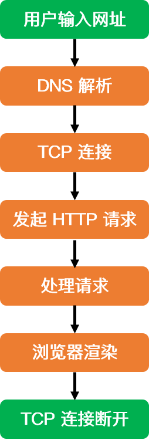

TCP

### 一、TCP与UDP的区别

#### TCP的特性

1. 面向连接的、可靠的、基于字节流的传输层通信协议
2. 将应用层的数据流分割成报文段并发送给目标节点的TCP层
3. 数据包都有序号，对方收到则发送ACK确认，未收到则重传
4. 使用校验和来检验数据再传输过程中是否有误	
5. 尽最大努力交付，不保证可靠交付

#### UPD的特性

1. 面向非连接的
2. 不维护连接状态，支持同事多个客户端传输相同的消息
3. 数据包包头只有8个字节，额外开销小
4. 吞吐量只受限于数据生成速率、传输速率以及机器性能
5. 面向报文的，不对应用程序提交的报文信息进行拆分或合并

#### 区别

1. 连接：TCP是面向连接的、而UDP是无连接的
2. 安全：TCP提供可靠的服务，即通过TCP传送的数据是无差错、不丢失、不重复且按需抵达（握手、序号、重传），而UDP尽最大努力交付，即不提供可靠的交付
3. 传输：TCP传输效率相对较低，UDP传输效率高，适用于高速传输和实时性较强的通信
4. 连接数量：TCP只能是点对点、一对一的，而UDP支持一对一，一对多，多对一，多对多
5. 适用场景：TCP适合在分布式高精度计算系统的数据传输，而UDP适合网络语音和在线视频

### 二、TCP三次握手

1. Client将标志位SYN置1，随机产生一个值seq=J，并将该数据包发送给Server，Client进入SYN_SENT状态
2. Server收到数据包后，由标志位SYN=1知道Client请求建立连接，Server将标志位SYN和ACK都置为1，ack=J+1，随机产生一个值seq=k，并将该数据包发送给Client以确认连接请求，Server进入SYN_RCVD状态
3. Client收到确认后，检测ack是否为J+1，ACK是否为1，如果正确则将标志位ACK置为1，ack=K+1，并将该数据包发送给Server。

​       Server检查ack是否为K+1，ACK是否为1，正确则连接建立成功，Client和Server进入ESTABLISHED状态，完成三次握手

#### 为什么需要三次握手

1. **为了初始化双方的Sequence Number**，互相通知对方自己的seq值，作为以后数据通信的序号，以保证应用层接收到的数据不回因为网络传输问题而乱序
2. **为了防止失效的连接请求到达服务器，占用服务器资源**

#### 为什么握手需要三次，而不是两次或四次

**因为两端建立连接之前，要完成资源分配和初始化序列号交换**。所以收到建立连接请求的SYN报文后，把ACK和SYN放在一个报文里发送给客户端了。最少三次交互即可完成

### 三、TCP四次挥手

1. Client发送一个FIN，用来关闭Client到Server的数据传送，Client进入FIN_WAIT_1状态

2. Server收到FIN后，发送一个报文client，确认序号为收到序号+1（与SYN相同，一个FIN占用一个序号），Server进入CLOSE_WAIT状态

   Client收到确认后，就进入了FIN-WAIT-2状态，等待Server发出连接释放报文

3. Server发送一个FIN，用来关闭Server到Client的数据传送，Server进入LAST_ACK状态，最后确认

4. Client收到FIN后，Client进入TIME_WAIT状态，接着发送一个ACK给Server，确认序号为接收序号+1，Server进入CLOSERD状态，完成四次挥手

#### **为什么Client在TIME-WAIT状态必须等到2MSL的时间**

​    **为了保证A发送的最后一个ACK报文能到达B。**假如这个ACK报文丢失了，处于LAST-ACK状态的B收不到确认，会超市憧穿，A就能在2MSL时间内收到这个重传的FIN + ACK报文，再重新启动2MSL计时器

#### 为什么需要四次挥手才能断开

TCP断开连接的目标是：回收资源、终止数据传输。当关闭连接时，收到对方的FIN报文，仅表示对方不再发送数据了，但是还能接收数据（半关闭状态），因此ACK和FIN一般都会分开发送

#### 服务器出现大量CLOSE_WAIT状态的原因

这个状态出现的原因，是为了让服务端发送还未传送完的数据，传送完毕之后，服务端会发送FIN连接释放报文

### 四、TCP如何保证可靠性

#### TCP首部

- 每个TCP段都包含16位的原端口和目的端口，用于寻找发端和收端的应用进程
- 32位的序号用来表示从TCP发端到收端发送的数据字节流，它表示在这个报文段中的第一个数据字节
- 标志位：共有六个，URG、ACK、PSH、RST、SYN、FIN，可多个同时设为1
  - URG: 紧急指针有效
  - ACK：确认序号有效
  - PSH：接收方应该尽快将这个报文段交给应用层
  - RST：重建连接
  - SYN：同步序号，用来发起一个连接
  - FIN：发端完成发送任务
- 首部长度：需要这个值是因为任选字段的长度是可变的。占4位，因此TCP最多有60个字节的首部，正常长度是20字节。
- 窗口：是一个16位字段，大小为字节，因此窗口大小最大为65535字节。TCP的流量控制由连接的每一端通过声明的窗口大小来提供
- 检验和：由发端计算和存储，并由收端进行验证

#### 1. 检验和

	1. 首先将校验和部分归零
 	2. 将TCP首部、数据都划分成16位的一个个16进制数
 	3. 将这些数逐个想家，溢出的部分驾到最低位上
 	4. 将得到的结果取反

#### 2. 确认应答与序列号

 序列号：TCP传输时将每个字节的数据都进行了编号（保证了数据的按序到达，去除重复数据）

 确认应答：TCP传输过程中，每次接收方收到数据后，都会对传输方进行确认应答，也就是ACK报文

#### 3. 超时重传

当报文发出后在一定时间内未收到接收方的确认，发送方就会进行重传

#### 4. 流量控制

如果发送端的发送速度太快，导致接收方的接收缓冲区很快就被填满了。**TCP根据接收方对数据的处理能力，决定发送方的发送速度，这就是流量控制**

在TCP的报头信息中，有一个16位字段的窗口大小，它实际上是接收方接收数据缓冲区的剩余大小，接收方在确认应答发送ACK报文时，将自己的即时窗口大小填入，随ACK报文一起发送过去。

#### 5. 拥塞控制

**流量控制是为了让接收方能来得及接收，而拥塞控制是为了降低整个网络的拥塞程度**

主要是通过四个算法来进行拥塞控制的：慢开始、拥塞避免、快重传、快恢复

- 慢开始：最初执行慢开始，令拥塞窗口(cwnd)设置为1，当收到确认后，cwnd加倍。如果存在超时的丢包时间，则将ssthresh(慢启动阈值)设为cwnd的一半，并将cwnd设为1重新慢开始

- 拥塞避免：当cwnd的值等于ssthresh时，进入拥塞避免模式，每个轮次只将cwnd加1

- 快重传与快速恢复：在接收方，要求每次接收到报文段都应该对最后一个已收到的有序报文段进行确认。例如已经接收到 M1 和 M2，此时收到 M4，应当发送对 M2 的确认。

  在发送方，如果收到三个重复确认，那么可以知道下一个报文段丢失，此时执行快重传，立即重传下一个报文段。例如收到三个 M2，则 M3 丢失，立即重传 M3。

  在这种情况下，只是丢失个别报文段，而不是网络拥塞。因此执行快恢复，令 ssthresh = cwnd / 2 ，cwnd = ssthresh，注意到此时直接进入拥塞避免。

慢开始和快恢复的快慢指的是 cwnd 的设定值，而不是 cwnd 的增长速率。慢开始 cwnd 设定为 1，而快恢复 cwnd 设定为 ssthresh。

## HTTP

### 一、HTTP简介

超文本传输协议。是一个简单的请求-相应协议，它通常运行在TCP之上

特点：

- C/S模型：请求-响应
- 简单：只需发送请求方法和路径
- 灵活：运行传输任意类型

#### 二、HTTP状态码

#### 三、GET和POST的请求

1. HTTP报文层面：GET将请求信息放在URL，POST放在报文中，想获取请求信息必须解析报文，因此安全性比get高

2. Get可以被缓存、被存储，POST不行

3. GET回退无害，POST回退会重新提交
4. GET符合幂等性，POST不符合。幂等的意味着对同一URL的多个请求应该返回同样的结果
5. GET 参数通过 URL 传递，并且长度有限制，而 POST 放在 request body 并且长度没有限制
6. GET是从服务器上获取数据，POST是向服务器传送数据

#### 四、HTTPS的简介

是以安全为目标的 HTTP 通道，在HTTP的基础上通过传输加密和[身份认证](https://baike.baidu.com/item/身份认证/5294713)保证了传输过程的安全性

特点：

- 数据保密性：保证数据内容再传输的过程中不会被第三方查看
- 数据完整性：及时发现被第三方篡改，如果被掉包，我们能轻松发现并拒收
- 身份校验安全性：保证数据到达用户期望的目的地。

#### 五、HTTP和HTTPS的区别

1. HTTPS需要到CA申请证书，HTTP不需要
2. HTTPS密文传输，HTTP明文传输
3. HTTPS默认使用443端口，HTTP默认80端口

#### 六、HTTPS数据传输流程

1. 浏览器将支持的加密算法信息发送给服务器
2. 服务器选择一套浏览器支持的加密算法，以证书（证书发布的CA机构，证书的有效期、公钥、证书所有者和签名等）的形式发送给浏览器
3. 浏览器验证证书合法性，并结合证书公钥加密信息发送给服务器
4. 浏览器使用私钥解密信息，验证哈希，加密响应消息回发浏览器
5. 浏览器解密响应信息，并对消息进行验证，之后进行加密交互数据

## 一、协议层次以及它们的服务类型

### 1. OSI七层模型

OSI 模型全称为开放式通信系统互连参考模型，是国际标准化组织 ( ISO ) 提出的一个试图使各种计算机在世界范围内互连为网络的标准框架

#### 1.1 应用层

作用：通过应用程序间的交互来完成特定的网络应用。**该层协议定义了应用进程之间的交互规则，通过不同的应用层协议为不同的网络应用提供服务**

协议：DNS、HTTP、SMTP

在应用层交互的数据单元我们称之为**报文**

#### 1.2 表示层

作用：使通信的应用程序能够解释交换数据的含义。该层提供的服务主要包括数据压缩、数据加密以及数据描述

#### 1.3 会话层

作用：负责建立、管理和终止表示层实体之间的通信会话。该层提供了数据交换的定界和同步功能，包括了建立检查点和恢复方案的方法

#### 1.4 传输层

作用：**为两台主机进程之间的通信提供服务。应用程序利用该服务传送应用层报文**。该服务并不针对某一特定的应用，多种营养可以复用同一个运输层服务，同一个运输层服务可以把收到的信息分发给上面应用层的相应进程

#### 1.5 网络层

两台计算机之间传送数据时其通信链路往往不止一条，所传输的信息甚至可能经过很多通信子网

作用：**选择合适的网间路由和交换节点，确保数据按时成功传送**

**在发送数据时，网络层把运输层产生的报文或用户数据报封装成分组和包向下传输到数据链路层**

协议：IP

#### 1.6 数据链路层

两台主机之间的数据传输，总是在一段一段的链路上传送的

作用：**在两个相邻节点之间传送数据时，数据链路层将网络层交下来的 IP 数据报组装成帧，在两个相邻节点间的链路上传送帧**

每一帧包括数据和必要的控制信息。通过控制信息我们可以知道一个帧的起止比特位置，此外，也能使接收端检测出所收到的帧有无差错，如果发现差错，数据链路层能够简单的丢弃掉这个帧，以避免继续占用网络资源

#### 1.7 物理层

作用：实现计算机节点之间比特流的透明传送，尽可能屏蔽掉具体传输介质和物理设备的差异

使其上面的数据链路层不必考虑网络的具体传输介质是什么。该层的主要任务是确定与传输媒体的接口的一些特性（机械特性、电气特性、功能特性，过程特性）。

### 2. TCP/IP参考模型

OSI七层模型是基于标准化的考虑，没有考虑到具体的市场需求，使得该模型结构复杂，部分功能冗余

TCP/IP参考模型是直接面向市场需求的，实现起来也比较容易

#### 2.1 应用层

将OSI模型中的**应用层、表示层、会话层**的功能合并到一个应用层实现

作用：通过不同的应用层协议为不同的应用层提供服务（FTP、Telnet、DNS、SMTP）

#### 2.2 传输层

作用：为上层实体提供源端到对端主机的通信功能

传输层定义了两个主要协议：传输控制协议TCP和用户数据报协议UDP

#### 2.3 网际互联层

作用：主要负责相同或不同的网络中计算机之间的通信

IP协议提供的是一个可靠、无连接的数据报传递服务。该协议实现两个基本功能：寻址和分段

根据数据报报头重的目的地址将数据传送到目的地址，IP负责选择传送线路。

另外两个主要协议是互联网组管理协议IGMP和互联网控制报文协议ICMP

#### 2.4 网络接入层

网络接入层的功能对应于 OSI 参考模型中的**数据链路层和物理层**

作用：负责监视数据在主机和网络之间的交换。

实际上TCP/IP并未真正描述着一层的实现，而由参与互连的各网络使用自己的物理层和数据链路层协议，然后与TCP/IP的网络接入层进行连接

### 3. TCP/IP五层协议

五层体系的协议结构是综合了 OSI 和 TCP/IP 优点的一种协议，包括应用层、传输层、网络层、数据链路层和物理层。其中应用层对应 OSI 的上三层，下四层和 OSI 相同。五层协议的体系结构只是为介绍网络原理而设计的，实际应用还是 TCP/IP 四层体系结构

### 4. OSI模型和TCP/IP模型的异同比较

相同点：

- OSI 参考模型与 TCP/IP 参考模型都采用了层次结构
- 都能够提供面向连接和无连接两种通信服务机制

不同点：

- OSI 采用的七层模型； TCP/IP 是四层结构
- TCP/IP 参考模型没有对网络接口层进行细分，只是一些概念性的描述； OSI 参考模型对服务和协议做了明确的区分
- OSI 先有模型，后有协议规范，适合于描述各种网络；TCP/IP 是先有协议集然后建立模型，不适用于非 TCP/IP 网络
- TCP/IP 一开始就提出面向连接和无连接服务，而 OSI 一开始只强调面向连接服务，直到很晚才开始制定无连接的服务标准
- OSI 参考模型虽然被看好，但将网络划分为七层，实现起来较困难；相反，TCP/IP 参考模型虽然有许多不尽人意的地方，但作为一种简化的分层结构还是比较成功的

### 5. OSI和TCP/IP协议之间的关系

### 6. 为什么去掉了表示层和会话层

OSI 参考模型在提出时，他们的理想是非常好的。但实际上，**由于会话层、表示层、应用层都是在应用程序内部实现的，最终产出的是一个应用数据包，而应用程序之间是几乎无法实现代码的抽象共享的**，这也就造成 OSI 设想中的应用程序维度的分层是无法实现的

所以在后来的 TCP/IP 协议框架的设计中，便将表示层和会话层与应用层整合在一起，让整个过程更为清晰明了

### 7. 数据如何在各层之间进行传输（封装过程）

- 在发送主机端，一个应用层报文被传送到运输层，在最简单的情况下，运输层收取到报文并附上附加信息，该首部将被接收端的运输层使用
- 应用层报文和运输层首部信息一道构成了运输层报文段，附加的信息可能包括：允许接收端运输层向上向适当的应用程序交付报文的信息以及差错检测位信息。该信息让接收端能够判断报文中的比特是否在途中已被改变
- 运输层则向网络层传递该报文段，网络层增加了如源和目的端系统地址等网络层首部信息，生成了网络层数据报
- 该数据报接下来被传递给链路层，在数据链路层数据包添加发送端 MAC 地址和接收端 MAC 地址后被封装成数据帧
- 在物理层数据帧被封装成比特流，之后通过传输介质传送到对端

## 二、应用层

### 1. Keep-Alive和非Keep-Alive的区别，对服务器性能有影响吗

在早期的 HTTP/1.0 中，浏览器每次 发起 HTTP 请求都要与服务器创建一个新的 TCP 连接，服务器完成请求处理后立即断开 TCP 连接

对于非 Keep=Alive 来说，必须为每一个请求的对象建立和维护一个全新的连接。对于每一个这样的连接，客户机和服务器都要分配 TCP 的缓冲区和变量，这给服务器带来的严重的负担

建和关闭连接的过程需要消耗资源和时间，为了减少资源消耗，缩短响应时间，就需要重用连接

Keep-Alive 并不是没有缺点的，**当长时间的保持 TCP 连接时容易导致系统资源被无效占用**，若对 Keep-Alive 模式配置不当，将有可能比非 Keep-Alive 模式带来的损失更大。因此，我们需要正确地设置 keep-alive timeout 参数，当 TCP 连接在传送完最后一个 HTTP 响应，该连接会保持 keepalive_timeout 秒，之后就开始关闭这个链接

### 2. HTTP方法

### 3. GET和POST的区别

1. HTTP报文层面：GET将请求信息放在URL，POST放在报文中，想获取请求信息必须解析报文，因此安全性比get高

2. Get可以被缓存、被存储，POST不行

3. GET回退无害，POST回退会重新提交

5. GET符合幂等性，POST不符合。幂等的意味着对同一URL的多个请求应该返回同样的结果

6. GET 参数通过 URL 传递，并且长度有限制，而 POST 放在 request body 并且长度没有限制

7. GET是从服务器上获取数据，POST是向服务器传送数据

### 4. HTTP与HTTPS的工作方式

#### 4.1 HTTP

HTTP（Hyper Text Transfer Protocol: 超文本传输协议） 是一种简单的请求 - 响应协议，被用于在 Web 浏览器和网站服务器之间传递消息

HTTP 使用 TCP（而不是 UDP）作为它的支撑运输层协议。其默认工作在 TCP 协议 80 端口，HTTP 客户机发起一个与服务器的 TCP 连接，一旦连接建立，浏览器和服务器进程就可以通过套接字接口访问 TCP

##### 4.1.1 为什么HTTP要用TCP协议

- 如果使用UDP，那么HTTP在传输文件时可能会经常出错，因为UDP不可靠
- HTTP协议只定义了应用层的东西，所以要下层来保证可靠性，其实也不一定非要HTTP，只要可以保证可靠性传输的传输层协议，都可以用来承接HTTP

##### 4.1.2 HTTP是无状态的协议，那么它如何保存用户的信息

1. 基于Session实现的会话保持

   > 在客户端第一次向服务器发送 HTTP 请求后，服务器会创建一个 Session 对象并将客户端的身份信息以键值对的形式存储下来，然后分配一个会话标识（SessionId）给客户端,这个会话标识一般保存在客户端 Cookie 中，之后每次该浏览器发送 HTTP 请求都会带上 Cookie 中的 SessionId 到服务器，服务器根据会话标识就可以将之前的状态信息与会话联系起来，从而实现会话保持
   >
   > 实现方式：**Cookie、URL回写实现（就是把session id直接附加在URL路径的后面），表单隐藏字段**
   >
   > 优点：安全，因为状态信息保存在服务器端
   >
   > 缺点：假如用的是分布式服务器，可能信息会落到不同的服务器上，导致找不到Session（采用中间件解决，利用Redis解决）
   >
   > ​			占用服务器的资源
   >
   > 

2. 基于Cookie实现的会话保持

   > 当服务器发送响应消息时，在 HTTP 响应头中设置 Set-Cookie 字段，用来存储客户端的状态信息。客户端解析出 HTTP 响应头中的字段信息，并根据其生命周期创建不同的 Cookie，这样一来每次浏览器发送 HTTP 请求的时候都会带上 Cookie 字段，从而实现状态保持。基于 Cookie 的会话保持与基于 Session 实现的会话保持最主要的区别是前者完全将会话状态信息存储在浏览器 Cookie 中
   >
   > 优点：服务器不用保存状态，减少服务器存储压力
   >
   > 缺点：不安全，因为会话的信息存在客户端上，意味着会话中不能有机密信息
   >
   > ​           每次请求都需要额外发送Cookie，会占用更多带宽

Cookie被禁用了怎么办？可以通过重写 URL 的方式将会话标识放在 URL 的参数里，也可以实现会话保持

##### 4.1.3 HTTP状态码

200 ok：正常返回信息

201 Created：已创建。成功请求并创建了新的资源

202 Accepted：已接受。已经接受请求，但未处理完成

203 Non-Atuoriative Information: 非授权信息。请求成功

204 No Content：无内容。服务器成功处理，但未返回内容

205 Reset Content: 重置内容，服务器处理成功

206 Partial Content: 成功处理了部分内容

300 Multiple Choices：多种选择。被请求的资源有一系列可供选择的回馈信息，用户或浏览器能够自行选择一个首选地址进行重定向

301 Moved Permanently: 永久移动，请求的资源已被永久的移动到新URI，返回信息会包括新的URI

302 FOUND：临时移动，客户端应继续使用原有的URI

400 Bad Request: 客户端请求的语法错误，服务器无法理解

401 Unauthorizied：请求要求用户的身份认证

402 Payment Required：保留，将来使用

403 Forbidden：服务器理解客户端的请求，但拒绝执行此请求

404 Not Found：资源无法找到

405 Method Not Allowed：请求中的方被禁止

406 Not Acceptable：服务器无法根据客户端请求的内容特性完成请求

500 Internal Server Error：服务器发生不可预期的错误

501 Not Implement： 服务器不支持当前请求所需要的某个功能

502 Bad Gateway：请求未完成，服务器从上游服务器收到一个无效的响应

503 Service Unavaliable： 由于临时的服务器维护或者过载，服务器当前无法处理请求，一段时间后可能恢复正常

504 Gateway Time-out：充当网关或代理的服务器，未及时从远端服务器获取请求

#### 4.2 HTTPS

HTTPS（Hyper Text Transfer Protocol over Secure Socket Layer）是以安全为目标的 HTTP 协议，在 HTTP 的基础上通过传输加密和身份认证的方式保证了传输过程的安全性

##### 4.2.1 HTTPS的工作流程

- 浏览器将支持的加密算法信息发送给服务器
- 服务器选择一套浏览器支持的加密算法，以证书（证书发布的CA机构，证书的有效期，公钥，证书所有者，还有签名等）的形式发送给浏览器
- 浏览器验证证书合法性，并结合证书公钥加密信息发送给服务器
- 服务器使用私钥解密信息，验证哈希，加密响应消息回发浏览器
- 浏览器解密响应信息，并对消息进行验真，之后进行加密交互数据

##### 4.2.2 HTTP与HTTPS的区别

- HTTP 协议以明文方式发送内容，数据都是未加密的，安全性较差。HTTPS 数据传输过程是加密的，安全性较好
- HTTP 和 HTTPS 使用的是完全不同的连接方式，用的端口也不一样，前者是 80 端口，后者是 443 端口
- HTTPS 协议需要到数字认证机构（Certificate Authority, CA）申请证书，一般需要一定的费用
- HTTP 页面响应比 HTTPS 快，主要因为 HTTP 使用 3 次握手建立连接，客户端和服务器需要握手 3 次，而 HTTPS 除了 TCP 的 3 次握手，还需要经历一个 SSL 协商过程

##### 4.2.3 怎么保证去CA机构认证CA证书时不被伪造

**假设中间人篡改了证书原文，由于他没有 CA 机构的私钥，所以无法得到此时加密后的签名，因此无法篡改签名**

客户端浏览器收到该证书后会发现原文和签名解密后的值不一致，则说明证书被中间人篡改，证书不可信，从而终止向服务器传输信息

例如中间人拿到了 CA 机构认证的证书，它想窃取网站 A 发送给客户端的信息，于是它成为中间人拦截到了 A 传给客户端的证书，然后将其替换为自己的证书。此时客户端浏览器收到的是被中间人掉包后的证书，但由于**证书里包含了客户端请求的网站信息，因此客户端浏览器只需要把证书里的域名与自己请求的域名比对一下就知道证书有没有被掉包**了

证书是需要申请，并由专门的数字证书认证机构(CA)通过非常严格的审核之后颁发的电子证书。颁发证书的同时会产生一个私钥和公钥。私钥由服务端自己保存，不可泄漏。公钥则是附带在证书的信息中，可以公开的。证书本身也附带一个证书电子签名，这个签名用来验证证书的完整性和真实性，可以防止证书被串改。这里如果被替换的证书如果不是client的信任CA列表签发的，这个篡改证书一样过不了客户端的校验。另外，证书还有个有效期

### 4.3 HTTP1.0和HTTP1.1的区别

- 缓存处理：在 HTTP/1.0 中主要使用 header 里的 if-modified-Since, Expries 来做缓存判断的标准。而 HTTP/1.1 请求头中添加了更多与缓存相关的字段，从而支持更为灵活的缓存策略，例如 Entity-tag, If-Unmodified-Since, If-Match, If-None-Match 等可供选择的缓存头来控制缓存策略
- 节约带宽：当客户端请求某个资源时，HTTP/1.0 默认将该资源相关的整个对象传送给请求方，但很多时候可能客户端并不需要对象的所有信息。而在 HTTP/1.1 的请求头中引入了 range 头域，它允许只请求部分资源，其使得开发者可以多线程请求某一资源，从而充分的利用带宽资源，实现高效并发
- 错误通知的管理：TTP/1.1 在 1.0 的基础上新增了 24 个错误状态响应码，例如 **414 表示客户端请求中所包含的 URL 地址太长，以至于服务器无法处理**；410 表示所请求的资源已经被永久删除
- Host请求头：早期 HTTP/1.0 中认为每台服务器都绑定一个唯一的 IP 地址并提供单一的服务，请求消息中的 URL 并没有传递主机名。而随着虚拟主机的出现，一台物理服务器上可以存在多个虚拟主机，并且它们共享同一个 IP 地址。为了支持虚拟主机，HTTP/1.1 中添加了 host 请求头，请求消息和响应消息中应声明这个字段，若请求消息中缺少该字段时服务端会响应一个 404 错误状态码
- **长连接**：HTTP/1.0 默认浏览器和服务器之间保持短暂连接，浏览器的每次请求都需要与服务器建立一个 TCP 连接，服务器完成后立即断开 TCP 连接。HTTP/1.1 默认使用的是持久连接，其支持在同一个 TCP 请求中传送多个 HTTP 请求和响应

### 4.4 HTTP 1.X 和 HTTP 2.0 的区别

- 相比于 HTTP/1.X 的文本（字符串）传送， **HTTP/2.0 采用二进制传送**。客户端和服务器传输数据时把数据分成帧，帧组成了数据流，流具有流 ID 标识和优先级，通过优先级以及流依赖能够一定程度上解决关键请求被阻塞的问题

- HTTP/2.0 支持多路复用。因为流 ID 的存在， 通过同一个 HTTP 请求可以实现多个 HTTP 请求传输，客户端和服务器可以通过流 ID 来标识究竟是哪个流从而定位到是哪个 HTTP 请求
- HTTP/2.0 头部压缩。HTTP/2.0 通过 gzip 和 compress 压缩头部然后再发送，同时通信双方会维护一张头信息表，所有字段都记录在这张表中，在每次 HTTP 传输时只需要传头字段在表中的索引即可，大大减小了重传次数和数据量

### 4.5 HTTP 3.0 

HTTP/2存在的问题：HTTP/2 多路复用只是减少了连接数，其队头的拥塞问题并没有完全解决，倘若 TCP 丢包率过大，则 HTTP/2 的表现将不如 HTTP/1.1

#### 4.5.1 QUIC协议

QUIC（Quick UDP Internet Connections），直译为快速 UDP 网络连接，是谷歌制定的一种基于 UDP 的低延迟传输协议。其主要目的是解决采用传输层 TCP 协议存在的问题，同时满足传输层和应用层对多连接、低延迟等的需求。该协议融合了 TCP, TLS, HTTP/2 等协议的特性，并基于 UDP传输

- QUIC 复用了 HTTP/2 协议的多路复用功能，由于 QUIC 基于 UDP，所以也避免了 HTTP/2存在的队头阻塞问题
- 低延迟连接。当客户端第一次连接服务器时，QUIC 只需要 1 RTT（Round-Trid Time）延迟就可以建立安全可靠的连接（采用 TLS 1.3 版本），相比于 TCP + TLS 的 3 次 RTT 要更加快捷。可缓存加密的认证信息，再次连接是可实现0RTT的连接建立延迟
- QUIC 的报文是经过加密和认证的，除了少量的报文，其它所有的 QUIC 报文头部都经过了认证，报文主体经过了加密。只要有攻击者篡改 QUIC 报文，接收端都能及时发现。
- 具有向前纠错机制，每个数据包携带了除了本身内容外的部分其他数据包的内容，使得在出现少量丢包的情况下，尽量地减少其它包的重传次数，其通过牺牲单个包所携带的有效数据大小换来更少的重传次数，这在丢包数量较小的场景下能够带来一定程度的性能提升

#### 4.5.2 HTTP 3

HTTP/3 是在 QUIC 基础上发展起来的，其底层使用 UDP 进行数据传输，上层仍然使用 HTTP/2

- 使用 UDP 作为传输层进行通信
- 在 UDP 之上的 QUIC 协议保证了 HTTP/3 的安全性。QUIC 在建立连接的过程中就完成了 TLS 加密握手
- 建立连接快，正常只需要 1 RTT 即可建立连接。如果有缓存之前的会话信息，则直接验证和建立连接，此过程 0 RTT。建立连接时，也可以带有少量业务数据
- 不和具体底层连接绑定，QUIC 为每个连接的两端分别分配了一个唯一 ID，上层连接只认这对逻辑 ID。网络切换或者断连时，只需要继续发送数据包即可完成连接的建立

### 4.6 SSL和TLS的定义和区别

SSL：（Secure Socket Layer，安全套接字层），位于可靠的面向连接的网络层协议和应用层协议之间的一种协议层。SSL通过互相认证、使用数字签名确保完整性、使用加密确保私密性，以实现客户端和服务器之间的安全通讯。该协议由两层组成：SSL记录协议和SSL握手协议。

TLS：(Transport Layer Security，传输层安全协议)，用于两个应用程序之间提供保密性和数据完整性。该协议由两层组成：TLS记录协议和TLS握手协议

TLS的主要目标是使SSL更安全，并使协议更完善和精确，主要增强如下：

- 更安全的MAC算法。TLS使用的HMAC算法比SSL的MAC算法更安全
- 更严格的警报。TLS支持几乎所有的SSL3.0报警代码，而且TLS还补充了很多报警代码，如解密失败、记录溢出、未知CA等
- “灰色区域”规范的更明确定义。

### 5. DNS的作用和原理

#### 5.1 DNS

DNS（Domain Name System）是域名系统的英文缩写，是一种组织成域层次结构的计算机和网络服务命名系统，用于 TCP/IP 网络

#### 5.2 DNS的作用

通常我们有两种方式来识别主机，通过主机名或者IP

**人们喜欢便于记忆的主机名来识别，而路由器则喜欢定长的、有着层次结构的IP地址**

为了满足这些不同的偏好，我们就**需要一种能够进行主机名到 IP 地址转换的目录服务，域名系统作为将域名和 IP 地址相互映射的一个分布式数据库，能够使人更方便地访问互联网**

#### 5.3 DNS域名解析原理

DNS 采用了分布式的设计方案，其域名空间采用一种树形的层次结构：**从上到下依次为根域名服务器、顶级域名服务器和权威域名服务器**

还有一类重要的 DNS 服务器，叫做本地 DNS 服务器。本地 DNS 服务器严格来说不在 DNS 服务器的层次结构中，但它对 DNS 层次结构是很重要的。一般来说，每个网络服务提供商（ISP） 都有一台本地 DNS 服务器。当主机与某个 ISP 相连时，该 ISP 提供一台主机的 IP 地址，该主机具有一台或多台其本地 DNS 服务器的 IP 地址

**工作原理：以def.mn.edu为例**

- 主机先向它的本地DNS服务器发送一个DNS查询报文。该报文包含需要被转换的def.mn.edu
- 本地DNS服务器将该报文转发到根DNS服务器，根DNS服务器注意到查询的IP地址为edu后，向本地DNS服务器返回负责edu的顶级域名服务器的IP地址列表
- 该本地DNS再次向这些顶级服务器发送查询报文，该顶级域名服务器注意到 [mn.edu](http://mn.edu/) 的前缀，并用权威域名服务器的 IP 地址进行响应
- 通常情况下，顶级域名服务器并不总是知道每台主机的权威 DNS 服务器的 IP 地址，而只知道中间的某个服务器，该中间 DNS 服务器依次能找到用于相应主机的 IP 地址
- 我们假设中间经历了权威服务器 ① 和 ②，最后找到了负责 def.mn.edu 的权威 DNS 服务器 ③，之后，本地 DNS 服务器直接向该服务器发送查询报文从而获得主机 B 的IP 地址

在上图中，IP 地址的查询其实经历了两种查询方式，分别是递归查询和迭代查询

- 递归查询：如果主机所询问的本地域名服务器不知道被查询域名的 IP 地址，那么本地域名服务器就以 DNS 客户端的身份，向其他根域名服务器继续发出查询请求报文，即替主机继续查询，而不是让主机自己进行下一步查询，如上图步骤（1）和（10）。
- 迭代查询：当根域名服务器收到本地域名服务器发出的迭代查询请求报文时，要么给出所要查询的 IP 地址，要么告诉本地服务器下一步应该找哪个域名服务器进行查询，然后让本地服务器进行后续的查询，如上图步骤（2）~（9）。

#### 5.4 为什么DNS使用UDP

更正确的答案是 DNS 既使用 TCP 又使用 UDP。

当进行区域传送（主域名服务器向辅助域名服务器传送变化的那部分数据）时会使用 TCP，因为数据同步传送的数据量比一个请求和应答的数据量要多，而 TCP 允许的报文长度更长，因此为了保证数据的正确性，会使用基于可靠连接的 TCP。

当客户端向 DNS 服务器查询域名 ( 域名解析) 的时候，一般返回的内容不会超过 UDP 报文的最大长度，即 512 字节。用 UDP 传输时，不需要经过 TCP 三次握手的过程，从而大大提高了响应速度，但这要求域名解析器和域名服务器都必须自己处理超时和重传从而保证可靠性。

#### 5.5 怎么实现DNS劫持的

**DNS 劫持即域名劫持，是通过将原域名对应的 IP 地址进行替换从而使得用户访问到错误的网站或者使得用户无法正常访问网站的一种攻击方式**

攻击者可以冒充原域名所属机构，通过电子邮件的方式修改组织机构的域名注册信息，或者将域名转让给其它组织，并将新的域名信息保存在所指定的 DNS 服务器中，从而使得用户无法通过对原域名进行解析来访问目的网址

具体的实施步骤：

- 获取要劫持的域名信息：攻击者首先会访问域名查询站点查询要劫持的域名信息
- 控制域名相应的 E-MAIL 账号：在获取到域名信息后，攻击者通过暴力破解或者专门的方法破解公司注册域名时使用的 E-mail 账号所对应的密码。更高级的攻击者甚至能够直接对 E-mail 进行信息窃取
- 修改注册信息：当攻击者破解了 E-MAIL 后，会利用相关的更改功能修改该域名的注册信息，包括域名拥有者信息，DNS 服务器信息
- 使用 E-MAIL 收发确认函：在修改完注册信息后，攻击者在 E-mail 真正拥有者之前收到修改域名注册信息的相关确认信息，并回复确认修改文件，待网络公司恢复已成功修改信件后，攻击者便成功完成 DNS 劫持

预防手段：

- 直接通过 IP 地址访问网站，避开 DNS 劫持
- 由于域名劫持往往只能在特定的网络范围内进行，因此一些高级用户可以通过网络设置让 DNS 指向正常的域名服务器以实现对目的网址的正常访问，例如将计算机首选 DNS 服务器的地址固定为 8.8.8.8

### 6. 套接字有哪些

套接字（Socket）是对网络中不同主机上的应用进程之间进行双向通信的端点的抽象，网络进程通信的一端就是一个套接字，不同主机上的进程便是通过套接字发送报文来进行通信

有三种类型：

- 流套接字（SOCK_STREAM）：流套接字基于 TCP 传输协议，主要用于提供面向连接、可靠的数据传输服务。由于 TCP 协议的特点，使用流套接字进行通信时能够保证数据无差错、无重复传送，并按顺序接收，通信双方不需要在程序中进行相应的处理
- 数据报套接字（SOCK_DGRAM）：和流套接字不同，数据报套接字基于 UDP 传输协议，对应于无连接的 UDP 服务应用。该服务并不能保证数据传输的可靠性，也无法保证对端能够顺序接收到数据。此外，通信两端不需建立长时间的连接关系，当 UDP 客户端发送一个数据给服务器后，其可以通过同一个套接字给另一个服务器发送数据。当用 UDP 套接字时，丢包等问题需要在程序中进行处理
- 原始套接字（SOCK_RAW）：由于流套接字和数据报套接字只能读取 TCP 和 UDP 协议的数据，当需要传送非传输层数据包（例如 Ping 命令时用的 ICMP 协议数据包）或者遇到操作系统无法处理的数据包时，此时就需要建立原始套接字来发送

### 7. URI（统一资源标识符）和 URL（统一资源定位符）之间的区别

URL，即统一资源定位符 (Uniform Resource Locator )，URL 其实就是我们平时上网时输入的网址，它标识一个互联网资源，并指定对其进行操作或获取该资源的方法

URI 是一种语义上的抽象概念，可以是绝对的，也可以是相对的，而URL则必须提供足够的信息来定位，是绝对的。简单地说，只要能唯一标识资源的就是 URI，在 URI 的基础上给出其资源的访问方式的就是 URL。

### 8. 为什么抓包工具能抓到你的包

**假如我们需要抓取客户端的数据包，需要监控客户端与服务器交互之间的网络节点，监控其中任意一个网络节点（网卡），获取所有经过网卡中的数据，对这些数据按照网络协议进行解析，这就是抓包的基本原理**

中间的网络节点是不受我们控制的，所以我们只能在客户端或者服务端进行抓包

#### 8.1 抓取HTTP的数据报

- **首先抓包工具会提出代理服务，客户端需要连接该代理**
- 客户端发出 HTTP 请求时，会经过抓包工具的代理，抓包工具将请求的原文进行展示
- 抓包工具使用该原文将请求发送给服务器
- 服务器返回结果给抓包工具，抓包工具将返回结果进行展示
- 抓包工具将服务器返回的结果原样返回给客户端

这里抓包工具相当于透明人，数据经过的时候它一只手接到数据，然后另一只手把数据传出去。

#### 8.2 抓取HTTPS的数据报

- **客户端连接抓包工具提供的代理服务，并安装抓包工具的根证书**
- 客户端发出 HTTPS 请求，抓包工具模拟服务器与客户端进行 TLS 握手交换密钥等流程
- 抓包工具发送一个 HTTPS 请求给客户端请求的目标服务器，并与目标服务器进行 TLS 握手交换密钥等流程
- 客户端使用与抓包工具协定好的密钥加密数据后发送给抓包工具
- 抓包工具使用与客户端协定好的密钥解密数据，并将结果进行展示
- 抓包工具将解密后的客户端数据，使用与服务器协定好的密钥进行加密后发送给目标服务器
- 服务器解密数据后，做对应的逻辑处理，然后将返回结果使用与抓包工具协定好的密钥进行加密发送给抓包工具
- 抓包工具将服务器返回的结果，用与服务器协定好的密钥解密，并将结果进行展示
- 抓包工具将解密后的服务器返回数据，使用与客户端协定好的密钥进行加密后发送给客户端
- 客户端解密数据

这个时候抓包工具对客户端来说相当于服务器，对服务器来说相当于客户端。在这个传输过程中，客户端会以为它就是目标服务器，服务器也会以为它就是请求发起的客户端

### 9. 如果你访问一个网站很慢，怎么排查和解决

- **查看本地网络是否正常**。查看网络带宽是否被占用，例如当你正在下载电影时并且没有限速，是会影响你打开网页的速度的，这种情况往往是处理器内存小导致的
- 网速测试正常，可以对服务器速度进行排查。**通过 ping 命令查看链接到服务器的时间和丢包等情况**，观察丢包率和ping值
- 从网站本身找原因

### 10. 其他协议

#### 10.1 FTP

- FTP（File Transfer Protocol，文件传输协议）是用于在网络上进行文件传输的一套标准协议，使用客户/服务器模式，使用 TCP 数据报，提供交互式访问，双向传输
- TFTP（Trivial File Transfer Protocol，简单文件传输协议）一个小且易实现的文件传输协议，也使用客户/服务器方式，使用 UDP 数据报，只支持文件传输而不支持交互，没有列目录，不能对用户进行身份鉴定

#### 10.2 SMTP

SMTP（Simple Main Transfer Protocol，简单邮件传输协议）是在 Internet 传输 Email 的标准，是一个相对简单的基于文本的协议。在其之上指定了一条消息的一个或多个接收者（在大多数情况下被确认是存在的），然后消息文本会被传输。可以很简单地通过 Telnet 程序来测试一个 SMTP 服务器。SMTP 使用 TCP 端口 25。

#### 10.3 DHCP

DHCP ( Dynamic Host Configuration Protocol，动态主机设置协议 ) 是一个**局域网的网络协议**，使用 UDP 协议工作，主要有两个用途

- 用于内部网络或网络服务供应商自动分配 IP 地址给用户
- 用于内部网络管理员作为对所有电脑作中央管理的手段

#### 10.4 SNMP

SNMP（Simple Network Management Protocol，简单网络管理协议）构成了互联网工程工作小组（IETF，Internet Engineering Task Force）定义的 Internet 协议族的一部分。该协议能够支持网络管理系统，用以监测连接到网络上的设备是否有任何引起管理上关注的情况

### 11. 网页解析全过程

① DNS 解析：当用户输入一个网址并按下回车键的时候，浏览器获得一个域名，而在实际通信过程中，我们需要的是一个 IP 地址，因此我们需要先把域名转换成相应 IP 地址。【具体细节参看问题 16，17】

② TCP 连接：浏览器通过 DNS 获取到 Web 服务器真正的 IP 地址后，便向 Web 服务器发起 TCP 连接请求，通过 TCP 三次握手建立好连接后，浏览器便可以将 HTTP 请求数据发送给服务器了。【三次握手放在传输层详细讲解】

③ 发送 HTTP 请求：浏览器向 Web 服务器发起一个 HTTP 请求，HTTP 协议是建立在 TCP 协议之上的应用层协议，其本质是在建立起的TCP连接中，按照HTTP协议标准发送一个索要网页的请求。在这一过程中，会涉及到负载均衡等操作。

拓展：什么是负载均衡？

负载均衡，英文名为 Load Balance，其含义是指将负载（工作任务）进行平衡、分摊到多个操作单元上进行运行，例如 FTP 服务器、Web 服务器、企业核心服务器和其他主要任务服务器等，从而协同完成工作任务。负载均衡建立在现有的网络之上，它提供了一种透明且廉价有效的方法扩展服务器和网络设备的带宽、增加吞吐量、加强网络处理能力并提高网络的灵活性和可用性。

负载均衡是分布式系统架构设计中必须考虑的因素之一，例如天猫、京东等大型用户网站中为了处理海量用户发起的请求，其往往采用分布式服务器，并通过引入反向代理等方式将用户请求均匀分发到每个服务器上，而这一过程所实现的就是负载均衡。

④ 处理请求并返回：服务器获取到客户端的 HTTP 请求后，会根据 HTTP 请求中的内容来决定如何获取相应的文件，并将文件发送给浏览器。

⑤ 浏览器渲染：浏览器根据响应开始显示页面，首先解析 HTML 文件构建 DOM 树，然后解析 CSS 文件构建渲染树，等到渲染树构建完成后，浏览器开始布局渲染树并将其绘制到屏幕上。

⑥ 断开连接：客户端和服务器通过四次挥手终止 TCP 连接。【其中的细节放在传输层详细讲解】

## 三、传输层

### 1. 三次握手和四次挥手

