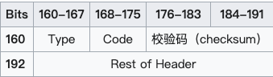
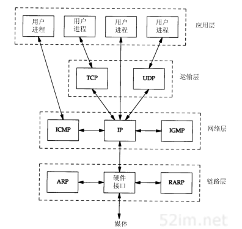

## 一、协议
### 1. ICMP
- 是什么：Internet控制报文协议，是一种无连接的协议，位于网络层
- 有什么用：通过发送控制消息，提供可能发生在通信环境中的各种问题反馈，例如ping、traceroute
- 原理：根据不同的类别(Type)和代码(Code)让机器来识别不同的连线状况

#### 报头
ICMP报头从IP报头的第160位开始（IP首部20字节）（除非使用了IP报头的可选部分）。

 

- Type : ICMP的类型，标识生成的错误报文
- Code : 进一步划分ICMP的类型，用来查找产生错误的原因 

### 2. IP
- 是什么：是TCP/IP协议族中最为核心的协议

- 有什么用：所有的TCP、UDP、ICMP、IGMP数据都以IP数据报格式传输

- 特点：

  - 不可靠。不能保证IP数据报能成功地到达目的地，因为IP对于错误的处理方式为丢弃数据报，然后返回一个ICMP。任何要求的可靠性必须由上层来提供

  - 无连接。每个IP数据报都是独立寻址的（不同的线路，到达的时间也不同），不需要维护后续相关的状态信息

#### 2.1 IP首部

## 二、TCP

### 2.1 TCP报文格式

### 

- 每个TCP段都包含16位的原端口和目的端口，用于寻找发端和收端的应用进程

- 32位的序号用来表示从TCP发端到收端发送的数据字节流，它表示在这个报文段中的第一个数据字节

- 标志位：共有六个，URG、ACK、PSH、RST、SYN、FIN，可多个同时设为1

  > URG：紧急指针有效
  >
  > ACK：确认序号有效
  >
  > PSH：接收方应该尽快将这个报文段交给应用层
  >
  > RST：重建连接
  >
  > SYN：同步序号，用来发起一个连接
  >
  > FIN：发端完成发送任务

- 首部长度：需要这个值是因为任选字段的长度是可变的。占4位，因此TCP最多有60个字节的首部，正常长度是20字节。
- 窗口：是一个16位字段，大小为字节，因此窗口大小最大为65535字节。TCP的流量控制由连接的每一端通过声明的窗口大小来提供
- 校验和：由发端计算和存储，并由收端进行验证

### 2.2 三次握手过程详解

#### 2.2.1 第一次握手

Client将标志位SYN置1，随机产生一个值seq=J，并将该数据包发送给Server，Client进入SYN_SENT状态

#### 2.2.2 第二次握手

Server收到数据包后，由标志位SYN=1知道Client请求建立连接，Server将标志位SYN和ACK都置为1，ack=J+1，随机产生一个值seq=k，并将该数据包发送给Client以确认连接请求，Server进入SYN_RCVD状态

#### 2.2.3 第三次握手

Client收到确认后，检测ack是否为J+1，ACK是否为1，如果正确则将标志位ACK置为1，ack=K+1，并将该数据包发送给Server。

Server检查ack是否为K+1，ACK是否为1，正确则连接建立成功，Client和Server进入ESTABLISHED状态，完成三次握手

#### 2.2.4 SYN攻击

SYN攻击就是Client在短时间内伪造大量不存在的IP地址，并向Server不断地发送SYN包，Server回复确认包，并等待Client的确认，由于源地址是不存在的，因此，Server需要不断重发直至超时，这些伪造的SYN包将产时间占用未连接队列，导致正常的SYN请求因为队列满而被丢弃，从而引起网络堵塞甚至系统瘫痪

> \#netstat -nap | grep SYN_RECV

### 2.3 四次挥手

终止TCP连接

#### 2.3.1 第一次挥手

Client发送一个FIN，用来关闭Client到Server的数据传送，Client进入FIN_WAIT_1状态

#### 2.3.2 第二次挥手

Server收到FIN后，发送一个client，确认序号为收到序号+1（与SYN相同，一个FIN占用一个序号），Server进入CLOSE_WAIT状态

#### 2.3.3 第三次挥手

Server发送一个FIN，用来关闭Server到Client的数据传送，Server进入LAST_ACK状态

#### 2.3.4 第四次挥手

Client收到FIN后，Client进入TIME_WAIT状态，接着发送一个ACK给Server，确认序号为收到序号+1，Server进入CLOSED状态，完成四次挥手。

### 2.4 为什么建立连接是三次握手，而关闭连接却是四次挥手呢

**因为两端建立连接之前，要完成资源分配和初始化序列号交换**。所以收到建立连接请求的SYN报文后，把ACK和SYN放在一个报文里发送给客户端了。最少三次交互即可完成。

**而TCP断开连接的目标是：回收资源、终止数据传输。**关闭连接时，当收到对方的FIN报文时，仅仅表示对方不再发送数据了但是还能接收数据，己方也未必全部数据都发生给了对方，所以己方可以立即close，也可以发送一些数据给对方后，再发送FIN报文给对方来关闭连接。因此，ACK和FIN一般都会分开发送

## 三、UDP

#### 2.1 是什么

UDP是一个简单的面向数据报的传输层协议：进程的每个输出操作都正好产生一个UDP数据报，并组装成一份待发送的IP数据报

#### 2.2 特性

- 面向非连接的

- 不维护连接状态，支持同时多个客户端传输相同的消息

- 数据包报头只有8个字节，额外开销较小

- 吞吐量只受限于数据生成速率、传输速率以及机器性能 

- 面向报文的，不对应用程序提交的报文信息进行拆分或合并

